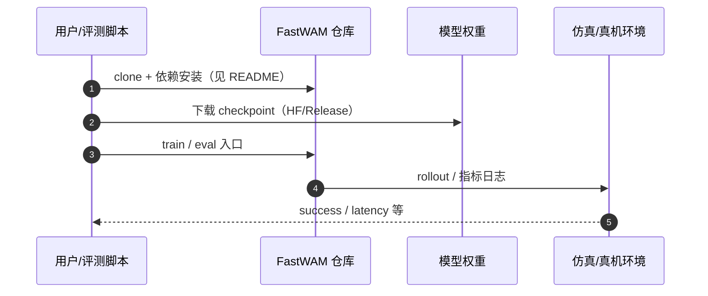

# Fast-WAM（arXiv:2603.16666）

**Fast-WAM**（*Fast-WAM: Do World Action Models Need Test-time Future Imagination?*，[arXiv:2603.16666](https://arxiv.org/abs/2603.16666)，[项目页](https://yuantianyuan01.github.io/FastWAM/)，[代码](https://github.com/yuantianyuan01/FastWAM)）来自 [机器人研发工程师 · 前沿算法盘点](../../sources/blogs/wechat_robot_engineer_embodied_frontier_algorithms_2026-09-23.md)。

## 一句话定义

**训练期保留视频共训、推理期跳过未来视频去噪，190 ms 延迟（>4× 快于 imagine-then-execute WAM）；LIBERO 97.6% / RoboTwin 91.8%。**

## 英文缩写速查

| 缩写 | 英文全称 | 简要说明 |
|------|----------|----------|
| Fast-WAM | Fast World Action Model | 本文低延迟 WAM |
| WAM | World Action Model | 世界–动作联合模型 |
| DiT | Diffusion Transformer | 扩散 Transformer |
| LIBERO | Lifelong Robot Learning Benchmark | 操作基准 |

## 为什么重要

- WAM 测试时迭代视频生成是延迟主因；需分离「训练表征收益」与「推理想象必要性」。
- 开源结论：**已开源**（步骤 2.5，2026-09-23）。
- 与 [具身前沿算法技术地图](../overview/embodied-frontier-algorithms-technology-map.md) 同路线条目可横向对照。

## 核心机制

| 项 | 内容 |
|----|------|
| **arXiv** | [2603.16666](https://arxiv.org/abs/2603.16666) |
| **开源** | **已开源** |
| **要点** | Wan2.2-TI2V 视频骨干 + Action DiT；推理只过一遍 clean latent 直接出动作 chunk。 |
| **文内指标** | 仿真与真机折毛巾等；无具身预训练仍 competitive（作者报告）。 |

## 源码运行时序图

图下说明：复现以 [`sources/repos/fast_wam.md`](../../sources/repos/fast_wam.md) 与官方 README 为准。

## 实验与评测

- 仿真与真机折毛巾等；无具身预训练仍 competitive（作者报告）。
- **读法：** 索引级摘要；逐项 baseline 以原文 PDF 为准。

## 与其他工作对比

| 维度 | Fast-WAM（本文） | imagine-then-execute 式 WAM | [MemoryWAM](./paper-memorywam.md) / [TempoWAM](./paper-tempowam.md) |
|------|-------------------|------------------------------|---------------------------------------------------------------------|
| 推理时是否生成未来视频 | **否**，只过一遍 clean latent 直出动作 chunk | 是，先去噪出未来帧再解动作 | 是（各自在记忆/时序维度上扩展） |
| 训练时是否用视频 | **是**，保留视频共训 | 是 | 是 |
| 报告延迟 | **190 ms**（作者报告，>4× 快于 imagine-then-execute） | 受去噪步数支配 | 未在本页口径下对齐 |
| 主张 | 未来想象的收益可在 **训练期** 吃掉，推理期不必再付 | 想象是能力来源 | 想象 + 记忆/时序结构 |

- **这是「把代价挪到训练期」，不是砍能力：** 视频共训仍在，被去掉的只是 **test-time 的未来去噪**；因此复现时若连训练期视频一起省掉，结论不成立。
- **数值口径：** LIBERO 97.6% / RoboTwin 91.8%（作者报告）属 [评测闭环](../queries/embodied-eval-benchmark-selection-loop.md) 的 ③ 仿真策略成功率层，**跨基准不可直接比榜**，也不蕴含真机成功率。
- **与同族页的读法：** [MemoryWAM](./paper-memorywam.md)、[TempoWAM](./paper-tempowam.md)、[DreamZero](./paper-notebook-dreamzero-world-action-models-are-zero-shot-poli.md) 与本文同属 [World-Action Models](../concepts/world-action-models.md) 谱系，但各自动的是不同旋钮（记忆 / 时序 / 零样本 / 延迟），**不是同一条曲线上的强弱关系**。

## 结论

**Fast-WAM 证明 WAM 价值可在训练期视频建模中兑现，推理不必每步想象；TempoWAM/MemoryWAM 是互补层。**

1. 开源边界：**已开源** — 以项目页/仓库实际链接为准（入库日 2026-09-23）。
2. 核心机制：Wan2.2-TI2V 视频骨干 + Action DiT；推理只过一遍 clean latent 直接出动作 chunk。…
3. 部署前核对硬件栈与评测协议，勿直接横比公众号摘录数字。

## 关联页面

- [world-action-models](../concepts/world-action-models.md)
- [paper-memorywam](./paper-memorywam.md)
- [paper-tempowam](./paper-tempowam.md)
- [paper-notebook-dreamzero-world-action-models-are-zero-shot-poli](./paper-notebook-dreamzero-world-action-models-are-zero-shot-poli.md)

## 参考来源

- [fast-wam_arxiv_2603_16666.md](../../sources/papers/fast-wam_arxiv_2603_16666.md)
- [wechat_robot_engineer_embodied_frontier_algorithms_2026-09-23.md](../../sources/blogs/wechat_robot_engineer_embodied_frontier_algorithms_2026-09-23.md)
- [arXiv:2603.16666](https://arxiv.org/abs/2603.16666)

## 推荐继续阅读

- [arXiv PDF](https://arxiv.org/pdf/2603.16666)
- [项目页](https://yuantianyuan01.github.io/FastWAM/)
- [代码](https://github.com/yuantianyuan01/FastWAM)

