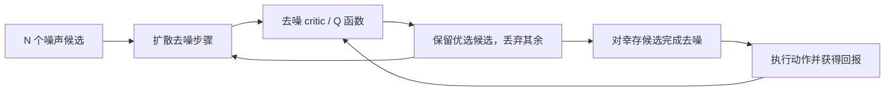
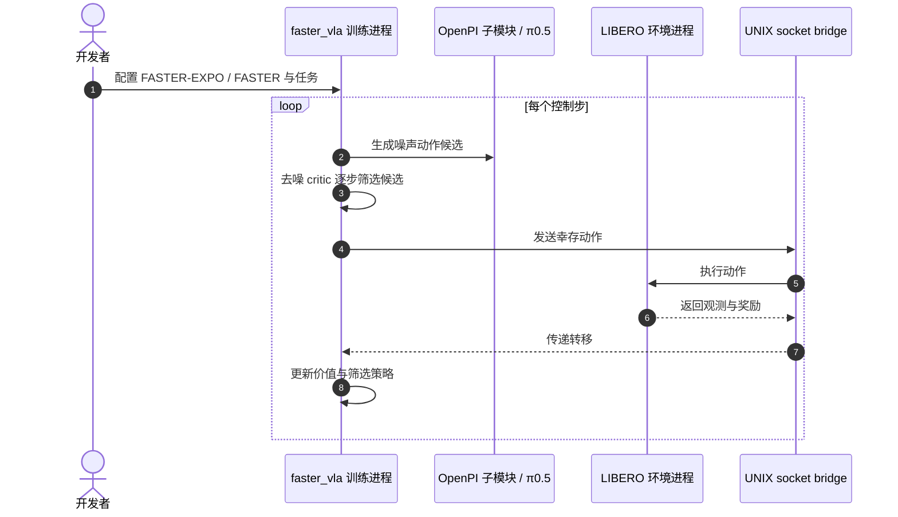

# FASTER：用价值引导采样加速强化学习

**FASTER**（*Value-Guided Sampling for Fast RL*）由 Stanford 团队提出，目标是在扩散策略的多候选去噪阶段提前识别低价值动作，从而降低 best-of-N 测试时扩展的计算成本。

## 一句话定义

**FASTER 在扩散去噪还没结束时就用价值估计筛掉较差动作，只把计算花在更有希望的候选上。**

## 英文缩写速查

| 缩写 | 英文全称 | 简要说明 |
|------|----------|----------|
| FASTER | Value-Guided Sampling for Fast RL | 扩散候选价值筛选方法 |
| RL | Reinforcement Learning | 学习动作价值和筛选策略 |
| MDP | Markov Decision Process | 把候选逐步去噪与过滤表示为决策过程 |
| VLA | Vision-Language-Action | 本文 π0.5 实验使用的预训练机器人策略 |
| TD | Temporal Difference | 训练去噪价值函数的时序差分方法 |

## 为什么重要

best-of-N 常用于从生成式策略的多个候选中挑选更好的动作，但传统做法要把 N 个样本全部去噪完成后再评分。若生成每个动作都昂贵，测试时采样的质量收益会伴随近似按候选数量增长的计算成本。FASTER 试图让筛选动作也被学习：越早看出候选差，就越早停止为它付出去噪算力。

## 核心信息

| 项 | 内容 |
|----|------|
| 作者 / 机构 | Perry Dong、Alexander Swerdlow、Dorsa Sadigh、Chelsea Finn；斯坦福大学（Stanford University） |
| 论文 | [arXiv:2604.19730](https://arxiv.org/abs/2604.19730)，2026-04-21 提交 |
| 项目页 | [FASTER](https://pd-perry.github.io/faster/) |
| 代码 | [Robomimic](https://github.com/alexanderswerdlow/faster)；[π0.5 VLA](https://github.com/alexanderswerdlow/faster_vla) |

## 核心原理

1. **把去噪链建模为 MDP：** 状态包含当前环境状态、去噪进度和幸存噪声候选；决策是在候选集中保留或丢弃动作，至少保留一个。
2. **学习未来价值：** 采用 TD 学习去噪 critic，估计当前保留哪些候选会带来更好的最终动作价值。
3. **逐步过滤：** 推理时从多个噪声种子出发，随着去噪推进淘汰低价值候选。
4. **完成单个幸存者：** 对剩余候选继续完整去噪，执行最终动作。它把“多采样再比较”的部分计算提前转成价值引导的早期筛选。

### 流程总览

## 源码运行时序图

FASTER 有 Robomimic 与 VLA 两个官方实现入口。[faster_vla](https://github.com/alexanderswerdlow/faster_vla) 将训练代码与 LIBERO 环境放在独立虚拟环境进程中，并通过 UNIX socket 交换动作与观测。

## 实验与评测

- **Robomimic 操纵：** 项目页报告 online 与 batch-online RL 的长时程操纵任务性能稳定优于被比较方法。
- **预训练 VLA：** π0.5 实验报告在保持任务性能的同时显著降低训练与推理计算需求。
- **读法：** 论文核心比较不是“只看吞吐”，而是对齐策略性能后再看完整去噪调用和采样成本。
- **代码入口：** 两个官方仓分别覆盖 Robomimic 和 VLA 实验；其依赖及配置不同。

## 与其他工作对比

| 维度 | FASTER（本文） | 朴素 best-of-N | [EXPO](./paper-expo.md) / [EXPO-FT](./paper-expo-ft.md) |
|------|----------------|----------------|------------------------------------|
| 候选何时被评估 | 去噪**过程中**逐步评估并淘汰 | 全部去噪完成后再统一打分 | 对生成动作做 edit 后按 Q 选优 |
| 计算随候选数增长 | 只有幸存者走完完整去噪 | 近似按 N 线性增长 | 取决于 base 采样数与 edit 步 |
| 价值函数作用 | 学习「保留哪些候选」的去噪 critic | 仅对最终动作打分 | on-the-fly Q 最大化 |
| 典型实验栈 | Robomimic + π0.5 VLA | — | 扩散/flow 策略；EXPO-FT 接 π 系 VLA 真机 |

- **增量在「早筛」而非「更好的打分器」：** 与朴素 best-of-N 的区别是把选优前移到去噪链内部，节省的是被淘汰候选的剩余去噪步。
- **与 EXPO 系同属「生成式策略 + 价值选优」家族：** faster_vla 训练入口同时提供 FASTER 与 FASTER-EXPO 配置；横比时应区分「改进选优方式」与「改进动作本身」两个贡献，并对齐候选数与完整去噪调用次数。

## 工程实践

| 场景 | 建议 |
|------|------|
| 诊断收益 | 同时记录候选数、实际完整去噪数、任务回报和 wall-clock 延迟 |
| 安全筛选 | 确保候选过滤策略至少留一个可执行动作，并监测价值估计失准 |
| 复现 Robomimic | 按 faster README 准备 robomimic 数据和训练配置 |
| 复现 VLA | 按 faster_vla README 初始化 OpenPI 子模块与 LIBERO 分离进程 |

## 局限与风险

- 早期去噪的价值估计可能不能准确预测最终动作质量；筛选过早会丢掉最后更好的候选。
- “训练和推理计算下降”依赖具体候选规模、任务和实现；迁移到其他扩散策略前需重新测量。
- VLA 代码的 OpenPI/LIBERO 多进程桥增加配置和复现复杂度。
- 论文摘要描述的是性能与计算的总体主张，本页不推导未报告的固定百分比节省。

## 结论

**FASTER 将 best-of-N 的后验选优改成去噪过程中的序贯筛选，能把生成式策略的测试时计算更多地用在有希望的候选上。**

1. **核心贡献是早筛候选**，不是简单并行更多动作。
2. **筛选器本身需要学习价值**，且须验证早期分数与最终执行回报的相关性。
3. **开源覆盖两套实验栈**：Robomimic 与 π0.5 VLA。
4. **效率评价要同时看性能和实际算力/延迟**，不能仅报候选数。
5. **部署前重测安全性和筛选误差**，避免把高价值但物理风险大的动作送上机器人。

## 关联页面

- [EXPO](./paper-expo.md) — 生成式策略上的价值优化基线
- [EXPO-FT](./paper-expo-ft.md) — 把 value-based RL 接到预训练 VLA 真机微调
- [强化学习](../methods/reinforcement-learning.md)
- [VLA](../methods/vla.md)
- [Manipulation](../tasks/manipulation.md)

## 参考来源

- [FASTER 论文归档](../../sources/papers/faster_arxiv_2604_19730.md)
- [FASTER 项目页归档](../../sources/sites/faster-project.md)
- [FASTER 官方代码归档](../../sources/repos/faster.md)

## 推荐继续阅读

- [FASTER 项目页](https://pd-perry.github.io/faster/) — 方法图、论文及两个代码入口
- [arXiv:2604.19730](https://arxiv.org/abs/2604.19730)
