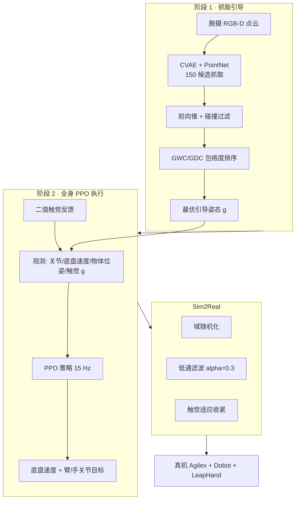

# FastGrasp：移动操作器上的学习式全身快速灵巧抓取

**FastGrasp**（*Learning-based Whole-body Control method for Fast Dexterous Grasping with Mobile Manipulators*，上海科技大学，arXiv:[2604.12879](https://arxiv.org/abs/2604.12879)，[项目页](https://taoheng-star.github.io/fastgrasp-page/)）提出 **「抓取引导生成 → 全身强化学习执行 → 二值触觉闭环」** 框架，让 **移动底盘、六轴臂与 16-DoF 灵巧手** 在 **高速接近与冲击接触** 中协同完成抓取，并通过 **Isaac Sim 训练 + 域随机化/低通滤波/触觉适应** 部署到真机。

## 一句话定义

**先用 CVAE 从点云批量提案并挑出最「包得住」的抓取姿态，再用 PPO 让整车冲过去抓——触觉一碰就收紧，专治高速冲击下的滑脱与反弹。**

## 英文缩写速查

| 缩写 | 英文全称 | 简要说明 |
|------|----------|----------|
| FastGrasp | — | 本文移动快速灵巧抓取框架 |
| CVAE | Conditional Variational Autoencoder | 以点云为条件生成多样抓取姿态 |
| GWC | Grasp Width Coverage | 拇指–各指宽度轴上对物体投影的覆盖度 |
| GDC | Grasp Depth Coverage | 掌法向深度轴上的物体包络覆盖度 |
| PPO | Proximal Policy Optimization | 全身抓取策略的 on-policy RL 优化器 |
| GAE | Generalized Advantage Estimation | PPO 优势函数估计 |
| DR | Domain Randomization | 仿真随机化以缩小 sim2real 差距 |
| LPF | Low-Pass Filter | 真机指令平滑（α=0.3） |
| TA | Tactile Adaptation | 据二值触觉反馈动态收紧手关节 |
| Sim2Real | Simulation to Reality | 仿真策略迁移真机部署 |

## 核心信息

| 字段 | 内容 |
|------|------|
| 机构 | 上海科技大学（ShanghaiTech University） |
| 作者 | Heng Tao、Yiming Zhong、Zemin Yang、Yuexin Ma（通讯） |
| 平台 | Agilex Bunker Mini + Dobot CR5 + **LeapHand**；RealSense D435i；Jetson AGX Orin |
| 触觉 | 每指/掌 **9 路** 薄膜压力 → **二值接触** |
| 仿真 | Isaac Sim；60 Hz 物理 / **15 Hz** 控制；48 并行环境 |
| 训练算力 | Intel i9-14900K + RTX 4090 |
| 控制接口 | 底盘速度 + 臂 5-DoF 关节位置 + 手 16-DoF 关节位置 |

## 为什么重要

- **补齐「移动 × 灵巧 × 高速」三角空白：** 静态灵巧抓取（UniDexGrasp、DexGrasp Anything 等）工作区受限；移动操作多限于 **平行夹爪**；空中接物（Catch it!）缺 **多样几何的精细包络抓取**。
- **冲击稳定是一等公民：** 高速接近产生 **短暂接触窗口** 与 **惯性滑移**；本文用 **触觉奖励 + 触觉观测 + 真机触觉适应** 三重闭环，消融显示去触觉观测成功率 **−15.65%**。
- **引导降低全身 RL 难度：** 预训练 **CVAE 抓取生成器** 提供 150 候选，经 **前向锥 + GWC/GDC** 选最优，比随机引导（**14.45%**）与单阶段 PointNet 策略（**3.03%**）显著更稳。
- **部分点云鲁棒性：** 在遮挡/噪声点云下仍达 **38.51%** 平均成功率，而力方向两阶段基线 **归零**——包络度指标不依赖显式法向，适合腕摄现实感知。
- **与上科大灵巧线衔接：** 作者组在 DexGrasp Anything、DexH2R 等工作中积累 **物理感知灵巧抓取**；FastGrasp 将问题推进到 **轮式移动全身 + 动态速度**。

## 方法

| 阶段 | 模块 | 要点 |
|------|------|------|
| **1 · 抓取引导** | CVAE + PointNet | 478k 合成抓取预训练；推理每物体采样 **150** 候选 |
| **1 · 筛选** | 前向锥 + 碰撞过滤 + GWC/GDC | 剔除后向/下探碰撞；选 Quality 最高引导 |
| **2 · 全身 RL** | PPO | 观测含引导姿态 $\mathbf{g}$、腕摄物体位姿、二值触觉 |
| **2 · 奖励** | 十项分层 | 臂展、底盘运动、预抓取对齐、快速接近、稳定持握、触觉接触等 |
| **部署** | DR + LPF + TA | 缺任一项真机成功率 **0%**（高速设定） |

### 流程总览

## 实验要点（归纳）

| 轴 | 报告口径（以论文为准） |
|----|------------------------|
| **仿真 unseen（全点云）** | Easy **59.50%** / Hard **34.42%** / 平均 **50.09%** S.R. |
| **仿真 unseen（部分点云）** | 平均 **38.51%**；反应式移动操作 [3] 仍 **8.31%** |
| **vs 两阶段力方向** | TS+ES **50.09%** vs TS+FS **41.99%**（包络度优于力方向质量） |
| **真机高速** | 完整配置 **32%**（Simple **35%** / Complex **27%**） |
| **真机半速** | **34.62%**；速度降低略增稳定性 |
| **Sim2Real 消融** | 无 DR 或 无 LPF → **0%**；无 TA → **26.87%** |

## 常见误区或局限

- **误区：「仿真 50% 等于产线可用」。** 真机高速仅 **~32%**，且任务为 **短窗抓取–撤离**（episode 最长 **2 s**）；复杂环境与安全仍依赖人工监护。
- **误区：「触觉必须是高分辨率视觉触觉」。** 本文刻意用 **二值压力** 换 **15 Hz 实时推理** 与更小 sim2real 差距；与 T-Rex 等高维触觉 VLA 路线互补而非替代。
- **局限：** **平底/桌面** 场景为主；对 **极扁平物体** 作者自述仍困难；臂第 4 关节锁定、底盘 **1.3 m/s** 上限约束动态包络；**暂无开源代码**（截至论文页）。

## 与其他页面的关系

- [Manipulation](../tasks/manipulation.md) — 灵巧操作与触觉增强学习路线总览
- [Loco-Manipulation](../tasks/loco-manipulation.md) — 轮式移动 + 上肢操作的全身协调（非人形双足）
- [抓取专题](../overview/topic-grasp.md) — 动态高速抓取的数据与感知锚点
- [Tactile Sensing](../concepts/tactile-sensing.md) — 二值/压力触觉在冲击抓取中的角色
- [Grasp Pose Estimation](../methods/grasp-pose-estimation.md) — 点云 → 6-DoF/手型抓取的感知栈背景
- [HRDexDB](./hrdexdb-dataset.md) — 互补的 **静态/台架** 多模态灵巧抓取数据（本文偏 **动态移动执行**）
- [Isaac Sim / Isaac Lab](./isaac-gym-isaac-lab.md) — 训练仿真环境

## 参考来源

- [FastGrasp 论文摘录（arXiv:2604.12879）](../../sources/papers/fastgrasp_arxiv_2604_12879.md)

## 推荐继续阅读

- 论文 HTML：<https://arxiv.org/html/2604.12879v1>
- 论文 PDF：<https://arxiv.org/pdf/2604.12879>
- 项目页：<https://taoheng-star.github.io/fastgrasp-page/>
- [T-Rex](./paper-trex-tactile-reactive-dexterous-manipulation.md) — 双手触觉反应式 VLA 的另一条高频接触路线
- [OmniTacTune](./paper-omnitactune-tactile-residual-adaptation.md) — 冻结视觉策略 + 触觉残差真机 RL 的快速适应
