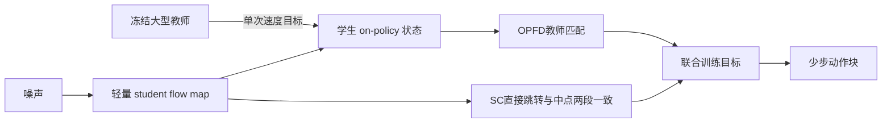

# FastOPD：VLA 的快速 on-policy 蒸馏

**FastOPD** 在学生策略自己的流生成轨迹上只查询一次教师，再以自一致性将局部监督传播到多步跳转，兼顾模型压缩和少步推理。

## 英文缩写速查

| 缩写 | 英文全称 | 简要说明 |
|------|----------|----------|
| OPD | On-Policy Distillation | 在学生自身轨迹上向教师学习 |
| OPFD | On-Policy Flow Map Distillation | 对单个学生状态做教师速度匹配 |
| SC | Self-Consistency | 让直接跳转与两段短跳转相符 |
| VLA | Vision-Language-Action | 以视觉、语言条件输出机器人动作的策略 |

## 为什么重要

大规模 VLA 往往使用迭代式 diffusion / flow action head，部署延迟由模型尺寸和采样步数共同决定。只缩小模型或单纯减少去噪步数都可能牺牲能力；传统 on-policy 蒸馏又要反复调用大教师。FastOPD 的目标是一次转移两种预算：将教师能力蒸馏到小 action expert，并将其 flow map 训练成少步生成器。

## 方法栈：单点教师监督 + 区间自一致性

1. **轻量 student。** 冻结视觉语言骨干，只微调轻量动作专家，并加时间投影以接收区间端点 (s,t)。论文实验使用约 350M VLM + 102M action expert 的学生结构。
2. **单状态 on-policy 教师匹配。** 从噪声 (x_1) 通过学生 flow map 跳到一个采样状态 ~(x_t)，在这个由学生产生的状态上匹配学生与教师的瞬时速度。相比沿整个去噪链逐步查询教师，教师调用次数下降。
3. **有限区间自一致性。** 对 ([s,t]) 区间，学生直接预测的 flow 与先到中点再完成第二段的速度目标保持一致；这把对角线速度上的教师监督传到有限步长的 shortcut。
4. **联合目标。** (mathcal{L}_{FastOPD}=mathcal{L}_{SC}+lambdamathcal{L}_{OPFD})。SC 监督有限步 flow map，OPFD 监督 on-policy 对角速度；推理时可用 1–2 次跳转生成动作。

## 工程实践

- **基座与学生：** 论文采用 SmolVLA 轻量 student，并将 π0.5、LingBot-VLA、Fast-WAM 或 MolmoAct2 作为教师覆盖仿真与真机设置。
- **训练省时：** 项目页报告每 1,000 iteration 从标准 OPD 的 9.51 小时降为 1.43 小时；在 LIBERO 达到相近单步水平约快 5.7 倍。
- **开源边界：** 截至 2026-10-06，官方项目页尚未给出代码、权重或独立数据下载链接，故源码运行时序图不适用；不要照论文数字误写为可直接复现。
- **适用建议：** 若当前瓶颈是 teacher rollout/去噪延迟而非视觉骨干前向，少步 flow map 有针对性；仍需在自己的机器人上验证观察频率、action chunk、控制周期与失败恢复。

## 实验与评测

| 场景 | FastOPD 结果 | 对照 / 含义 |
|------|--------------|-------------|
| LIBERO | 2 步平均成功率 81.8%；推理 66 ms | π0.5 10 步为 97.5%、301 ms；速度降低延迟 78.1%，保留约 84% 成功率 |
| RoboTwin 2.0，LingBot-VLA 教师 | 单步平均 51.2% | base SmolVLA 单步 35.3%；10 步教师 571 ms，FastOPD 1 步 57 ms |
| YAM 真机 pnp-plate | MolmoAct2 教师蒸馏 student，4 步成功率 50% | SmolVLA 4 步 42%；10 步 SmolVLA 平均成功完成时间 19.32s，FastOPD 为 17.38s |

评测中的 success rate、NFE、端到端延迟分别反映任务可靠性、采样次数与模型响应时间；降低推理延迟不自动等于提升底层伺服频率或安全性。

## 与其他工作对比

- **标准 OPD：** 沿学生完整去噪轨迹反复查询教师；FastOPD 用一次 on-policy 状态查询并以 SC 扩展监督，训练成本更低。
- **DMD / CTM / iMF 等少步蒸馏：** 都以降低采样次数为目标，但 FastOPD 强调真实 on-policy 教师速度目标与有限区间自一致性共同训练，而非仅离线拟合或独立 few-step 目标。
- **WAM 蒸馏：** 论文展示 Fast-WAM 作为教师之一，说明方法跨 VLA/WAM teacher 可用；FastOPD 本身是部署效率/策略蒸馏方法，不是单独的世界模型结构。

## 结论

**FastOPD 的实用贡献是把教师昂贵的逐步监督缩成单状态监督，再用自一致性获得少步策略；收益是延迟和训练时间下降，而非完全保留教师性能。**

1. **一次教师查询仍能学多步映射** — 依赖 SC 把局部速度信息传播至有限区间。
2. **模型压缩和采样压缩同时发生** — 学生约 451M 参数，推理常用 1–2 步，评测显示相对 teacher 有成功率折损。
3. **任务域覆盖较广但数据有限** — LIBERO、RoboTwin 2.0 与一个 YAM 真机任务提供可行性证据，不能外推至任意本体或工作空间。
4. **当前复现受代码开放限制** — 项目页列研究结果但没有公开代码 URL；先跟踪发布状态，再投入复现。

## 局限与风险

- 官方源码、权重与数据的公开下载入口未列出，独立复现暂受限。
- 真机结果来自单项 pnp-plate 设置和有限试验；任务完成率与延迟不能代替长时程可靠性、安全停止或跨本体验证。
- few-step 近似会带来教师与学生性能差距，采样更少不必然提升每个任务的成功率。

## 关联页面

- [VLA](../methods/vla.md) — 语言条件动作策略主线；已链接本页。
- [Diffusion Policy](../methods/diffusion-policy.md) — 动作扩散/流策略与采样推理。
- [World Action Models](../concepts/world-action-models.md) — FastOPD 将轻量蒸馏扩展到 WAM teacher。

## 参考来源

- [论文来源归档](../../sources/papers/fastopd_arxiv_2610_02832.md)
- [项目页来源归档](../../sources/sites/fastopd.md)
- [arXiv:2610.02832](https://arxiv.org/abs/2610.02832)

## 推荐继续阅读

- [FastOPD 项目页](https://fastopd.github.io/)
- [FastOPD 论文](https://arxiv.org/abs/2610.02832)
