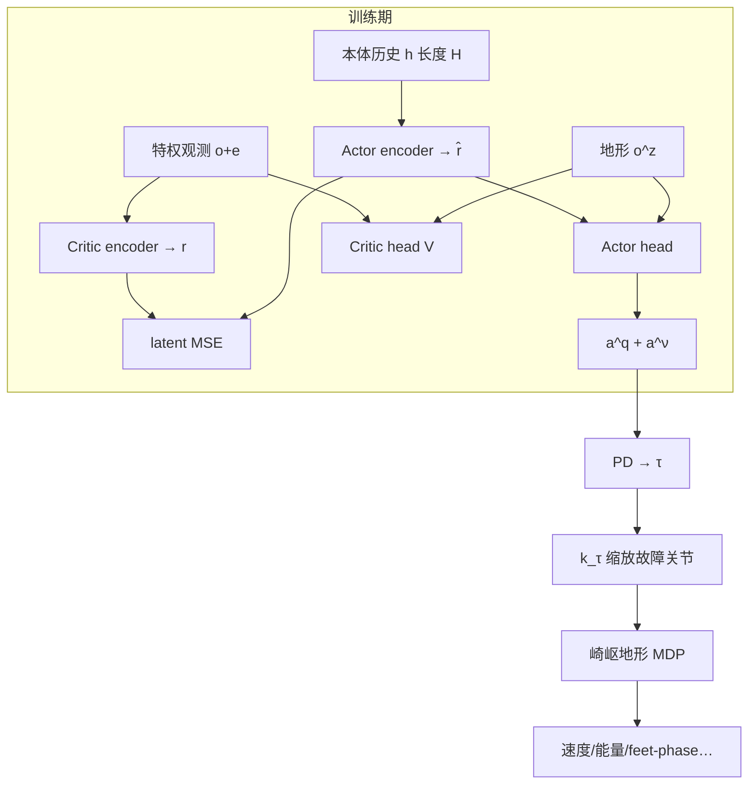

# Fault-Tolerant Locomotion（执行器失效自适应步态）

**Learning Fault-Tolerant Locomotion with Adaptive Gait Timing**（[arXiv:2608.07328](https://arxiv.org/abs/2608.07328)，[项目页](https://gianni0907.github.io/fault_tolerant_locomotion/)）来自 **意大利技术研究院（Istituto Italiano di Tecnologia, IIT）** HHCM：面向 **突然执行器功率损失** 的四足 RL 步态，在 **68 kg KYON** 上做崎岖仿真与平地真机验证。

## 一句话定义

**别为每条坏腿写专用步态**——用特权 critic 教 actor 从本体历史推断故障 latent，再让策略自己调 **步态频率**，在功率损失下重组协调。

## 英文缩写速查

| 缩写 | 英文全称 | 简要说明 |
|------|----------|----------|
| FTL | Fault-Tolerant Locomotion | 本文容错步态问题设定（非作者强制缩写） |
| PPO | Proximal Policy Optimization | 主训练算法（Brax 实现） |
| AAC | Asymmetric Actor–Critic | Critic 见特权故障/动力学信息，Actor 仅部署观测 |
| PD | Proportional–Derivative | 将关节目标转为扭矩指令 |
| DR | Domain Randomization | 刚度/阻尼/质量/摩擦等随机化 |
| KYON | Kyon quadruped | IIT 约 68 kg 中型四足实验平台 |

## 为什么重要

- **把问题对准重型四足：** 小平台上常见的高频激进补偿，在更大质量与更紧执行器裕度下往往不可行。
- **故障感知不靠真值传感器：** 部署时不给关节故障 mask；靠本体历史 + latent-alignment 隐式推断。
- **不预定义坏腿策略：** 故障腿不进入 feet-phase 惩罚，允许策略自发三足/残自由度补偿。
- **把步态 timing 写成动作：** 可学习 \(\nu\) 让接触调度随故障与地形变，而不是固定 gait generator。
- **开源边界清醒：** 项目页有视频与架构，**无训练代码**——可读方法，不可当可跑栈。

## 核心信息

| 字段 | 内容 |
|------|------|
| 机构 | 意大利技术研究院（Istituto Italiano di Tecnologia）；HHCM Research Line |
| 发表 | arXiv preprint（2026-08-07） |
| arXiv | [2608.07328](https://arxiv.org/abs/2608.07328) |
| 项目页 | <https://gianni0907.github.io/fault_tolerant_locomotion/> |
| 代码 | **确认未开源**（截至 2026-08-11；项目页无 GitHub） |
| 演示 | [YouTube](https://youtu.be/x4paP49SKuY) |
| 平台 | KYON 68 kg；Isaac/Brax 训练地形；MuJoCo+XBot2 Sim-to-Sim；真机平地 |
| 训练 | PPO + \(\lambda_3\) latent MSE；50 Hz 策略；故障扭矩效率课程 |
| 主要基线 | Oracle；w/o latent alignment；w/o observation history；free-gait（无可学习频率） |

## 核心原理

### 输入 / 输出

| 侧 | 内容 |
|------|------|
| Actor 观测 \(o\) | 基座角速度、重力、关节相对默认/参考、足端位置、上一动作、速度命令、参考相位等（含噪声） |
| 特权 \(e\) | 线速度/加速度、关节速度、扭矩、接触、足速、**关节故障 mask** 等 |
| 地形 \(o^z\) | 足高 + 每足 5×5 局部高程（文中训练与部署均假设可用） |
| 动作 | \(a=\langle a^q,a^\nu\rangle\)：关节偏差 + 步态频率；PD 跟踪 |
| 输出 | 50 Hz 关节目标与 \(\nu^{\mathrm{ref}}\) |

### 流程总览

### 关键机制（压缩）

1. **非对称信息：** Critic 用故障 mask 等特权估价值；Actor 只看可部署传感器历史。
2. **Latent-alignment：** \(\mathcal{L}=\mathcal{L}^{\mathrm{PPO}}+\lambda_3\|\hat r-r\|^2\)，把「故障相关表征」压进 Actor。
3. **可学习频率：** \(\nu^{\mathrm{ref}}=\nu^{\mathrm{def}}+s_\nu a^\nu\) 推进腿相位，塑造参考接触日程；故障腿不贡献 feet-phase 误差。
4. **故障课程：** 随机关节在随时间 \(t̄\) 起缩放 \(\tau\)；跟踪奖励达标则加重失效直至 \(k_\tau\to 0\)。

## 源码运行时序图

**不适用**：截至 **2026-08-11**，[项目页](https://gianni0907.github.io/fault_tolerant_locomotion/) 与论文均 **未提供** 可运行训练/部署仓库或权重；仅有演示视频。代码公开后再补本图。

## 工程实践

| 项 | 建议 / 论文设定 |
|----|----------------|
| 控制频率 | 策略 50 Hz；真机栈经 XBot2（Sim-to-Sim 侧 1 kHz 异步） |
| 历史长度 | 消融显示 \(H=1\to2\) 最大增益；取 \(H=3\) 作参数折中 |
| 网络 | Actor encoder `[512,128,64]`；Critic encoder `[128,64]`（见表 III） |
| PPO | γ 0.97、GAE λ 0.95、clip 0.3、lr \(3\times10^{-4}\)（Brax） |
| DR | \(K_p/K_d\)、摩擦、链路质量、躯干质量/CoM 等（表 V） |
| 评测协议 | 故障于 \(t=5\mathrm{s}\)；跟踪误差 + 生存时间；膝故障通常最难 |
| 复现现状 | **未开源**；见 [项目页归档](../../sources/sites/fault-tolerant-locomotion-github-io.md) |

## 实验与评测

| 设置 | 结果要点（以论文 §IV / 图为准） |
|------|--------------------------------|
| 训练曲线 | Full method 相对 w/o alignment / w/o history 更高 episodic reward（五次 seed） |
| 故障位置 | Fig. 5：膝故障整体更难；Ours 在聚合跟踪误差与生存时间上接近 Oracle、优于消融 |
| Sim-to-Sim | 未见楼梯（约 10 cm / 0.7 m）与 13° 坡；膝故障常切三足，髋故障可继续用残余 DOF |
| Sim-to-Real | 平地零样本；演示后左膝 pitch 功率损失下持续行走 |
| 历史消融 | \(H=1\to2\) 提升最大；更长历史边际小，并提高参数量 |
| 频率消融 | 相对 free-gait：更周期的摆/支撑相；非故障关节加速度与动作变化更低 |

## 结论

**对中大型四足，功率损失容错的关键是「隐式故障推断 + 可改编 timing」，而不是再堆一套按腿硬编码的故障模式库。**

1. **先看故障下跟踪误差与生存时间** — 比名义奖励更能反映「坏了一关节还能走多久」。
2. **Latent-alignment 不是装饰** — 关掉后 Actor 更难从本体史重建特权表征。
3. **历史窗口够短即可** — 文中一步差分信息贡献最大；盲目加长 \(H\) 性价比低。
4. **把频率放进动作空间** — 比纯 free-gait 更易得到可部署的周期补偿。
5. **真机目前是平地零样本** — 崎岖感知依赖假设可用的局部高程；接 LiDAR/深度是明确后续。
6. **选型边界** — 相对 [MOR 执行器约束高速奔跑](./paper-actuator-constrained-rl-high-speed-quadruped-locomotion.md)（工作区内高速），本文专攻 **故障后重组**；代码未开源前只作方法对照。

## 局限与风险

- **确认未开源：** 无法核对 Brax/MuJoCo 资产、奖励系数与故障课程实现。
- **地形观测假设：** 部署假定 \(o^z\) 可用；无感知模块时真机只验平地。
- **故障类型单一主线：** 主打功率损失（含课程至完全失效）；关节锁死等需另验。
- **单关节突发：** 训练采样单关节故障；多关节同时失效未作为主结果。
- **误区：** 把演示视频当成「任意崎岖真机已验证」，或当成已发布可部署控制器。

## 与其他工作对比

| 路线 | 故障信息 | 步态先验 | 开源/复现 |
|------|----------|----------|-----------|
| 模型基容错 | 显式故障模型 | 手调模式 | 难扩展 |
| Teacher–student 容错 RL | 训练特权 → 蒸馏 | 常固定 gait | 视具体工作 |
| 预定义坏腿惩罚 / 多专家 | 常需故障估计模块 | 强约束 | 易不自然 |
| **本文 FTL** | **隐式推断 + latent-alignment** | **可学习频率** | **未开源**；有项目页视频 |
| MOR 高速约束 RL | 非故障主题 | 对称步态奖励 | 见 [MOR 实体](./paper-actuator-constrained-rl-high-speed-quadruped-locomotion.md) |

## 关联页面

- [Locomotion](../tasks/locomotion.md) — 步态任务坐标
- [Sim2Real](../concepts/sim2real.md) — 零样本与 DR 语境
- [Reinforcement Learning](../methods/reinforcement-learning.md) — PPO / 特权训练总览
- [Teacher–Student / DAgger 训练](../methods/teacher-student-dagger-training.md) — 对照两阶段蒸馏
- [Implicit vs Explicit 执行器建模](../concepts/implicit-explicit-actuator-modeling.md) — 执行器 gap 相邻主题
- [执行器驱动链选型闭环知识链](../queries/actuator-drive-chain-selection-loop.md) — 本文把③层执行器功率损失当作故障扰动，写进策略训练与步态 timing
- [执行器约束 RL 高速四足](./paper-actuator-constrained-rl-high-speed-quadruped-locomotion.md) — 重型四足执行器边界对照
- [四足机器人实体](./quadruped-robot.md) — 平台索引
- [RL 运动控制纵深](../../roadmap/depth-rl-locomotion.md) — 学习型运动路线

## 参考来源

- [Fault-Tolerant Locomotion 论文摘录（arXiv:2608.07328）](../../sources/papers/fault_tolerant_locomotion_arxiv_2608_07328.md)
- [项目页归档](../../sources/sites/fault-tolerant-locomotion-github-io.md)

## 推荐继续阅读

- Gravina et al., *Learning Fault-Tolerant Locomotion with Adaptive Gait Timing* — [arXiv:2608.07328](https://arxiv.org/abs/2608.07328)
- [项目页](https://gianni0907.github.io/fault_tolerant_locomotion/)
- [演示视频](https://youtu.be/x4paP49SKuY)
- IIT HHCM Lab — <https://hhcm.iit.it/>
