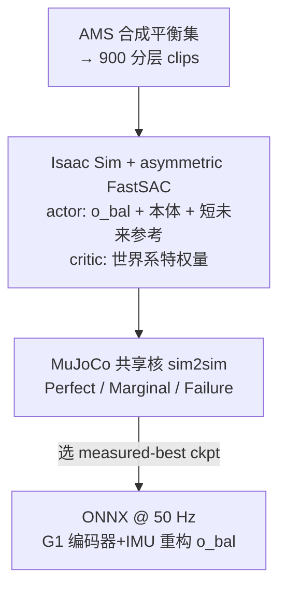

# FDDC：首个可部署的动态 CoM 单腿平衡策略与基准

**FDDC**（*First Deployable Dynamic-CoM*；论文 *First Deployable Dynamic-CoM: A Unified Policy and Method-Agnostic Benchmark for Humanoid Single-Leg Balance*，[arXiv:2608.00500](https://arxiv.org/abs/2608.00500)）由 **北京大学** 提出：把 capture point（xCoM）改写成**支撑足相对、仅编码器+IMU 可重构**的动态 CoM 观测，直接送入上真机的 actor，配合人体姿势控制奖励库与 asymmetric FastSAC，并发布 method-agnostic 的 MuJoCo sim2sim 单腿平衡基准。

## 一句话定义

**单腿平衡要的是预防失稳，不是踩一步再救回来——把相对支撑足的动态 CoM 放进可部署 actor，再配人体科学奖励，比堆通用跟踪能力更管用。**

## 英文缩写速查

| 缩写 | 英文全称 | 简要说明 |
|------|----------|----------|
| FDDC | First Deployable Dynamic-CoM | 本文策略与全栈名称 |
| xCoM | extrapolated Center of Mass / Capture Point | CoM 按速度外推的捕获点 \(\xi=c+\dot{c}/\omega_0\) |
| CoM | Center of Mass | 质心；静态近似只看位置，动态平衡必须加速度 |
| TTB | Time-to-Boundary | xCoM 预计触边剩余时间的软惩罚 |
| MoS | Margin of Stability | xCoM 相对支撑多边形边界的空间裕度 |
| FastSAC | Fast Soft Actor-Critic | 本文采用的 asymmetric off-policy 训练算法 |
| ONNX | Open Neural Network Exchange | 真机部署的策略交换格式（50 Hz） |

## 为什么重要

- **能力缺口可测：** 八个已发布通用全身策略（含 [SONIC](../methods/sonic-motion-tracking.md)、GMT、TWIST、OmniXtreme 等）在同一基准上 Perfect = **0/90**——多数靠 hop/触地维持 Marginal，说明「跟踪强」≠「能干净单腿站住」。
- **打通部署死结：** 经典 capture point 需要基座线速度 \(v_b\)，机载没有 → 以往只进奖励/特权 critic，上真机靠蒸馏（文中对照 [HuB](./paper-notebook-hub.md)、[AMS](../methods/ams.md)）。相对支撑足后 \(v_b\) **相消**，actor 可直接部署。
- **消融主因清晰：** 去掉动态 CoM 观测独掉 **40 pt** Perfect；TTB 再掉 24 pt——观测 > 奖励中的时间边 > 其余项。

## 核心信息

| 项 | 内容 |
|----|------|
| **机构** | 北京大学（Peking University）；通讯 Yixin Zhu、Wenxin Li |
| **平台** | Unitree G1，29 DoF；策略 50 Hz → 机载 PD |
| **数据** | AMS 合成平衡集蒸馏 900 clips；\(3\times3\) 蹲深×摆足高分层；720/90/90 |
| **训练** | Isaac Sim + asymmetric FastSAC；8192 envs；\(4\times10^5\) iter；无蒸馏 |
| **评测** | 共享 MuJoCo 核 sim2sim（≠训练仿真）；Perfect / Marginal / Failure |
| **开源** | **宣称全栈开源**（data/code/policy/benchmark）；截至 **2026-08-05** abs/TeX **未列** GitHub / 项目页 URL |

## 核心原理

### 可部署动态 CoM 观测

单腿到一阶是 LIP。捕获点

\[
\xi = c + \dot{c}/\omega_0,\qquad \omega_0=\sqrt{g/h}
\]

决定能否在支撑足上停下。相对支撑中心 \(s\) 后 \(\xi-s\approx r+\dot{r}/\omega_0\)（\(r=c-s\)）。actor 观测水平分量

\[
o_{\mathrm{bal}}=(r^{B},\ \dot{r}^{B})\in\mathbb{R}^{4}
\]

附录推导：\(\dot{r}\) 中各刚体共享的 \(v_b\) 相消，机载只需 \(q,\dot{q}\)、陀螺 \(\omega^B\) 与质量模型。世界系 xCoM / \(v_b\) 只给 **特权 critic**，部署时丢弃。

### 人体科学奖励库（prevention over repair）

| 项 | 作用 | 人体依据 |
|----|------|----------|
| MoS 软边 | xCoM 逼近支撑边界时罚 | Margin of Stability |
| TTB 软边 | 预计触边时间低于反应阈时罚 | time-to-boundary |
| 踝→膝 action-rate | 踝罚最重、膝次之、髋不罚 | distal-first 姿势策略 |
| jerk | 抑高频颤振，保证可部署 | jerk 作姿势控制质量指标 |

原则：**先把 xCoM 留在脚内**，而不是逃逸后再迈步救回（后者被标成 Marginal）。

### 流程总览

## 源码运行时序图

**不适用** — 截至入库日（2026-08-05）论文宣称释放 data/code/policy/benchmark，但公开材料中**无**官方仓库或可运行入口 URL；若后续开源，应按「分层 motion → Isaac FastSAC 训练 → MuJoCo 基准扫 ckpt → ONNX 真机」补 `sequenceDiagram`。

## 工程实践

| 项 | 做法 |
|----|------|
| 观测装配 | actor 共 463-D：\(o_{\mathrm{bal}}\)(4) + 本体觉 + motion command + 5 步未来参考；全可机载重构 |
| 支撑足判定 | 重力对齐脚高：较低脚为支撑；双脚高差 <3 cm 视为双支撑（训练/部署一致） |
| Checkpoint | **勿**用最终或最高 reward；用基准 Perfect 扫全 ckpt（文中部署 step **262k**） |
| 真机 | 同 actor → ONNX；obs/action clip ±100；腰部三编码器轻低通；**定性**成功，定量真机表未报 |
| 噪声评测 | OU 式 IMU 姿态噪声 + dof-vel 延迟；无 CoM 观测时 Perfect 崩到 8.6% |

## 实验与评测

**主结果（clean，n=90）：** FDDC Perfect **95.6%** / Marg. 3.3% / Fail 1.1%；八个通用基线 Perfect **全 0**。SONIC 最强通用侧（Fail 仅 18.9%、Marg. 81.1%），但仍 **零** Perfect，MoS 约差一个数量级。

**消融（clean Perfect）：** 去 CoM 观测 55.6%；动态→静态 64.4%；去 TTB 71.1%；其余单项 −2～−11 pt。训练曲线上，无动态 CoM 的 run 早早 plateau，学不动任务。

**难度网格：** 深蹲 × 高摆足最难；通用策略失败率从约 11% 升到约 94%，与 FDDC 薄弱角一致。

## 结论

**单腿「干净站住」的主因是可部署的动态 CoM 观测，不是更大的通用跟踪模型；奖励里的时间边（TTB）是第二杠杆，基准应用来选 ckpt 而不是看训练 reward。**

1. **观测 > 蒸馏绕路** — 相对支撑足后 xCoM 可机载重构，actor 直接上真机，省掉 HuB/AMS 式 teacher–student。
2. **读表先看 Perfect** — Marginal（hop/触地）只说明「没倒」，不说明会平衡；八个 SOTA 的 0 Perfect 是能力缺口，不是评测刁难。
3. **消融优先级** — 动态 CoM（−40）≫ TTB（−24）> MoS/膝 rate（约 −11）> jerk/踝/未来参考。
4. **部署选点** — 用 sim2sim 基准扫 ckpt；训练 reward 与 Perfect 几乎不相关。
5. **开源跟进** — 全文承诺全栈释放，入库时尚无 URL；复现前先核项目页/仓库是否上线。
6. **真机读法** — 目前仅定性；定量 fall/hop 表仍是下一步，勿把 95.6% 直接当真机率。

## 与其他工作对比

| 维度 | FDDC | HuB / AMS（文中对照） | SONIC 等通用跟踪 |
|------|------|----------------------|------------------|
| 平衡信号进 actor | **支撑相对动态 CoM** | 多为静态 CoM/多边形；动态量常只进特权侧 | 通常无 xCoM 设计 |
| 上真机路径 | **无蒸馏** | 文称依赖蒸馏学生 | 原生可部署但不具备 Perfect 单腿 |
| 评测 | 共享 MuJoCo 核 + 三档结果 | 自选 demo/指标，难横比 | 本文首次系统测单腿 |
| 代码（本库核查） | 宣称开源、**无 URL** | AMS 本库已归档 [OpenDriveLab/AMS](../methods/ams.md)；HuB 仍以占位为主 | SONIC 等已有公开仓 |

> 注：FDDC 正文写 HuB/AMS「既不放代码也不放策略」。本库对 AMS 的开源归档以 [ams.md](../methods/ams.md) 为准；即便框架代码公开，**专项单腿策略/checkpoint** 仍可能未按 FDDC 基准可复现方式放出。

## 局限与风险

- 真机仅定性；sim2sim Perfect ≠ 实机 Perfect。
- 基准与策略目前锚定 Unitree G1 / MuJoCo 核，跨机体移植成本未报。
- 任务是**保持单腿参考姿态**，不是推扰恢复或行走中的瞬时单支撑；与 [Balance Recovery](../tasks/balance-recovery.md) 互补而非替代。
- 开源承诺与可下载物之间仍有缺口——选型复现前先核实仓库。

## 关联页面

- [Capture Point / DCM](../concepts/capture-point-dcm.md) — 本文把 xCoM 从「规划/特权量」推进到可部署观测
- [Balance Recovery](../tasks/balance-recovery.md) — 对照：恢复（迈步救回）vs 本文的预防（站住不逃逸）
- [AMS](../methods/ams.md) — 分层单腿 motion 的数据来源；敏捷+稳定对照
- [SONIC](../methods/sonic-motion-tracking.md) — 最强通用基线仍 0 Perfect 的读法
- [Reward Design](../concepts/reward-design.md) — MoS/TTB/远端优先 rate 的人体科学翻译案例
- [Unitree G1](./unitree-g1.md) — 训练与真机平台
- [HuB](./paper-notebook-hub.md) — 极限平衡专项对照（占位）
- [Learning Sim-to-Real Humanoid Locomotion in 15 Minutes](./paper-notebook-learning-sim-to-real-humanoid-locomotion-in-15-m.md) — FastSAC 配方来源
- [具身大模型评测基准选型闭环](../queries/embodied-eval-benchmark-selection-loop.md) — 本页可归入其 ③ 策略任务成功率评测层：method-agnostic 单腿 Perfect/Marginal/Failure 探针

## 参考来源

- [sources/papers/fddc_arxiv_2608_00500.md](../../sources/papers/fddc_arxiv_2608_00500.md) — 本次 ingest 归档
- [arXiv:2608.00500](https://arxiv.org/abs/2608.00500) — 论文与附录

## 推荐继续阅读

- Hof et al., *The condition for dynamic stability* (2005) — Margin of Stability / xCoM 经典
- Pratt et al., *Capture Point: A Step toward Humanoid Push Recovery* (2006)
- Seo et al., *Learning Sim-to-Real Humanoid Locomotion in 15 Minutes* ([arXiv:2512.01996](https://arxiv.org/abs/2512.01996)) — FastSAC
- [AMS](https://arxiv.org/abs/2511.17373) — 合成平衡数据与敏捷稳定对照
