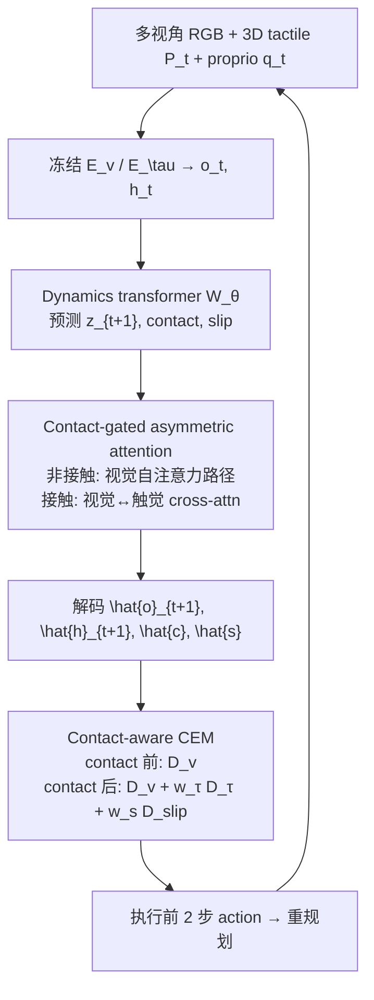

# FeelWorld（Hierarchical Visuo-Tactile WM · arXiv:2607.24267v1）

**FeelWorld**（*FeelWorld: Visuo-Tactile World Model for Hierarchical Contact Prediction and Planning*，[arXiv:2607.24267v1](https://arxiv.org/abs/2607.24267)，[PDF](https://arxiv.org/pdf/2607.24267v1)；中国科学院自动化研究所 / ImprintX Robotics / 北京智源人工智能研究院）学习 **动作条件** 的视触觉动力学：在冻结 **V-JEPA 2** 视觉 latent 与冻结 **FG-CLTP** 3D 触觉点云 latent 之上，用共享 **spatio-temporal transformer** 联合预测下一视觉 latent 与 **三层触觉状态**（contact → 3D tactile latent → slip），并通过 **contact-gated asymmetric attention** 在非接触段屏蔽触觉对视觉的干扰。推理时用 **contact-aware CEM** 在想象 rollout 上选动作，实现 chip/fruit/USB 三类接触丰富任务的 **zero-shot 规划**。

## 一句话定义

**把触觉拆成 contact、力相关 3D latent 与 slip 三层并显式监督，只在预测接触时让触觉调制视觉动力学，再用 contact 门控的 CEM 做模型规划。**

## 英文缩写速查

| 缩写 | 英文全称 | 简要说明 |
|------|----------|----------|
| WM | World Model | 动作条件前向想象模型 |
| CEM | Cross-Entropy Method | 采样–精英–重拟合的轨迹优化规划器 |
| LPIPS | Learned Perceptual Image Patch Similarity | 视觉 rollout 感知距离指标 |
| FG-CLTP | Fine-Grained CLTP | 3D 触觉点云预训练编码器（本文冻结 \(E_\tau\)） |
| FVD | Fréchet Video Distance | 视频时序一致性指标 |
| BCE | Binary Cross-Entropy | contact 头监督 |

## 核心信息

| 字段 | 内容 |
|------|------|
| **机构** | 中国科学院自动化研究所（CASIA）；ImprintX Robotics；北京智源人工智能研究院（BAAI） |
| **arXiv** | [2607.24267v1](https://arxiv.org/abs/2607.24267) |
| **平台** | Imeta-Y1；三 RGB（含腕部）+ DM 触觉（3D 点云） |
| **任务** | Chip grasping、Fruit grasping、USB insertion |
| **开源** | **截至 2026-09-30 无官方项目页/代码仓**（ImprintX SDK 仅采集，非 FeelWorld 训练栈） |

## 为什么重要

- **结构化触觉而非 monolithic touch token：** contact 控融合、3D latent 表局部几何、slip 表稳定性 — 与「把触觉当第二路图像」的 naive VT-WM 划界。
- **非接触段噪声隔离：** free-space 触觉不进入 visual cross-attention，保留 **visual-only** 路径，Table I 显示去掉 gate 时 SSIM **0.884→0.876**、PSNR **28.89→27.52**。
- **长程想象更稳：** 80-step 自回归 LPIPS 相对 V-JEPA 2 visual-only **低 61%**（0.062 vs 基线更长 horizon drift）。
- **规划可解释分段：** contact 前纯视觉 goal；contact 后加 tactile goal + slip cost — USB 成功率 **37.5%→75.0%**（Table IV）。
- **真机 zero-shot：** 无任务专用 policy，仅 subgoal + CEM over WM；三任务平均 **81.7%**。

## 核心方法结构

| 模块 | 作用 |
|------|------|
| \(E_v\) | 冻结 V-JEPA 2，多视角 RGB → \(o_t\)，拼接 sequence |
| \(E_\tau\) | 冻结 FG-CLTP，3D 点云 → \(h_t\)（不做 LayerNorm，保留幅值） |
| \(\mathcal{W}_\theta\) | 动力学 transformer；输入 \(z_t, g_t, q_t, a_t\) |
| \(H_c, H_\tau, H_s\) | contact / tactile latent / slip 解码头 |
| Contact gate \(g_t\) | 预测 \(\hat{c}_{t+1}\) 调制 visuo-tactile cross-attention |
| Contact-aware CEM | 想象 horizon 上分段 cost（Alg. 1 / Eq. 15） |

### 流程总览

## 源码运行时序图

**不适用**（截至 2026-09-30 无官方可运行仓库；CEM 与 WM 训练入口无法对齐公开 README。）

## 实验与评测

### 视觉与触觉预测（test set）

- **10-step LPIPS：** V-JEPA 2 **0.084** → FeelWorld **0.058**（−31%）；PSNR **24.37→28.89**，FVD **473.5→289.9**。
- **Contact / slip F1：** **98.1% / 83.4%**（slip 正样本约 **0.93%**，用 focal loss）。
- **接触转移段 LPIPS：** FeelWorld **0.055** vs V-JEPA 2 **0.127**；contact-onset error **0.44** vs 仅视觉头 **1.17** frames。

### Zero-shot CEM（每任务 40 真机 trials）

| Planner | Chip | Fruit | USB |
|---------|------|-------|-----|
| Visual-only | 40.0% | 70.0% | 37.5% |
| Naive VT CEM | 47.5% | 75.0% | 50.0% |
| **Contact-aware** | **82.5%** | **87.5%** | **75.0%** |

训练细节：8×H100，batch 64；9 帧 context（6 fps 下 1.5 s）；\(\lambda_\tau{=}0.3\), \(\lambda_c{=}\lambda_s{=}0.03\), \(\lambda_{\mathrm{roll}}{=}0.5\)。

## 结论

**FeelWorld 用「分层触觉 + 接触门控」把触觉真正接进 WM 的规划闭环，是接触丰富真机 manipulation 的强模型规划基线。**

1. **Hierarchy 不是装饰** — 去掉 hierarchical 监督，LPIPS 仅到 **0.071**；全模型 **0.058**。
2. **Gate 保护 free-space 视觉** —  naive VT 在长 rollout 仍 drift；门控抑制非接触触觉污染。
3. **Slip 要时序头** — focal + 仅 contact 帧算 loss，应对 **0.93%** 正样本比例。
4. **规划必须 contact-aware** — naive VT CEM 在 approach 段优化不可达 tactile goal，USB 仅 **50%**。
5. **CEM 贵但可 zero-shot** — 50 step × replan；论文指出未来可接 policy 蒸馏 rollout 评估。
6. **复现门槛** — 依赖 V-JEPA 2 + FG-CLTP + DM 触觉栈；**代码未发布** 时只能对照指标与架构。

## 工程实践

| 项 | 建议 |
|----|------|
| 传感器 | DM 3D 点云 + 官方 contact API（与 slip 标签管线一致） |
| 视觉 | 双视角 224²，与 DINO-WM/JEPA-WM 扩展设定对齐便于复现 Table I |
| 数据 | 刻意保留 **~30%** 失败 traj 测 long-horizon；6 fps 下采样 |
| 规划 | 先 vision-only CEM 作下界，再加 contact gate 看 USB/fragile grasp 增益 |
| 勿混淆 | GitHub `feelworld` 与 Feelworld 切换台仓库 **非本文** |

## 与其他工作对比

| 对照 | 差异读法 |
|------|----------|
| [VT-WM](./paper-sa-2602-06001-visuo-tactile-world-models-vt-wm.md) | 多任务 VT-WM 策展索引；FeelWorld 强调 **三层触觉 + 门控 + CEM** 真机表 |
| [OmniVTA](./paper-sa-2603-19201-omnivta-visuo-tactile-world-modeling-for-contact.md) | 短 horizon 预测 + contact-aware control；FeelWorld 偏 **latent WM + 长 rollout** |
| [VT-WAM](./paper-vt-wam-visuotactile-contact-rich.md) | WAM 动作生成；FeelWorld **不训 policy**，CEM over WM |
| V-JEPA 2 visual-only | 同 backbone 公平对比；FeelWorld 全视觉指标与接触段 LPIPS 均优 |

## 局限与风险

- **无公开代码 / 项目页** — 复现 CEM 与 gate 细节需等作者发布或邮件索取。
- **CEM 算力** — \(N{=}400\), 8 iter, 6-step horizon，难直接上 kHz 控制；论文明确不适合高频实时。
- **任务窄但深** — 三任务 200 traj/task，泛化到其他传感器/物体需重新采集与 FG-CLTP 适配。
- **Slip 标签稀缺** — 高 accuracy 可能掩盖类不平衡；部署应以 F1/recall 为主。
- **ImprintX 关联** — 机构与 DM 触觉生态相关，但 SDK ≠ FeelWorld 训练代码。

## 关联页面

- [Generative World Models](../methods/generative-world-models.md) — 动作条件想象与规划语境
- [Visuo-Tactile Fusion](../concepts/visuo-tactile-fusion.md) — 接触瞬间模态分工
- [Contact-Rich Manipulation](../concepts/contact-rich-manipulation.md) — 任务定义
- [Manipulation 任务](../tasks/manipulation.md) — 插装 / 抓取基准背景

## 参考来源

- [feelworld_arxiv_2607_24267.md](../../sources/papers/feelworld_arxiv_2607_24267.md)

## 推荐继续阅读

- [arXiv:2607.24267v1 PDF](https://arxiv.org/pdf/2607.24267v1) — 门控注意力可视化（Fig. 6）与 CEM 曲线（Fig. 7）
- [Visuo-Tactile Fusion 概念页](../concepts/visuo-tactile-fusion.md) — 融合层与力控闭环
- [Awesome Touch 技术地图](../overview/sun-awesome-touch-technology-map.md) — VT-WM 分组横向索引
