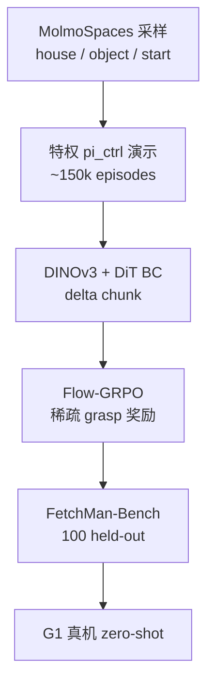

# FetchMan：仿真视觉人形 loco-manipulation

**FetchMan**（*Learning Visual Humanoid Loco-Manipulation Policies from Simulated Experiences*，[arXiv:2608.17027](https://arxiv.org/abs/2608.17027)，[项目页](https://orayyan.com/fetchman)）来自 **加州大学洛杉矶分校（UCLA）**、**艾伦人工智能研究所（Allen Institute for AI）** 与 **华盛顿大学（University of Washington）**：在 **MolmoSpaces** 程序化场景中生成 **~15 万** 脚本演示，**BC** 克隆后以 **Flow-GRPO** 稀疏奖励 refinement，在 **Unitree G1** 上 **零样本** 行走抓取。

## 一句话定义

**脚本演示能 scale 场景，但 BC 会被隐藏相位顶死——用 Flow-GRPO 在同仿真里把 walking/reposition 从 67% 拉到 83%，真机 73.3%。**

## 英文缩写速查

| 缩写 | 英文全称 | 简要说明 |
|------|----------|----------|
| BC | Behavior Cloning | 监督克隆脚本演示 |
| GRPO | Group Relative Policy Optimization | 组内相对优势、无 critic |
| Flow-GRPO | Flow Matching + GRPO | 给 flow 采样加 Gaussian SDE 得逐步 log-lik |
| WBC | Whole-Body Control | SONIC 低层跟踪 base 命令 |
| G1 | Unitree G1 Humanoid | 论文真机平台 |
| SR | Success Rate | 任务成功率 |
| RL | Reinforcement Learning | Flow-GRPO 在线 refinement |
| DiT | Diffusion Transformer | 动作头架构 |

## 为什么重要

- **环境泛化 loco-manip：** 相对 [VIRAL](./paper-viral-humanoid-visual-sim2real.md) / [DoorMan](./paper-doorman-opening-sim2real-door.md) 的窄环境结构，FetchMan 强调 **15 万+ 场景/5 万+ 物体** 分布。
- **BC 天花板机制清晰：** 脚本控制器含 **不可观测相位**（nav↔reach↔manip），更多演示无法突破 ~67% sim loco-manip。
- **Flow-GRPO 补 walking：** manip 已克隆好（~75%）；RL 增益主要在 **base reposition** 与 loco-manip 切换。
- **Sim2Real 两要素：** 冻结 **DINOv3** + **delta 动作**；换 SigLIP 或 absolute 动作真机 loco-manip **≈0%**。
- **FetchMan-Bench：** 固定 held-out 场景与 manipulation / loco-manipulation 双指标，便于横向对比（代码待发布）。

## 核心信息

| 项 | 内容 |
|----|------|
| **机构** | UCLA；Allen Institute for AI；UW |
| **平台** | Unitree G1 + Dex1-1；SONIC 低层 @50 Hz |
| **观测** | 头 fisheye + 腕 RGB + 本体；10 Hz 策略 |
| **动作** | 15 维：base vel/height + 上身/夹爪目标 |
| **数据** | ~150k 场景 bowl-pick；~650 h；单 L40S ~40 GPU-h 采集 |
| **开源** | **部分开源 / 待发布** — [omarrayyann/fetchman](https://github.com/omarrayyann/fetchman) 占位仓（2026-08-25 仅 README；**Code by 2026-09-01**）；Bench 仍无下载 |

## 核心原理

**Stage 1 — 数据：** MolmoSpaces 采样 house/object/start；特权 \(\pi_{\text{ctrl}}\) 规划 A* 路径并分相位执行；每 episode DR（纹理、光照、相机内外参、支撑面高度等）。

**Stage 2 — BC：** 冻结 DINOv3 ViT-B/16 → DiT flow-matching 预测 H=16 chunk、执行前 8；**delta** 重参数化 11 维绝对目标。

**Stage 3 — Flow-GRPO：** 5 步 Gaussian flow 采样；64 组×8 episode 同 reset；稀疏 grasp+lift 奖励；PPO clip + 冻结 BC KL；丢弃 uniform 组。

### 流程总览

## 源码运行时序图

**不适用**（截至 **2026-08-25**）：[omarrayyann/fetchman](https://github.com/omarrayyann/fetchman) 与项目页 **Data & Code** 已互链，但仓内仅 README（声明 **2026-09-01 前** 补代码）；FetchMan-Bench 尚无公开下载。代码释出后应补：MolmoSpaces rollout → BC 训练 → Flow-GRPO → Bench/真机部署。

## 工程实践

| 项 | 内容 |
|----|------|
| **开源跟进** | 2026-08-25 项目页已挂 GitHub 占位仓；训练/推理入口待 README 时间表落地后更新 repo 归档与时序图 |
| **分层命令** | 固定 SONIC 低层；策略只出 15 维语义命令——与 VIRAL/DoorMan 同类 factorization |
| **BC 上限诊断** | manip SR 高、loco-manip 低 → 优先 RL refinement 而非加演示 |
| **Sim2Real** | 不要替换 DINOv3 或 delta 动作；二者是真机 transfer 必要条件 |
| **多物体** | dino.txt 文本 token；350k 演示；G=64 因 uniform 组更多 |
| **算力** | 数据生成 ~40 GPU-h；RL 阶段需大规模并行 identical-reset 组 |

## 与其他工作对比

| 对照 | 差异读法 |
|------|----------|
| [VIRAL](./paper-viral-humanoid-visual-sim2real.md) | 同 G1 视觉 sim2real、同「策略只出语义命令 + 固定低层」分层；VIRAL 环境结构窄，FetchMan 押 **15 万场景 / 5 万物体** 的 MolmoSpaces 分布泛化 |
| [DoorMan](./paper-doorman-opening-sim2real-door.md) | 同用 GRPO 自举 loco-manip，但任务是铰接开门；FetchMan 是 fetch/reach-pick，且明确把 RL 预算指向 **base reposition** 而非 manip |
| 纯加演示的 BC scaling | 脚本控制器含 nav↔reach↔manip **不可观测相位**，单帧策略推不出来 → sim loco-manip 卡在 ~67%，加演示不涨；必须换 RL refinement 而非扩数据 |
| [Temporal GRPO](./paper-temporal-grpo.md) | 同为 GRPO 变体但问题轴不同：Temporal GRPO 修 VLA 的阶段信用，FetchMan 的 Flow-GRPO 是给 flow-matching 采样加 Gaussian SDE 以拿到逐步 log-lik |
| 端到端 WBC / 不固定低层 | FetchMan 冻结 SONIC @50 Hz，策略只出 15 维命令——换来 zero-shot transfer，代价是 gait/stance 不可 adapt |
| SigLIP 骨干 / absolute 动作 | 同管线换视觉骨干或动作参数化，真机 loco-manip **≈0%**：冻结 DINOv3 + delta 动作不是调参项，是 sim2real 的必要条件 |

## 局限与风险

- **无历史：** 单帧策略难推断脚本 相位；加 history 增 token 成本未 ablate。
- **固定 SONIC：** 不能 adapt  gait/stance；重物体或大扰动超出低层包络。
- **任务：** 仅 fetch/reach-pick；未覆盖铰接/长程组合技能。
- **复现待落地：** 官方占位仓已挂出（2026-09-01 前补代码）；截至 2026-08-25 仍不可跑训练栈；Bench 发布前仅能引用论文数字。

## 实验与评测

| 方法 | Sim manip | Sim loco-manip | Real manip | Real loco-manip |
|------|-----------|----------------|------------|-----------------|
| BC | 75.0±4.3 | 67.0±4.7 | 72.7±9.5 | 56.7±9.0 |
| BC+RL | 79.0±4.1 | **83.0±3.8** | 77.2±8.9 | **73.3±8.1** |

Flow-GRPO 相对 BC：sim loco-manip **+16 pp**；真机 **+16.6 pp**。Architecture ablation：SigLIP / absolute → 真机 loco-manip **0%**。

## 结论

**FetchMan 证明：MolmoSpaces 规模合成数据 + 分层 WBC 可以 zero-shot G1 loco-manip，但 BC  alone 不够，Flow-GRPO 才是破 walking 瓶颈的关键。**

1. **真影响：BC 顶来自隐藏相位** — 加数据不涨；RL 在同仿真组 rollout 里补 reposition。
2. **真影响：DINOv3 + delta** — sim2real 必要条件；缺一则真机 loco-manip 崩塌。
3. **真影响：增益在 loco-manip 不在 manip** — 克隆已够好，RL 预算应瞄准行走/handoff。
4. **次要代价：固定 SONIC** — 平衡/步态不可 adapt。
5. **工程读法：占位仓已挂** — 方法坐标可用；复现跟 [GitHub](https://github.com/omarrayyann/fetchman) README 时间表与 Bench 发布。
6. **多物体初步可行** — 62% sim loco-manip，仍低于单物体 83%。

## 关联页面

- [Loco-Manipulation 任务](../tasks/loco-manipulation.md)
- [VIRAL](./paper-viral-humanoid-visual-sim2real.md) — 同 G1 视觉 sim2real 对照
- [DoorMan](./paper-doorman-opening-sim2real-door.md) — GRPO 自举的另一 loco-manip 实例
- [Unitree G1](./unitree-g1.md) — 硬件平台
- [Temporal GRPO](./paper-temporal-grpo.md) — VLA 侧 GRPO 变体（不同问题）

## 参考来源

- [FetchMan 论文归档](../../sources/papers/fetchman_arxiv_2608_17027.md)
- [FetchMan 项目页归档](../../sources/sites/fetchman-orayyan.md)
- [FetchMan 官方仓库归档](../../sources/repos/fetchman.md)

## 推荐继续阅读

- 项目页 — <https://orayyan.com/fetchman>
- 官方 GitHub（占位）— <https://github.com/omarrayyann/fetchman>
- Flow-GRPO — <https://arxiv.org/abs/2505.05470>
- MolmoSpaces — <https://arxiv.org/abs/2602.11337>
