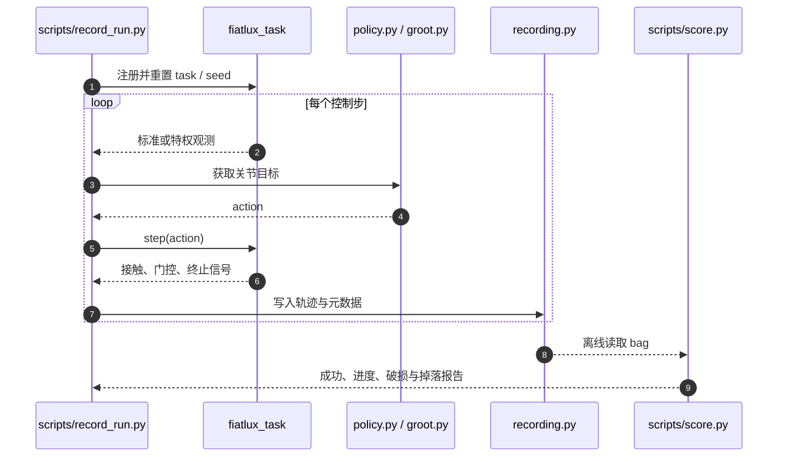

# Fiatlux：G1 攀梯换灯长时程基准

## 一句话定义

Fiatlux 把搬梯、上下梯、双手换灯与易碎物品处置放进同一维护任务，用十二个子任务定位失败环节；它提供评测环境，完整自主换灯仍未解决。

## 英文缩写速查

| 缩写 | 英文全称 | 简要说明 |
|---|---|---|
| VLA | Vision-Language-Action | GR00T 零样本基线的模型类型 |
| PPO | Proximal Policy Optimization | 官方训练入口使用的强化学习算法 |
| WBC | Whole-Body Control | 协调双臂操作与身体运动的控制层 |
| PD | Proportional-Derivative | 关节目标位置对应的低层控制 |
| USD | Universal Scene Description | 仿真机器人与场景资产格式 |
| SDK | Software Development Kit | 真机 G1 命令适配依赖的开发接口 |

## 为什么重要

平地行走和桌面抓取分别成功，仍可能在拿着易碎灯泡上下梯时失败。这个基准同时考察长时程协调、接触切换、双手操作和物品完整性，也把“场景已实现”与“策略已解决”区分开。

## 核心信息

| 项目 | 内容 |
|---|---|
| 机构 | 夏威夷大学马诺阿分校 HawAII、独立研究者、普渡大学 |
| 平台 | Isaac Lab 中的 Unitree G1；真实 G1 SDK 适配器待实现 |
| 完整环境 | `FIATLUX-Replace-v0`；另有十二个子任务与 Training/Teleop 变体 |
| 开源 | [代码](https://github.com/haw-ai-i/fiatlux)、资产与记录公开；[开放核查](../../sources/sites/fiatlux.md) |

## 核心原理与流程总览

| 阶段 | 子任务 | 主要能力 |
|---|---|---|
| 设置工作区 | S01 搬梯；S02 上梯 | 移动梯子、支撑接触切换 |
| 处理旧灯 | S03 取灯；S04 下梯；S05 搬运；S06 处置 | 高处操作、持物移动、释放 |
| 获取新灯 | S07 接近；S08 抓取；S09 搬回 | 抓取与双手/身体协调 |
| 完成安装 | S10 持灯上梯；S11 安装；S12 下梯 | 易碎物操作与攀爬 |

输入为标准可感知/可估计信号，训练或评测另可使用独立的 privileged 观测组；动作是关节位置目标，落到低层 PD。十二个环境允许独立重置，完整环境考察持续执行，单项成绩不能直接相乘当成整链成功率。

门控由多个条件组成，按难度加权，允许部分进度；干净成功额外要求不掉落、不突破脆弱性界限。灯泡入座由 attachment 状态机与保持外力模拟，其精细连接物理仍有简化。

## 源码运行时序图

模块入口见[官方仓库归档](../../sources/repos/fiatlux.md)。图示运行与评分路径，PPO 训练走 `scripts/rsl_rl/train.py`。

## 工程实践

先固定 `uv.lock` 依赖并获取资产，再检查环境注册与场景，最后用 random/zero 录制并离线评分。包含相机的任务需 `--enable_cameras`。README 目前仅为完整 Replace 提供 PPO 配置；子任务存在不代表每个都配好同一训练入口。

GR00T 服务需外部 PolicyServer 与授权权重；遥操作需要额外 SONIC/VR 栈。优先从八个有成功示范的子任务排查接口，再研究攀爬与持续技能切换。本次只核查源码和文档，未运行 Isaac 仿真。

## 实验与评测

论文与项目页：八个非攀爬子任务共有 107 个遥操作 takes、80 个满分；S02/S04/S10/S12 四项攀爬未提供通过门控的示范。在梯上初始化后站稳只是姿态验证。

GR00T N1.7 零样本、zero、random 在十二个子任务、各四个布局种子的评测中成功率均为零；表内非零得分为部分进度。遥操作加权成绩只覆盖有数据的八项，不能与覆盖十二项的策略成绩视为同分母。

[当前 HF 数据卡](../../sources/datasets/fiatlux-teleoperation.md)另含 18 个攀爬尝试，总计 125 episodes；数据范围大于论文的 107 个非攀爬 takes。没有新增“攀爬成功”结论。

## 结论

**Fiatlux 最值得复用的是任务拆分和可归因评分，完整攀爬换灯能力仍需验证。**

1. 同时报告干净成功、进度、掉落和破损，部分得分不能替代完成率。
2. 把梯上稳定、从地面上梯、持物下梯分别验收；四项攀爬仍是缺口。
3. 保留完整链测试，独立重置的子任务不能证明自然切换成功。
4. 使用遥操作记录时区分失败尝试、成功 takes 和覆盖范围；数据集不等于权重。
5. 标准观测有利于设计部署接口，但真机适配与连接器物理尚待补齐。

## 与其他工作对比

| 对照 | Fiatlux 的不同点 |
|---|---|
| [HumanoidBench](./humanoid-bench.md) | 聚焦有梯子、高处维护、易碎灯泡的连续任务及子任务门控 |
| [LocoWM](./paper-locowm.md) | LocoWM 改善移动中的载荷精度；Fiatlux 提供包含攀爬与装配的评测任务 |
| 单独抓取或行走基准 | 额外暴露技能切换、物品安全和持续执行失败 |

## 局限与风险

四项攀爬可达性未充分证明，三组已发布自主基线均未完成子任务。仿真灯泡连接、独立子任务 reset 与真机接触仍有差距；当前结果不能外推为真机自动攀梯换灯。公开的是代码、资产与 rollout，不是已经训练成功的全程控制器。

## 关联页面

- [Loco-Manipulation](../tasks/loco-manipulation.md)
- [具身评测基准入口](../overview/hub-embodied-eval-benchmark.md)
- [HumanoidBench](./humanoid-bench.md)
- [LocoWM](./paper-locowm.md)

## 参考来源

- [Fiatlux 论文摘录](../../sources/papers/fiatlux_arxiv_2609_38216.md)
- [项目页与开放核查](../../sources/sites/fiatlux.md)
- [官方仓库入口](../../sources/repos/fiatlux.md)
- [遥操作数据卡](../../sources/datasets/fiatlux-teleoperation.md)

## 推荐继续阅读

- [官方项目页](https://fiatlux-bench.github.io/)
- [官方评分文档](https://github.com/haw-ai-i/fiatlux/blob/main/docs/scoring.md)
