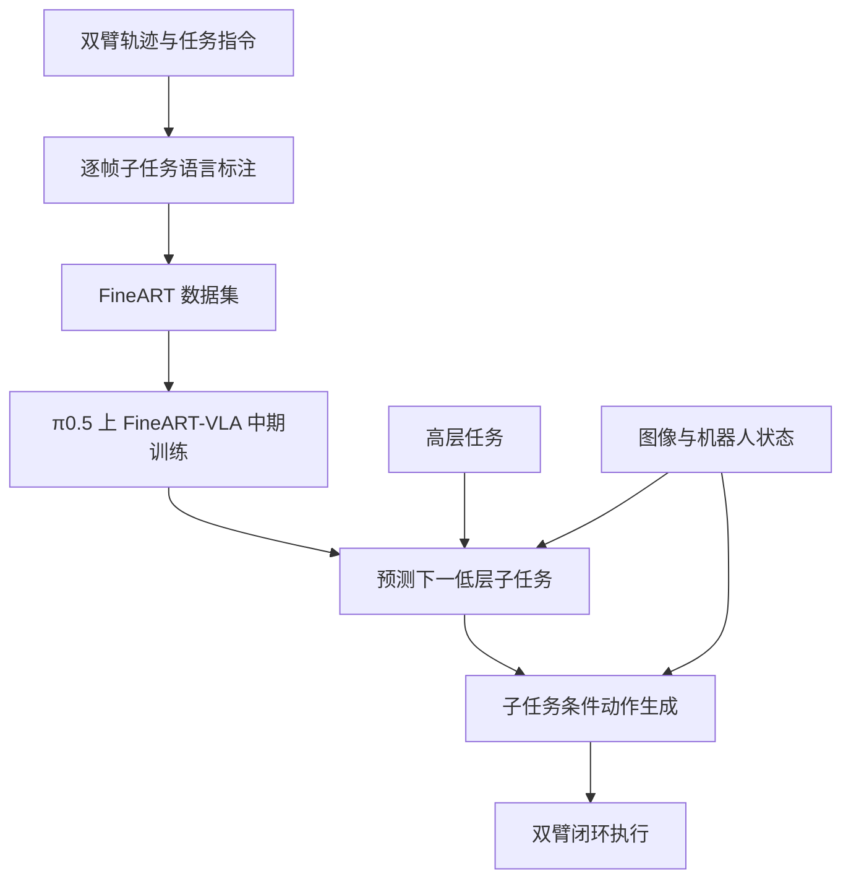

# FineART-VLA：用语言子任务组织双臂长时程操作

**FineART** 同时指细粒度标注的双臂机器人轨迹数据集，以及基于该数据的 **FineART-VLA** 策略。策略不只接收一次性的高层任务指令，而是在执行中预测下一低层子任务，再以子任务为条件生成动作。论文题为 *FineART: Fine-Grained Annotated Robotic Trajectory Dataset and Vision-Language-Action Model for Bimanual Manipulation*（[arXiv:2609.36416](https://arxiv.org/abs/2609.36416)）。

- **代码实现：** [Hugging Face LeRobot](https://github.com/huggingface/lerobot)；[FineART-VLA 实现文档](https://github.com/huggingface/lerobot/blob/main/docs/source/fineart_vla.mdx)
- **模型入口：** [lerobot/fineart_vla_base](https://huggingface.co/lerobot/fineart_vla_base)
- **作者：** Jade Choghari、Pepijn Kooijmans、Mansi Agarwal、Yusuf Umut Ciftci、Aseem Doriwala、Catherine Weaver、Mouli Sivapurapu、Kai Yang、Jackson Lee、Thomas Wolf、Pragna Mannam
- **实现状态：** FineART-VLA 已集成在 LeRobot；给定 GitHub 链接是通用实现仓库，不是单独的 FineART 仓库。

## 一句话理解

**数据把长任务拆成有时间边界的语言子任务；模型先预测下一步做什么，再据此生成双臂动作。**

## 英文缩写速查

| 缩写 | 英文全称 | 简要说明 |
|---|---|---|
| VLA | Vision-Language-Action | 根据视觉和语言条件生成机器人动作。 |
| FAST | Frequency-space Action Sequence Tokenization | 将连续动作序列编码为离散 token 的方法。 |
| DROID | Distributed Robot Interaction Dataset | 论文使用的多任务机器人操作数据来源之一。 |
| π0.5 | Physical Intelligence π0.5 | FineART-VLA 中期训练所基于的机器人策略模型。 |

## 方法图

## 数据：细粒度标注解决什么

论文指出，普通轨迹常常每条只有一个高层语言标签，难以监督长程任务中的阶段切换。FineART 为轨迹加入密集子任务标注。

| 论文报告的数据规模 | 数量 |
|---|---:|
| episodes | 40,543 |
| 总时长 | 1,718 小时 |
| 子任务标注 | 533,913 |
| 任务种类 | 151 |

episode、小时数、子任务数分别表示轨迹、采集时长和语言分段规模，不等同于动作步数。

## FineART-VLA：规划和动作衔接

FineART-VLA 建立在 Physical Intelligence 的 π0.5 与 LeRobot Pi05 策略实现上。相较只做任务条件动作生成的 PI05，它加入可训练的 PaliGemma 语言头，使模型在 rollout 中能生成中间子任务文本，再把文本作为动作专家的条件。

LeRobot 当前实现文档给出默认配方：

- **30% 高层任务 → 子任务预测：** 学习给定任务后下一步应执行什么低层指令。
- **70% 子任务条件动作训练：** 根据活动子任务生成连续 flow-matching 动作，也可训练 FAST 离散动作 token。
- **推理分解：** 默认形式为 (p(amid o,	ext{subtask})p(	ext{subtask}mid o,	ext{task}))。运行时负责何时触发规划和命令调度；示例中的默认规划间隔为 3 秒。普通动作调用本身不会偷偷重新规划。
- **数据前提：** 训练集需提供连续子任务语言时间线及实现文档所列语言标注列。标准 LeRobot 数据集不会自动推断子任务；若没有语言列，就没有对应的语言规划监督。

## 论文结果

| 评测 | 论文报告结果 | 读数边界 |
|---|---:|---|
| 空间指代消歧 | 成功率 32.0% → 100.0% | 论文中期训练对比 |
| 未见长程任务，逐步人工子任务指导 | 16.0% → 76.0% | 有人工分阶段指导，不等于自主 rollout |
| 新机器人少量微调 | 数据需求约为无中期训练基线的 1/10 | 论文定义的新机器人适配设置 |
| 新硬件上的未见任务 | 零样本泛化 | 只适用于论文测试协议 |

LeRobot 文档给出基于 lerobot/fineart_vla_base 的训练入口、依赖安装和数据格式说明；示例采用 bfloat16、batch size 8、30,000 steps 等配置，实际复现须结合硬件与数据版本调整。

## 与其他工作对比

FineART 是带细粒度子任务时间标注的数据集，FineART-VLA 则是在 π0.5/LeRobot 上训练的策略。相较直接用高层任务指令生成整段动作，它显式预测下一条低层子任务，再以该子任务条件化动作生成；论文结果需区分人工逐步提供子任务与模型自主规划两种设置。

## 复现边界

- **区分数据集与策略：** FineART 是数据；FineART-VLA 是策略。
- **区分人工指导与自主规划：** 76% 的结果来自逐步提供人工子任务，不应写成模型完全自主长程成功率。
- **语言标注是必要条件：** 没有子任务时间线的普通数据不会自动获得该训练目标。
- **跨机器人结论受协议约束：** “约 1/10 数据”基于论文指定的新机器人微调对比。
- **开源状态：** 论文称完整数据、权重和训练代码开放；代码实现集成在 LeRobot。模型文件托管及当前配置以论文和 LeRobot 最新文档为准。

## 关联页面

- [VLA 方法](../methods/vla.md)
- [机器人操作任务](../tasks/manipulation.md)
- [LeRobot](./lerobot-humanoid.md)
- [论文来源归档](../../sources/papers/fineart_arxiv_2609_36416.md)

## 结论

FineART-VLA 的关键不是单纯扩大动作模型，而是把子任务边界作为训练信号，使模型能在执行中形成“下一步做什么”的中间语言目标，并直接用该目标条件化动作生成。复现成败高度依赖时间对齐正确的子任务标注；人工指导结果需与自主策略表现分开解读。

## 参考来源

- [FineART arXiv 论文](https://arxiv.org/abs/2609.36416)
- [FineART-VLA 在 LeRobot 的官方实现说明](https://github.com/huggingface/lerobot/blob/main/docs/source/fineart_vla.mdx)
- [LeRobot 仓库](https://github.com/huggingface/lerobot)
- [FineART-VLA base checkpoint](https://huggingface.co/lerobot/fineart_vla_base)
