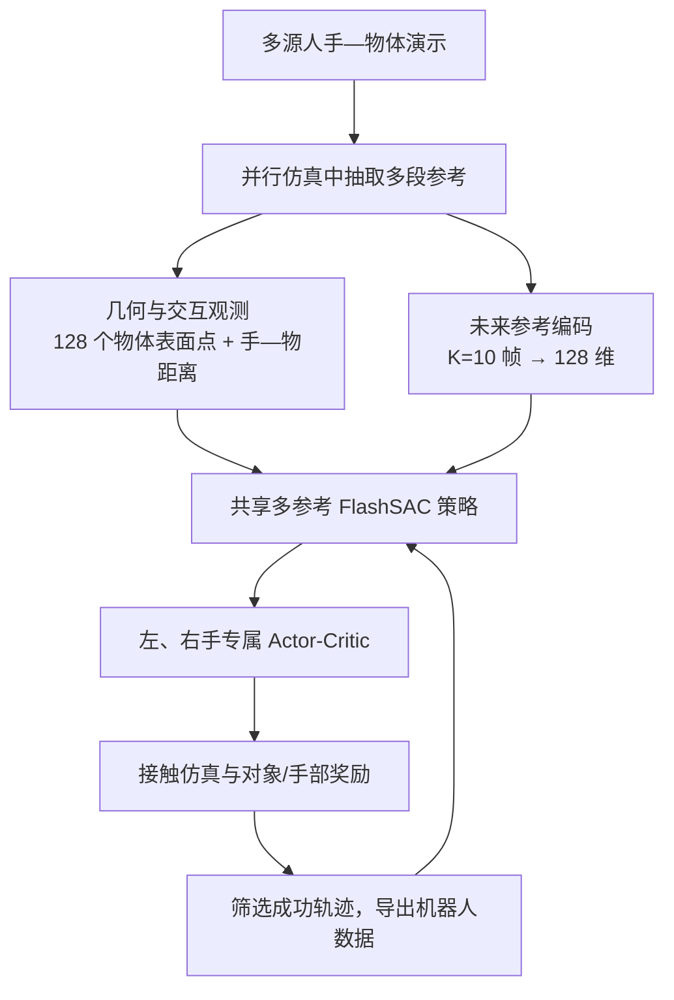

# FlashDexRetarget：Accelerating Dexterous Manipulation Data Generation through Multi-Motion Retargeting

## 一句话定义

**FlashDexRetarget** 将灵巧手动作重定向从“每段演示单独优化”改为“一个策略联合学习许多演示”，用物体几何与交互监督生成物理可执行的机器人轨迹。

## 英文缩写速查

| 缩写 | 英文全称 | 简要说明 |
|------|----------|----------|
| RL | Reinforcement Learning | 在物理仿真中学习跟踪手—物体演示的控制策略 |
| HOI | Human-Object Interaction | 人手与物体的姿态、接触和相对运动关系 |
| PCD | Point Cloud | 描述物体表面几何并参与策略观测和跟踪奖励 |
| SAC | Soft Actor-Critic | FlashSAC 所属的离策略强化学习方法 |
| GPU-h | GPU-hours | 论文比较多参考训练与逐动作基线的计算预算 |

## 为什么重要

大量人类手—物体演示可以提供多样的灵巧操作数据，但人手与机器人手的形态和动力学不同，不能直接照搬关节轨迹。逐演示运行物理搜索或训练独立策略会让计算量随演示数量增长。FlashDexRetarget 的核心变化是共享策略：多段参考动作共同训练，已学到的经验可以服务其他演示，目标是把数据生成的边际成本降下来。

## 方法流程

下图概括论文方法：每个训练环境从参考集合取一段演示；策略根据机器人当前状态、物体表面点、局部手—物距离特征和未来参考编码生成动作；奖励同时约束物体运动、交互关系和手部跟踪。双手各有 actor-critic，但共同处于同一个双手—物体仿真状态中。

## 核心机制

- **共享多参考跟踪：** 将一组人手与物体轨迹放进并行仿真环境，由一个条件策略共同学习，而非为每个演示单独训练或搜索。
- **几何感知观测：** 在手腕局部坐标系中表示物体表面，采样 128 个点；同时输入指尖到物体表面的距离与法向，令策略能区分物体形状和交互方式。
- **未来动作上下文：** 时序编码器读取接下来 (K=10) 帧的手和物体参考，压成 128 维表示，帮助策略提前处理旋转、双手协作等动作变化。
- **连续交互奖励：** 用连续手—物距离提供交互监督，避免从带重建误差的示范中硬推二元接触标签；物体奖励依据对齐表面点误差计算，以共同尺度覆盖平移和旋转。
- **双手分开的学习信号：** 左右手分别有 actor 和 critic，各自接受本手奖励；两个策略都读取完整双手状态、只控制对应一只手，适配双手角色不对称的任务。
- **重用离线经验：** 采用 FlashSAC，并将 replay buffer 扩至 50M transitions、critic 隐层增至 1024，以适应跨演示更宽的状态分布。

## 评测与结果

主基准从 TACO、OakInk2 与 HOT3D 选取 50 段动作（25 段单物体、25 段双物体），在 XHand 和 Sharpa Wave Hand 上测试。所有模拟评测使用 Isaac Sim 与 RTX 3090 GPU。

| 目标手 / 方法 | SR_SPIDER 成功率 | 严格 SR_MT 成功率 | GPU-hours |
|---|---:|---:|---:|
| XHand — FlashDexRetarget | **90%** | **86%** | **29** |
| XHand — CHORD | 46% | 0% | 2,847 |
| Sharpa Wave Hand — FlashDexRetarget | **86%** | **80%** | **44** |
| Sharpa Wave Hand — CHORD | 50% | 0% | 3,314 |

SR_SPIDER 主要看物体位置和旋转误差；SR_MT 还要求机器人手部跟踪参考手部，因此标准更严格。表格中 XHand 的约 98 倍计算量差距对应 29 对 2,847 GPU-hours；论文摘要将其概括为约 100 倍。真实机器人回放展示了擦板、向平底锅倒入物体和关盖任务。论文另用 200、500、1,000 段演示检查规模扩展。

## 与其他工作对比

相较 CHORD 等逐条演示优化方法，FlashDexRetarget 用一个多参考策略联合学习多段演示，目标是让训练经验跨动作复用。论文在 XHand 50 动作基准报告 SR_SPIDER 90%（CHORD 46%），计算量约 29 对 2,847 GPU-hours；更严格的 SR_MT 分别为 86% 与 0%。这些数值依赖论文的成功判据和基线预算，真机回放验证也不等于未见动作的开放泛化。

## 结论

**FlashDexRetarget 的主要贡献是把物理灵巧手重定向的训练成本跨演示摊销，同时维持较高的物体动作重现率。**

1. 比较“90%”时需注明采用 SR_SPIDER 物体级成功标准；更严格的手与物体联合跟踪 SR_MT 为 86%。
2. 100 倍计算优势来自共享多参考训练对比逐动作基线的总 GPU-hours；复现时需保持基线预算统计口径一致。
3. 物体点云、局部手—物距离和未来参考共同解决多参考训练中的几何与时序歧义；消融显示离策略经验复用和 critic 容量同样重要。
4. 真机结果是成功仿真轨迹的回放验证，不能据此推出对未见动作、未见机器人或任意现场观测的泛化。
5. 论文与演示可访问；截至 2026-10-07，官方算法代码仍标注 coming soon，项目 GitHub 仓库目前是项目页源码，不能据此视为可复现实装。

## 工程实践

复现评测要先统一演示集划分、有效动作过滤和成功判据。论文剔除了双手均未操作且物体静止的片段，以免“物体没动”造成虚假成功；SR_SPIDER、SR_MT-Obj 与 SR_MT 的阈值和统计口径不同，报告结果时不要只写一个未定义的成功率。当前没有公开训练代码、权重或项目数据包，因而方法实现与 GPU-hour 数字暂时无法独立复跑。

## 局限与风险

论文指出，方法依赖相对干净的人手—物体轨迹、准确物体几何和特权仿真信息；这些条件会限制真实部署和鲁棒性。未见动作、未见形态的泛化并未由主 50 动作实验直接证明。算法代码与数据发布仍待跟进。

## 源码运行时序图

**不适用：** 截至 2026-10-07，官方仓库只托管项目网站，论文代码入口为 coming soon；目前没有可运行的官方算法实现可据以绘制调用时序。

## 关联页面

- [Motion Retargeting（动作重定向）](../concepts/motion-retargeting.md)
- [SPIDER：Scalable Physics-Informed Dexterous Retargeting](../methods/spider-physics-informed-dexterous-retargeting.md)
- [HOI-Retarget](./paper-hoi-retarget.md)

## 参考来源

- [论文原始资料摘录](../../sources/papers/flashdexretarget_arxiv_2610_01849.md)
- [官方项目页开放状态](../../sources/sites/flashdexretarget-project.md)
- [官方 GitHub 仓库核查](../../sources/repos/flashdexretarget.md)
- [arXiv 摘要与版本历史](https://arxiv.org/abs/2610.01849) · [PDF](https://arxiv.org/pdf/2610.01849) · [HTML v2](https://arxiv.org/html/2610.01849v2)
- [官方项目页](https://holiday-robot.github.io/FlashDexRetarget/)
