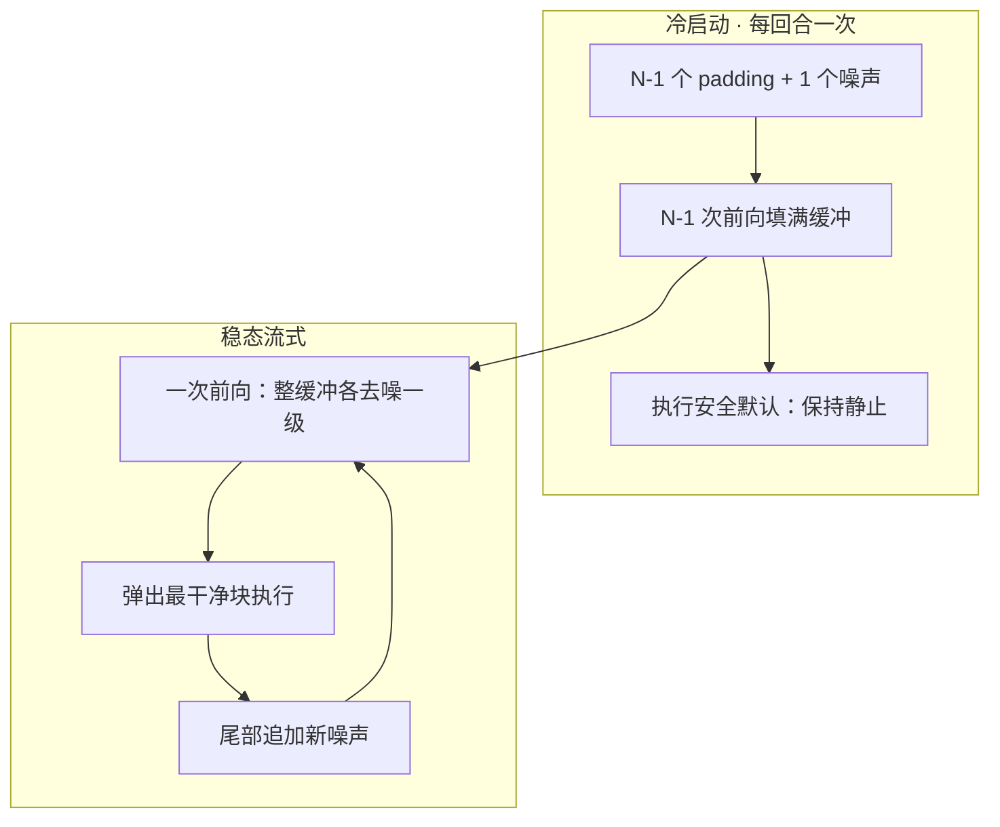
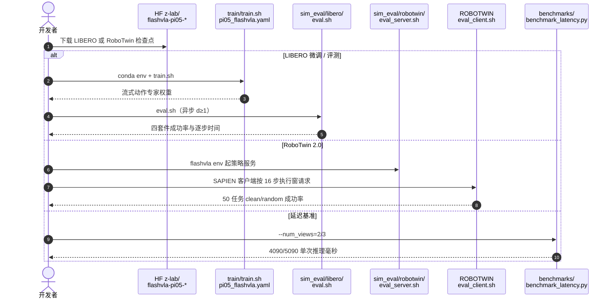

# FlashVLA：流式异步 VLA 动作解码

**FlashVLA**（*Streaming Action Decoding for Fast and Asynchronous VLA Inference*，[arXiv:2608.27384](https://arxiv.org/abs/2608.27384)，[代码](https://github.com/z-lab/flashvla)）由 **加州大学圣地亚哥分校（UCSD）** 与 **麻省理工学院（MIT）** 提出：把长视频的 **交错噪声流式扩散** 接到流匹配 VLA 的动作专家上，用一块缓冲同时压低 **逐步延迟** 与 **异步观测错配**，无需额外未来状态预测器。

## 一句话定义

**维护交错噪声水平的动作块缓冲，用 chunk 级因果注意力一次前向推进整缓冲，稳态每步弹出一块可执行动作——延迟摊销与轨迹连续来自同一结构。**

## 英文缩写速查

| 缩写 | 英文全称 | 简要说明 |
|------|----------|----------|
| VLA | Vision-Language-Action | 视觉–语言–动作策略 |
| FM | Flow Matching | \(\pi_{0.5}\) 等连续动作专家的迭代解码 |
| FiLM | Feature-wise Linear Modulation | 多级时间步条件的缩放/平移/门控 |
| TTFA | Time-to-First-Action | 新观测到首个可用动作的延迟 |
| TTR | Time-to-React | 推断延迟 + 半个执行窗的期望反应时间 |
| CUDA Graph | CUDA Graph | 稳态路径编译，降低 kernel 发射开销 |

## 为什么重要

- **延迟与错配不是两件事：** 同步停机与异步陈旧观测，都来自「每个 chunk 从纯噪声孤立解码」。只做轻骨干/蒸馏或只加未来状态条件，都只修一侧。
- **即插即用：** 改动作专家的时间步条件与注意力掩码，再做一次多缓冲微调，即可接到 \(\pi_{0.5}\) / SmolVLA / LingBot-VLA。
- **长程收益最大：** RoboTwin 2.0 长程子集平均成功率 **+36.6 pt**；LIBERO-Long **+3.8 pt**——缓冲里的短历史对跨 chunk 任务更敏感。
- **工程可跑：** Apache-2.0 仓 + LIBERO / RoboTwin 权重；真机单卡 RTX A4000 维持 **30 Hz**。

## 核心信息

| 项 | 内容 |
|----|------|
| **机构** | 加州大学圣地亚哥分校（UCSD）；麻省理工学院（MIT） |
| **基座** | 主实验 \(\pi_{0.5}\)；泛化 SmolVLA、LingBot-VLA |
| **缓冲** | LIBERO：\(C{=}10,N{=}4\)；RoboTwin：\(C{=}20,N{=}4\)（\(N\times C\) 对齐原生 chunk 50） |
| **训练** | 8×H200；LIBERO 50K / RoboTwin 100K |
| **开源** | **已开源** Apache-2.0：[z-lab/flashvla](https://github.com/z-lab/flashvla)；HF [`flashvla-pi05-libero`](https://huggingface.co/z-lab/flashvla-pi05-libero) / [`flashvla-pi05-robotwin`](https://huggingface.co/z-lab/flashvla-pi05-robotwin) |

## 核心原理（方法）

流匹配 VLA 把观测 \(o_t\) 下的动作块 \(\mathbf{a}_t\) 从噪声 \(\mathbf{x}_1\) 沿速度场 \(v_\theta\) 去噪。FlashVLA 不再把 \(N\) 次前向全部花在同一块上，而是保持

\[
\mathbf{B}_t=[\mathbf{x}^{(1)}_{\tau_1},\ldots,\mathbf{x}^{(N)}_{\tau_N}],\quad \tau_1<\cdots<\tau_N.
\]

前端近干净、即将执行；尾端近纯噪声。一次前向把每块推进一级；稳态弹出前端、尾部补新噪声。chunk 级因果掩码只允许更噪块看更干净块，禁止反向，避免「即将执行的块被更噪未来污染」。

**多缓冲联合微调** 把同一观测的 \(N\) 种冷启动填充状态打进一个样本，共享 \(o_t\) 编码、用掩码隔离缓冲，覆盖冷启动与稳态。动作专家用 FiLM 做多级时间步条件；RoboTwin 多任务偶发梯度爆炸时，重初始化专家归一化层。

### 流程总览

## 源码运行时序图

节点对齐 [`sources/repos/flashvla.md`](../../sources/repos/flashvla.md) 与 README 入口。

- **最短复现：** `conda env create -f environment.yml` → 拉 `flashvla-pi05-libero` → `sim_eval/libero/eval.sh`。
- **双仿真：** RoboTwin 必须服务端 / 客户端分环境，见 `sim_eval/robotwin/`。
- **系统优化：** 稳态路径编成 CUDA Graph + 线性层打包 + `max-autotune`，与算法正交但为墙钟加速所必需。

## 工程实践

| 项 | 建议 |
|----|------|
| 缓冲跨度 | \(N\times C\) 贴近预训练原生 chunk；LIBERO 默认 \(C{=}10,N{=}4\) |
| 异步延迟 \(d\) | \(d{=}1\) 已够用；\(d{=}4\) 仍高于同步 \(\pi_{0.5}\)，VLASH 在 \(d{=}4\) 会掉点 |
| 冷启动 | 每回合付 \(N{-}1\) 步静止默认；短任务更明显，长 rollout 可摊销 |
| 微调不稳 | 专家 norm 输出爆炸时重初始化 norm、其余权重继续加载 |
| 对照基线 | 异步比 VLASH / StreamingVLA；延迟比 Realtime-VLA；反应比 FASTER |

## 实验与评测

| 设定 | 数字（论文 / README） |
|------|----------------------|
| LIBERO \(d{=}1\) | 平均 **97.8%** vs \(\pi_{0.5}\) **96.9%**；逐步 **22.1 ms（2.43×）** |
| LIBERO 同步 | 平均 **97.9%**；Long **96.2%**（+3.8） |
| RoboTwin 50 任务 | 平均 **90.5–90.6%** vs **86.0%**；长程 **89.6%** vs **53.0%** |
| 推理延迟 | 4090 双视角 **26.7 ms** vs \(\pi_{0.5}\) **45.8** / Realtime-VLA **29.2** |
| 反应 | TTFA **37.1 ms** vs FASTER **62.1**（1.7×） |
| 真机 Franka | 三任务均分 **84.4%** vs 同步/RTC **80.0%**；完成时间约 **1.3×**；A4000 **67.3 ms** 推断 + \(d{=}2\) → 30 Hz |
| 因果消融 | 去掉掩码、保留缓冲：异步成功率约 **-10 pt** |

## 结论

**FlashVLA 用「联合解码动作块」同时修流匹配 VLA 的墙钟延迟和异步错配；因果掩码是异步连续性的活性成分，不是缓冲本身。**

1. **真影响指标是逐步墙钟与长程成功率** — LIBERO 2.43×、长程 RoboTwin +36.6 pt；平均成功率只是「不掉点」的门槛。
2. **不要用未来状态头补异步** — chunk 级因果注意力已把在飞轨迹条件进未来块。
3. **缓冲跨度对齐预训练 chunk** — 乱加大 \(C\) 会在短视界任务上掉成功率，逐步时间还会被失败重置污染。
4. **冷启动是一次性税** — 短 episode 更疼；部署时用静止默认，不要执行未填满缓冲的预测。
5. **系统编译与算法分开记账** — CUDA Graph 等优化两边都开才公平比延迟。
6. **从预训练 VLA 微调，不是从零流式预训练** — 作者把从零因果预训练列为下一步。

## 与其他工作对比

| 对照 | 差异读法 |
|------|----------|
| VLASH | 显式未来状态条件；同 \(\pi_{0.5}\) 上 \(d{=}1\) 仅 1.15×，\(d{=}4\) 掉到 93.1% |
| StreamingVLA | 动作流匹配 + 自适应早观测；1.70× 但 LIBERO 平均 **-2.0 pt** |
| Realtime-VLA / FASTER | 把单次前向做便宜或改反应调度；不改「孤立 chunk 迭代」结构 |
| [ForeTime-VLA](./paper-foretime-vla.md) | 蒸馏 WAM 未来 token 进 \(\pi_{0.5}\)；FlashVLA 改的是 **解码循环**，不是未来表征 |

## 局限与风险

- **继承孤立 chunk 预训练目标** — 微调适配流式，上限仍受基座训练方式约束。
- **冷启动** — \(N{-}1\) 步暖机；极短任务摊销不足。
- **RoboTwin 逐步加速偏小** — 仿真渲染占逐步时间的大头（约 36.8 / 47.4 ms），政策侧加速被摊薄。
- **真机样本** — 每任务 15 trial、三档量规；完成时间只统计成功回合。

## 关联页面

- [\(\pi_{0.5}\)](./paper-pi05-open-world-vla.md) — 主基座与 openpi 入口
- [VLA](../methods/vla.md) — 流匹配动作头与部署加速
- [Action Chunking](../methods/action-chunking.md) — chunk 边界停机与异步重叠
- [LingBot-VLA](./lingbot-vla.md) — 跨架构泛化之一
- [ForeTime-VLA](./paper-foretime-vla.md) — 同基座、不同问题（未来 token 蒸馏）
- [LeRobot](./lerobot.md) — 评测与数据格式依赖

## 参考来源

- [flashvla_arxiv_2608_27384.md](../../sources/papers/flashvla_arxiv_2608_27384.md) — 论文摘录
- [flashvla.md](../../sources/repos/flashvla.md) — 仓库入口
- [z-lab-flashvla.md](../../sources/sites/z-lab-flashvla.md) — 项目博客

## 推荐继续阅读

- 论文 — <https://arxiv.org/abs/2608.27384>
- 代码 — <https://github.com/z-lab/flashvla>
- LIBERO 权重 — <https://huggingface.co/z-lab/flashvla-pi05-libero>
- VLASH（异步对照）— <https://arxiv.org/abs/2512.01031>
