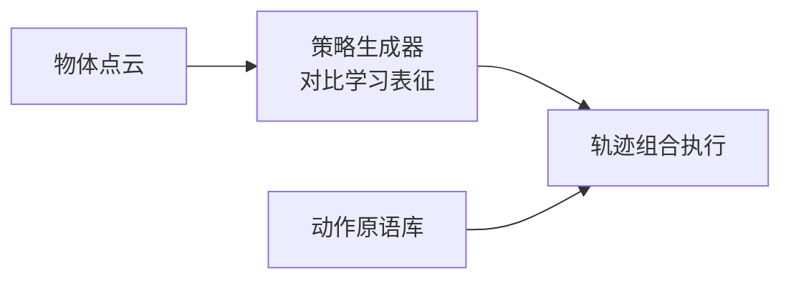

# FlatLab：平面物体操作的统一框架与仿真基准

**FlatLab**（*A Unified Methodology Framework and Simulation-Based Benchmark for Robotic Manipulation of Flat Objects*；[arXiv:2608.14049](https://arxiv.org/abs/2608.14049)，[项目页](https://flatlab-web.github.io/)）提出 **策略生成器 + 动作执行模块** 解耦框架，并发布 **FlatLab** 仿真平台：100+ 刚性与可变形平面物体、自动多模态采集与统一评测协议。

## 一句话定义

**平面物体操作需要同时标准化「怎么测」和「怎么做」——单策略推边缘/双臂抬升无法覆盖全部几何与材质组合。**

## 英文缩写速查

| 缩写 | 英文全称 | 简要说明 |
|------|----------|----------|
| FlatLab | Flat Object Manipulation Lab/Benchmark | 本文仿真基准平台 |
| Sim2Real | Simulation-to-Real | 仿真训练迁移真机 |
| OBB | Oriented Bounding Box | 部分对比工作用的定向框表征 |

## 为什么重要

- 书本、木板、布料等 **平放构型** 常无直接夹取 affordance。
- 现有工作多 **单策略 + 封闭物体集**，横向比较困难。
- 纳入 [九篇盘点](../../sources/blogs/wechat_embodied_station_9_papers_vla_predict_grasp_2026-08-24.md) 的「基准 + 任务工程」主线。

## 核心信息

| 项 | 内容 |
|----|------|
| **机构** | 吉林大学、北京大学、中科院、伯明翰大学等 |
| **仿真** | Isaac Sim；100+ 平面物体资产 |
| **开源** | **待发布**（摘要/项目页承诺公开 code，截至 2026-08-24 无 URL） |

## 核心原理

- **策略生成器** — 从点云预测操作策略（推边缘、双臂抬升等），学习策略中心、物体不变表征。
- **执行模块** — 长时序拆为可复用原语，学习位置相关姿态而非物体专属特征。

## 源码运行时序图

**不适用** — 截至 **2026-08-24** 代码尚未发布。

## 工程实践

| 项 | 建议 |
|----|------|
| 何时引用 | 需要 **平面物体** 泛化基准或策略级解耦管线 |
| 与单策略对比 | 大/薄/可变形物体失败模式不同，需自适应策略选择 |
| 跟踪发布 | 关注 flatlab-web 是否上线 GitHub 与一键部署脚本 |

## 实验与评测

- 仿真未见物体/类别泛化优于启发式与基线。
- 真机展示多策略（Strategy A/B/C）切换案例。

## 结论

**平面物体泛化 = 策略选择标准化 + 可复用执行原语 + 可扩展基准。**

1. **解耦设计** — 避免过拟合物体几何，策略与执行可独立消融。
2. **基准缺口填补** — 刚/可变形平面物体此前缺少统一仿真平台。
3. **多模态数据** — 自动采集点云/RGB/深度与成败示范。
4. **待发布代码** — 复现前只能参考项目页与 PDF。
5. **任务工程价值** — 与「更大 VLA」并列的务实进展线。

## 与其他工作对比

| 对照 | 差异读法 |
|------|----------|
| 单策略推边缘 | 对大/可变形物体失效；本文多策略预测 |
| 双臂抬升大平板 | 薄/软物体不可靠；本文统一框架内切换 |
| FluidLab / GarmentLab | 流体/服装专用；FlatLab 专注 **平面** 刚/软体 |

## 局限与风险

- **代码待发布** — 基准与训练管线暂不可复现。
- **Isaac Sim 依赖** — 部署需 NVIDIA 仿真栈。
- **真机规模** — 论文以仿真为主，真机案例为策略展示级。

## 关联页面

- [Manipulation](../tasks/manipulation.md)
- [Sim2Real](../concepts/sim2real.md)
- [VLA·预测·抓取 9 篇技术地图](../overview/vla-predict-grasp-9-papers-technology-map.md)

## 参考来源

- [flatlab_arxiv_2608_14049](../../sources/papers/flatlab_arxiv_2608_14049.md)
- [flatlab-web-github-io](../../sources/sites/flatlab-web-github-io.md)
- [具身智能小站 9 篇盘点（2026-08-24）](../../sources/blogs/wechat_embodied_station_9_papers_vla_predict_grasp_2026-08-24.md)

## 推荐继续阅读

- [arXiv:2608.14049](https://arxiv.org/abs/2608.14049)
- [FlatLab 项目页](https://flatlab-web.github.io/)
