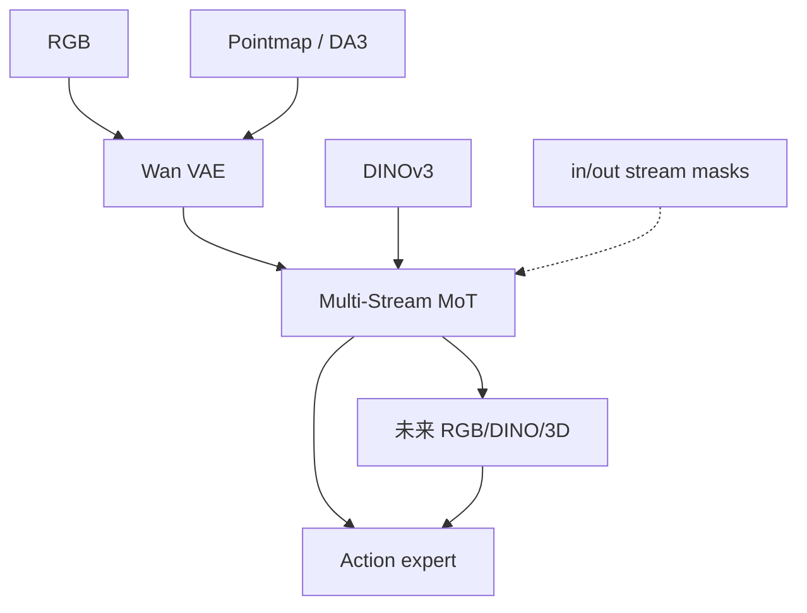

# Flex-π（Multi-Stream WAM · Compute Flexibility · arXiv:2608.10860）

**Flex-π**（*Flex-π: A Multi-Stream World-Action Model with Compute Flexibility*，[arXiv:2608.10860](https://arxiv.org/abs/2608.10860)）由 **华盛顿大学（UW）** 与 **艾伦人工智能研究所（AI2）** 提出（Yan\* / Liu\* / Fan\* / Cai / Liao / Zhang† / Fox†）：在共享 latent 里联合去噪 **RGB · 3D pointmap · DINO 语义 · 动作**，并用流 dropout + cross-modality forcing 让 **一个 checkpoint** 覆盖 action-only 到 full joint 的算力档位。[项目页](https://flex-pi.github.io/) · [代码占位](https://github.com/geyan21/flex-pi)。

## 一句话定义

**几何和语义不必新传感器：冻结视频 VAE 几乎免费吃进 pointmap，再和 DINO 一起训；部署时用掩码选你要的速度–精度点。**

## 英文缩写速查

| 缩写 | 英文全称 | 简要说明 |
|------|----------|----------|
| WAM | World Action Model | 联合未来与动作的策略族 |
| MoT | Mixture-of-Transformers | 多流共享 trunk、分模态 FFN/专家 |
| VAE | Variational Autoencoder | Wan-2.2 冻结编码器；RGB 与 pointmap 共用 |
| DINO | Self-Distillation with No Labels | DINOv3 物体语义 token 流 |
| CMF | Cross-Modality Forcing | 输入缺某流仍强制预测其未来 |

## 为什么重要

- **把 DreamWAM 式「训练多视图」推到可部署多组合：** 推理仍可只出动作，也可读 3D/语义未来。
- **算力柔性是产品接口：** action-only ~60 ms（快于 \(\pi_{0.5}\)）；full joint 换更高成功率。
- **真机精密双臂增益大：** self-repair / soft-bag 等接触丰富任务相对最强基线最高约 **2–7×**。

## 核心信息

| 项 | 内容 |
|----|------|
| **机构** | 华盛顿大学（UW）；艾伦人工智能研究所（AI2） |
| **规模** | ~6B（5B 视觉 MoT trunk + ~1B action expert） |
| **预训练** | Wan-2.2-5B 初始化；AGIBOT World 等 |
| **开源** | **代码待发布**（GitHub 仅 README；截至 2026-08-13） |
| **源码运行时序图** | **不适用**（无可运行实现） |

## 核心原理

### 三视觉流 + 动作专家

| 流 | 编码 | 角色 |
|----|------|------|
| RGB \(z^o\) | 冻结 Wan VAE | 外观与视频先验 |
| Pointmap \(z^p\) | **同一** VAE | 3D 几何（论文报近无损重建） |
| DINO \(d\) | 冻结 DINOv3 + PixelUnshuffle | 物体语义 |
| Action | 较窄 expert，单向读视觉未来 | 控制输出 |

中间 16/30 MoT block 做跨流注意力；动作永不被视觉流反向注意。

### 柔性训练

独立采样 \(\mathbf{m}^{\mathrm{in}}\) / \(\mathbf{m}^{\mathrm{out}}\)（每流 drop 0.5，至少保留一流输入）。**\(\mathbf{m}^{\mathrm{out}}\) 不是 loss mask**——所有未来流始终算 flow matching；缺输入仍预测该模态未来 = cross-modality forcing（RoboTwin 相对增益约 +47% 的消融叙事见项目页）。

### 流程总览

## 工程实践

| 项 | 建议读法 |
|----|----------|
| 部署档位 | 默认先跑 **action-only**；难任务再开 joint 未来 |
| 传感器 | 训练用 RGB→DA3/DINO 离线；推理可无 3D 输入 |
| 延迟前沿 | 5090 上 ~60 ms vs ~193 ms（action-only vs full joint） |
| 开源跟进 | Watch [geyan21/flex-pi](https://github.com/geyan21/flex-pi) |
| 对照协议 | 真机与 \(\pi_{0.5}\)、ManiFlow、Fast-WAM 同数据对照 |

## 实验与评测

| 设定 | Flex-π 读点 |
|------|-------------|
| 真机 ID avg（full / action-only） | **83.0% / 76.4%**（ManiFlow 58.0，\(\pi_{0.5}\) 52.1） |
| 真机 OOD avg | **76.1%**（ManiFlow 31.5，\(\pi_{0.5}\) 43.2） |
| 50% 数据 Put Plate | full joint **95%** 仍高于全数据基线 |
| RoboTwin / LIBERO | 有限演示约 **1.9×** 最强 WAM；LIBERO 总体最高 **99.2%** |

## 结论

**Flex-π 证明：WAM 的增益可以来自「多流联合预测 + 部署掩码」，而不必在推理时永远付出 full video 成本。**

1. **先看 action-only 是否已超过 \(\pi_{0.5}\)** — 多数任务已赢，再决定是否加 joint。
2. **几何/语义是训练税，不是传感器税** — pointmap 走共享 VAE；DINO 冻结。
3. **CMF 不要当可选项砍掉** — 它强迫共享表征互预测，而不只是缺模态鲁棒。
4. **选型坐标：** 要算力柔性多流 → Flex-π；要失败后果 → [FACT](./paper-fact.md)；要 beyond-RGB 但部署 RGB-only 固定配方 → [DreamWAM](./paper-dreamwam.md)。

## 局限与风险

- **代码与权重待发布**；数字以论文/项目页为准，暂不可本地复现。
- 仍需大量演示；joint 与最低延迟不可同得。
- LIBERO 已近饱和，主说服力在真机精密任务与 OOD。

## 与其他工作对比

| 工作 | 关系 |
|------|------|
| [DreamWAM](./paper-dreamwam.md) | 同为多视图未来；DreamWAM 推理关 beyond-RGB，Flex-π 保留可选流组合 |
| Fast-WAM / DreamZero | RGB latent WAM 基线；Flex-π 加 3D/DINO 与柔性掩码 |
| \(\pi_{0.5}\) | 强 VLA 对照；Flex-π action-only 更快且真机更高 |
| ManiFlow | 显式 3D 输入基线；OOD 掉点更大 |

## 关联页面

- [World Action Models](../concepts/world-action-models.md)
- [DreamWAM](./paper-dreamwam.md)
- [FACT](./paper-fact.md)
- [VLA](../methods/vla.md)
- [LIBERO](./libero-benchmark.md)

## 参考来源

- [论文归档](../../sources/papers/flex_pi_arxiv_2608_10860.md)
- [仓库归档](../../sources/repos/flex-pi.md)
- [项目页归档](../../sources/sites/flex-pi-github-io.md)

## 推荐继续阅读

- 项目页真机表与流组合演示：<https://flex-pi.github.io/>
- 论文 HTML：<https://arxiv.org/html/2608.10860>
