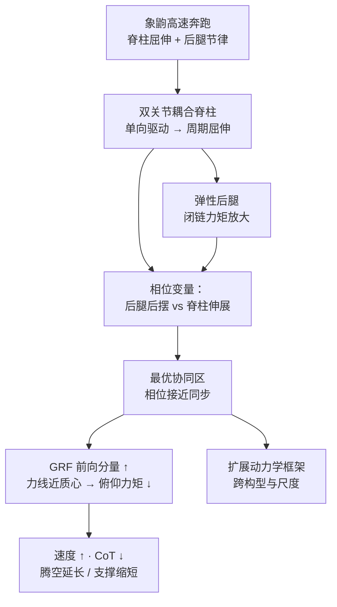

# FLEXOR：动态脊-腿协同与微小型四足高速推进

**Unlocking fast robotic locomotor propulsion through dynamic spine-leg synergy**（Wang Ruochao 等，**北京理工大学**第一单位，联合 **南京大学**；*Science Advances*，2026-09-25，[DOI:10.1126/sciadv.aed5603](https://doi.org/10.1126/sciadv.aed5603)；[PubMed 42789728](https://pubmed.ncbi.nlm.nih.gov/42789728/)）提出微小型仿生四足 **FLEXOR**（*F*ast *Leg*ged robot with a *Flex*ible spine for *O*ptimal *R*unning），用 **双关节耦合脊柱** 与 **弹性腿** 在仿真与实机中识别 **动态脊-腿协同** 的最优相位，并证明该协同可跨不同脊柱/腿构型与尺度泛化。

## 一句话定义

**小尺度四足不必只靠加大腿功率：让脊柱伸展与后腿后摆在相位上对齐，就能把 GRF 更有效地转成前向推进，并由闭链脊柱放大力矩。**

## 英文缩写速查

| 缩写 | 英文全称 | 简要说明 |
|------|----------|----------|
| FLEXOR | Fast Legged robot with a Flexible spine for Optimal Running | 本文微小型仿生四足平台 |
| GRF | Ground Reaction Force | 地面反作用力；协同优化其前向分量与作用线 |
| CoT | Cost of Transport | 运输成本，单位距离能耗 |
| BL/s | Body Lengths per Second | 体长/秒，小尺度速度归一化 |
| BIT | Beijing Institute of Technology | 北京理工大学，第一完成单位 |
| NJU | Nanjing University | 南京大学，合作单位 |
| DoF | Degrees of Freedom | 机构自由度；双关节脊柱相对单关节的构型差异 |

## 为什么重要

- **把「脊柱」从装饰变成推进器：** 多数四足机器人弱化或固定脊柱；本文像象鼩一样用 **节律脊柱屈伸 + 腿** 共同产推进，强调 **physical intelligence 在本体** 而非纯算法堆功率。
- **可操作的协同变量：** 用 **后腿后摆相对脊柱伸展的相位差** 刻画脊-腿关系，并在实验中找到 **可重复的最优区**——工程上比黑盒 RL 更易解释与迁移。
- **结构增益与能量：** 双关节 **耦合** 脊柱把 **单向旋转** 变成周期屈伸，并通过闭链 **放大扭矩**；新闻稿对照显示 **峰值后腿 GRF 近翻倍** 而 **CoT 下降**，说明增益来自 **力传递与时序** 而不只是加大输入功率。
- **小尺度 relevance：** 微小型四足驱动与尺寸受限，与象鼩问题同构；对 **高机动具身智能** 与 **仿生微机器人** 选型有直接参考。
- **确认未开源：** 截至入库日无官方仓库，读者需以论文 + 机构稿理解机制，不能按 README 复现。

## 核心信息

| 项 | 内容 |
|----|------|
| **机构** | 北京理工大学（BIT）人工智能学院 **石青** 团队（第一单位）；南京大学 **邴振山**；通讯 **石青**、**于志强**（长三角研究院嘉兴） |
| **作者** | 一作 **王若超**（博士后）；Crossref 共 9 作者，末位 **Qing Shi** |
| **平台** | FLEXOR：双关节耦合柔性脊柱 + 弹性后腿；仿生原型 **象鼩** |
| **发表** | *Science Advances*，2026-09-25；Issue 39 |
| **开源（2026-10-01）** | **确认未开源**：[北理工新闻稿](../../sources/sites/bit-flexor-sciadv-2026.md) 与 DOI 页均无 GitHub / 数据链 |

## 流程总览

## 核心机制（知识归纳）

### 1. 仿生动机与机构

- **象鼩** 体型小、却能在奔跑中呈现 **明显脊柱屈伸**，与 **高度适应奔跑的后肢** 协同——问题设定与 **微小型四足**（驱动功率与惯量受限）对齐。
- **双关节耦合脊柱：** 将生物脊柱等效为 **双关节**，通过 **闭链多连杆** 把作动器 **单向旋转** 转为 **快速周期性脊柱屈伸**；相对 **单关节脊柱**，减少复杂往复控制并 **放大传递到后腿的扭矩**（见 [机构新闻摘录](../../sources/sites/bit-flexor-sciadv-2026.md) 图 2 说明）。

### 2. 动态脊-腿协同

- 建立 **多参数动力学模型**，以 **后腿后摆相对脊柱伸展的相位差** 为描述协同的核心标量。
- **最优协同：** 后腿后摆 **接近** 脊柱 **伸展** 时，脊柱与后腿作用力在 **恰当时刻** 共同传至地面 → **GRF 前向分量增大**，且 **作用线更接近质心** → **绕质心俯仰力矩减小**，机身姿态波动受抑。
- **步态相：** 最优协同 **延长腾空相、缩短支撑相**，降低触地过程能量损耗。

### 3. 实机对照（机构稿数字，同质量 / 同整体尺寸 / 同最大驱动功率）

| 指标 | 单关节脊柱对照 | FLEXOR（双关节耦合） |
|------|----------------|----------------------|
| 平均速度 | 基准 | **0.784 m/s**（**>7 体长/秒**） |
| 相对速度 | — | **+31.6%** |
| CoT | 基准 | **−32.2%** |
| 后腿峰值 GRF | **2.82 N** | **5.19 N** |

> 定量以期刊正文为准；上表来自北理工 2026-09-28 新闻稿，与 Crossref 摘要叙事一致。

### 4. 泛化

- **扩展动力学框架** 扫描不同 **脊柱结构、腿部构型、尺度、关节轨迹、弯曲幅度与驱动扭矩**；绝对速度随形态变化，但 **最优协同仍集中在「脊柱伸展 ≈ 后腿后摆」** 附近 → 作者主张这是四足系统的 **共同动力学规律**，而非 FLEXOR 特例。

## 评测与指标

- 主指标：**平均前进速度**、**CoT**、**GRF 幅值与方向**、**相位协同参数**、腾空/支撑相占比；对照实验控制 **质量、包络尺寸与峰值驱动功率**。
- 仿真 + **robophysical 实机** 联合识别最优相位；扩展模型做 **跨形态/尺度** 敏感性分析（细节见原文 Supplementary）。

## 与其他工作对比

| 对比轴 | FLEXOR（本文） | [Learning to Adapt](./paper-learning-to-adapt-bio-inspired-quadruped-gait.md) | [Walk These Ways](./paper-walk-these-ways-quadruped-mob.md) |
|--------|----------------|-------------------------------------------------------------------------------|-------------------------------------------------------------|
| 核心问题 | **脊-腿相位协同** 与 **闭链脊柱力放大** | **多步态切换** 与 BGS/πL 盲适应 | **MOB** 多技能 RL 与 sim 多样性 |
| 本体重点 | 双关节耦合 **柔性脊柱** | 标准四足，不强调脊柱 | 标准四足 + 地形/命令随机化 |
| 主要增益 | 同功率下 **速度 +31.6% / CoT −32.2%**（对单关节脊柱） | 复杂地形 **零样本** 多 gait | 大规模并行 sim 的 **鲁棒 locomotion** |
| 开源 | **未开源**（2026-10-01） | [ihcr 仓库](https://github.com/ihcrlearning/learning_to_adapt) | 官方 MOB 栈 |

- 与 [执行器约束 RL 高速四足](./paper-actuator-constrained-rl-high-speed-quadruped-locomotion.md) 正交：后者把 **MOR 扭矩–转速包络** 写进训练换绝对 m/s，本文换 **结构协同** 而非堆电枢功率。

## 源码运行时序图

**不适用。** 截至 **2026-10-01** 无官方可运行仓库；[步骤 2.5 核查](../../sources/sites/bit-flexor-sciadv-2026.md) 仅链到 DOI 与机构新闻。若团队后续发布训练/控制代码，应补 `sources/repos/` 与本节 `sequenceDiagram`。

## 工程实践

| 项 | 建议 |
|----|------|
| 何时考虑脊柱 | 小尺度、功率预算紧、需 **BL/s** 而非绝对 m/s 时，评估 **脊-腿相位** 是否比加电机更划算 |
| 机构 | 优先评估 **闭链力放大** 与 **单向驱动→周期运动** 是否降低控制带宽需求 |
| 调参 | 以 **相位差** 为主旋钮扫描；最优区窄则先固定腿弹性与脊柱幅度再微调 |
| 对照基线 | 与 **同规格单关节脊柱** 比，避免与大型四足 RL 平台直接比绝对速度 |
| 复现预期 | **无代码**；CAD/控制需联系作者或等数据发布 |
| 与 RL 栈关系 | 本文为 **机理 + 机构** 路线，可与 [Walk These Ways](./paper-walk-these-ways-quadruped-mob.md) 等 **MOB/RL** 正交：本体协同 vs 策略多样性 |

## 局限与风险

- **尺度与形态：** 结论在 **微小型** 与特定 **双关节脊柱** 上验证；放大到工业四足或人形需重新辨识相位与结构增益。
- **未开源：** 不能验证控制律细节、传感器栈与制造公差敏感性。
- **对照范围：** 新闻稿强调与 **同功率单关节脊柱** 对照；与 **无脊柱刚性四足** 或 **纯 RL 高速机** 的横向对比需读原文 Table。
- **部署路径：** 作者展望 **头–尾–全身多关节协同**；当前页只覆盖 **脊-腿** 主链。

## 结论

**FLEXOR 表明：在小尺度四足上，动态脊-腿协同是可设计、可参数化的推进机制，结构放大力矩与时序对齐可以同时换速度与 CoT。**

- **真影响指标：** 相位对齐带来的 **GRF 方向/作用线** 改善，以及 **31.6% / 32.2%** 级速度–能耗对照（同规格单关节脊柱）。
- **次要代价：** 机构复杂度与调参维度上升；泛化到其它构型需扩展模型验证。
- **部署读法：** 适合 **仿生微机器人 / 物理智能本体** 研究，不适合期待即插即用开源栈的 RL 工程团队。
- **开源：** 入库日 **确认未开源**；选型时按 **论文 + 机构稿** 做机制判断，勿假设有 GitHub。
- **与步态 RL 的关系：** 不替代 [Learning to Adapt](./paper-learning-to-adapt-bio-inspired-quadruped-gait.md) 类 **步态切换** 学习，而是补 **脊柱–腿耦合** 这一生物维度。

## 关联页面

- [Locomotion 任务](../tasks/locomotion.md) — 四足运动主线
- [Learning to Adapt（Nature MI 2025）](./paper-learning-to-adapt-bio-inspired-quadruped-gait.md) — 生物启发四足步态与切换
- [Walk These Ways](./paper-walk-these-ways-quadruped-mob.md) — 四足 MOB / 多技能 RL
- [执行器约束 RL 高速四足](./paper-actuator-constrained-rl-high-speed-quadruped-locomotion.md) — 高速四足的另一轴（扭矩–转速包络）
- [仿生多模态机器人综述（Science Robotics 2026）](./paper-bioinspired-multimodal-robotics.md) — 物理智能 × 计算智能总览
- [Gait Generation](../concepts/gait-generation.md) — 步态与节律概念

## 参考来源

- [`flexor_dynamic_spine_leg_synergy_sciadv_2026.md`](../../sources/papers/flexor_dynamic_spine_leg_synergy_sciadv_2026.md) — DOI / Crossref 摘要与开源结论
- [`bit-flexor-sciadv-2026.md`](../../sources/sites/bit-flexor-sciadv-2026.md) — 北理工新闻稿与实机数字
- [Science Advances 原文](https://www.science.org/doi/10.1126/sciadv.aed5603)
- [PubMed 42789728](https://pubmed.ncbi.nlm.nih.gov/42789728/)

## 推荐继续阅读

- [DOI 10.1126/sciadv.aed5603](https://doi.org/10.1126/sciadv.aed5603) — 期刊全文与补充材料
- [北理工科研成果稿](https://www.bit.edu.cn/xww/xzw/xsjl1/d3c4735d43a24b14ba71eca2693a73a2.htm) — 中文机制导读与团队背景
