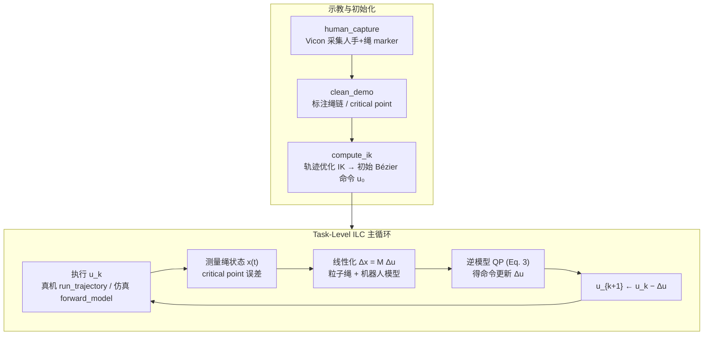

# Flying Knots（Task-Level ILC for Deformable Rope Manipulation）

**Flying Knots** 是 CMU **Krishna Suresh & Chris Atkeson** 的 **可变形体动态操作** 论文（arXiv:2602.21302）：在 **flying knot**（非平面绳索动态打结）任务上，用 **Task-Level Iterative Learning Control（任务级迭代学习控制）** 实现 **单次人类示教 + 简化绳模型 + 真机闭环修正**，避免依赖大规模示教数据或海量仿真。

## 英文缩写速查

| 缩写 | 英文全称 | 简要说明 |
|------|----------|----------|
| ILC | Iterative Learning Control | 重复执行同一任务并从误差中迭代修正命令的控制范式 |
| QP | Quadratic Programming | 将逆模型/跟踪问题写成二次规划求解 |
| IK | Inverse Kinematics | 由末端/任务轨迹反解关节或命令参数 |
| MoCap | Motion Capture | 本文用 Vicon 采集人手与绳 marker 轨迹 |
| DoF | Degrees of Freedom | 可变形体有效自由度极高，是建模难点 |
| IL | Imitation Learning | 对比路线：本文强调「单示教 + 迭代修正」而非大规模 BC |

## 核心信息

| 字段 | 内容 |
|------|------|
| 机构 | 卡内基梅隆大学（CMU） |
| 作者 | Krishna Suresh、Chris Atkeson |
| 论文/项目 | <https://arxiv.org/abs/2602.21302> · <https://flying-knots.github.io/> |
| 代码 | [flying_knots_public](https://github.com/krish-suresh/flying_knots_public)（MIT） |
| 硬件 | xArm7 + Vicon mocap |
| 任务 | Flying knot — 甩动绳索使中段 **自碰撞成结** |

## 为什么重要

- **样本效率对照 IL/RL**：主流操作学习依赖 **数百–数万条示教** 或 **大规模仿真**；本文在 **7 种真实绳索** 上 **≤10 次真机试验** 即达 **100% 成功率**，且绳型间 **2–5 次可迁移**。
- **任务级而非轨迹级 ILC**：不逐点跟踪整条绳状态，而聚焦 **critical point**（自碰撞瞬间）的任务误差——降低可变形体全状态建模负担。
- **模型辅助的真机闭环**：每轮用 **局部线性化逆模型 QP** 把任务误差映射为 **Bézier 命令更新**，兼顾 **可解释性** 与 **硬件数据效率**。
- **开源可复现管线**：四阶段脚本 + `docs/architecture.md` paper→code 对照，便于研究 **绳操作 / ILC / 示教→命令** 接口。

## 流程总览

## 核心机制（归纳）

### Flying knot 与 critical point

- **Flying knot**：动态甩绳使绳段在空中 **自碰撞** 形成结；属于 **非平面、强动态、接触丰富** 的可变形体操作。
- **Critical point**：示教清洗阶段人工/半自动标注的 **首次自碰撞帧**；ILC 主代价 **Q** 加权该点位置/速度误差，**follow-through** 项（**Q**ft）约束碰撞后短时跟踪。

### Task-Level ILC（Algorithm 1）

每轮迭代：

1. 在硬件或粒子仿真中执行当前 **Bézier 命令 u**。
2. 记录绳轨迹 **x(t)**（mocap 或仿真状态）。
3. 计算 critical-point 任务误差 **x̃**(tc)。
4. 围绕当前命令线性化动力学，组装 **Δx = M Δu** 约束。
5. 解 **Eq. 3** 二次规划得 **Δu**；信任域更新由 `common/solver.py` + Clarabel 完成。
6. **u**k+1 ← **u**k − **Δu**，直至成功或达迭代上限。

### 模型与命令参数化

| 组件 | 实现要点 | 代码入口 |
|------|----------|----------|
| 绳动力学 | 粒子链刚度/阻尼；可选圆柱碰撞 | `simulation/particle_dynamics.py` |
| 逆模型 QP | critical-point + follow-through 代价 | `simulation/inverse_model.py` |
| 机器人 | Drake MultibodyPlant xArm7 | `xarm7/kinematics.py` |
| 初始命令 | Eq. 4 轨迹优化 IK（SNOPT） | `main/compute_ik.py` |
| 命令表示 | Bézier 控制点 | `common/math.py` |

备选高保真模型（**非 ILC 主路径**）：Drake 刚体链（`drake_rope.py`）、PyElastica Cosserat 杆（`elastica_rope.py`）。

### 实验设置与结果（论文摘要级）

- **绳索种类（7）**：链、乳胶手术管、编织/绞合绳等；直径 **7–25 mm**，线密度 **0.013–0.5 kg/m**。
- **学习效率**：各绳型 **≤10 trials → 100% 成功率**。
- **跨绳迁移**：多数绳型间 **2–5 trials** 可成功迁移。

## 常见误区或局限

- **非端到端学习策略**：核心是 **ILC + 显式绳模型**，不是 diffusion/VLA 式黑盒策略；泛化边界在 **任务族与绳型参数** 内。
- **感知与标注依赖**：需 **Vicon** 跟踪绳 marker；critical point 与绳链标注是管线瓶颈，难以直接搬到 **纯视觉** 场景。
- **单臂平台**：实验为 **xArm7 单臂** 持绳两端手柄，与 **双手灵巧 / 人形全身** 操作栈有 gap。
- **研究代码快照**：仓库明确 **非产品化**；真机需自备 xArm7 + Vicon，仿真路径可部分离线调试。

## 与其他路线对比

| 路线 | 数据需求 | 模型假设 | 本文位置 |
|------|----------|----------|----------|
| **大规模 IL / Diffusion Policy** | 数百+ 示教 | 隐式动力学 | **单示教 + 迭代修正** |
| **RL in sim** | 海量仿真 + sim2real | 仿真绳物理 | **真机直接 ILC，轻量粒子模型** |
| **轨迹级 ILC** | 重复试验 | 全状态跟踪 | **任务级 critical-point 目标** |
| **MPC / 在线优化** | 实时模型 | 每步重规划 | **批次迭代更新 Bézier 命令** |

与 [Contact-Rich Manipulation](../concepts/contact-rich-manipulation.md) 的关系：绳 **自碰撞** 是典型的 **瞬态接触丰富** 子问题；本文用 **任务级误差 + QP 逆模型** 而非阻抗/力控执行层直接闭环。

与 [Imitation Learning](../methods/imitation-learning.md) 的关系：共享 **人类示教起点**，但后续是 **模型驱动迭代修正** 而非 **行为克隆扩展数据集**。

## 关联页面

- [Manipulation（操作）](../tasks/manipulation.md) — 可变形体操作子域
- [Contact-Rich Manipulation](../concepts/contact-rich-manipulation.md) — 自碰撞/contact 语义
- [Imitation Learning](../methods/imitation-learning.md) — 单示教 vs 大规模 IL 对照
- [flying_knots_public（仓库实体）](./flying-knots-public.md) — 代码与依赖入口

## 推荐继续阅读

- PyElastica（Cosserat 杆仿真）：<https://github.com/GazzolaLab/PyElastica>
- xArm 官方 ROS：<https://github.com/xArm-Developer/xarm_ros>
- Posa et al., *Trajectory Optimization with Discontinuous Contact Dynamics* — 接触丰富轨迹优化经典参考

## 参考来源

- [Flying Knots 论文摘录](../../sources/papers/flying_knots_arxiv_2602_21302.md)
- [flying_knots_public 仓库归档](../../sources/repos/flying_knots_public.md)
- [Flying Knots 项目页归档](../../sources/sites/flying-knots-github-io.md)
- Suresh & Atkeson, *Learning Deformable Object Manipulation Using Task-Level Iterative Learning Control*, arXiv:2602.21302, 2026. <https://arxiv.org/abs/2602.21302>
