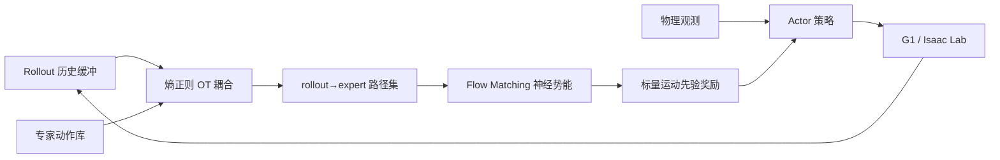

# Flow-Matched Motion Priors：在线 OT 模仿奖励

**FMP**（*Flow-Matched Motion Priors: Online Optimal-Transport Rewards for Imitation Learning*，[arXiv:2609.15631](https://arxiv.org/abs/2609.15631)）由 **清华大学** 航天工程学院蒋方华组与 **中国科学院软件研究所** 合作提出：在 **Unitree G1** 上，用 **最优传输（OT）+ flow matching** 在线学习 **标量运动先验奖励**，替代或改进 **AMP** 判别器与朴素 barycentric OT 奖励。

## 一句话定义

**把「当前 rollout 该怎么靠近专家动作库」写成 OT 耦合路径上的 flow-matched 势能，每次策略更新前刷新标量奖励，避免 AMP 远支撑集失效与 OT 步态相位平均化。**

## 英文缩写速查

| 缩写 | 英文全称 | 简要说明 |
|------|----------|----------|
| FMP | Flow-Matched Motion Priors | 本文在线 OT+FM 运动先验奖励 |
| OT | Optimal Transport | 在 rollout 历史与专家库间做分布匹配 |
| FM | Flow Matching | 沿 OT 路径训练神经势能/分数 |
| AMP | Adversarial Motion Prior | 判别器风格奖励基线 |
| RL | Reinforcement Learning | 任务奖励 + 运动先验标量奖励联合优化 |

## 为什么重要

- **AMP 远支撑集盲区：** 策略与专家分布相距较远时，对抗判别奖励会变得不 informative；FMP 用 **路径上的动态 FM** 而非单点判别。
- **朴素 OT 的相位问题：** 把匹配专家后继做 barycentric 平均会跨步态相位「抹平」关节运动；FMP 保留 **rollout→expert 路径结构**。
- **接口仍像 AMP：** Actor 只吃物理观测，奖励仍是 **标量** — 便于接入现有人形 IL/RL 栈。
- **G1 数字可对照：** 50M transition 对齐实验给出速度、跌倒次数与拟合时间 — 适合与 [AMP 方法页](../methods/amp-reward.md) 一起读。

## 核心信息

| 项 | 内容 |
|----|------|
| **机构** | 清华大学航天工程学院；中国科学院软件研究所 |
| **平台** | Unitree G1，**Isaac Lab** |
| **对照** | AMP、barycentric OT 奖励、endpoint-only / value-only 消融 |
| **开源** | **截至 2026-09-16 arXiv 未列代码/项目页** |

## 流程总览

每次策略更新前：用当前 rollout 与专家库做 **OT 耦合** → 在路径上 **FM 训练势能**（endpoint-gradient + relative-value 校准）→ 给 actor 标量奖励。

## 源码运行时序图

**不适用** — 截至入库日 **无官方可运行仓库**；若后续开源，预期路径为：专家库加载 → rollout 缓冲 → OT 耦合 → FM 奖励网更新 → PPO/类似 actor 步。

## 实验与评测

**对齐预算：** 各方法 **50M transition**；初始化分 **示范重置** 与 **固定默认姿态** 两类。

| 条件 | FMP 要点 | 对照读法 |
|------|----------|----------|
| 示范重置前向行走 | **0.727 m/s** 稳定 | 与 AMP / barycentric OT 比速度与跌倒 |
| 固定姿态初始化 | **0.338 m/s**；跌倒 **129** 次 | endpoint-only 控制 **243** 次跌倒 |
| 奖励模型泛化 | 拟合 rollout 外泛化优于 value-only / endpoint-only | 控制实验验证 FM 路径监督 |
| 相对静态 score teacher | 插值 0.25/0.50 分数增量误差更低；离线拟合 **-29%** 时间 | 动态 FM vs 静态梯度教师 |

## 与其他工作对比

| 路线 | 关系 |
|------|------|
| [AMP](../methods/amp-reward.md) | 直接基线；FMP 保留标量奖励接口但换 OT+FM 监督 |
| Barycentric OT 奖励 | 本文对照；相位平均削弱关节目标 |
| [ResSafe](./paper-ressafe.md) | 同 G1 生态，但 ResSafe 解 **安全过滤**，FMP 解 **运动先验奖励** — 问题正交 |
| [X-WBC](./paper-x-wbc.md) | 跨本体 WBC 基础模型；FMP 是单本体 IL 奖励机制 |

## 局限与风险

- **代码未开源：** 复现需等官方仓库或自行实现 OT+FM 奖励环。
- **任务范围：** 公开摘要以 **前向行走 / 运动先验** 为主，不宜外推到操作或全身跟踪。
- **计算开销：** 每次更新前训练奖励模型；相对 AMP 的离线判别器，在线 OT+FM 成本需实测。

## 结论

**FMP 说明「运动先验奖励」可以用 OT 路径 + 在线 FM 做得比 AMP/朴素 OT 更稳，尤其在差初始化下少跌倒，但部署仍取决于官方代码与奖励刷新频率。**

1. **先分清奖励族** — 不要把 FMP 当成 AMP 换皮；OT 耦合与 FM 路径监督是核心。
2. **读固定姿态行** — 0.338 m/s 与 129 falls 才是对「冷启动」更有信息量的数字。
3. **对照 barycentric OT** — 若你已有 OT 奖励，检查是否在步态相位上做了有害平均。
4. **与 AMP 谱系联读** — 见 [人形 AMP 综述](../overview/humanoid-amp-motion-prior-survey.md)。
5. **开源跟进** — 无仓库前只作方法选型参考，不作复现承诺。

## 关联页面

- [AMP 奖励](../methods/amp-reward.md)
- [模仿学习](../methods/imitation-learning.md)
- [Unitree G1](./unitree-g1.md)
- [ResSafe](./paper-ressafe.md) — 同 G1，安全残差过滤

## 推荐继续阅读

- [arXiv:2609.15631](https://arxiv.org/abs/2609.15631) — 论文全文
- [AMP 原始论文摘录](../../sources/papers/amp.md) — 判别器先验背景

## 参考来源

- [FMP 论文摘录](../../sources/papers/fmp_motion_priors_arxiv_2609_15631.md)
