# FMPose3D：Flow Matching 单目 3D 姿态估计

**FMPose3D**（*monocular 3D pose estimation via flow matching*，arXiv:2602.05755，**CVPR 2026**，[项目页](https://xiu-cs.github.io/FMPose3D/)，[代码](https://github.com/AdaptiveMotorControlLab/FMPose3D)）由 **EPFL Adaptive Motor Control Lab** 提出：在经典 **2D→3D lifting** 范式下，把单目深度歧义建模为 **条件生成问题**——用 **Conditional Flow Matching（CFM）** 学习 ODE 速度场，从 Gaussian 噪声 **少步传输** 到 plausible 3D 关节分布；再以 **RPEA**（Reprojection-based Posterior Expectation Aggregation）把多假设融合为 **Bayes 近似最优** 单预测。方法同时覆盖 **人与动物** 3D 关键点基准，并在 RTX 4090 上相对扩散 lifter **DiffPose** 实现 **一个数量级级** 推理加速。

## 英文缩写速查

| 缩写 | 英文全称 | 简要说明 |
|------|----------|----------|
| FM | Flow Matching | 学习 ODE 速度场，将噪声分布传输到数据分布 |
| CFM | Conditional Flow Matching | 以 2D 姿态 $c=x^{2D}$ 为条件的流匹配训练目标 |
| RPEA | Reprojection-based Posterior Expectation Aggregation | 用 2D 重投影误差加权聚合多 3D 假设 |
| FHA | Flipped-Hypothesis Aggregation | 原图与水平翻转各采样假设，一并送入 RPEA |
| MPJPE | Mean Per-Joint Position Error | 3D 关节位置误差（mm），主评测指标 |
| ODE | Ordinary Differential Equation | FM 推理沿确定性速度场积分，相对扩散 SDE 更少步 |

## 为什么重要

- **概率 lifting 的新效率点：** 单目 3D 姿态本质是 **一对多** 逆问题；扩散式 lifter（DiffPose 等）准确但 **逐步去噪昂贵**。FMPose3D 用 **3 步 Euler** 即可采样，$N=40$ 假设仍 **>145 FPS**（RTX 4090），为 **实时多假设感知** 提供新基线。
- **人与动物统一框架：** 除 Human3.6M / MPI-INF-3DHP 外，在 **Animal3D / CtrlAni3D** 上超越 AniMer 等 shape-based 方法，且 **2026-03 已集成 DeepLabCut**——对 **动物行为 → 机器人模仿** 上游数据采集有直接工程意义。
- **机器人上游接口清晰：** 输出 **3D 关键点**（$J\times 3$），非 SMPL 网格；适合作为 [Motion Retargeting Pipeline](../concepts/motion-retargeting-pipeline.md) 中「视频/图像 → 稀疏 3D 骨架」分支，再接入 IK / GMR 等（与 GVHMR→SMPL 链路互补）。
- **聚合模块可迁移：** RPEA 把「多假设 → 单预测」显式接到 **Bayes MMSE**，比简单 Mean 或 JPMA 更能随 $N$ 增益，且 joint-wise 版保持骨架一致性。

## 流程总览

```mermaid
flowchart TB
  subgraph train["训练（CFM）"]
    pair["配对 (x^2D, x^3D)"] --> sample["采样 x0~N(0,I), t~U[0,1]"]
    sample --> xt["x_t = (1-t)x0 + t·x1"]
    xt --> vnet["v_θ(x_t, t, c=x^2D)"]
    vnet --> loss["L_CFM = ||v_θ - (x1-x0)||²"]
  end
  subgraph infer["推理（多假设 + RPEA）"]
    det2d["2D 关键点<br/>CPN / GT / DLC 等"] --> cond["条件 c = x^2D"]
    cond --> ode["Euler S=3 步 ODE 积分<br/>多种子 → N 假设"]
    ode --> fha["可选 FHA<br/>原图 + 水平翻转"]
    fha --> rpea["RPEA：重投影 Top-K + 加权期望"]
    rpea --> out["单帧 3D 关键点 ĥx^3D"]
  end
```

## 核心机制（归纳）

### 1）条件分布传输（§3.1）

- **状态：** $x_t\in\mathbb{R}^{J\times 3}$ 为 3D 关节；**条件** $c=x^{2D}\in\mathbb{R}^{J\times 2}$。
- **训练路径：** 线性插值 $x_t=(1-t)x_0+t x_1$，目标速度 $v_t=x_1-x_0$；最小化 $\mathcal{L}_{\text{CFM}}=\|v_\theta-v_t\|_2^2$。
- **推理：** $\hat{x}^{3D}=x_0+\int_0^1 v_\theta\,dt$；实践 **$S=3$** Euler 步即可 competitive baseline（MPJPE **49.3 mm** on H36M detected 2D）。

### 2）RPEA 与 FHA（§3.2）

| 策略 | 机制 | 作用 |
|------|------|------|
| **多假设采样** | 不同 $x_0$ 种子 → $N$ 条 ODE 轨迹 | 捕获深度歧义 |
| **FHA** | 原图 + flip 各采 $N/2$ 假设 | 测试时增强，不简单平均 flip 输出 |
| **RPEA joint-wise** | 每关节按重投影损失筛 Top-K，softmax 加权 | MPJPE **47.3 mm**（$N=40$） |
| **RPEA pose-wise** | 整条假设按 pose 级重投影加权 | P-MPJPE 最优，MPJPE 略逊 |

伪似然 $p(H_i|X^{2D})\propto\exp(-\alpha L(H_i,X^{2D}))$，逼近不可积后验的 **Monte Carlo 期望**。

### 3）速度场骨干（§3.3）

- **并行 GCN + Self-Attention** 分别编码局部骨架与全局关节关系，特征级融合后预测 $v_\theta$。
- 消融：仅 Attention **50.9** / 仅 GCN **50.1** / 串行 **50.5** / **并行 49.3 mm**。

## 实验要点

| 基准 | 设定 | 代表性结果 |
|------|------|------------|
| **Human3.6M** | CPN 2D，detected | MPJPE **47.3**（RPEA+$N=40$+FHA）vs DiffPose **49.7** |
| **MPI-INF-3DHP** | 仅 H36M 训练，零微调 | PCK / AUC **SOTA**（跨数据集泛化） |
| **Animal3D** | 与 CtrlAni3D 联合训练 | P-MPJPE **61.5** vs AniMer **80.4** |
| **CtrlAni3D** | 同上 | P-MPJPE **44.0** vs AniMer **44.1** |
| **速度** | RTX 4090，单帧 | $S=3,N=1$ **160 FPS**；$N=40$ **145.6 FPS** vs DiffPose DDIM-5 **27.2 FPS** |

## 与其他工作对比

| 维度 | FMPose3D | 扩散 lifter（DiffPose / D3DP） | 确定性 lifter（SimpleBaseline / GCN） |
|------|----------|--------------------------------|----------------------------------------|
| 多假设 | 噪声种子 + 少步 ODE | 多步 reverse diffusion | 单点回归 |
| 推理步数 | **3** ODE 步 | 10–50+ 去噪步 | 1 forward |
| 聚合 | **RPEA**（Bayes 动机） | Mean / JPMA | N/A |
| 输出表示 | **3D 关键点** | 3D 关键点 | 3D 关键点 |
| 动物 | **联合训练 + DLC 集成** | 主为人域 | 人域为主 |
| 相对 HMR | 不估计 mesh/形状 | 不估计 mesh | 不估计 mesh |

与 [HTD-Refine](../entities/paper-htd-refine-monocular-hmr.md)（SMPL **后处理精炼**）、[GENMO](../methods/genmo.md)（**生成式 SMPL 序列**）不同，FMPose3D 定位在 **轻量 2D→3D 关键点 lifter**，更适合已有关键点检测器或 DeepLabCut 管线的场景。

## 工程实践与开源状态

**截至 2026-07-17 项目页核查：已开源。**

| 组件 | 状态 | 入口 |
|------|------|------|
| 训练/推理代码 | **已发布** Apache-2.0 | [GitHub](https://github.com/AdaptiveMotorControlLab/FMPose3D) |
| PyPI 包 | **已发布** | `pip install fmpose3d` |
| 预训练权重 | **已发布**（**NC 许可**） | [HF MLAdaptiveIntelligence/FMPose3D](https://huggingface.co/MLAdaptiveIntelligence/FMPose3D) |
| DeepLabCut | **已集成**（2026-03） | 动物 `fmpose3d[animals]` |
| Inference API | **已提供** | `fmpose3d/inference_api/` |

**局限：** 模型权重 **非商用**；方法假设 **已知 2D 关键点**（人域常用 CPN，动物用 SuperAnimal）；输出为 **关键点而非 SMPL**，接入人形重定向需额外骨架映射；动物评测未使用 RPEA，增益主要来自 FM lifter 本身。

## 常见误区

- **不是端到端 HMR：** 需要外部 2D 检测器或 GT 2D；与「图像→mesh」路线（HMR2、GVHMR）问题设定不同。
- **ODE 轨迹确定性 ≠ 输出确定性：** 固定种子可复现；**多样性来自 $x_0$ 采样**，不是 SDE 随机性。
- **RPEA 不是简单平均：** Mean 随 $N$ 增益饱和；RPEA 利用重投影似然，更接近最优融合。
- **动物 SOTA 不依赖 RPEA：** Table 3 动物结果未用聚合模块，仍超 shape-based 基线。

## 与其他页面的关系

- [Motion Retargeting Pipeline](../concepts/motion-retargeting-pipeline.md) — 视频/图像上游 **3D 关键点源**（尤其动物 DLC 链路）
- [HTD-Refine](../entities/paper-htd-refine-monocular-hmr.md) — 互补：SMPL 轨迹 **动力学后处理**
- [GENMO](../methods/genmo.md) — 互补：多模态 **SMPL 生成/回归**
- [Diffusion Motion Generation](../methods/diffusion-motion-generation.md) — 扩散 vs FM 生成范式对照

## 推荐继续阅读

- 论文 PDF：<https://arxiv.org/pdf/2602.05755>
- 官方 Demo 与 Overview：<https://xiu-cs.github.io/FMPose3D/>
- DeepLabCut 文档：<https://www.mackenziemathislab.org/deeplabcut>

## 参考来源

- [FMPose3D 论文归档（arXiv:2602.05755）](../../sources/papers/fmpose3d_arxiv_2602_05755.md)
- [FMPose3D 项目页归档](../../sources/sites/fmpose3d-xiu-cs-github-io.md)
- [FMPose3D 官方仓库归档](../../sources/repos/fmpose3d.md)
