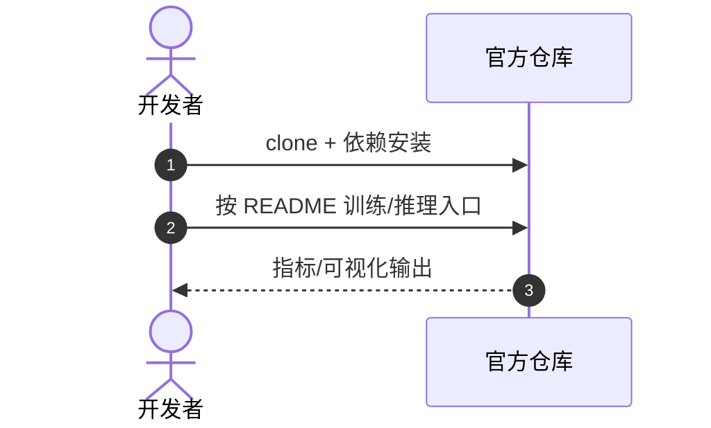

# FocusPool

**FocusPool**（*Localized Visual Feature Aggregation via Focus Pooling for Visuomotor Policies*，[arXiv:2609.08408](https://arxiv.org/abs/2609.08408)，[项目/代码](https://github.com/RuiyuWANG/FocusPool)）— 详见 [具身智能小站 10 篇盘点（2026-09-09）](../../sources/blogs/wechat_embodied_station_visual_focus_10_papers_2026-09-09.md)。

## 一句话定义

中间 CNN 特征有空间结构，但平均池化会把控制相关局部和背景一起抹平——FocusPool 用本体状态调制查询，把「看哪里」写进策略学习。

## 英文缩写速查

| 缩写 | 英文全称 | 简要说明 |
|------|----------|----------|
| FocusPool | Focus Pooling | 本文局部视觉聚合模块 |
| BC | Behavior Cloning | 视觉运动策略训练 |
| SR | Success Rate | 任务成功率 |
| MimicGen | MimicGen | 仿真长程操作基准 |

## 为什么重要

- MimicGen 六项任务 100 演示：仿真 mean SR 52.7%，相对最佳基线 +36.2%
- UFactory xArm7 真机 L2：mean SR 80.0%，相对 +41.2%

## 核心信息

| 项 | 内容 |
|----|------|
| **arXiv** | [2609.08408](https://arxiv.org/abs/2609.08408) |
| **开源** | **已开源** |
| **项目/代码** | [https://github.com/RuiyuWANG/FocusPool](https://github.com/RuiyuWANG/FocusPool) |

## 核心原理

- MimicGen 六项任务 100 演示：仿真 mean SR 52.7%，相对最佳基线 +36.2%
- UFactory xArm7 真机 L2：mean SR 80.0%，相对 +41.2%
- 仅训练 ResNet-18 编码器 5.8% 参数；一半数据可达可比基线

## 源码运行时序图

官方仓 [https://github.com/RuiyuWANG/FocusPool](https://github.com/RuiyuWANG/FocusPool)（归档见 [focuspool.md](../../sources/repos/focuspool.md) 若已建）：

- **最短复现：** 以 README 训练/评测脚本为准。

## 实验与评测

- 指标与设置以原文 PDF / 项目页为准；上文 Highlights 来自公众号归纳 + 项目页摘要。
- 横向对照见 [视觉聚焦与数据效率 10 篇技术地图](../overview/visual-focus-data-efficiency-10-papers-technology-map.md)。

## 与其他工作对比

> 下表只做**定位对照**，不做跨设定横比：本页 Highlights 来自公众号归纳 + 项目页摘要（见参考来源），未逐条核对原文实验表，与下列各页不共享同一评测协议。

| 对照 | 差异读法 |
|------|----------|
| **全局平均池化**（本文要替代的默认做法） | 唯一严格可比的一组：同一 ResNet-18 编码器、同一 MimicGen 100 演示预算，只换特征聚合方式。本文报仿真 mean SR 52.7%（相对最佳基线 +36.2%）、xArm7 真机 +41.2%，并称只训编码器 5.8% 参数。差别在**空间结构丢不丢**——平均池化把控制相关局部和背景一起抹平 |
| [通道–空间注意力](../methods/channel-spatial-attention.md) | 最近的机制对照：CBAM 等也在中间特征上重加权，但权重由**特征自身**算出；FocusPool 的查询由**本体状态**调制，即「当前关节/夹爪状态决定该看哪里」，是任务闭环内的注意力而非纯视觉先验 |
| [策略的视觉表征](../concepts/visual-representation-for-policy.md) | 该页归纳策略该吃什么视觉表征；FocusPool 属「不换骨干、改读出方式」一支，与换大预训练骨干（[视觉骨干](../concepts/vision-backbones.md)）是两条独立的省数据路径，取舍是**改动小可叠加 vs 上限受骨干限制** |
| [Diffusion Policy](../methods/diffusion-policy.md) | 常见的视觉运动策略基线；FocusPool 改的是**观测侧**（怎么读视觉），扩散策略改的是**动作侧**（怎么建模多峰动作分布），两者正交 |
| [行为克隆的若干谜题](../concepts/behavioral-cloning-mysteries.md) | 提醒读法：「一半数据达到可比基线」是**同分布演示**下的样本效率，不等于分布漂移下的鲁棒性；复合误差问题不由聚合方式解决 |
| [多头注意力](../concepts/multi-head-attention.md) | 迭代交叉注意力的机制底座 |

## 结论

**FocusPool 的可迁移主张已写入 Highlights；部署前以原文实验设定与开源边界为准。**

1. **真影响：** 见核心原理 bullets。
2. **次要代价：** 预印本/待开源项需独立复现验证。
3. **部署读法：** 已开源 — 先读 README 或项目页再接真机/智能体栈。

## 关联页面

- [视觉聚焦与数据效率 10 篇技术地图](../overview/visual-focus-data-efficiency-10-papers-technology-map.md)
- [模仿学习](../methods/imitation-learning.md)
- [通道–空间注意力](../methods/channel-spatial-attention.md) — 最近的机制对照
- [策略的视觉表征](../concepts/visual-representation-for-policy.md) / [视觉骨干](../concepts/vision-backbones.md) — 两条独立的省数据路径
- [Diffusion Policy](../methods/diffusion-policy.md) — 正交的动作侧改法
- [行为克隆的若干谜题](../concepts/behavioral-cloning-mysteries.md) — 样本效率 ≠ 分布漂移鲁棒性

## 参考来源

- [focuspool_arxiv_2609_08408.md](../../sources/papers/focuspool_arxiv_2609_08408.md)
- [具身智能小站 10 篇盘点（2026-09-09）](../../sources/blogs/wechat_embodied_station_visual_focus_10_papers_2026-09-09.md)
- [arXiv:2609.08408](https://arxiv.org/abs/2609.08408)

## 推荐继续阅读

- [原文 PDF](https://arxiv.org/pdf/2609.08408)
- [项目/代码](https://github.com/RuiyuWANG/FocusPool)
