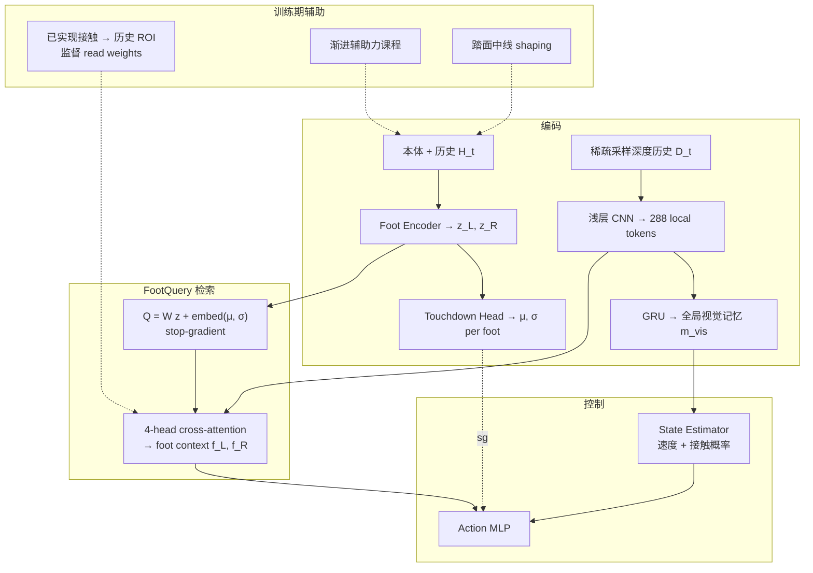

# FootQuery：触地前瞻引导的深度历史检索感知人形行走

**FootQuery**（*Future-Touchdown-Guided Retrieval from Depth History for Perceptive Humanoid Locomotion*；Tao Dong *、Jia Yu、Yuxuan Fan、Linna Zhao、Jiaqi Gong、Andong Yang、Chao Gao、Guyue Zhou †；[arXiv:2609.21447](https://arxiv.org/abs/2609.21447)，2026）由 **清华大学智能产业研究院（AIR）**、**清华大学电机工程与应用电子技术系**、**北京科技大学** 与 **南洋理工大学** 提出：当未来落脚区域在触地前已离开当前视野时，用 **每只脚预测的下一触地点分布** 作为条件，**查询稀疏采样的深度历史 token**，并与 **全局 GRU 视觉记忆** 融合生成控制；部署仅需 **本体 + 机载深度历史**。真机 **Unitree G1** 单策略完成户外楼梯与室内楼梯/平台/沟混合路线。

## 一句话定义

**把「深度历史该读哪一帧、哪一块」组织成 per-foot 的 cross-attention 检索问题——query 来自本体预测的下一触地点，监督来自已实现接触在历史深度里曾可见的 ROI。**

## 英文缩写速查

| 缩写 | 英文全称 | 简要说明 |
|------|----------|----------|
| FootQuery | Future-Touchdown-Guided Retrieval | 本文 per-foot 深度历史检索框架 |
| PPO | Proximal Policy Optimization | 非对称 actor–critic 主优化器 |
| GRU | Gated Recurrent Unit | 汇总帧级深度特征为全局视觉记忆 |
| ROI | Region of Interest | 历史深度帧中触地点可见区域 |
| POMDP | Partially Observable Markov Decision Process | 部分可观测 locomotion 形式化 |
| RL | Reinforcement Learning | 单阶段端到端训练范式 |
| HPL | Humanoid Parkour Learning | 仿真对照：感知人形跑酷学习 |
| Sim2Real | Simulation to Real | 仿真训练、G1 真机部署 |

## 核心信息

| 字段 | 内容 |
|------|------|
| **机构** | 清华大学（AIR + 电机系）；北京科技大学（USTB）；南洋理工大学（NTU） |
| **作者** | Tao Dong *、Jia Yu、Yuxuan Fan、Linna Zhao、Jiaqi Gong、Andong Yang、Chao Gao、Guyue Zhou † |
| venue | [arXiv:2609.21447](https://arxiv.org/abs/2609.21447)（2026-09） |
| **平台** | **Unitree G1**；策略控制 **12 腿关节** |
| **机载** | 本体 + **深度历史**（无项目页披露的具体分辨率/帧率以 PDF 为准） |
| **开源** | **无项目页、无官方代码**（截至 2026-09-22） |

## 为什么重要

- **钉住「历史该读什么」：** [SOLO](./paper-solo.md) 用 QR 重建高程；[CReF](./paper-cref.md) 用本体查 **当前** 深度；FootQuery 把检索条件绑在 **每只脚独立的下一触地点**，解决双足 **异时异址** 的信息需求。
- **与 SSR 关键分工：** [SSR](./paper-ssr-humanoid-open-world-traversal.md) 的落脚预测主要服务 **训练奖励**；FootQuery 的 predictor **参与部署期感知**（query 深度历史），并可用 **历史 ROI** 直接监督 attention。
- **量化动机清晰：** 楼梯诊断中未来触地点 **仅 7.82%** 在当前 ROI 可见，**60.07%** 依赖历史帧——比「堆更长 RNN」更可解释。
- **训练机制可复用：** **渐进辅助力课程** 与 **踏面中线 event-consistent shaping** 针对探索与 **连续楼梯交替踏面**；与核心 FootQuery 架构解耦（仅训练期）。

## 核心原理

### 相对相邻路线的差异

| 轴 | FootQuery | CReF / DELTA | SSR | SOLO / DPL |
|----|-----------|--------------|-----|------------|
| 视觉记忆 | **深度 token 历史 + GRU 全局记忆** | 当前深度 / 高程采样 | 第一视角深度 RNN | 高程重建 / 逐格 QR |
| 落脚信号 | **per-foot 下一触地点分布 → query** | 当前状态 query / 支撑奖励 | 想象落脚 → **奖励** | QR/重建误差 |
| 监督对象 | **历史图像 ROI attention** | 重建/落脚距离 | 接触支撑度量 | 地图单元高度 |

### 流程总览

### 训练辅助（非部署）

- **渐进辅助力：** 按 pre-clamp 力需求与生存统计调节骨盆支撑，**单调撤至 0**（类比体操 spotting / [A2CF](https://arxiv.org/abs/2506.23125) 族，实现细节以 PDF 为准）。
- **Tread-midline shaping：** 摆动早期锁定目标踏面，奖励向 **中线** 推进并鼓励 **交替踏面** 接触。

## 源码运行时序图

**不适用** — 截至 2026-09-22 arXiv 未列项目页或官方 GitHub；无可运行实现入口。

## 工程实践

| 项 | 内容 |
|----|------|
| 算法 | 非对称 actor–critic + **PPO**；可选 AMP 与任务奖励混合 |
| 观测 | Actor：本体、本体历史、深度历史；Critic：特权速度/地形/足高与接触等 |
| 动作 | 关节位置偏移 → PD 跟踪；limit penalty 作用于未 clip 目标 |
| 检索 | 288 tokens；有效深度覆盖率 <5% 的 token 被 mask |
| 部署输入 | **仅** 本体 + 机载深度历史（无 critic 特权） |
| 对照实现 | 仿真对比 **HPL**、[MoRE](https://arxiv.org/abs/2506.08840)、[Hiking](https://arxiv.org/abs/2601.07718) 官方 checkpoint；MuJoCo 同物理与力矩上限 |

## 局限与风险

- **无开源复现入口：** 无项目页/代码/权重；工程细节（深度帧率、历史长度、sim 栈）需读 PDF 全文。
- **与 elevation 路线互补非替代：** 不做显式 2.5D 地图；极端几何若从未进入历史窗口仍可能失败（论文报告 **32.11%** 楼梯样本在保留窗口内仍不可见）。
- **Touchdown 预测误差随 lead 增大：** 24-step lead XY MAE 约 **8.52 cm**（3-step 约 **1.31 cm**）——检索 quality 依赖短期预测。
- **NoFootQuery ablation 未完全隔离 actor 依赖：** 论文自述需 matched no-read-supervision / shuffle 控制进一步验证。

## 评测

### 仿真（最难档成功率，完整系统 vs NoFootQuery）

| 地形 | 20 cm 楼梯 | 50 cm 沟 | 50 cm 平台 |
|------|------------|----------|------------|
| Ours | **87%** | **94%** | **91%** |
| Δ vs NoFootQuery | +13 pp | +60 pp | +55 pp |

相对 **HPL**：在 **50 cm 平台** 与 **20 cm 楼梯** 上更高（HPL 约 55% / 71%）；**50 cm 沟** 与 HPL 持平（94%）。与 **MoRE / Hiking** 官方模型在同 MuJoCo 课目上报告 **100%** vs 平台/沟失败。

### 历史可见性（楼梯诊断）

| 指标 | 数值 |
|------|------|
| 当前帧 ROI 可见 | 7.82% |
| 仅历史帧可见 | 60.07% |
| 任一保留帧可见 | 67.89% |
| GT-best-head Top-1 / Top-3 | 81.73% / 95.80% |

### 真机（Unitree G1）

- **户外：** 楼梯上行（Fig. 11a）。
- **室内：** 单策略串联楼梯上下、平台、沟（Fig. 11b–c）。

## 结论

**FootQuery 把感知人形 walking 的「深度历史」问题收成 per-foot、触地前瞻条件的 cross-attention 检索，并用历史 ROI 监督把检索与真实支撑对齐——相对 NoFootQuery 在最难沟/台上增益最大；G1 真机验证了单策略混合地形连续执行。**

1. **部署读法：** 只需本体 + 深度历史；query 来自 **下一触地点分布**，不是当前 foot pose  alone。
2. **与 SSR 勿混：** SSR 落脚预测偏 **奖励**；FootQuery 偏 **执行期检索**。
3. **历史窗口是硬约束：** 约三分之一楼梯样本在保留窗口内仍不可见——需结合速度/相机布局理解失败模式。
4. **训练辅助可拆：** 辅助力 + 踏面中线 shaping 仅训练期；复现时先 ablate FootQuery 再叠辅助项。
5. **选型对照：** 要 **显式高程图** 看 SOLO/DPL；要 **当前帧 query** 看 CReF；要 **开放世界长程** 看 SSR。
6. **复现阻塞：** 截至入库日 **无代码**；关注 AIR/清华后续是否发布项目页。

## 与其他页面的关系

- [paper-ssr-humanoid-open-world-traversal.md](./paper-ssr-humanoid-open-world-traversal.md) — 想象落脚 vs 历史检索
- [paper-cref.md](./paper-cref.md) — 当前深度 cross-attention
- [paper-solo.md](./paper-solo.md) — 逐格高程 QR + 长程蒸馏
- [stair-obstacle-perceptive-locomotion.md](../tasks/stair-obstacle-perceptive-locomotion.md) — 楼梯/障碍感知选型表
- [unitree-g1.md](./unitree-g1.md) — 验证平台

## 参考来源

- [footquery_arxiv_2609_21447.md](../../sources/papers/footquery_arxiv_2609_21447.md)

## 推荐继续阅读

- [arXiv:2609.21447](https://arxiv.org/abs/2609.21447)
- [SSR（arXiv:2605.30770）](./paper-ssr-humanoid-open-world-traversal.md) — 落脚预测 + 开放世界长程对照
- [CReF（RA-L 2026）](./paper-cref.md) — 本体查询当前深度的人形单阶段线
