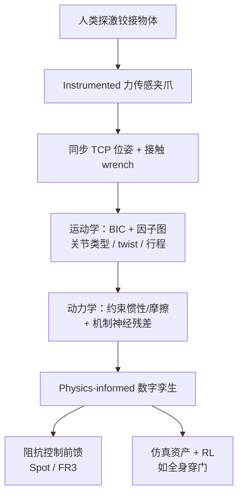

# ForceTwin（Physics-informed Digital Twins from Instrumented Human Interaction）

**ForceTwin**（[arXiv:2609.21751](https://arxiv.org/abs/2609.21751)，[项目页](https://timengelbracht.github.io/forcetwin-website/)）由 **苏黎世联邦理工（ETH）、NVIDIA、Microsoft、波恩大学** 等提出：用 **instrumented 手持夹爪** 让人类探激铰接物体，从同步 **TCP 位姿 + 接触 wrench** 识别 **实例级动力学数字孪生**（惯性、摩擦、速度相关机制力），并直接用于 **阻抗控制前馈** 或 **仿真策略训练**。

## 一句话定义

铰接操作不能只靠外观或运动学孪生——**ForceTwin 用人类力交互把「看不见的门闭门器/弹簧」测进可仿真、可控制的物理模型**。

## 英文缩写速查

| 缩写 | 英文全称 | 简要说明 |
|------|----------|----------|
| TCP | Tool Center Point | 工具中心点位姿 |
| VLM | Vision-Language Model | 视觉–语言先验（对比基线之一） |
| BIC | Bayesian Information Criterion | 关节类型（转动/移动）模型选择 |
| Sim2Real | Simulation to Real | 仿真训练策略迁移真机 |

## 为什么重要

- **解耦采集与机器人部署：** 人可先于机器人到场、快速扫过关节行程与多种速度，避免「必须上臂探激才能辨识」的循环依赖。
- **补 Real2Sim 默认物理的洞：** [SimFoundry](./paper-simfoundry-real2sim-scene-generation.md) 等管线常把质量/摩擦交给 VLM 或默认值；ForceTwin 用 **实测 wrench** 标定 **同一实例** 的机制响应，对闭门器、弹簧挡等 **状态相关** 力尤其关键。
- **一条孪生两用：** 同一 $\mathcal{M}_{\mathrm{phys}}$ 既作 **阻抗前馈动力学**，也可写入仿真资产训练 **全身穿门** 等策略。

## 核心信息

| 项 | 内容 |
|----|------|
| **机构** | 苏黎世联邦理工（ETH）、NVIDIA、Microsoft、波恩大学 |
| **平台** | Boston Dynamics Spot、Franka FR3；手持力传感夹爪采集 |
| **开源** | 见 [工程实践](#工程实践) |

## 核心原理

观测为同步流 $\mathcal{D}=\{{}^{W}T_{\mathrm{TCP},i},{}^{W}\mathcal{F}_{i}\}$：补偿夹爪自重/惯性后得到物体侧 wrench，在 **刚性无滑移 grasp** 假设下估计单自由度铰接的 $\kappa$（revolute/prismatic）、twist、关节范围 $\mathcal{Q}$ 与广义力模型 $\hat{\tau}(q,\dot{q},\ddot{q})$。

**运动学：** screw / PoE 拟合 + BIC 选关节类；因子图联合精化几何与 per-sample $q_i$。**动力学：** 半参数 **partially linear** 模型——非负约束下的 **惯性 $I$、Coulomb 摩擦、粘性阻尼** 加上 **结构化神经残差** $\mathcal{M}_{\mathrm{mech}}$ 捕获闭门器等 **非线性、状态相关** 机制力；参数可直接映射到常见仿真器与控制律。

几何可与识别 **解耦**：$\mathcal{M}_{\mathrm{phys}}$ 事后注册到 mesh 或机器人物体表示，形成 **physics-informed digital twin**。

### 流程总览

## 源码运行时序图

**不适用** — 截至 **2026-09-28** [项目页](https://timengelbracht.github.io/forcetwin-website/) **未见** 可运行官方代码或数据发布链接；BibTeX 仍标注 preprint 上线后提供。

## 工程实践

| 项 | 说明 |
|----|------|
| 开源状态 | **未开源**（项目页无 GitHub；以 [forcetwin-website.md](../../sources/sites/forcetwin-website.md) 复核为准） |
| 硬件前提 | 需 **标定过的力–力矩传感夹爪** 与可靠 wrench 补偿；grasp 刚性假设在滑移场景下会伤辨识 |
| 控制接入 | 孪生作为 **前馈动力学** 嵌入阻抗律；与纯 kinematics-only 或 VLM 先验动力学对比时增益最大在 **强机制** 物体 |
| 与 Real2Sim 栈 | 可视为 **per-instance 动力学层**，接在几何/铰接估计（如 CRISP、SimFoundry 导出 URDF）之后 |

## 实验与评测

| 设置 | 结果（论文报告） |
|------|------------------|
| 惯性参数 vs VLM 先验 | 误差约 **减半** |
| 阻抗目标完成（9 object–embodiment） | ForceTwin **87%** vs VLM 先验 **60%** vs 纯运动学孪生 **57%** |
| 强机制物体 | 两基线易 **stall**；ForceTwin 仍可完成 |
| 下游 | 用识别孪生训练 **whole-body door-traversal** 并真机部署 |

## 结论

**ForceTwin 把「测力的人类探激」变成可导出、可控制的铰接物体动力学孪生，在强机制场景上明显优于 VLM/运动学-only 孪生。**

1. 问题核心是 **实例级、状态相关的机制力**，外观与语言先验无法替代 **instrumented interaction**。
2. **半参数 + 神经残差** 兼顾仿真兼容参数与闭门器等非线性项，比纯黑盒回归更可审计。
3. **87% vs 60%/57%** 说明动力学辨识直接决定阻抗前馈能否过「卡死点」。
4. 同一模型可 **闭环到 RL 穿门**，不只服务单次阻抗跟踪。
5. 采集侧依赖 **手持硬件与 wrench 补偿质量**；项目页 **尚无代码**，复现需等官方发布或自研管线。
6. 与 [Contact-Guided Exploration](./paper-contact-guided-exploration-locomanipulation.md) 等同属 ETH/NVIDIA 生态，但 ForceTwin 解决 **物体动力学孪生**，后者解决 **loco-manip 探索稀疏接触**——可组合而非替代。

## 与其他工作对比

| 路线 | 测什么 | 动力学深度 | 需要机器人现场 | 与 ForceTwin |
|------|--------|------------|----------------|--------------|
| **ForceTwin** | 人类 + 力传感夹爪 wrench | 惯性/摩擦/机制残差 | **否**（人先测） | 本页 |
| VLM / 语言物理先验 | 图像+文本 | 静态/先验参数，易物理不可信 | 否 | 论文主基线 **60%** |
| 纯 kinematics Real2Sim | 视频/交互 | 仅铰接几何 | 视方法 | 基线 **57%** |
| 机器人探激辨识 | 腕力/ proprio | 常限 Coulomb 或 quasi-static | **是** | ForceTwin 强调 **人类可及 + 全机制** |
| [SimFoundry](./paper-simfoundry-real2sim-scene-generation.md) | RGB 视频 | 默认/ VLM 物性 | 否（视频） | 互补：**几何 cousins + ForceTwin 级动力学** |

## 局限与风险

- 单自由度铰接与 **刚性 grasp** 假设限制复杂多关节/滑移场景。
- 几何注册与多体场景级孪生未在本页展开；长序列策略仍受 sim2real gap 约束。
- **无可公开代码** 时，辨识与导出格式需读原文自行复现。

## 关联页面

- [Manipulation](../tasks/manipulation.md) — 操作仿真资产与接触力学上下文
- [Sim2Real](../concepts/sim2real.md) — 孪生用于策略训练与部署
- [Impedance Control](../concepts/impedance-control.md) — 前馈动力学接入点
- [SimFoundry](./paper-simfoundry-real2sim-scene-generation.md) — 视频 Real2Sim 默认物性 vs 实测动力学
- [Contact-Guided Exploration](./paper-contact-guided-exploration-locomanipulation.md) — 同机构 loco-manip 探索线
- [机器人视觉感知栈选型闭环](../queries/robot-perception-stack-selection-loop.md) — 交互式感知（探激辨识铰接物性）在感知栈选型中的位置

## 参考来源

- [forcetwin_arxiv_2609_21751.md](../../sources/papers/forcetwin_arxiv_2609_21751.md)
- [forcetwin-website.md](../../sources/sites/forcetwin-website.md)

## 推荐继续阅读

- [https://timengelbracht.github.io/forcetwin-website/](https://timengelbracht.github.io/forcetwin-website/)
- [https://arxiv.org/abs/2609.21751](https://arxiv.org/abs/2609.21751)
