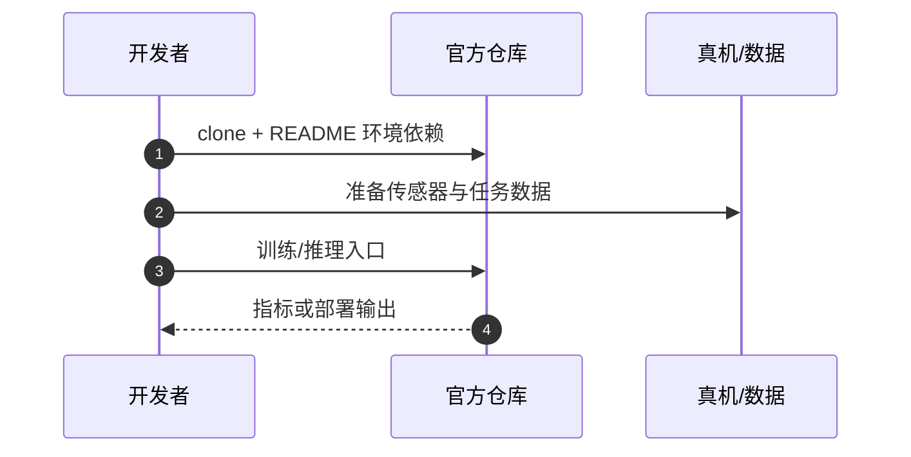

# ForceU-VLA（arXiv:2608.15009）

**ForceU-VLA**（*ForceU-VLA: A Force-Aware Vision-Language-Action Model for Embodied Ultrasound Scanning*，[arXiv:2608.15009](https://arxiv.org/abs/2608.15009)）收录于 [多模空间 · 一周 VLA 研究趋势简析（2026.08.10–08.16）第四篇](../../sources/blogs/wechat_duomo_vla_weekly_trends_2026-08-10_part4.md) **架构模块/医疗** 段。

## 一句话定义

**超声扫描 VLA 联合超声图像、力反馈与动作，协同融合并随扫描阶段自适应多模态权重，改善接触稳定与压力调节。**

## 英文缩写速查

| 缩写 | 英文全称 | 简要说明 |
|------|----------|----------|
| VLA | Vision-Language-Action | 视觉–语言–动作策略 |
| VLM | Vision-Language Model | 视觉–语言多模态模型 |
| RL | Reinforcement Learning | 强化学习 |
| PRM | Process Reward Model | 过程/进度奖励模型 |
| OOD | Out-of-Distribution | 分布外场景或轨迹 |

## 为什么重要

- 医疗超声需力–视联合建模与阶段识别；ForceU-VLA 针对探头–组织接触闭环。
- 策展机构：中国海洋大学；山东大学；合肥工业大学
- 开源结论：**已开源**（步骤 2.5，2026-09-27）。

## 核心机制

| 项 | 内容 |
|----|------|
| **arXiv** | [2608.15009](https://arxiv.org/abs/2608.15009) |
| **开源** | **已开源** |
| **文内评测** | UR7e + RGB + 超声图像实机 |

## 源码运行时序图

节点对齐 [`sources/repos/forceu-vla.md`](../../sources/repos/forceu-vla.md) 与 README 入口。

## 实验与评测

- **文内口径：** UR7e + RGB + 超声图像实机
- **读法：** 本页为 [公众号策展](../../sources/blogs/wechat_duomo_vla_weekly_trends_2026-08-10_part4.md) 摘要；逐项指标以 **原文 PDF** 为准。

## 与其他工作对比

| 对照 | 差异读法 |
|------|----------|
| [第四篇技术地图](../overview/vla-weekly-trends-2026-08-10-part4-technology-map.md) | 同批 14 篇横向索引；本文属 **架构模块/医疗** |
| [VLA 方法页](../methods/vla.md) | 单篇机制细节以原文为准 |

## 结论

**ForceU-VLA 适合作为本期「架构模块/医疗」路线的快速索引页。**

1. 核心贡献：超声扫描 VLA 联合超声图像、力反馈与动作，协同融合并随扫描阶段自适应多模态权重，改善接触稳定与压力调节。
2. 开源结论：**已开源** — 以项目页/仓库实际链接为准。
3. 横向对照见 [第四篇技术地图](../overview/vla-weekly-trends-2026-08-10-part4-technology-map.md)。

## 关联页面

- [VLA（Vision-Language-Action）](../methods/vla.md)
- [一周 VLA 趋势技术地图（第四篇）](../overview/vla-weekly-trends-2026-08-10-part4-technology-map.md)

## 参考来源

- [wechat_duomo_vla_weekly_trends_2026-08-10_part4.md](../../sources/blogs/wechat_duomo_vla_weekly_trends_2026-08-10_part4.md)
- [arXiv:2608.15009](https://arxiv.org/abs/2608.15009)

## 推荐继续阅读

- [VLA 方法页](../methods/vla.md)
- [arXiv PDF](https://arxiv.org/pdf/2608.15009)
