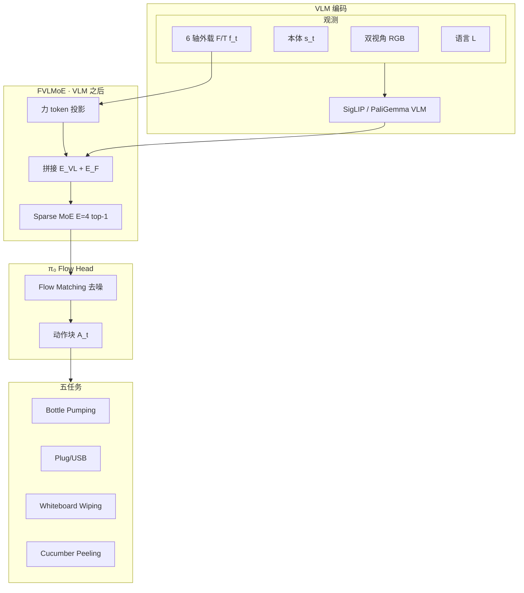

# ForceVLA：力感知 MoE 增强 VLA（NeurIPS 2025 · arXiv:2505.22159）

**ForceVLA**（*Enhancing VLA Models with a Force-aware MoE for Contact-rich Manipulation*，[arXiv:2505.22159](https://arxiv.org/abs/2505.22159)，**NeurIPS 2025**，Qiaojun Yu 等 · **上海交大 / 上海 AI Lab / 复旦 / Noematrix** 等；[项目页](https://sites.google.com/view/forcevla2025)）在 **π₀** 框架上将 **6 轴外载力/力矩** 提升为一等模态：**FVLMoE** 在 VLM 编码后动态路由融合力 token 与视–语嵌入，注入 flow matching action head。

## 一句话定义

**力必须在 VLM 之后注入——FVLMoE 用 sparse MoE 按接触相位路由力与视–语特征，五任务平均 60.5%（较 π₀-base w/ force +23.2 pt），plug 插入消融 80%。**

## 英文缩写速查

| 缩写 | 英文全称 | 简要说明 |
|------|----------|----------|
| ForceVLA | — | 本文力感知 VLA |
| FVLMoE | Force-aware VLM Mixture-of-Experts | VLM 后力 token + sparse MoE 融合 |
| MoE | Mixture of Experts | E=4, top-k=1 稀疏路由 |
| VLA | Vision-Language-Action | 基于 π₀ / PaliGemma + SigLIP |
| F/T | Force/Torque | 6 轴外载 wrench（世界系） |
| FM | Flow Matching | π₀ 动作头去噪范式 |

## 核心信息

| 项 | 内容 |
|----|------|
| 机构 | SJTU；Shanghai AI Lab；Fudan；Shanghai Innovation Institute；Noematrix Intelligence 等 |
| 通讯作者 | Qiaojun Yu（yqjllxs@alumni.sjtu.edu.cn） |
| 基座 | **π₀**（$O_t=\{V_t^b, V_t^h, s_t, f_t\}$；$f_t\in\mathbb{R}^6$） |
| 数据 | **ForceVLA-Data**：5 任务 / **244** 轨迹 / **140k** 同步步 |
| 开源（2026-09-23） | **待发布** — 论文承诺 code/data at website；项目页无官方 GitHub |

## 为什么重要

- **VLA 的力盲问题：** 接触丰富阶段力需求随相位变化；纯视觉在遮挡下 brittle。
- **融合位置发现：** **力必须在 VLM 之后** — early fusion MoE 可致 plug **0%**；late concat **60%**；FVLMoE **80%**。
- **MoE 相位 specialization：** Expert load 随任务/完成度变化；insert/peel 相位 specialist；Expert 0 跨任务通用。
- **与同批对照：** [Tactile-VLA](./paper-sa-2507-09160-tactile-vla-unlocking-vision-language-action-mod.md) 用 VBTS+混合力控；[TaF-VLA](./paper-sa-2601-20321-taf-vla-tactile-force-alignment-in-vision-langua.md) 用高维触觉–力 latent 对齐；ForceVLA 走 **低维 F/T + MoE** 最轻量路线。

## 核心贡献/方法

| 模块 | 要点 |
|------|------|
| **FVLMoE** | 力线性投影为 token；与 VLM 输出拼接 → encoder → **sparse MoE (E=4, top-k=1)** → 残差 → 投影 |
| **注入点** | $G_{\text{FVLMoE}}$ 与 proprio/noisy action suffix **相加** 调制 flow denoising |
| **ForceVLA-Data** | Bottle Pumping、Plug/USB Insertion、Whiteboard Wiping、Cucumber Peeling；480×640 |
| **设计 ablation** | early MoE **0%** vs late concat **60%** vs FVLMoE **80%**（plug） |
| **泛化** | 几何/高度/遮挡/不稳定插座；遮挡 **90%** |

## 流程总览

## 评测与指标

| 设置 | ForceVLA | π₀-base w/ F | 备注 |
|------|----------|--------------|------|
| 五任务平均 SR | **60.5%** | **37.3%** | **+23.2 pt** |
| Plug 插入（消融） | **80%** | early MoE **0%** / late concat **60%** | 融合位置关键 |
| 遮挡泛化 | **90%** | — | 几何/高度/不稳定插座 |
| 黄瓜削皮 | **14.12 cm/刀**，**7 刀** | — | 持续接触任务 |
| 擦板 | 两阶段指标 | — | 见论文 §Experiments |

## 与其他工作对比

| 维度 | ForceVLA | Tactile-VLA | TaF-VLA | TouchWorld |
|------|----------|-------------|---------|------------|
| 力/触觉 | **6 轴 F/T token** | VBTS + 力目标 | VBTS–力 latent | 触觉 WM + TRT |
| 融合 | **FVLMoE post-VLM** | VLM cross-attn | TaF-Adapter | 层级四模块 |
| 基座 | **π₀** | 预训练 VLM | VLA + adapter | flow VLA + TRT |
| 数据规模 | 244 traj / 140k step | UMI demo | 10M+ TaF frames | 六任务 benchmark |

## 结论

**ForceVLA 的可操作结论是：低维 F/T 可以进 VLA，但只能作为 VLM 之后、经 MoE 路由的相位条件——plug 上 early fusion 0% vs FVLMoE 80% 把设计空间钉死了。**

1. **+23.2 pt 五任务平均** — 相对 π₀-base w/ force 37.3% → 60.5% 是主表信号。
2. **融合位置不可妥协** — VLM 前注入力会毁掉 plug 任务（0%）。
3. **MoE 可解释** — Expert 0 通用 + 相位 specialist；适合接触相位调试。
4. **ForceVLA-Data 将公开** — 244 轨迹五任务；截至核查日未挂官方链。
5. **与 VBTS 路线正交** — 腕部 F/T 低成本 vs [TaF-VLA](./paper-sa-2601-20321-taf-vla-tactile-force-alignment-in-vision-langua.md) 高维对齐。
6. **代码待发布** — 勿用非官方 fork 作 canonical 入口。

## 源码运行时序图

**不适用**（截至 **2026-09-23**：[项目页](https://sites.google.com/view/forcevla2025) **未列** 官方 GitHub/HF；论文声明 code/data will be released at website）。

## 局限与风险

- 依赖外载 6 轴 F/T；与指端 VBTS（[Sparsh](./paper-sparsh.md)）互补但硬件成本/安装不同。
- 五任务、244 轨迹；跨 embodiment 泛化边界未充分展开。
- MoE 路由稳定性与 sim-to-real 未单独报告。
- **待发布开源**；第三方镜像非官方。

## 关联页面

- [VLA](../methods/vla.md) — π₀ 基座与 flow matching
- [接触丰富操作](../concepts/contact-rich-manipulation.md) — 五任务语境
- [Tactile-VLA](./paper-sa-2507-09160-tactile-vla-unlocking-vision-language-action-mod.md) — VBTS+混合力控对照
- [TaF-VLA](./paper-sa-2601-20321-taf-vla-tactile-force-alignment-in-vision-langua.md) — 触觉–力对齐对照
- [TouchWorld](./paper-touchworld-tactile-foundation-dexterous-manipulation.md) — 层级触觉基础模型
- [触觉智能九篇地图](../overview/tactile-intelligence-nine-papers-map.md) — VTLA 层

## 参考来源

- [ForceVLA 论文归档（arXiv:2505.22159）](../../sources/papers/forcevla_arxiv_2505_22159.md)

## 推荐继续阅读

- [项目页](https://sites.google.com/view/forcevla2025) — 方法图、五任务视频、MoE 可视化
- [arXiv:2505.22159](https://arxiv.org/abs/2505.22159) — FVLMoE 公式与 ForceVLA-Data
- [NeurIPS 2025](https://arxiv.org/abs/2505.22159) — 正式发表版
