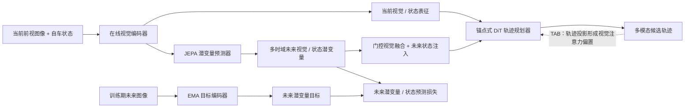

# ForeDrive：让潜在未来直接服务自动驾驶规划

**ForeDrive**（*Foresight-Guided End-to-End Autonomous Driving with a Planning-Relevant Latent World Model*，[arXiv:2609.26299](https://arxiv.org/abs/2609.26299)）提出一种「预测潜未来并直接条件化规划」的端到端自动驾驶架构：JEPA 式世界模型输出多时域视觉/自车状态潜变量，门控融合后送入 DiT 轨迹规划器；规划梯度更新共享在线编码器，但不直接更新潜变量预测器。论文作者来自华中科技大学、上海造父智能科技有限公司和同济大学。

## 一句话定义

**ForeDrive 的重点不是生成未来视频，而是学出能改变轨迹选择的未来潜表征，并以当前观测为主证据将其接入扩散规划。**

## 英文缩写速查

| 缩写 | 英文全称 | 简要说明 |
|------|----------|----------|
| WM | World Model | ForeDrive 中预测未来视觉与自车状态潜变量的模块 |
| JEPA | Joint-Embedding Predictive Architecture | 在表征空间预测未来，不要求像素级重建 |
| DiT | Diffusion Transformer | 负责生成多模态候选轨迹的扩散 Transformer |
| TAB | Trajectory-Adaptive Bias | 将轨迹候选投影到相机视图并调节视觉注意力 |
| PDMS | Predictive Driver Model Score | NAVSIM v1 的综合规划分数 |
| EPDMS | Extended Predictive Driver Model Score | NAVSIM v2 使用的单阶段综合分数 |
| EMA | Exponential Moving Average | 构造未来潜变量训练目标的慢速目标编码器 |

## 为什么重要

许多世界模型优化「能否预测未来」，再把预测用于预训练或辅助损失；但预测准确不保证对规划有用。ForeDrive 把未来视觉与自车状态潜变量直接送入轨迹生成器，同时通过当前优先融合避免预测未来压过可靠的当前观测，并将规划梯度与预测器更新路径隔离。它因此连接了[潜空间世界模型](../methods/generative-world-models.md)与[生成式轨迹规划](./paper-diffusiondrive.md)，但不是像素级驾驶视频生成系统。

## 核心信息

| 项目 | 内容 |
|------|------|
| 论文 | [arXiv:2609.26299](https://arxiv.org/abs/2609.26299)，v2 发布于 2026-09-23 |
| 作者 | Sinuo Wang、Zichong Gu、Yuhan Huang、Wenxin Wen、Xun Yang、Yiqing Zhang、Xingyu Zhang、Ningyu Che、Jie Ling、Qiankun Yu、Wei Liu、Jing Xu、Xinggang Wang |
| 机构 | 华中科技大学；上海造父智能科技有限公司；同济大学 |
| 输入 | 当前前视相机图像与自车状态；未来图像只在训练期构造 EMA 潜变量监督目标 |
| 模块 | DINOv3 在线/EMA 编码器、JEPA 式潜变量预测器、门控未来融合、未来状态注入、TAB、锚点式 DiT 规划器 |
| 评测 | NAVSIM v1 / v2；另报告 nuScenes zero-shot 转移评测 |
| 代码 / 权重 / 数据包 | 截至 2026-10-05，未找到官方项目主页、代码仓库、checkpoint 或独立数据包 |
| 实验硬件 | 论文报告使用 32×NVIDIA H20 训练；单 H20 推理计时 |

## 核心方法

### 1. 在线表征与未来目标

在线编码器读取当前前视图像，形成当前视觉 token；自车状态作为当前状态条件。EMA 目标编码器只编码训练期可用的未来图像，生成 stop-gradient 潜变量目标。预测器在一次前向中并行预测 1、2、3、4 秒等多时域视觉与自车状态表征，而非自回归地逐帧滚动生成 RGB 视频。

论文把未来状态拆为导航命令与自车运动（速度、加速度）等分量；规划器通过未来状态通路注入预测运动状态，导航命令不走该注入通路。未来图像只参与训练监督，不是推理时的输入。

### 2. 预测器与规划器的非对称耦合

- 预测损失监督预测视觉潜变量与未来状态。
- 规划损失沿当前表征通路更新共享在线编码器，使其也学习轨迹决策相关信息。
- 进入规划器的未来预测采用 stop-gradient，预测器本身仍只接收预测任务的梯度。

这不是完全冻结世界模型：共享编码器可被规划目标塑造；隔离的是「规划梯度直接改写预测器」这条路径。消融显示，联合训练且将未来表征接入规划，比只加辅助预测损失更有收益。

### 3. 当前优先的未来条件化

1. **门控视觉融合：** 当前视觉 token 作 query/残差主干，多时域未来 token 作 key/value，学习每个时域的共享门控权重。
2. **未来状态注入：** 预测的自车运动状态与当前状态拼成 planner memory，并条件化每层解码器。
3. **Trajectory-Adaptive Bias：** 将轨迹模式及候选点投影至前视图，在 DiT 去噪时提高路径相关视觉 token 的注意力偏置；这是几何先验，不是额外外部轨迹评分器。

### 流程总览

当前观测始终保留为融合主干；未来图像只提供训练目标；TAB 将候选轨迹空间与前视相机 token 建立软几何联系。

## 实验与评测

| 评测 | ForeDrive 报告值 | 解读 |
|------|------------------|------|
| NAVSIM v1 navtest | **89.9 PDMS**（默认 DINOv3 ViT-B/16） | NAVSIM v1 同协议结果 |
| NAVSIM v1，ViT-L | **90.4 PDMS** | 更大视觉编码器容量上界，不是默认主配置 |
| NAVSIM v2 | **90.0 one-stage EPDMS** | v2 使用另一指标，不能与 v1 PDMS 直接作数值对比 |
| 匹配 current-only 消融 | 88.9 → **89.9 PDMS** | 完整 WM+TAB 相对 Base +1.0；单加 WM / TAB 为 +0.7 / +0.6 |
| 单 H20 推理 | 58.2 ms/frame，17.2 FPS | 纯 FP32 前向；不含裁剪、缩放与数据加载，WM 比 Base 多约 26 ms |
| 模型规模 | 118.4M 参数 | 评估模型总参数；训练期 EMA 编码器不计入 |

论文还报告 nuScenes zero-shot 转移评测，但这不是实车部署验证。NAVSIM 分数和消融均为论文报告，不能替代独立复现。

## 结论

**ForeDrive 的增益来自让规划器消费受预测监督的未来表征，并将未来作为当前观测的补充，而不是让世界模型只做辅助预测或生成像素视频。**

1. **预测不等于规划有用：** 预测损失本身不够；消融中实际注入未来视觉/状态才带来主要收益。
2. **保留当前观测主导权：** future-only 明显低于 gated current-primary fusion，预测未来应作为补充上下文。
3. **非对称梯度是关键设计：** 规划更新共享在线编码器，但预测器继续由预测损失优化，隔离直接的预测—规划梯度干扰。
4. **读指标需分版本：** v1 的 89.9 PDMS 与 v2 的 90.0 EPDMS 不是同一指标；ViT-L 的 90.4 是更大骨干结果。
5. **实时性与复现是当前短板：** 单 H20 纯前向 58.2 ms/frame，且没有找到公开代码/权重；论文训练配置尚不足以直接复跑。
6. **外推保持谨慎：** NAVSIM 与 nuScenes zero-shot 评测不能推导出真车道路部署安全性。

## 与其他工作对比

| 工作 | 未来信号怎么用 | 与 ForeDrive 的差别 |
|------|----------------|-------------------|
| [DiffusionDrive](./paper-diffusiondrive.md) | 截断扩散生成轨迹，锚点引导快速去噪 | ForeDrive 增加受预测监督的多时域未来潜表征与 TAB；跨论文数字受协议与输入差异影响，勿直接作因果比较 |
| [Drive-JEPA / LAW 等](../methods/generative-world-models.md) | 既有预测 latent 多用于预训练或辅助监督 | ForeDrive 将未来 latent 明确接入轨迹生成器，并通过非对称优化耦合预测与规划 |
| [X-Foresight](./paper-x-foresight.md) | 驾驶 VLA 内嵌预测式世界模型 | 可对照未来预测进入动作/规划的接口；模型与协议不同 |

## 工程实践

| 事项 | 论文给出的信息 / 实践边界 |
|------|--------------------------|
| 训练栈 | Python 3.9、PyTorch 2.4、PyTorch Lightning 2.2、CUDA 12.1；32×H20、4 节点 DDP、BF16 |
| 数据与评测 | 使用 NAVSIM navtrain latent cache、OpenScene v1.1；按官方 PDMS / one-stage EPDMS 协议 |
| 推理输入 | 当前前视相机图像与自车状态；未来图像不进入推理 |
| 部署证据 | 单卡 H20 离线前向计时与 benchmark；未见真车闭环部署报告 |
| 开源入口 | 截至 2026-10-05 未找到官方项目页、公开代码仓库、checkpoint 或独立数据包 |
| 源码运行时序图 | **不适用**：未找到官方可运行实现，不能编造调用链 |

## 局限与风险

- **训练成本高：** 论文报告 32 张 H20；常见单卡工作站无法直接照论文配置复现实验。
- **时延不可只看 FPS：** 58.2 ms 是纯模型前向，未计前后处理、数据搬运、传感器同步和安全层。
- **预测未来存在不确定性：** 多时域 latent 是条件化信号，不是真实未来；仍需当前观测锚定和下游安全约束。
- **基准不等同真车安全：** NAVSIM 与 nuScenes 评测不能替代封闭场地或道路实车验证。
- **开放状态会变化：** 截至入库日未找到公开实现；未来若有项目页、代码或权重发布，应更新来源与复现状态。

## 关联页面

- [生成式世界模型](../methods/generative-world-models.md) — 潜空间预测、视频世界模型与规划用途分类
- [端到端自动驾驶十大算法地图](../overview/e2e-autonomous-driving-top10-algorithms.md) — 驾驶规划和世界模型的相邻路线
- [DiffusionDrive](./paper-diffusiondrive.md) — NAVSIM 上的截断扩散规划基线
- [X-Foresight](./paper-x-foresight.md) — 驾驶 VLA 内的预测式世界模型
- [世界模型功能分类](../concepts/functional-taxonomy-world-models.md) — 区分渲染、仿真与规划型世界模型

## 参考来源

- [ForeDrive arXiv v2 HTML](https://arxiv.org/html/2609.26299v2) — 方法、消融、性能与补充材料
- [ForeDrive arXiv 摘要页](https://arxiv.org/abs/2609.26299) — 论文元信息与摘要
- [ForeDrive 来源摘录](../../sources/papers/foredrive_arxiv_2609_26299.md) — 入库摘录与开放状态核查
