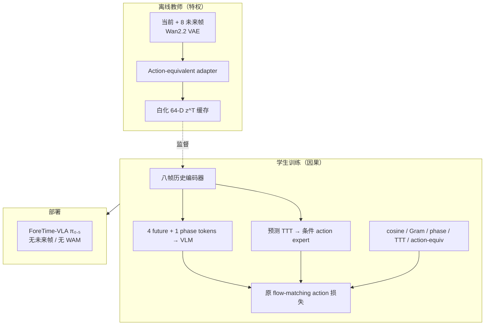

# ForeTime-VLA：世界模型未来 Token 蒸馏

**ForeTime-VLA**（*Causal Future-Token Distillation from a World Action Model for Conveyor-Belt Manipulation*，[arXiv:2608.20735](https://arxiv.org/abs/2608.20735)）由 **清华大学**、**上海人工智能实验室**、**哈尔滨工业大学** 与 **云深处科技（DEEP Robotics）** 提出：在 **π₀.₅** 上蒸馏 **Fast-WAM 系教师** 的 **64-D action-equivalent 未来表征**，推理时仅用 **八帧因果历史** 预测未来/阶段/过渡时间，**无需 WAM 或未来帧前向**。

## 一句话定义

**训练期用特权 WAM 未来帧定义紧凑未来码，部署期用因果 future token 把「何时抓、怎么接触」的结构注入 π₀.₅，而不在控制环里生成视频。**

## 英文缩写速查

| 缩写 | 英文全称 | 简要说明 |
|------|----------|----------|
| VLA | Vision-Language-Action | 视觉–语言–动作策略 |
| WAM | World Action Model | 联合建模世界预测与动作的世界–动作模型 |
| TTT | Time-to-Transition | 到下一操作阶段（如闭合夹爪）的归一化时间 |
| FM | Flow Matching | π₀.₅ 动作专家的连续 flow 匹配训练 |
| MAE | Mean Absolute Error | 离线窗级动作误差指标 |
| SR | Success Rate | 任务成功率 |

## 为什么重要

- **动态操纵的时间结构：** 传送带抓取依赖 **接触时机与姿态**，单帧 VLA 微调易欠拟合「尚未可见的未来约束」。
- **WAM 训练、VLA 部署：** 延续 Fast-WAM「**视频建模主要服务训练**」路线，但把收益压进 **64-D token** 而非测试时想象。
- **可量化真机增益：** 三档带速 **44/90** grasp，相对 π₀.₅ **23/90**；快速档 **11/30 vs 2/30**。
- **与 DECOWAM 互补：** [DECOWAM](./paper-decowam.md) 蒸馏 **腿足 loco-manip** 特权观测；ForeTime-VLA 面向 **桌面传送带 π₀.₅** 与 **相位/过渡时间** 双条件。

## 核心信息

| 项 | 内容 |
|----|------|
| **机构** | 清华大学；上海人工智能实验室；哈尔滨工业大学；云深处科技（DEEP Robotics） |
| **基座** | **π₀.₅**（flow-matching action expert + VLM 前缀） |
| **教师** | 冻结 **Wan2.2 VAE**（Fast-WAM 管线）+ 非坍缩 adapter → 白化 **64-D** \(z^T\) |
| **学生** | 八帧因果编码器 → future / phase / TTT；**4 future tokens + 1 phase token** |
| **动作** | H=20, D=16 chunk；**保留原 flow target**，叠加多任务对齐损失 |
| **开源** | **截至 2026-08-25 未列官方代码或权重 URL**（仅 arXiv） |

## 流程总览

## 源码运行时序图

**不适用** — 截至入库日 arXiv 未提供可运行官方代码或权重；复现需自搭 π₀.₅ 微调栈与 Fast-WAM 教师预处理管线。

## 方法要点

### 离线教师

- 未来帧偏移 \(\{2,4,7,9,12,14,17,19\}\)；adapter 防坍缩（方差/协方差正则 + 动作几何损失）。
- 仅缓存 **教师** 64-D 码监督学生；**真机部署不跑教师**。

### 学生与双路径条件

- **慢路 VLM：** future + phase token 进前缀。
- **快路 action expert：** 预测的未来码与 **TTT** 共同条件 flow 去噪。
- 损失：\(\mathcal{L}_{flow}\) + cosine + Gram relational + phase + TTT + action reconstruction。

## 实验读法

### 离线（768 匹配窗 / split）

| 指标 | π₀.₅ | ForeTime-VLA | 变化 |
|------|------|--------------|------|
| Test MAE | 0.134119 | **0.130593** | −2.63%（bootstrap 95% CI 0.82–4.48%） |
| Test L2 | baseline | **−3.02%** | — |
| 延迟 | baseline | **+2.46–2.93%** | 可接受开销 |

### 真机传送带（grasp success）

| 条件 | ForeTime-VLA | 次优基线 | Δ |
|------|--------------|----------|---|
| 静止 | **81.1%** | +12.2 pt | — |
| 慢速移动 | **58.9%** | +22.2 pt | — |
| 三档合计 | **44/90** | π₀.₅ 23/90 | +21 |
| 快速档 | **11/30** | π₀.₅ 2/30 | +9 |

- **失败模式：** 离线姿态增益与真机 **迟到/接触姿态错误** 减少一致，支持因果蒸馏假设。

## 结论

**ForeTime-VLA 把 WAM 的「未来」从像素管线收成 64-D token，在 π₀.₅ 上用最少的推理开销买到动态抓取的可观成功率提升。**

- **真影响指标：** 真机三档带速 grasp **44/90**、快速档 **11/30**；静止/慢速 **+12~22 pt** 领先次优。
- **机制：** **相位 + TTT + future token** 双路径条件，比单纯加大历史窗口更直接编码 **接触事件时间结构**。
- **代价：** 离线需 **WAM 教师预处理** 全数据集；推理仍有 **~2.5% 延迟**；全参数微调成本高于纯 SFT。
- **与 Fast-WAM 关系：** 训练借 WAM 表征、部署不滚视频——与 Fast-WAM 哲学一致，但目标是把结构 **烙进 VLA** 而非单独 WAM 策略。
- **开源：** **未发布** — 跟进 arXiv / 机构页是否释出代码与 checkpoint。
- **选型：** **移动物体/传送带/闭合一瞬** 类任务优先；静态 pick-place 增益可能有限。

## 与其他工作对比

| 对比轴 | ForeTime-VLA | π₀.₅ 直微调 | Fast-WAM 部署 | [DECOWAM](./paper-decowam.md) |
|--------|--------------|-------------|---------------|-------------------------------|
| 测试时 WAM | **无** | 无 | 可去掉视频分支 | 无 |
| 教师信号 | 64-D future 码 | 无 | 联合训练 | 特权未来瓶颈 |
| 任务 | 传送带抓取 | 通用 | 通用操纵 | 腿足 loco-manip |
| 条件变量 | phase + TTT + tokens | 语言+图像 | 语言+图像 | 分解相机/基座/臂 |

## 局限与风险

- **无公开代码：** 复现依赖 π₀.₅ 与 Wan 教师链，工程门槛高。
- **数据集域：** 去重传送带集；外推到其他动态场景需重训教师码。
- **全参微调：** 非 LoRA 轻量适配，算力与过拟合风险需评估。

## 关联页面

- [π₀.₅](./paper-pi05-open-world-vla.md)、[VLA](../methods/vla.md)
- [World Action Models](../concepts/world-action-models.md)、[Generative World Models](../methods/generative-world-models.md)
- [Manipulation](../tasks/manipulation.md)
- [DECOWAM](./paper-decowam.md) — 另一类 WAM→策略蒸馏
- [FlashVLA](./paper-flashvla.md) — 同基座 \(\pi_{0.5}\)：改解码循环而非未来 token

## 参考来源

- [ForeTime-VLA 论文摘录](../../sources/papers/foretime_vla_arxiv_2608_20735.md)

## 推荐继续阅读

- [arXiv:2608.20735](https://arxiv.org/abs/2608.20735) — 完整损失权重与真机协议
- [Fast-WAM](https://arxiv.org/abs/2508.04416) — 教师 WAM 脉络（若站内已收录请从 WAM 概念页跳转）
- [π₀.₅ 实体页](./paper-pi05-open-world-vla.md) — 基座策略与 flow 接口
