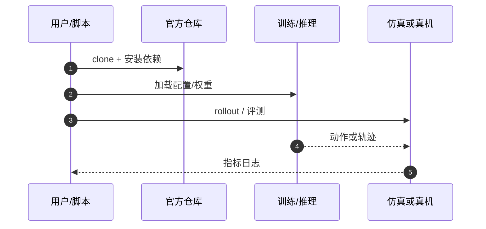

# ForgetMimic（arXiv:2609.28378）

**ForgetMimic: Motion Unlearning for Reinforcement Learning Humanoid Control**（[代码](https://github.com/Zili1000/ForgetMimic)，[arXiv:2609.28378](https://arxiv.org/abs/2609.28378)）来自 [具身智能小站 · 13 篇盘点](../../sources/blogs/wechat_embodied_13_papers_forgetmimic_2026-09-24.md)（2026-09-24）。

## 一句话定义

**多技能人形策略可在 **动作级** 选择性遗忘指定 motion，而不必整策略重训。**

## 英文缩写速查

| 缩写 | 英文全称 | 简要说明 |
|------|----------|----------|
| VLA | Vision-Language-Action | 视觉–语言–动作策略 |
| RL | Reinforcement Learning | 强化学习 |
| TO | Trajectory Optimization | 轨迹优化 |
| HITL | Human-in-the-Loop | 人在回路 |

## 为什么重要

- 危险/过时/合规禁止动作一旦进多技能策略，全量重训成本极高；安全更新需要 **unlearning** 而非 only fine-tune。
- 纳入 [13 篇技术地图](../overview/embodied-13-papers-technology-map.md) 阅读坐标。
- 开源结论（步骤 2.5，2026-09-24）：**已开源**。

## 核心机制

| 项 | 内容 |
|----|------|
| **arXiv** | [2609.28378](https://arxiv.org/abs/2609.28378) |
| **开源** | **已开源** |
| **要点** | 对目标动作施加 anti-reward，并关闭会补偿失败的训练机制；保留集 motion 的 tracking reward 与成功率维持。 |
| **文内指标** | Fight / FightAndSports1 成功率 **100%→0%**；非目标动作平均 tracking reward 降 **<2%**，成功率仍 **>85%**（G1、H2 等）。 |

## 源码运行时序图

## 实验与评测

- Fight / FightAndSports1 成功率 **100%→0%**；非目标动作平均 tracking reward 降 **<2%**，成功率仍 **>85%**（G1、H2 等）。
- **读法：** 公众号归纳；逐项 baseline 与协议以 arXiv PDF 为准。

## 与其他工作对比

- 横向索引见 [13 篇技术地图](../overview/embodied-13-papers-technology-map.md)。

## 结论

**遗忘与保留可解耦到动作粒度** — 部署前明确目标 motion 集合与 anti-reward 口径。

1. 开源边界：**已开源** — 以项目页/仓库实际链接为准（入库日 2026-09-24）。
2. 核心机制：对目标动作施加 anti-reward，并关闭会补偿失败的训练机制；保留集 motion 的 tracking reward 与成功率维持。…
3. 部署前核对任务协议与硬件条件，勿直接横比公众号摘录数字。

## 关联页面

- [Reinforcement Learning](../methods/reinforcement-learning.md)
- [Locomotion](../tasks/locomotion.md)
- [Unitree G1](./unitree-g1.md)
- [Embodied 13 Papers Technology Map](../overview/embodied-13-papers-technology-map.md)

## 参考来源

- [13 篇盘点（公众号）](../../sources/blogs/wechat_embodied_13_papers_forgetmimic_2026-09-24.md)
- [ForgetMimic: Motion Unlearning for Reinforcement Learning Humanoid Control](../../sources/papers/forgetmimic_arxiv_2609_28378.md)

## 推荐继续阅读

- [arXiv:2609.28378](https://arxiv.org/abs/2609.28378) — 原文
