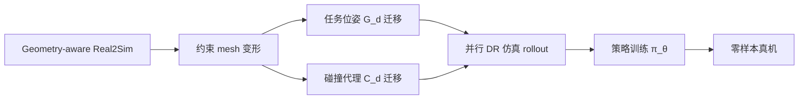

# FPSA R2S2R（arXiv:2609.18293）

**FPSA R2S2R**（*Function-Preserving Data Generation for Zero-Shot Real-to-Sim-to-Real Manipulation*，[arXiv:2609.18293](https://arxiv.org/abs/2609.18293)，[项目页](https://fpsa-r2s2r.github.io/)）来自 [具身智能小站 9 篇盘点](../../sources/blogs/wechat_embodied_station_9_papers_perception_action_transfer_2026-09-17.md)。

## 一句话定义

**接触密集任务的数据增广必须保持插口/配合面/碰撞关系不失效——约束引导 mesh 变形 + 任务位姿与碰撞代理一致迁移，再用随机化仿真 rollout 合成训练数据，零样本上真机。**

## 英文缩写速查

| 缩写 | 英文全称 | 简要说明 |
|------|----------|----------|
| FPSA | Function-Preserving Shape Augmentation | 功能保持形变增广 |
| R2S2R | Real-to-Sim-to-Real | 真机重建→仿真→真机部署 |
| ARAP | As-Rigid-As-Possible | 弯曲形变约束 |

## 为什么重要

- 标准 axis-aligned scaling 常破坏 **配合几何**，生成无效演示。
- **无需遥操作源轨迹** 即可从重建资产扩数据，降低 contact-rich 任务采集成本。
- 开源结论：**待发布**（匿名项目页，2026-09-17）。

## 流程总览

## 核心机制

| 项 | 内容 |
|----|------|
| **arXiv** | [2609.18293](https://arxiv.org/abs/2609.18293) |
| **开源** | **待发布** |
| **变形** | stretch 用 slippage-preserving；bend 用 ARAP；保持 task-critical interface |
| **文内指标** | 五项真机名义条件平均成功率 82% |

## 源码运行时序图

**不适用**（截至 2026-09-17 无官方代码 URL）。

## 实验与评测

- **主指标：** 五项 contact-rich 真机任务 **名义条件平均成功率 82%**，且 **零样本**——训练数据全部来自变形资产 + 随机化仿真 rollout，无真机 fine-tuning。
- **口径提醒：** 82% 是 **名义条件**（nominal）下的数字；视觉扰动、位姿误差与非名义初始条件的退化曲线需回原文实验章节核对。
- **消融读法：** 该工作的关键变量是「变形是否保持 task-critical interface」——与 axis-aligned scaling 的对照，是判断 FPSA 是否值得引入的唯一决定性实验。
- 本页为清单摘要级；完整表格与协议见 [参考来源](#参考来源)，代码 **待发布**，暂不可独立复现。

## 与其他工作对比

| 对照对象 | 差异 |
|----------|------|
| Axis-aligned scaling / 随机缩放增广 | 最常见的 mesh 扩充手段，但会破坏 **配合几何**，生成物理上无效的演示；FPSA 以约束变形（stretch 用 slippage-preserving、bend 用 ARAP）替代 |
| 遥操作扩数据 | 质量高但线性烧人力；FPSA **无需源轨迹**，从重建资产直接扩，成本曲线不同 |
| [DeformSmith](./paper-deformsmith.md) | 同为「物理可信数据」但方向相反：FPSA 保 **刚性接口不失效**，DeformSmith 生成 **可变形本体** |
| 纯 Real2Sim 重建（不做增广） | 只得到单一资产，覆盖不了公差与型号差异；FPSA 在重建之后补 **功能保持的形状族** |

## 结论

**FPSA 把 Sim 数据扩规模的关键从「更多 mesh」改成「变形状但不破坏功能接口」——适合螺丝/装配/gear 类 contact-rich 任务选型参考。**

1. 与 [DeformSmith](./paper-deformsmith.md) 对比：FPSA 强调 **刚性接口保持**，DeformSmith 强调 **可变形本体**。
2. 零样本声明不含真机 fine-tuning，部署时需核对视觉扰动协议。
3. 匿名作者阶段，优先跟踪项目页是否释出代码与资产格式。

## 关联页面

- [sim2real](../concepts/sim2real.md)
- [manipulation](../tasks/manipulation.md)
- [DeformSmith](./paper-deformsmith.md)
- [9 篇技术地图](../overview/perception-action-transfer-9-papers-technology-map.md)

## 参考来源

- [fpsa_r2s2r_arxiv_2609_18293.md](../../sources/papers/fpsa_r2s2r_arxiv_2609_18293.md)
- [wechat_embodied_station_9_papers_perception_action_transfer_2026-09-17.md](../../sources/blogs/wechat_embodied_station_9_papers_perception_action_transfer_2026-09-17.md)

## 推荐继续阅读

- [FPSA 项目页](https://fpsa-r2s2r.github.io/)
- [arXiv PDF](https://arxiv.org/pdf/2609.18293)
