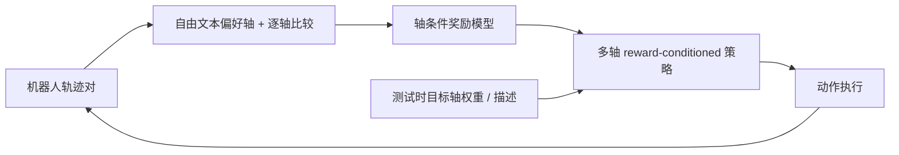
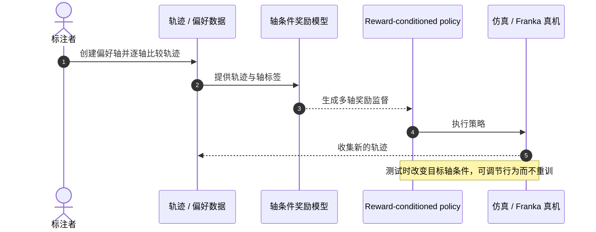

# Freeform Preference Learning：用多轴偏好训练机器人策略

**Freeform Preference Learning（FPL）** 由 Stanford 团队提出，让人类用自然语言定义任务质量的多个维度，再分别比较轨迹，训练奖励模型和可按目标轴控制的策略。

## 一句话定义

**FPL 不把速度、安全和结果质量揉成一个“总体偏好”，而是逐轴标注并训练能按这些目标调节的机器人策略。**

## 英文缩写速查

| 缩写 | 英文全称 | 简要说明 |
|------|----------|----------|
| FPL | Freeform Preference Learning | 多轴自由形式偏好学习 |
| RL | Reinforcement Learning | 使用学得奖励改进策略 |
| VLA | Vision-Language-Action | 通过视觉、文本目标和动作进行控制 |
| DROID | DROID dataset | 论文真实机器人设置使用的机器人操作平台/数据体系 |

## 为什么重要

长程任务只用“成功/失败”标注往往太稀疏；把轨迹压成单一偏好，又会隐藏速度、安全、摆放质量等冲突。FPL 允许标注者直接定义这些偏好轴，既把监督变得更清楚，也为策略提供更密集的学习信号。

## 核心信息

| 项 | 内容 |
|----|------|
| 作者 / 机构 | Marcel Torne、Anubha Mahajan、Abhijnya Bhat、Chelsea Finn；斯坦福大学（Stanford University） |
| 论文 | [arXiv:2606.32027 v3](https://arxiv.org/abs/2606.32027) |
| 项目页 | [FPL](https://freeform-pl.github.io/fpl.website/) |
| 代码 | 仿真 [fpl](https://github.com/freeform-pl/fpl)；真机 [fpl_real](https://github.com/freeform-pl/fpl_real) |
| arXiv 状态 | 2026-06-30 提交 v1，2026-08-01 更新至 v3 |

## 核心原理

1. **定义评价轴：** 标注者写出“速度”“摆放质量”“安全”等任务相关轴；允许在标注中逐步发现新轴。
2. **逐轴比较：** 对同一对轨迹，在每个轴上分别选择更好的轨迹，避免单个总偏好混合多个判断标准。
3. **学习多维奖励：** 奖励模型以轨迹和自然语言偏好轴为条件，为该维度输出奖励信号。
4. **提取可条件化策略：** 策略学习多个偏好轴的组合；推理时调节各轴目标，就能改变行为风格而无需重训。

### 流程总览

## 源码运行时序图

项目页同时链接仿真与真机仓库；下图概括数据—偏好—奖励—策略的运行接口。仓库中的可执行命令、机器人驱动和环境细节以对应 README 为准。

## 实验与评测

- **任务规模：** 4 个真实机器人长程任务与 2 个仿真任务；真实任务包含把方块放进目标碗、折短裤、摆盘吐司、布置餐桌。
- **平均任务进展：** 项目页的 real-world task progress 汇总为 FPL 75，第二高基线 37，即提高 38 个百分点。
- **策略组合性：** 项目页演示模型组合训练中未同时出现过的速度与目标组合。
- **测试时可调：** 单一策略可由目标轴条件引导至不同目标，不需要为每个偏好重新训练。
- **奖励密度：** 无需提供显式子任务分段，学得奖励仍能在摆餐具等关键事件附近给出局部进度变化。

## 与其他工作对比

| 维度 | FPL（本文） | 稀疏成功/失败奖励 | 单一总体偏好（标准 RLHF 式） |
|------|-------------|-------------------|------------------------------|
| 监督形式 | 自然语言定义的**多轴**逐轴比较 | 二值终局标签 | 每对轨迹一个整体偏好 |
| 奖励密度 | 轴条件稠密奖励 | 稀疏 | 取决于奖励模型，常混合多个判断标准 |
| 测试时调节 | 改变目标轴条件即可转向，无需重训 | 不支持 | 偏好变化通常需重新标注/训练 |
| 标注负担 | 每对轨迹需逐轴判断，单对成本更高 | 最低 | 中 |

- **与 [RoboReward](./paper-roboreward.md) / [TOPReward](./paper-topreward.md) 的分工：** 后两者回答「任务完成了多少」（单一进度/终局分），FPL 回答「在哪个质量维度上更好」；前者偏通用奖励模型，FPL 偏把人类多目标偏好显式化并接到可条件化策略。
- **横比注意：** 项目页 75 vs 37 是 task progress 汇总分，与其他论文报告的成功率不可直接比较。

## 工程实践

| 场景 | 建议 |
|------|------|
| 人类标注 | 先写清偏好轴，再逐轴比较；避免让标注者同时权衡安全、速度和结果 |
| 策略训练 | 对照 sparse success 与 single overall preference，测多轴监督的实际增益 |
| 行为定制 | 将期望属性作为文本轴/目标条件输入同一策略，检查是否出现未见组合 |
| 代码复现 | 区分仿真仓和真机仓；后者需要对应硬件、相机和控制环境 |

## 局限与风险

- 偏好轴仍由人类定义；轴覆盖不足时，模型无法自动补出未表达的价值约束。
- 单轴奖励相加时，尺度和权重会影响权衡，部署前需显式校准。
- 项目页报告的 75 与 37 是 task progress 汇总分，不应误读为成功率百分比。
- 真实任务数量为四项，跨本体、更多环境和长期稳定性仍需进一步验证。

## 结论

**FPL 用可读、可组合的多轴人类偏好学习稠密奖励，让机器人行为在训练后仍能按目标偏好调整。**

1. **轴定义减少偏好歧义**，尤其适用于多目标长程任务。
2. **奖励信号更稠密**，但不是依赖人工显式子任务分割。
3. **策略条件化支持测试时转向**，避免为每个偏好单独训练一个策略。
4. **38 个百分点是任务进展指标差值**，不是成功率差值。
5. **复现入口分仿真与真机两仓**，部署成本需按本体和设备计算。

## 关联页面

- [Progress Reward Modeling](../concepts/progress-reward-modeling.md) — FPL 属于轴条件稠密奖励路线
- [Reward Design](../concepts/reward-design.md) — 多目标偏好与标量奖励的权衡
- [Reinforcement Learning](../methods/reinforcement-learning.md)
- [Manipulation](../tasks/manipulation.md)

## 参考来源

- [FPL 论文归档](../../sources/papers/fpl_arxiv_2606_32027.md)
- [FPL 项目页归档](../../sources/sites/fpl-project.md)
- [FPL 仓库归档](../../sources/repos/fpl.md)

## 推荐继续阅读

- [FPL 项目页](https://freeform-pl.github.io/fpl.website/) — 交互式偏好示例、结果和演示视频
- [arXiv:2606.32027 v3](https://arxiv.org/abs/2606.32027)
