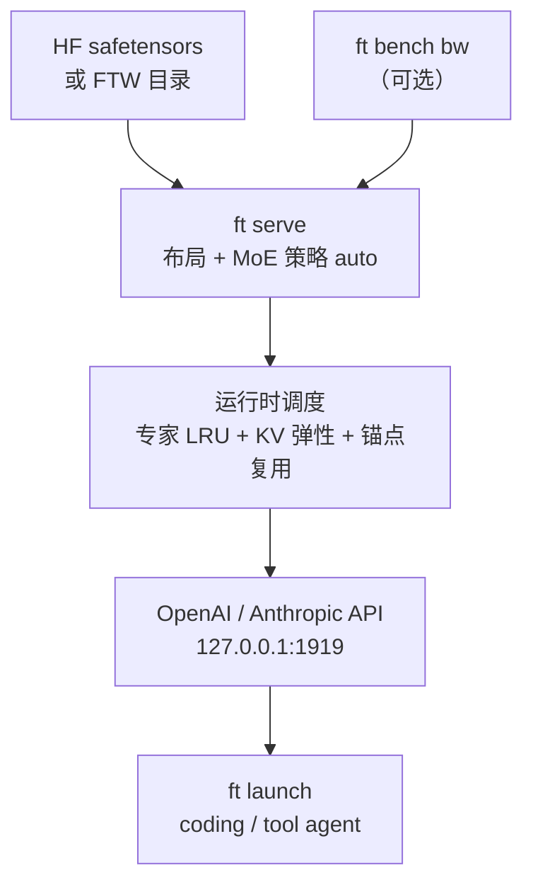
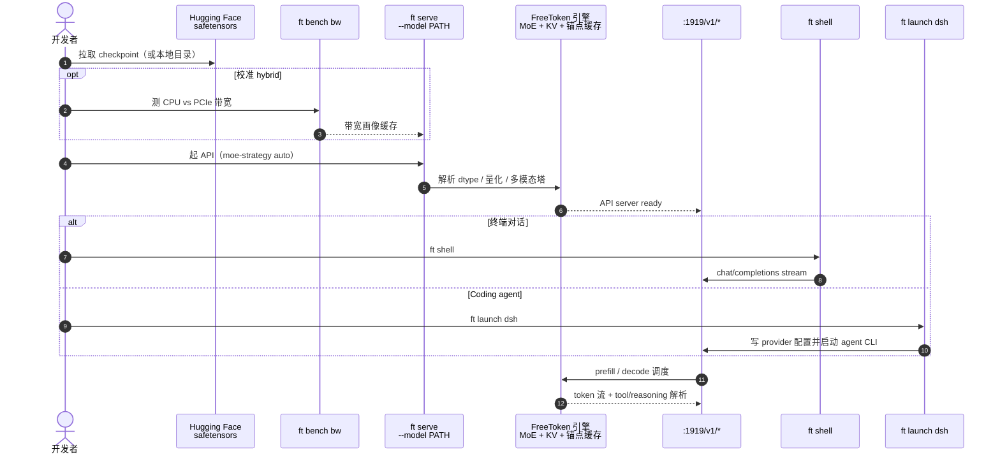

# FreeToken：边缘原生 MoE 推理

**FreeToken**（*Efficient Edge-Native MoE Serving with Bandwidth-Adaptive Execution*，[arXiv:2608.16157](https://arxiv.org/abs/2608.16157)，[代码](https://github.com/FlashML-org/FreeToken)，[项目页](https://flashml.ai)）由 **加州大学伯克利分校（UC Berkeley）**、**麻省理工学院（MIT）** 与 **FlashML** 团队提出：把个人电脑当作 **统一弹性推理平台**（而非「缩小的数据中心 GPU」），全栈协同模型布局、专家驻留、CPU–GPU 执行、agent 状态复用与运行时显存管理，使开放权重前沿 MoE 能在本地以可交互速度服务真实 coding / tool-using agent。

## 一句话定义

**按机器实际带宽与异构资源动态映射 MoE 计算与状态，并用语义锚点避免 agent 上下文编辑后的冗余重算——让已有硬件能跑远超其 VRAM 名义上限的前沿模型。**

## 英文缩写速查

| 缩写 | 英文全称 | 简要说明 |
|------|----------|----------|
| MoE | Mixture of Experts | 稀疏路由大模型；专家权重远大于单卡 VRAM |
| KV | Key–Value Cache | 自回归推理中的注意力缓存 |
| FTW | FreeToken Weights | 可选快速加载权重格式（`ft checkpoint`） |
| NVFP4 / FP8 | NVIDIA FP4 / 8-bit Float | 常见量化 checkpoint 格式 |
| API | Application Programming Interface | OpenAI `/v1/*` 与 Anthropic `/v1/messages` 兼容 |
| PCIe | Peripheral Component Interconnect Express | CPU–GPU 与 offload 专家传输带宽 |
| LRU | Least Recently Used | GPU 专家槽的替换策略 |

## 为什么重要

- **机器人研究的间接基础设施：** 仿真脚本、训练配置、benchmark 复现 increasingly 依赖 **本地 coding agent**（见 [真机策略 autoresearch 闭环](../queries/real-robot-policy-autoresearch-harness.md)）。FreeToken 把 **753B GLM-5.2** 级模型拉到单工作站 GPU，改变「必须云 API」的默认假设。
- **MoE 边缘范式：** 不是简单把 vLLM 缩到消费卡，而是 **$q^\star$ 带宽自适应** 在 fused / offload / cpu / hybrid 间连续调度，并用 `ft bench bw` 画像机器。
- **Agent 负载特化：** 工具调用、thinking block、上下文 surgical edit 会触发 KV 重算；**semantic anchor checkpoints** 针对这类模式做复用。
- **生态已接好：** `ft launch` 一键配置 Claude Code、Codex、[DeepSeek Harness](./deepseek-harness.md)（`dsh`）、OpenClaw、OpenCode 等，与 [Kimi K3](./kimi-k3.md) 等自托管权重路线互补。

## 核心信息

| 项 | 内容 |
|----|------|
| **机构** | 加州大学伯克利分校（UC Berkeley）；麻省理工学院（MIT）；FlashML |
| **论文日期** | 2026-08-17（arXiv v1） |
| **支持规模（论文宣称）** | 笔电 **35B**；游戏台式 **284B**；工作站单卡 **753B（GLM-5.2）** |
| **硬件跨度** | 8GB 笔电 GPU → RTX 30/40/50 消费卡 → 单卡工作站 |
| **模型族** | 20+ MoE / 多模态（完整表见 [models.md](https://github.com/FlashML-org/FreeToken/blob/main/docs/models.md)） |
| **开源** | **已开源** Apache-2.0：[FlashML-org/FreeToken](https://github.com/FlashML-org/FreeToken)；桌面应用另从 [flashml.ai](https://flashml.ai) 下载 |

## 核心原理

### 系统协同轴

| 模块 | 作用 |
|------|------|
| **带宽自适应 MoE 执行** | `fused` / `offload` / `cpu` / `hybrid`；`auto` 对 MoE 默认 offload，有 `ft bench bw` 画像时升 hybrid |
| **专家全局 LRU 缓存** | offload 族策略下 GPU 槽缓存热专家，miss 经 PCIe 或 CPU 补算 |
| **全层 double-buffered prefill** | 长上下文预填与权重/专家搬运重叠 |
| **语义锚点 checkpoint** | 对 recurrent state / KV 做锚定，agent 编辑上下文后跳过冗余重算 |
| **弹性显存管理** | 运行时 **专家缓存 ↔ KV** 动态再分配，无需重启 |
| **FTW + graph-compatible 执行** | 可选权重预转换；稳态 decode 走 CUDA graph |

### 流程总览

## 源码运行时序图

节点对齐 [`sources/repos/freetoken.md`](../../sources/repos/freetoken.md) 与 [quickstart](https://github.com/FlashML-org/FreeToken/blob/main/docs/quickstart.md)。

- **最短路径：** `uv pip install "freetoken[accel]"` → `ft serve --model Qwen/Qwen3.6-35B-A3B` → `curl :1919/v1/chat/completions` 或 `ft shell`。
- **大模型：** 先 `ft bench bw` 再 serve，让 `auto` 选 hybrid；调 `--memory-ratio` / `--moe-cache-size` 平衡专家与 KV。
- **权重格式：** 可直接读 HF；`ft checkpoint` 预转 FTW 加速冷启动（旧版 FTW 见 `ftw-hotfix.md`）。

## 工程实践

| 项 | 建议 |
|----|------|
| 安装 | 推荐 `uv pip install "freetoken[accel]"`；RTX 30/40/50 原生支持 |
| 起服务 | `ft serve --model <本地或 HF id>`；仅 `--model` 必填，其余随 checkpoint + GPU 自解析 |
| MoE 策略 | 默认 `auto`；VRAM 充足再手动 `fused`；台式机先跑 `ft bench bw` |
| 显存 | `--memory-ratio` 默认 0.9；`--kv-reserve-tokens` 为 MoE 缓存留底 |
| 多模态 | Qwen3-VL / Gemma-4 / GLM-5.3-Flash 等见 models.md 图像 token 表；纯文本加 `--text-model-only` |
| Agent | `ft launch claude|codex|dsh|opencode|openclaw`；`--dry-run` 预览配置 |
| 对照栈 | 思路受 SGLang / vLLM / mini-sglang 启发；与云 API 比的是 **数据驻留 + 超大 MoE 本地可达** |

## 实验与评测（论文宣称，清单索引）

| 维度 | 要点 |
|------|------|
| 模型覆盖 | 20+ MoE；DeepSeek-V4-Flash、Qwen3.6/3.8、GLM-5.2 等 |
| 硬件 | 8GB 笔电 GPU → 单卡工作站 |
| 可服务规模 | 35B（笔电）/ 284B（游戏台式）/ 753B GLM-5.2（工作站） |
| 工作负载 | 真实 coding 与 tool-using agent（非仅静态 benchmark） |

> 本页未搬运论文完整吞吐表；数值与对照基线以 PDF 为准。

## 结论

**FreeToken 把「开放权重前沿 MoE」从数据中心假设拉回个人机：真杠杆是带宽自适应专家调度 + agent 态复用，而不是单纯量化或更小 batch。**

1. **先画像机器** — `ft bench bw` 决定 hybrid 是否优于纯 offload；同一策略在不同 PCIe/CPU 配比上表现可完全不同。
2. **MoE 策略别硬 fused** — VRAM 不够时 offload/hybrid 才是默认可行路径；fused 需显式确认能放下全部热专家。
3. **agent 负载要单独优化** — 语义锚点针对工具调用与上下文编辑；纯聊天 benchmark 低估其价值。
4. **权重入口是 HF safetensors** — FTW 可选加速；注意旧 FTW 与量化重构后的兼容性（`ftw-hotfix.md`）。
5. **与机器人栈的关系是「研究 harness 后端」** — 接 dsh/Codex 写仿真与训练代码，不替代 [VLA](../methods/vla.md) 等 embodied 策略。
6. **桌面 app vs CLI** — 产品页安装包降低门槛；复现与定制仍走 GitHub 开源引擎。

## 与其他工作对比

| 对照 | 差异读法 |
|------|----------|
| vLLM / SGLang | 数据中心向高吞吐 serving；FreeToken 强调 **单用户边缘异构 + 超大 MoE offload** |
| llama.cpp | 通用本地推理；FreeToken 专注 **前沿 MoE + agent API + 带宽自适应专家** |
| [Kimi K3](./kimi-k3.md) | K3 是 **权重**；FreeToken 是 **在消费硬件上跑 K3/GLM/Qwen 等 MoE 的 serving 栈** |
| [LLaDA2.2-flash](./llada2-2-flash.md) | 离散扩散 **模型**；FreeToken 是 **运行时**，可 serve 多种架构 checkpoint |

## 局限与风险

- **硬件门槛仍高** — 753B 需工作站级 GPU + 大量主机内存；笔电场景是 **35B 级** 而非任意 frontier。
- **kernel 调优绑定列表** — models.md 外同架构 checkpoint「可用」但未必最优。
- **桌面闭源分发** — flashml.ai 安装包与开源 CLI 并存；审计与定制以 GitHub 为准。
- **评测以论文为准** — 与云 API 的成本/质量 trade-off 需按自有 agent 任务复测。

## 关联页面

- [Kimi K3](./kimi-k3.md) — 典型需本地 serving 的超大 MoE 权重
- [DeepSeek Harness](./deepseek-harness.md) — `ft launch dsh` 对接的 coding agent
- [真机策略 autoresearch 闭环](../queries/real-robot-policy-autoresearch-harness.md) — 本地 agent 研究 harness 语境
- [Muon](../methods/muon.md) — 作者线（Song Han）训练效率方法交叉
- [NVIDIA Jetson](./nvidia-jetson.md) — 另一类边缘 AI 栈（嵌入式 vs 消费 GPU）

## 参考来源

- [freetoken_arxiv_2608_16157.md](../../sources/papers/freetoken_arxiv_2608_16157.md) — 论文摘录
- [freetoken.md](../../sources/repos/freetoken.md) — 仓库与 MoE 策略
- [flashml-freetoken.md](../../sources/sites/flashml-freetoken.md) — 项目页开源核查

## 推荐继续阅读

- 论文 — <https://arxiv.org/abs/2608.16157>
- 代码 — <https://github.com/FlashML-org/FreeToken>
- 支持模型 — <https://github.com/FlashML-org/FreeToken/blob/main/docs/models.md>
- 快速开始 — <https://github.com/FlashML-org/FreeToken/blob/main/docs/quickstart.md>
