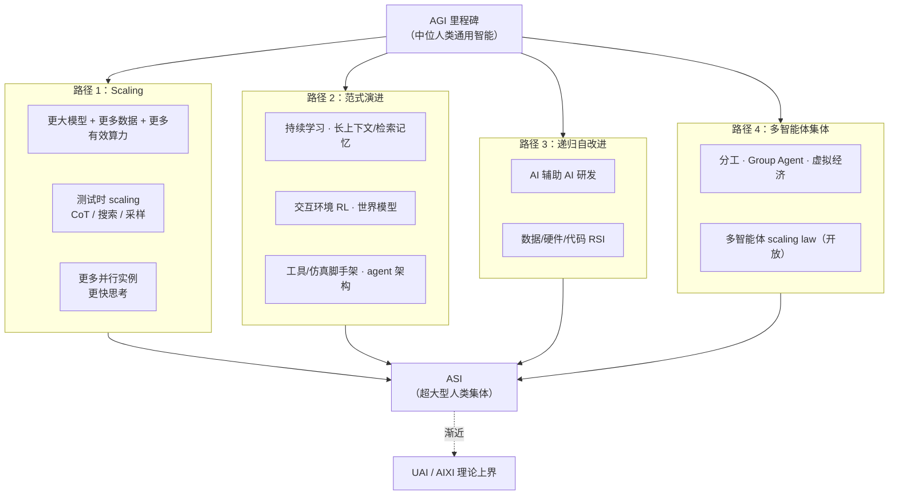

# From AGI to ASI（DeepMind 技术报告）

**From AGI to ASI** 是 Google DeepMind 发布的长篇技术报告（arXiv:2606.12683，2026-06）：在 **不预设 AGI 到达时间** 的前提下，讨论 **人类级 AGI 之后** 机器智能如何沿连续谱继续增长，直至 **人工通用超级智能（ASI）** 与理论极限 **Universal AI（AIXI）**。报告主体是 **技术路径与瓶颈地图**，不是机器人系统论文；但对 **具身基础模型、数据工厂与多机协作** 研究者，它把当前社区正在做的 scaling、世界模型、仿真 RL 与 agent 集体，嵌入更宏观的 **可检验研究议程**。

## 一句话定义

用 **AGI→ASI 四条并行技术路径** 与 **六类瓶颈** 组织后 AGI 时代的 AI 进展假设，并强调 **有效算力增长、测试时 scaling、仿真/交互数据与多智能体集体** 可能让「单模型平台期 + 算力仍指数增长」仍产生集体层面的超级能力。

## 英文缩写速查

| 缩写 | 英文全称 | 简要说明 |
|------|----------|----------|
| AGI | Artificial General Intelligence | 约中位人类水平的通用认知智能 |
| ASI | Artificial General Superintelligence | 广泛任务上超越大型人类专家集体的通用超级智能 |
| UAI | Universal Artificial Intelligence | 以 AIXI 为形式化的机器智能理论上界 |
| AIXI | Agent–AI cross entropy / universal agent | Hutter 框架下的不可计算最优通用 RL 智能体 |
| RL | Reinforcement Learning | 交互环境中的序贯决策学习 |
| VLA | Vision-Language-Action | 视觉–语言–动作基础策略，机器人侧当前范式实例 |
| CoT | Chain-of-Thought | 测试时通过中间推理链消耗额外算力以提升表现 |
| RSI | Recursive Self-Improvement | AI 加速 AI 研发形成的正反馈自改进循环 |

## 为什么重要（机器人读者视角）

- **把「scaling 够不够」问清楚**：报告区分 **单模型能力 scaling** 与 **并行实例 / 测试时算力 / 集体组织** 三条增益通道；后者直接对应 **大规模仿真 rollout、多机 fleet、云端 VLA 副本与 teleop 工厂** 等机器人工程现实。
- **范式演进清单与仓库主线对齐**：明确点名 **持续学习、长上下文/工作记忆、交互 RL、内部世界模型、工具增强规划**——与 [VLA](../methods/vla.md)、[World Action Models](../concepts/world-action-models.md)、[生成式世界模型](../methods/generative-world-models.md) 等页面对象一致，便于判断「工程演进」vs「范式跃迁」。
- **数据墙 → 仿真与交互**：在文本预训练接近上限的叙事下，报告把 **高保真仿真、多智能体任务、RL 交互轨迹、test-time 蒸馏回训练集**（AlphaZero 式）列为对抗数据墙的主通道——与 [Sim2Real](../concepts/sim2real.md)、[具身数据飞轮](../concepts/data-flywheel.md) 同构。
- **抽象壁垒与具身接地**：若模型主要吸收人类已有抽象（文本/符号），可能难以 **从原始传感流发现新物理概念**；报告认为突破或需 **具身交互验证**，并把 **物理实验延迟** 视为递归自改进的硬刹车——对「纯视频预训练能否通向可部署机器人」是高层风险提示。
- **多智能体 ASI 路径**：集体智能、分工与市场式协调被单列为第四条路径，与 [MARL](../methods/marl.md)、多机 swarm 与世界模型中的 **多体 rollout** 研究可交叉阅读。

## 流程总览：四条路径（可并行）

## 核心机制（归纳）

### 术语与能力上界

| 概念 | 报告中的操作性含义 |
|------|------------------|
| **AGI** | 约 **中位人类** 在多数认知任务上的表现；首批 AGI 可能已在不少窄项超人类 |
| **ASI** | 在 **几乎所有人类活动领域** 稳定超越 **数万专家级人类、十年协作** 的大型集体 |
| **数字智能优势** | 高带宽 I/O、可调思考速度、大工作记忆、无损复制与经验共享——随算力 **相对人类差距扩大** |
| **根本局限** | 光速、Landauer、实时世界、物质操控、测量精度、P/NP、哥德尔/停机等 **不随 scaling 消失** |

### 有效算力与集体 scaling

- 历史复合：**有效算力 ~10×/年**（硬件 × 投资 × 算法效率；各因子有不确定性）。
- **关键推论**：即使 **单模型** 在 AGI 附近平台化，**实例数 × 速度 × 测试时思考长度** 仍可在短期内扩大 **10³–10⁸** 倍；若任务可 **并行分解**（研发、仿真、数据策展），集体可能已达 ASI 门槛。
- **与具身 scaling 对照**：[Embodied Scaling Laws](../concepts/embodied-scaling-laws.md) 讨论 **轨迹/参数/任务** 幂律；本报告讨论 **宏观算力与认知副本**，二者层级不同但 **「数据+算力共缩放」** 叙事一致（Chinchilla 式）。

### 六类瓶颈（Table 4 摘要）

| 瓶颈 | 机器人相关读法 |
|------|----------------|
| **数据墙** | 互联网文本见顶；**仿真、RL 交互、合成渲染、人类–AI 共采** 是具身侧主缓解手段 |
| **经济/资源** | 训练集群、真机 fleet、能源与芯片互联；决定 **数据工厂与大规模 sim** 能否持续 |
| **神经范式不足** | 纯 IL/VLA 可能缺 **因果决策、持续学习、风险敏感控制**；或需世界模型/RL 闭环 |
| **研究变难** | 低垂果实减少；**AI 辅助实验与代码** 可能对冲（对 sim 自动化是利好） |
| **抽象壁垒** | 只吃人类抽象的数据可能 **封顶于人类概念空间**；**接地传感 + 物理验证** 或是突破路径 |
| **刻意减速** | 监管/事故/舆论 vs 产业竞争；影响 **开源权重、真机部署节奏** |

### 理论脚注：预训练与 AIXI

报告把 **大规模 log-loss 预训练** 解释为 **有界资源下的通用压缩近似**，并认为叠加 **规划脚手架 / RL 决策** 可能继续推进——为 [Foundation Policy](../concepts/foundation-policy.md) / [VLA](../methods/vla.md) 提供 **宏观理论背书**，同时强调 **AIXI 不可计算** 与实践鸿沟（持续学习、超长程规划仍开放）。

## 评测与研究议程

本报告 **不做实证 benchmark**，但列出对 **预测 AI 进展** 至关重要的评测方向，具身读者可映射为：

| 议程主题 | 报告主张 | 机器人侧对照 |
|----------|----------|--------------|
| **Scaling 外推** | power-law / benchmark stitching 预测单模型能力 | [Embodied Scaling Laws](../concepts/embodied-scaling-laws.md)、Humanoid-GPT 等数据/模型 scaling |
| **ASI 级通用评测** | 需 **不饱和于人类水平** 的私有/对抗基准（ARC-AGI 类） | 长程 loco-manip、开放世界 household 仍缺统一 ASI 标尺 |
| **多智能体 scaling law** | 集体能力随实例数/交互密度的规律 **开放** | swarm RL、多机 fleet、仿真并行 rollout |
| **递归改进指标** | 跟踪 AI 对 AI 研发的自动化程度（Chan et al. 2026） | 自动 sim 课程、NAS、AI 辅助 retarget/标注流水线 |
| **抽象壁垒检验** | 限制训练集为人类 **2010 年前** 科学文本的 counterfactual | 纯人类视频 VLA vs 仿真接地 RL 的 **新概念发现** 能力 |

## 常见误区或局限

- **不是机器人技术报告**：正文 **明确不把一般机器人进展** 纳入预测范围；读者需自行把 **仿真/RL/世界模型** 段落映射到具身栈。
- **不是时间线预测**：数字（10×/年、实例数推演）是 **情景分析**，不是 DeepMind 官方产品路线图。
- **ASI ≠ 科幻全能**：报告反复否定 **治愈衰老、任意纳米组装、戴森球** 等作为 ASI 必然能力；**负向可预测性** 常强于正向。
- **集体 ASI 依赖任务可分解性**：并行副本并非对所有 **长链物理实验、单次真机稀缺事件** 自动线性加速。
- **安全与治理仅点到为止**：instrumental convergence、对齐工具链有提及，但非报告重心；勿当作 alignment 手册。

## 与其他页面的关系

- [Embodied Scaling Laws](../concepts/embodied-scaling-laws.md) — 机器人数据/参数 scaling 的微观定律；本页提供 **宏观算力与副本** 背景。
- [Data Flywheel](../concepts/data-flywheel.md) — 部署→数据→训练闭环；对应报告中 **数据 RSI 与 test-time 蒸馏** 通道。
- [World Action Models](../concepts/world-action-models.md) / [Generative World Models](../methods/generative-world-models.md) — 范式演进路径中的 **内部世界模型** 实例。
- [机器人学习「三个时代」](../queries/robot-learning-three-eras-narrative.md) — 产业侧 **存在性证明 → 基础模型 → Scaling** 叙事；可与此报告的 **后 AGI 连续谱** 前后拼接阅读。
- [MARL](../methods/marl.md) — 第四条路径（多智能体集体）在机器人仿真中的具体技术落点。

## 推荐继续阅读

- 论文：<https://arxiv.org/abs/2606.12683>
- 理论教材：Hutter et al., *Universal Artificial Intelligence*（AIXI 框架）
- 算力预测：Epoch AI 有效算力估计；Aschenbrenner (2024) 情景分析
- 具身对照：[Open X-Embodiment](../concepts/open-x-embodiment.md)、[τ₀-World Model](./tau0-world-model.md)（测试时仿真选动作）

## 参考来源

- [agi_to_asi_arxiv_2606_12683.md](../../sources/papers/agi_to_asi_arxiv_2606_12683.md) — arXiv 策展摘录
- Genewein, T., et al. (2026). *From AGI to ASI*. arXiv:2606.12683. <https://arxiv.org/abs/2606.12683>
