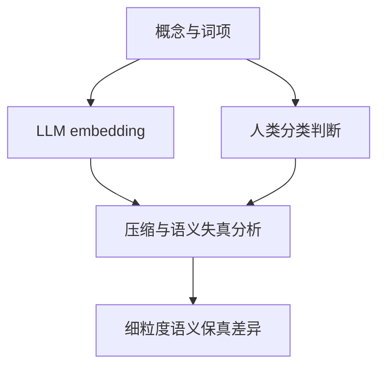

# From Tokens to Thoughts: How LLMs and Humans Trade Compression for Meaning

**From Tokens to Thoughts**（arXiv:2505.17117）由 Chen Shani、Liron Soffer、Dan Jurafsky、Yann LeCun、Ravid Shwartz-Ziv 等提出。论文把人类概念类别与 40 多种语言模型的 embedding 放进 information-bottleneck 框架中，分析压缩程度和语义区分能力之间的权衡。

## 英文缩写速查

| 缩写 | 英文全称 | 简要说明 |
|------|----------|----------|
| LLM | Large Language Model | 大型语言模型 |
| IB | Information Bottleneck | 用压缩输入信息同时保留任务相关信息的理论框架 |
| AMI | Alignment with Human judgments | 论文中用于比较模型表示与人类概念判断的指标 |

## 问题与方法

研究使用经典人类分类与典型性判断基准，比较模型 embedding 如何组织概念类别，并从信息瓶颈视角衡量表示的复杂度和语义失真。作者报告模型总体类别边界可与人类判断相符，但在细粒度语义区分上落后；模型表示更偏向统计压缩，人类表示则保留更多上下文细节。

## 结果边界

这是关于语言模型和人类概念表征的研究，不是 JEPA 方法、视觉世界模型或机器人规划实证。VideoDB 长文引用它来提醒表示压缩可能丢失规划相关细节；这属于跨论文的概念关联，并不是本文证明的机器人控制结论。

该论文在 2026-08-19 更新至 v7。具体实验应以相应版本和原文数据为准。

## 与其他工作对比

| 工作 | 研究对象 | 与本文的区别 |
|---|---|---|
| 本文 | LLM embedding 与人类概念类别 | 分析性研究：用信息瓶颈衡量压缩与语义保真权衡，不提出新训练目标 |
| [Semantic Tube Prediction](./paper-semantic-tube-prediction.md) | 语言模型训练中的隐藏状态轨迹 | 提出 JEPA 式训练正则并报告数据效率；本文只诊断表征，不改训练 |
| [VideoDB JEPA 长文](./article-videodb-jepa-world-models.md) | JEPA、世界模型与规划的综述 | 借用本文“过度压缩会丢细节”的观点作概念提醒，属于跨论文引申 |

## 结论

本文的价值在于提供一个**表征诊断视角**：LLM embedding 在粗粒度类别上与人类判断接近，但更偏向统计压缩、细粒度语义保真较弱。它可以作为评估 latent 表征“压缩是否过度”的参照，但不包含视觉、世界模型或机器人控制实验，不能直接当作机器人表征设计的实证依据。

## 关联页面

- [VideoDB JEPA 长文](./article-videodb-jepa-world-models.md)
- [Semantic Tube Prediction](./paper-semantic-tube-prediction.md)

## 参考来源

- [VideoDB JEPA 长文](./article-videodb-jepa-world-models.md)
- [Semantic Tube Prediction](./paper-semantic-tube-prediction.md)
- [论文来源归档](../../sources/papers/from_tokens_to_thoughts_arxiv_2505_17117.md)
- [arXiv:2505.17117](https://arxiv.org/abs/2505.17117)
