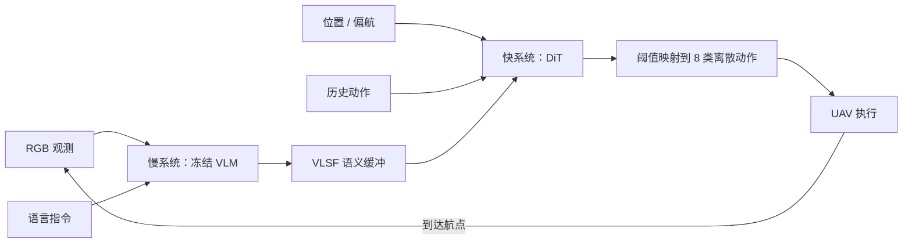

# FSD-VLN（空中长程 VLN · 快慢双系统）

**FSD-VLN**（*Fast-Slow Dual-System Modeling for Aerial Long-Horizon Vision-Language Navigation*，[arXiv:2607.08359](https://arxiv.org/abs/2607.08359)，鹏城实验室 / 中科院深圳先进技术研究院 / 北京大学）把低空长程 **UAV VLN** 拆成两条异步通路：慢系统用冻结预训练 VLM 提取语义先验并写入 **VLSF** 缓冲；快系统用 [GR00T N1](./paper-hrl-stack-34-gr00t_n1.md) 系 **DiT** 在 UAV 状态、历史动作与缓存语义上生成飞行动作。作者在 AirVLN-S + OpenFly 的 UE 城市场景上报告：未见 SR 相对自复现 OpenFly 从 5.1% 升到 **13.6%**，单步推理 402→**176 ms**，214 条任务总时长约 **−53%**。截至入库日 **确认未开源**，也 **无真机**。

## 一句话定义

**把空中 VLN 的「重语义」和「快飞控」拆开：VLM 低频写缓冲，DiT 高频出动作——长程靠历史动作条件，不靠一次预测很长的 chunk。**

## 英文缩写速查

| 缩写 | 英文全称 | 简要说明 |
|------|----------|----------|
| FSD-VLN | Fast-Slow Dual-System VLN | 本文快慢双系统空中导航框架 |
| VLN | Vision-and-Language Navigation | 语言条件视觉导航任务 |
| VLSF | Vision-Language Semantic Feature buffer | 慢路写入、快路读取的语义缓存 |
| DiT | Diffusion Transformer | 快路动作生成器（GR00T N1 变体） |
| TW-MSE | Time-Weighted Mean Squared Error | 后段时间步加权的长序列损失 |
| UAV | Unmanned Aerial Vehicle | 本文执行本体：低空无人机 |
| SR | Success Rate | 终点落在目标 20 m 内的比例 |
| SPL | Success weighted by Path Length | 成功且惩罚绕路的效率指标 |
| NE | Navigation Error | 终点到目标的欧氏距离（米） |

## 为什么重要

- **空中 VLN 的真实瓶颈是频段冲突：** 大模型语义对齐要算力，飞行稳定要非阻塞控制。反应式逐步预测易抖，自回归大模型又拖延迟——[实时性 ↔ 泛化取舍](../concepts/embodied-fm-latency-generalization-tradeoff.md) 在 UAV 上比室内离散转向更硬。
- **双系统不是再堆一层 VLM：** 慢路只更新语义缓冲，快路用缓存也能出动作；这是 **异步双频**，不是「每步都跑一遍大模型再解码控制」。
- **长程 ≠ 长 horizon：** 消融里 **H=1 最好**。标题里的 long-horizon 指 50–150 m、20–50 步的任务长度，靠 DiT 条件化历史动作维持连贯，而不是一次吐出很长的未来动作块。
- **读数要拆口径：** 摘要「未见最高 2× SR」主要相对 **自复现 OpenFly**（5.1%→13.6%）；相对 CityNavAgent（11.7%）只是 +1.9 pp，且 NE/OSR 并不全面领先。

## 核心信息

| 字段 | 内容 |
|------|------|
| 机构 | 鹏城实验室（Peng Cheng Laboratory）；中国科学院深圳先进技术研究院（SIAT）；北京大学（Peking University） |
| arXiv | [2607.08359](https://arxiv.org/abs/2607.08359)（v1，2026-07-09） |
| 项目页 / 代码 | **确认未开源**（截至 2026-08-16；abs/HTML/PDF 无 GitHub / 项目页） |
| 骨干 | GR00T N1 预训练；冻结视觉–语言编码器；LoRA（α=16）微调 DiT / 状态编码器 / 动作解码器 |
| 仿真 | Unreal Engine；AirVLN-S + OpenFly；四座虚拟城 + 广州渲染；>30,000 轨迹 |
| 真机 | **无** |
| 主要基线 | Random、CMA、Seq2Seq、NaVid、AerialVLN、CityNavAgent、自复现 OpenFly |

## 核心原理

### 输入 / 输出

| 侧 | 内容 |
|------|------|
| 视觉 | 航点到达时更新的 RGB \(I_t\) |
| 语言 | 自然语言指令 \(L\)（地标 + 相对运动，如「灰色宝塔形建筑」） |
| 状态 | UAV 位置与偏航 \(s_t=(\mathrm{pos},\mathrm{yaw})\) |
| 快路输出 | 视界 \(H\) 的动作段；默认评测 **H=1** |
| 执行原语 | Forward 3/6/9 m；Turn Left/Right 30°；Ascend/Descend 3 m；Stop |

### 流程总览

### 关键机制（压缩）

1. **慢路只写缓冲：** \(z_t=f_{\mathrm{VLM}}(I_t,L)\) 写入 VLSF；新图未到时快路继续用旧 \(VL_{sf}\)。
2. **快路条件化历史：** \(a_{t:t+H}\sim p_\theta(\cdot\mid z_t,s_t,a_{t-1})\)。DiT 对状态序列 self-attn，对语义 cross-attn，再经动作解码器出连续嵌入。
3. **离散飞控接口：** 扩散在连续空间，按阈值映回 8 类原语——生成灵活，控制仍可解释。
4. **TW-MSE：** 后段时间步权重大，减轻长序列梯度振荡；作者报告比标准 MSE 更稳、最终损失更低。
5. **训练范围：** 只更新决策头，保住通用多模态表征；4×4090、200K step、约 320 GPU-h。

## 源码运行时序图

**不适用**：截至 **2026-08-16**，arXiv 页面与公开检索均未确认官方可运行仓库、权重或项目页；无法对齐 README 训练/部署入口绘制复现时序。若后续开源，应补 `sources/repos/` 与本图。骨干 [Isaac-GR00T](https://github.com/NVIDIA/Isaac-GR00T) 可作通用 DiT VLA 工程参照，但不是本文官方复现入口。

## 工程实践

| 项 | 建议 / 论文设定 |
|----|----------------|
| 频段拆分 | 大模型语义更新绑在「到航点 / 新 RGB」；控制环读缓存，避免每步跑 VLM |
| 动作视界 | 先从 **H=1** 做；文中 H=2/4 在动态视觉下放大分布漂移 |
| 成功半径 | 空中榜用 **20 m**，勿与室内 R2R/VLN-CE 的 3 m 直接比 SR |
| 基线口径 | OpenFly 为作者 **自复现到本文测试集**；2× 只对这条，不对 CityNavAgent |
| 复现现状 | **无官方代码/权重/数据**；只能作方法选型，不能当可跑栈 |
| 算力 | 微调约 320 GPU-h（4×4090）；推理延迟数字是仿真侧单步，不是机载飞控周期 |

## 实验与评测

| 设置 | 结果要点 |
|------|----------|
| 未见（Table 1） | FSD-VLN SR **13.6%**、OSR 28.4%、SPL **10.7**、NE 78；OpenFly\* 5.1% / 27.3% / 3.5 / 198；CityNavAgent 11.7% / **35.2%** / 5.0 / **60** |
| 已见（Table 1） | FSD-VLN SR **26.7%**、SPL **22.8**、NE 76；OpenFly\* 18.5% / OSR **50.9%** / 12.2 / 115 |
| 单步延迟（Table 2） | 动作生成 402→**176 ms**；含数据准备 576→**387 ms** |
| 任务时长（Table 3） | 214 条：307.62→**144.72 s**，步数 4992→4468；双方成功的 10 条 52.71→**22.78 s** |
| 视界消融（Table 4，154 条） | H=1 SR **20.13%** / SPL 18.06 / NE 88；H=2 16.88%；H=4 15.58% |
| 成功判据 | 终点距目标 **≤20 m** |

\* OpenFly 为作者用官方代码在 **本文测试集** 上自复现，不是原论文官方分。

## 结论

**FSD-VLN 真正有用的不是「再做一个更强的空中 VLA」，而是把语义更新从控制环里拆出去，并用历史动作条件化的短视界 DiT 换轨迹连贯和延迟。**

1. **2× 只对 OpenFly 未见 SR** — 5.1%→13.6% 约 2.7×；相对 CityNavAgent 只是 11.7%→13.6%，且 NE/OSR 仍落后。选型时看 SPL 与延迟，不要只背摘要倍数。
2. **延迟收益来自异步，不只来自更小的头** — 单步 176 ms、任务时长约减半，且在「双方都成功」的 10 条上仍约 −56%，说明少走了纠偏弯路，而不只是算得快。
3. **H=1 是稳定策略** — 更长 chunk 在快速变化的空中观测下放大误差；长程靠跨步历史条件，不靠一次预测很远。
4. **动作接口仍是离散原语** — 扩散只是生成器，落地仍是 8 类飞控原语；不要当成连续轨迹跟踪或真机飞控栈。
5. **工程状态是方法对照，不是可跑栈** — 无代码、无权重、无真机；要跑空中 VLN 仍走 [WorldVLN](./paper-worldvln-aerial-vln-wam.md) 或 [Uni-LaViRA](./paper-uni-lavira.md) 的开源入口。

## 局限与风险

- **仅仿真：** 低空 UE 城市场景；风扰、感知失效、法规与机载算力未验证。
- **未开源：** 无官方仓、权重与 3 万条轨迹发布入口。
- **绝对 SR 仍低：** 未见 13.6% 说明任务很难，不是「已经能部署」。
- **指标不全面领先：** CityNavAgent 在未见 NE/OSR 更好；OpenFly 已见 OSR 更高。
- **误区：** 把本文当成 [WorldVLN](./paper-worldvln-aerial-vln-wam.md) 一类 WAM——本文 **不预测世界转移**，只缓存语义并生成动作。
- **误区：** 把 20 m SR 与室内 3 m SR 横比。

## 与其他工作对比

| 路线 | 指令 / 本体 | 核心机制 | 开源 / 真机 |
|------|-------------|----------|-------------|
| **室内 VLN 四范式** | 细粒度语言 / 地面 agent | 地图 / LLM / 扩散 / 导航 VLA | [可跑通栈](../overview/vln-open-source-repro-paradigms.md) |
| **WorldVLN** | 空中语言 / UAV | 潜自回归世界转移 → 航点 | 已开源；报告真机零样本 |
| **Uni-LaViRA** | 含 Aerial-VLN | 零样本 Language→Vision→Robot | 已开源评测；API 依赖 |
| **DA-Nav** | 商业方向指令 / 足式·人形 | 图像平面网格 + CoT 恢复 | 未开源；有真机 |
| **GR00T N1** | 操作 VLA | System 2 VLM + System 1 DiT | 已开源；本文当骨干迁移到 UAV |
| **DSWAM** | 操纵双系统 WAM | 可选 VLM 规划 + 直出动作块 | 有项目页；任务域不同 |
| **FSD-VLN（本文）** | 空中地标语言 / UAV | **VLSF 异步 + 短视界 DiT** | **未开源；无真机** |

## 关联页面

- [视觉–语言导航（VLN）](../tasks/vision-language-navigation.md) — 任务总览；本页补 **快慢双系统空中** 分支
- [WorldVLN](./paper-worldvln-aerial-vln-wam.md) — 同为空中 VLN 的训练式 WAM
- [Uni-LaViRA](./paper-uni-lavira.md) — 零样本 Aerial-VLN 对照
- [DA-Nav](./paper-da-nav.md) — 地面城市方向感知 VLN
- [GR00T N1](./paper-hrl-stack-34-gr00t_n1.md) — 双系统 VLA 骨干
- [VLA](../methods/vla.md) — 导航子任务上的 foundation policy
- [具身大模型实时性 ↔ 泛化取舍](../concepts/embodied-fm-latency-generalization-tradeoff.md) — 异步双频工程路线
- [VLN 四范式开源复现](../overview/vln-open-source-repro-paradigms.md) — 可跑通栈对照（本文暂不可跑）
- [多旋翼仿真规划控制栈](../overview/multirotor-simulation-planning-control-stack.md) — UAV 仿真与飞控语境

## 参考来源

- [FSD-VLN 论文摘录（arXiv:2607.08359）](../../sources/papers/fsd_vln_arxiv_2607_08359.md)

## 推荐继续阅读

- Zhu, Meng et al., *FSD-VLN: Fast-Slow Dual-System Modeling for Aerial Long-Horizon Vision-Language Navigation* — [arXiv:2607.08359](https://arxiv.org/abs/2607.08359)
- Gao et al., *OpenFly: A Versatile Toolchain and Large-Scale Benchmark for Aerial Vision-Language Navigation* — [arXiv:2502.18041](https://arxiv.org/abs/2502.18041)（本文主复现基线）
- Liu et al., *AerialVLN: Vision-and-Language Navigation for UAVs* — ICCV 2023（空中 VLN 任务范式）
- Bjorck et al., *GR00T N1* — [arXiv:2503.14734](https://arxiv.org/abs/2503.14734)（本文 DiT 骨干）
- Zhao et al., *WorldVLN* — [arXiv:2605.15964](https://arxiv.org/abs/2605.15964)（开源空中 WAM 对照）
