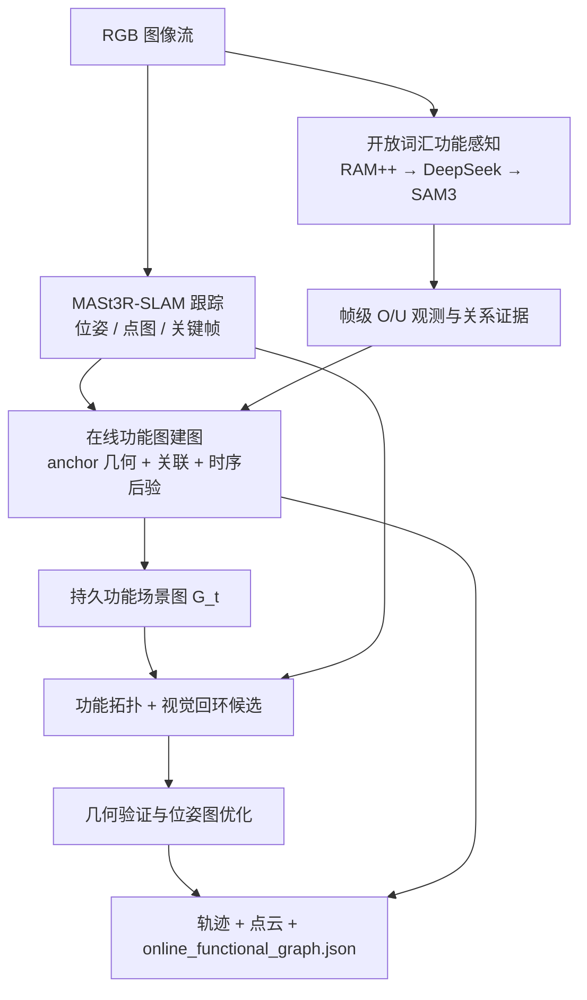
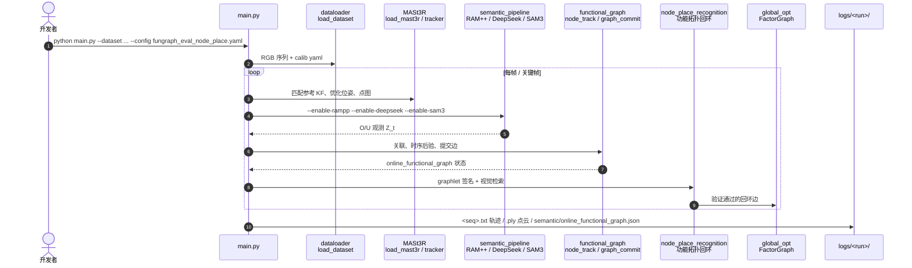

# Functional-SLAM（在线功能场景图 SLAM）

**Functional-SLAM**（*Interaction-Aware Mapping with Online Functional Scene Graphs*，[arXiv:2609.07497](https://arxiv.org/abs/2609.07497)，[代码](https://github.com/Hbelief1998/Functional-SLAM-CoRL_2026)，CoRL 2026）由 **Xinggang Hu、Chenyangguang Zhang、Zihan Zhu、Ruida Zhang、Xiangkui Zhang、Xiangyang Ji**（**清华大学**、**大连理工大学**、**苏黎世联邦理工学院**）提出：在 **MASt3R-SLAM** 几何跟踪之上，把 **开放词汇功能感知** 与 **在线功能 3D 场景图** 写进 SLAM 状态——不仅估计相机轨迹与稠密几何，还持续维护 **物体（O）**、**可操作交互单元（U）** 及其 **功能关系**，并用 **功能拓扑** 辅助回环，服务细粒度操控与交互规划。

## 一句话定义

**把功能 3D 场景图从离线重建推进为 SLAM 在线地图状态：anchor-keyframe 稳住小交互单元，时序后验提交功能边，功能拓扑补视觉回环漏检。**

## 英文缩写速查

| 缩写 | 英文全称 | 简要说明 |
|------|----------|----------|
| SLAM | Simultaneous Localization and Mapping | 同步定位与建图 |
| FSG | Functional Scene Graph | 含物体、交互单元与功能关系的 3D 场景图 |
| O / U | Object / Interaction Unit | 功能图中的物体节点与机器人可操作交互单元 |
| ATE | Absolute Trajectory Error | 绝对轨迹误差（文中 RMSE，毫米级室内） |
| MASt3R | Matching And Stereo 3D Reconstruction | 稠密匹配与点图先验；本文几何 SLAM 骨干 |
| RAM++ | Recognize Anything Model Plus | 图像级开放词汇标签 |
| SAM3 | Segment Anything Model 3 | 概念级分割，定位 O/U 区域 |
| CoRL | Conference on Robot Learning | 论文接收会议 |

## 为什么重要

- **语义 SLAM 仍不够「能动手」：** 认出「水壶」不等于知道 **哪块把手** 该抓才能倒水；功能图显式建模 **交互单元 ↔ 物体** 的功能边。
- **离线功能图跟不上在线探索：** OpenFunGraph、FunGraph、KeySG 等多依赖 **真值/稳定位姿** 或 **离线融合**；机器人进入未知环境时需要 **与 SLAM 同步更新** 的功能地图。
- **小元素 + 位姿漂移是硬组合：** 把手、旋钮尺度小、外观相似、几何支撑弱；世界坐标固定写法在 SLAM 后端优化后易 **关联错乱**——本文用 **anchor-keyframe 局部几何** 与 **功能上下文约束** 专门对付。
- **功能拓扑可反哺定位：** 重复外观、弱纹理场景下纯视觉回环易漏检；稳定功能 graphlet 提供 **对象级 + 功能级** 回环候选，FunGraph3D 上 ATE 较 MASt3R-SLAM **降 16.3%**。
- **工程可复现：** 官方仓含 `main.py`、36 条评测 RGB 序列（HF）、完整配置与 checkpoint 说明（**CC BY-NC-SA 4.0**）。

## 核心信息

| 字段 | 内容 |
|------|------|
| 作者 | Xinggang Hu, Chenyangguang Zhang, Zihan Zhu, Ruida Zhang, Xiangkui Zhang, Xiangyang Ji |
| 机构 | 清华大学；大连理工大学；苏黎世联邦理工学院（ETH Zurich） |
| 出处 | arXiv:2609.07497（2026-09）；CoRL 2026 |
| 代码 | <https://github.com/Hbelief1998/Functional-SLAM-CoRL_2026> |
| 数据集 | <https://huggingface.co/datasets/xg-123/Functional-SLAM-dataset> |
| Demo | <https://www.bilibili.com/video/BV13xbw6NECB/> |
| 输入 | 连续 **RGB** 流（评测序列带标定；真机实验曾用 iPhone 单目无内参模式） |
| 输出 | 关键帧轨迹、稠密点云、**在线功能图 JSON**、功能图叠加 PLY |
| 开源（截至 2026-09-09） | **已开源**：完整推理管线 + HF 数据 + 文档。SAM3 gated；DeepSeek API 需自备密钥 |

> **项目页说明：** 用户提供的 `cosmoh2g.github.io` 为 **CosmoH2G** 另一项目，**非** Functional-SLAM 落地页。本文公开入口以 **GitHub README + arXiv + HF** 为准。

## 方法与核心结构

| 模块 | 作用 |
|------|------|
| **MASt3R-SLAM 跟踪** | 位姿、稠密点图、置信度、关键帧决策；几何目标不变 |
| **开放词汇功能感知** | RAM++ 标签 → DeepSeek 场景相关功能目标 → SAM3 分割；反投影得 O/U 3D support 与帧级关系证据 \(\eta_{ou}\) |
| **Anchor-keyframe 几何** | 每稳定节点绑定 anchor KF，canonical 几何随 SLAM 位姿优化同步读回 |
| **功能上下文节点关联** | \(\phi_{geo}+\phi_{sem}+\phi_{ctx}\) 角色分组匹配（O 对 O、U 对 U），匈牙利一对一 |
| **时序功能边后验** | 多帧 support 累积后才 commit；每 U 只保留最可靠对象归属 |
| **功能拓扑回环** | 从在线图建 graphlet 签名 \(S_G\)、\(S_{FT}\)，与视觉检索候选合并并经几何验证 |

### 流程总览

## 源码运行时序图

官方仓 [Hbelief1998/Functional-SLAM-CoRL_2026](https://github.com/Hbelief1998/Functional-SLAM-CoRL_2026) 入口见 [sources/repos/functional_slam_corl_2026.md](../../sources/repos/functional_slam_corl_2026.md)：

- **最短路径：** clone `--recursive` → 安装 PyTorch CUDA 与子模块 → 下载 MASt3R/RAM++/SAM3 checkpoints → `hf download` 数据集 → 设置 `DEEPSEEK_API_KEY` → README 示例 `main.py` 命令。
- **论文完整配置：** `config/fungraph_eval_node_place.yaml`（功能拓扑回环开启）。
- **实时模式：** scene lock 后仅在关键帧跑语义/功能图 + 降低 SAM3 分辨率（README `--semantic-keyframes-only-after-scene-lock` 等）。

## 工程实践

| 项 | 建议 / 论文设定 |
|----|----------------|
| **何时用** | 需要 **在线** 功能场景图（把手/旋钮级交互语义）并与 **SLAM 位姿** 联合维护；室内 RGB 探索、操控前场景理解 |
| **何时不用** | 只要几何/物体级语义、不需功能边；无法跑 GPU + 多 foundation 模型；不能接受 DeepSeek API 与 SAM3 gated 依赖 |
| **硬件** | 论文 **RTX 3090**；README 开发于 RTX 3090 + CUDA 12.4 + PyTorch 2.5.1 |
| **许可** | 仓库 **CC BY-NC-SA 4.0**（非商用）；部署前核对 SAM3 / MASt3R 等 thirdparty 许可 |
| **评测数据** | HF 上 18×FunGraph3D + 18×SceneFun3D 裁剪 `rgb_SLAM`；`config/fungraph_*` / `scenefun3d_*` 标定 yaml 随仓发布 |
| **输出对接** | `online_functional_graph.json` 可接操控规划或 VLM；轨迹 TUM 格式便于与经典 SLAM 工具对比 |

## 实验与评测（论文报告摘要）

| 维度 | 设置 | 主要结论 |
|------|------|----------|
| **定位 FunGraph3D** | vs MASt3R-SLAM 等 | ATE RMSE **降 16.3%**；功能拓扑回环纠正重复外观/弱纹理漂移 |
| **定位 SceneFun3D** | 纹理丰富、回环少 | 平均 ATE **33.25 mm**，与几何骨干 **相当** |
| **功能图节点 FunGraph3D（Ours pose）** | vs OpenFunGraph / FunGraph / KeySG | Overall Nodes R@3 **64.55%**（次优离线法 Under GT pose 约 57% 量级但依赖真值） |
| **功能图三元组 FunGraph3D（Ours pose）** | 同上 | Triplets R@5 **41.10%** vs OpenFunGraph **11.64%** |
| **运行时** | vs 离线功能图 | **0.38 FPS** vs 0.02–0.06 FPS；纯 SLAM 基线更快但 **无功能图** |
| **消融 FunGraph3D** | 去节点稳定 / 时序边 / 功能回环 | ATE 19.0 / 17.9 / 19.7 → **16.5 mm**；Triplet R@5 最高 **41.10%**（完整系统） |
| **真机** | iPhone 手持室内 | 极端遮挡与稀疏观测下仍可跟踪并在线建功能图（定性） |

## 结论

**Functional-SLAM 的关键动作是把「功能场景图」升格为与位姿、几何并列的 SLAM 状态，并用 anchor 几何 + 时序后验 + 功能拓扑回环解决在线维护与定位两条线。**

1. **真影响：在线功能图** — 相对离线 OpenFunGraph 等同设定 Ours pose，FunGraph3D 节点/三元组 recall **大幅领先**（如 Triplets R@5 **41.10%** vs 11.64%）。
2. **真影响：anchor-keyframe 节点稳定** — 去掉后 ATE 升至 **19.0 mm**、三元组 recall 下降；小交互单元在位姿优化下必须用局部锚定几何。
3. **真影响：时序边后验** — 单帧提交功能边在遮挡/竞争下极易错配；去掉后三元组 R@5 仅 **31.51%**。
4. **真影响：功能拓扑回环** — FunGraph3D ATE 从 **19.7 → 16.5 mm**；重复外观场景补视觉检索漏检。
5. **次要代价：算力与依赖** — 0.38 FPS、多模型 + LLM API；比纯 MASt3R-SLAM 慢，但比离线功能图快一个数量级。
6. **部署读法：** SceneFun3D 上定位增益有限时仍可用功能图；位姿漂移大时功能图质量随几何骨干恶化（论文坦诚局限）。
7. **工程读法：可跑** — `main.py` + HF 数据 + README checkpoint 清单；注意 SAM3 gated 与 DeepSeek 环境变量。

## 与其他工作对比

| 对照 | 差异读法 |
|------|----------|
| OpenFunGraph / FunGraph / KeySG | **离线** 功能图：依赖稳定 3D 融合或 GT 位姿；Ours pose 下 recall 崩塌。Functional-SLAM **在线** 维护并显著领先 |
| [vS-Graphs](./paper-vs-graphs-visual-slam-scene-graph.md) | ORB-SLAM3 上 **建筑/房间** 分层场景图 + BA；无 O/U 功能边 |
| MASt3R-SLAM | 本文 **几何骨干**；Functional-SLAM 加功能图与拓扑回环，FunGraph3D ATE **更优** |
| [SLAMFormer-∞](./paper-slamformer-infinity.md) | 学习型 **稠密单目** 长程 SLAM；不建功能交互图 |
| [FunRec 索引](./paper-sa-2604-05621-funrec-reconstructing-functional-3d-scenes-from.md) | 第一人称 **离线** 功能 3D 数字孪生；问题相邻但范式为重建而非 SLAM 状态 |

## 局限与风险

- **依赖视觉跟踪与开放词汇感知：** 大帧间间隔、无纹理、运动模糊时位姿与功能图 **同时退化**（论文 Limitations）。
- **SceneFun3D + Ours pose：** 细粒度元素对位姿误差敏感，节点 recall 不及部分 **GT pose 离线法**。
- **外部依赖：** SAM3 需 HF 审批；DeepSeek 部署名可配置但 API 成本与延迟需自行评估。
- **许可：** CC BY-NC-SA 4.0 限制商用集成。

## 关联页面

- [vS-Graphs](./paper-vs-graphs-visual-slam-scene-graph.md) — 在线 SLAM + 可优化 3D 场景图（建筑语义）
- [SLAMFormer-∞](./paper-slamformer-infinity.md) — 学习型稠密单目 SLAM 对照
- [ORB-SLAM3](./orb-slam3.md) — 经典稀疏视觉 SLAM 基线
- [State Estimation](../concepts/state-estimation.md) — 位姿估计在栈中的位置
- [导航·SLAM 开源栈总览](../overview/navigation-slam-autonomy-stack.md) — 移动机器人 SLAM 分层选型
- [Manipulation](../tasks/manipulation.md) — 功能图服务的下游操控任务

## 参考来源

- [functional_slam_arxiv_2609_07497.md](../../sources/papers/functional_slam_arxiv_2609_07497.md) — 论文摘录与开源核查
- [functional_slam_corl_2026.md](../../sources/repos/functional_slam_corl_2026.md) — 官方仓归档
- Hu et al., *Functional-SLAM* — <https://arxiv.org/abs/2609.07497>
- 代码：<https://github.com/Hbelief1998/Functional-SLAM-CoRL_2026>

## 推荐继续阅读

- GitHub README（安装与示例命令）：<https://github.com/Hbelief1998/Functional-SLAM-CoRL_2026>
- 评测数据集：<https://huggingface.co/datasets/xg-123/Functional-SLAM-dataset>
- Demo 视频：<https://www.bilibili.com/video/BV13xbw6NECB/>
- MASt3R-SLAM 几何骨干：<https://github.com/rmurai0610/MASt3R-SLAM>
