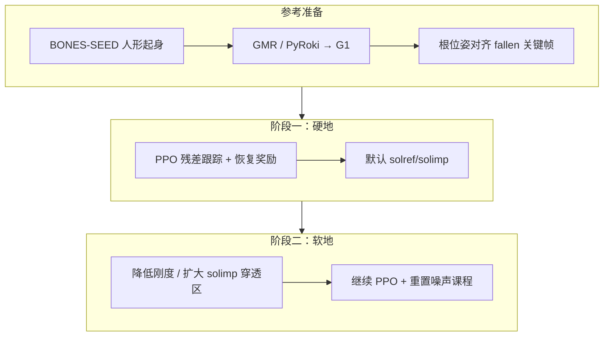
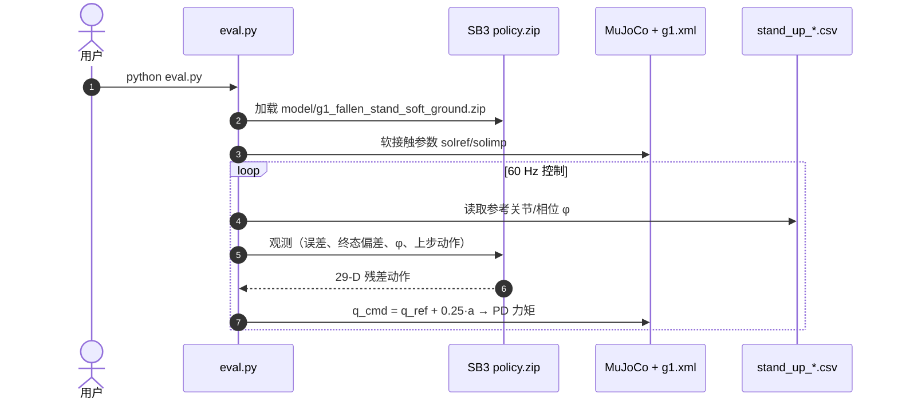

# G1 Compliant-Surface Stand-Up：软地面参考引导起身

**Demonstration-Guided Humanoid Stand-Up on an Emulated Deformable Surface**（[arXiv:2608.20852](https://arxiv.org/abs/2608.20852)，[代码/权重](https://github.com/andireposit/Stand-Up-Motion-on-Compliant-Surface-for-Humanoid)）由 **印度理工学院坎普尔分校（IIT Kanpur）** 机械工程系提出：在 **Unitree G1（29-DoF）** 上，用 **硬地采集并重定向的人形起身演示** 作参考，通过 **PPO 残差关节控制** 与 **显式恢复奖励**，经 **硬地→软地两阶段训练**，在 MuJoCo **刚性体软接触模型** 下完成 fallen-to-standing。

## 一句话定义

**把人形硬地起身演示经残差 RL 与恢复奖励落到 G1，再用 MuJoCo solref/solimp 软接触二阶段微调，使同一策略在仿真软地面也能站起。**

## 英文缩写速查

| 缩写 | 英文全称 | 简要说明 |
|------|----------|----------|
| PPO | Proximal Policy Optimization | 本工作使用的 on-policy 策略梯度算法 |
| G1 | Unitree G1 Humanoid | 宇树 29-DoF 人形平台 |
| GMR | General Motion Retargeting | 人体动作到机器人的运动重定向工具链 |
| PD | Proportional–Derivative | 关节级比例–微分跟踪控制 |
| GAE | Generalized Advantage Estimation | PPO 中优势函数估计方法 |
| CoM | Center of Mass | 质心，平衡与接触分析核心量 |

## 为什么重要

- **填补合规地面起身空白：** 多数起身 RL（HoST、SD-AMP 等）假设刚性地或仅轻度地形 DR；本文把 **显著柔度**（~40 mm 穿透）当作主挑战而非噪声项。
- **演示可来自硬地：** 降低软地 MoCap 采集成本——硬地演示 + 仿真软接触参数迁移。
- **奖励设计可证：** 消融表明 **仅参考跟踪不足以起身**，需骨盆高度、躯干竖直、终态站姿等 **显式恢复项**。
- **与 HoST 互补：** [HoST](./paper-host-humanoid-standingup.md) 无参考、多地形初始姿态；本文 **强参考跟踪 + 软地物理参数课程**，面向「同一演示形态在软地仍成立」。

## 核心信息

| 项 | 内容 |
|----|------|
| **机构** | 印度理工学院坎普尔分校（IIT Kanpur），机械工程系 |
| **硬件** | Unitree G1，29-DoF |
| **参考数据** | BONES-SEED 经 GMR/PyRoki 重定向；两条起身序列 |
| **仿真** | MuJoCo 软接触；硬地默认参数 → 软地 **solref=(0.1,1), solimp=(0.0,0.95,0.02)** |
| **控制** | 60 Hz 策略 + 残差 scale **0.25** + 关节 PD |
| **开源** | **部分开源** — `eval.py`、MuJoCo 模型、参考 CSV、**软地 checkpoint**；完整训练代码 **未发布** |

## 流程总览

## 源码运行时序图

仓库发布 **评测** 而非完整训练栈：

> **注：** 完整 PPO 训练管线（20 并行 env、奖励权重课程等）见论文；**截至 2026-08-25 仓库未发布训练脚本**。

## 核心机制（归纳）

### 残差参考跟踪

\[
\mathbf{q}^{\mathrm{cmd}}_t = \mathbf{q}^{\mathrm{ref}}_t + 0.25 \cdot \mathbf{a}_t
\]

观测含仿真/参考状态、跟踪误差、相对终态站姿偏差、归一化相位 \(\phi_t\) 与上步动作。

### 奖励结构

- **跟踪：** 关节位/速、根平面位、骨盆高、根姿态。
- **恢复：** 终态站姿、躯干竖直、站立骨盆高度（相位加权由跟踪转向完成）。
- **正则：** 脚滑、动作幅值、平滑度。

### 软地物理含义

降低 `solref`、调整 `solimp` 使支撑力 **延迟** 且允许 **更大穿透**（报告最大约 **40 mm**），迫使策略在接触丰富阶段适应变形地面。

## 实验读法

| 指标 | 结果 |
|------|------|
| 终态骨盆高度 | **0.792 m**（目标 0.794 m） |
| 终态竖直度 | **0.991**（最大 1.000） |
| 最大接触穿透 | **~40 mm** |
| 序列数 | 两条起身轨迹均在硬/软地达标 |

## 结论

**这篇工作的关键是把「软地」建模成可课程化的 MuJoCo 接触参数，并用显式恢复奖励补上纯参考跟踪在起身任务上的不足。**

- **决定性因素：** 阶段二 **solref/solimp 软化** + **恢复奖励**；消融证明无恢复项则跟踪参考仍失败。
- **演示来源：** 硬地 MoCap → 重定向 → 软地适配，降低软地数据采集门槛。
- **与 HoST 分工：** HoST 无参考、多初始姿态真机；本文 **强时序参考 + 合规地面仿真**，尚未报告真机软地验证。
- **复现入口：** `eval.py` + 已发布 **软地权重** 可复现论文代表策略；要改奖励或重训需等待训练代码或自实现 PPO 栈。
- **部署注意：** 仅仿真验证；软地参数需与目标泡沫/草地等物理对齐才能外推。
- **开源：** **部分** — 评测与权重已发布。

## 与其他工作对比

| 维度 | 本文（G1 软地） | [HoST](./paper-host-humanoid-standingup.md) | [SD-AMP](./paper-unified-walk-run-recovery-sdamp.md) |
|------|----------------|---------------------------------------------|------------------------------------------------------|
| 运动先验 | **人形演示参考** | 无 MoCap 参考 | AMP 双判别器 |
| 地形重点 | **仿真软接触** | 多刚性地形 + 真机 | 走/跑/起身统一 |
| 训练阶段 | 硬地 → 软地 **两阶段** | 四地形课程 + 多 critic | 重力门控 AMP |
| 真机 | 未报告 | **G1 真机** | **G1 真机** |
| 开源 | 评测+权重 | 完整训练代码 | 完整训练代码 |

## 局限与风险

- **仿真软接触 ≠ 真机泡沫/草地：** 仅用 MuJoCo 参数 emulate，未验证实物柔度。
- **训练未开源：** 复现完整方法需自搭 PPO 与奖励实现。
- **单策略单轨迹：** 每条参考轨迹单独训练策略，非统一多轨迹策略。

## 工程实践

| 项 | 说明 |
|----|------|
| 运行 | `pip install -r requirements.txt` → `python eval.py` |
| 权重 | `model/g1_fallen_stand_soft_ground.zip` + vecnormalize |
| 参考 | `stand_up_lying_R_002__A475_new.csv` |
| 视频 | [YouTube 演示](https://youtu.be/c04fnMCDdd8) |

## 关联页面

- [Balance Recovery](../tasks/balance-recovery.md)、[Locomotion](../tasks/locomotion.md)
- [HoST](./paper-host-humanoid-standingup.md)、[SD-AMP](./paper-unified-walk-run-recovery-sdamp.md)
- [Unitree G1](./unitree-g1.md)、[Sim2Real](../concepts/sim2real.md)

## 参考来源

- [论文摘录](../../sources/papers/g1_compliant_surface_standup_arxiv_2608_20852.md)
- [GitHub 仓库归档](../../sources/repos/stand_up_compliant_surface_humanoid.md)

## 推荐继续阅读

- [arXiv:2608.20852](https://arxiv.org/abs/2608.20852) — 完整奖励表与消融
- [HoST（arXiv:2502.08378）](https://arxiv.org/abs/2502.08378) — 无参考多姿态起身对照
- [仓库 model/ 目录](https://github.com/andireposit/Stand-Up-Motion-on-Compliant-Surface-for-Humanoid/tree/main/model) — 软地 checkpoint
