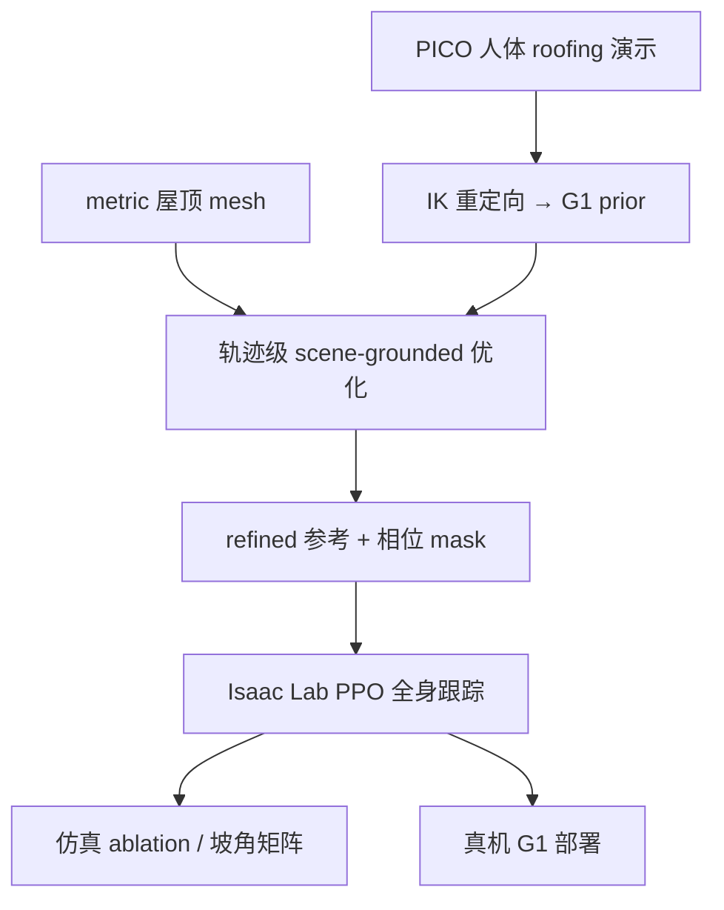

# G1 斜坡全身作业 Locomotion（arXiv:2609.20558）

**Learning Slope-Adaptive Whole-Body Locomotion for Humanoid Robots in Roofing Construction**（佛罗里达大学 University of Florida，[arXiv:2609.20558](https://arxiv.org/abs/2609.20558)，2026-09-17）面向**屋顶施工**场景：在 metric 坡面 mesh 上把人体 roofing 演示变成 Unitree G1 可执行的 **loco-manipulation** 原语，强调支撑、作业 clearance 与体 mesh 非穿透。

## 一句话定义

**坡面上钉枪/锤击不是「跟着 retarget 走」——先把脚和手的语义钉在屋顶 mesh 上，再用相位门控 RL 把参考扛过跟踪误差。**

## 英文缩写速查

| 缩写 | 英文全称 | 简要说明 |
|------|----------|----------|
| RL | Reinforcement Learning | 强化学习 |
| PPO | Proximal Policy Optimization | 本文仿真训练算法 |
| MPJPE | Mean Per Joint Position Error | 骨盆系 14 link 平均位置误差 |
| IK | Inverse Kinematics | 人体→G1 重定向 |
| VR | Virtual Reality | PICO 追踪采集人体演示 |
| SONIC | — | 对照零样本全身遥操作基线（论文设定） |

## 核心信息

| 字段 | 内容 |
|------|------|
| **机构** | 佛罗里达大学（University of Florida）土木与海岸工程系 |
| **作者** | Songyang Liu、Shuai Li（通讯） |
| **平台** | Unitree G1（29-DoF）；Isaac Lab 4096 并行仿真 |
| **采集** | PICO 头显 + 手柄 + 踝追踪；稀疏人体 roofing 演示 |
| **开源** | **确认未开源**（截至 2026-09-19） |
| **仿真** | 钉枪/锤击/侧推 clearance **0.256–0.531 cm**；各任务 **3/3** 成功 |
| **真机** | 实验室 ~11.8° 坡垫； uphill/钉枪/锤/弯身；MPJPE **27.6–79.9 mm** |

## 为什么重要

- **Construction-oriented 全身原语：** 不只 locomotion——钉枪、锤击、侧推、弯身 low-reach 在同一 **scene-grounded** 框架下定义支撑与作业关系。
- **Retarget 不够：** 人体与 G1 拓扑/比例不同；即使动作「像」，脚/手相对坡面仍可能错——需要 **metric roof mesh** 做轨迹级优化。
- **参考可行 ≠ 闭环可行：** 轨迹优化后仍用 **相位门控 clearance + mesh 非穿透奖励** 在 RL 里 enforcement，对应真机跟踪误差。

## 方法

| 阶段 | 机制 |
|------|------|
| **采集** | PICO 稀疏追踪 → 人体 roofing 动作 + 任务时序语义 |
| **重定向** | IK 匹配关键点到 G1；得初始 robot motion prior |
| **Scene-grounded 优化** | 屋顶对齐系；推断 foot-support；关联 work phase 与 hand–surface 距离；多点支撑、作业 clearance、体 mesh 非穿透、保形、平滑； kneeling 含规划膝接触 |
| **RL 跟踪** | Isaac Lab PPO；标准 motion tracking + **相位门控** task-clearance & mesh-nonpenetration |
| **部署** | 仿真策略零样本上真 G1（安全 hoist + 人工急停） |

### 流程总览

### 源码运行时序图

**不适用**（截至 2026-09-19：无官方代码/项目页）。

## 工程实践

| 项 | 读法 |
|----|------|
| 训练配置 | 4096 env；200 Hz sim / 50 Hz policy；30k PPO iters；摩擦随机 [0.3,1.6] static / [0.3,1.2] dynamic |
| 钉枪 ablation | 五档 **A** raw retarget → **M** 手动 offset → **B** 支撑 → **C** 参考任务 → **D** 执行感知 RL |
| 真机平台 | Matladin 折叠坡垫 ~11.8°；**非完整自主施工**，仅为 motion primitive 验证 |
| 与 HumoSlope | [HumoSlope](./paper-humoslope-physics-guided-slope-locomotion.md) 盲 **locomotion** 至 32°；本文 **loco-manip + 语义坡面** ~12° 实验室 |

## 实验与评测

| 轴 | 报告口径 |
|----|----------|
| 多动作库 | 完整 roofer motion library tracking + 训练坡角覆盖矩阵 |
| 任务成功 | support / work-clearance / nonpenetration 全 seed 满足 |
| Baseline | 纯 reward RL、零样本 SONIC 遥操作 |
| 真机 | 基座系 14 link MPJPE；无 sim-to-real policy 微调 |

## 结论

**本文真影响指标是「坡面语义约束下的 clearance 厘米级 + 真机 <80 mm MPJPE」——价值在 scene-grounded 参考 + 执行期 enforcement，不是裸 retarget。**

1. **先优化参考再 RL：** C→D 的增益说明 **轨迹级 task semantics** 与 **相位门控奖励** 缺一不可。
2. **Clearance 读法：** 0.26–0.53 cm 是 palm–roof 法向距离；换工具/手模要重标 \(d_w\)。
3. **坡角覆盖：** 训练坡角矩阵决定外推——实验室 ~12° 真机不代表通用屋顶 pitch。
4. **对照 HumoSlope：** 若要 **盲爬陡坡** 看 HumoSlope；若要 **坡面作业工具交互** 看本文。
5. **开源：** 无代码——复现需自建 roof mesh 优化器 + Isaac Lab tracking 奖励。
6. **安全：** 真机有 hoist/急停——工程部署勿去掉人机安全层。

## 局限与风险

- **场景专用：** roofing mesh 与任务语义强绑定；换行业需重新定义 work phase 与 clearance。
- **稀疏 PICO：** 跟踪噪声会进 retarget；优化可部分吸收但非万能。
- **真机证据有限：** 初步 deployment，非长期自主施工。
- **误区：** MPJPE 低不等于 clearance 合格——需分任务看 work phase 指标。

## 与其他工作对比

| 对照 | 差异读法 |
|------|----------|
| [HumoSlope](./paper-humoslope-physics-guided-slope-locomotion.md) | 同 G1 坡面；HumoSlope **纯 locomotion + 本体盲**；本文 **whole-body 工具作业 + metric scene** |
| [Humanoid Locomotion](../tasks/humanoid-locomotion.md) | 可挂接为 **construction / slope loco-manip** 样本 |
| [Unitree G1](./unitree-g1.md) | 29-DoF 平台与 Isaac Lab 栈一致 |
| 纯 teleop / SONIC | 本文强调 **retarget+优化+RL** 相对零样本遥操作的任务 clearance 优势 |

## 关联页面

- [Humanoid Locomotion](../tasks/humanoid-locomotion.md)
- [Loco-Manipulation](../tasks/loco-manipulation.md)
- [Unitree G1](./unitree-g1.md)
- [Isaac Lab](./isaac-lab.md)
- [HumoSlope](./paper-humoslope-physics-guided-slope-locomotion.md)
- [PPO](../methods/ppo.md)

## 参考来源

- [g1_slope_adaptive_roofing_arxiv_2609_20558.md](../../sources/papers/g1_slope_adaptive_roofing_arxiv_2609_20558.md)
- [arXiv:2609.20558](https://arxiv.org/abs/2609.20558)

## 推荐继续阅读

- [arXiv PDF](https://arxiv.org/pdf/2609.20558)
- [HumoSlope 坡面 locomotion 对照](./paper-humoslope-physics-guided-slope-locomotion.md)
