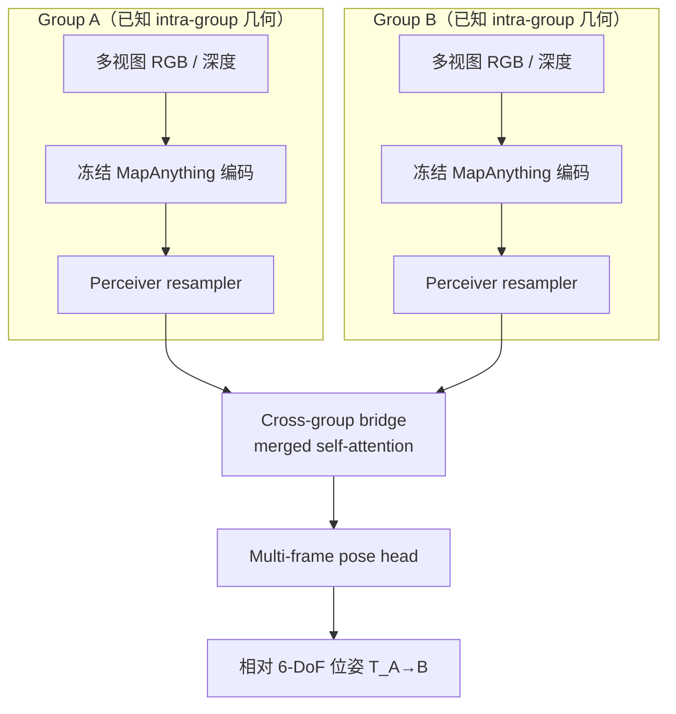
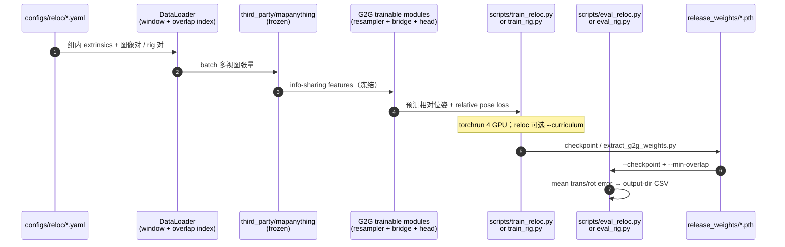

# G2G：利用组内几何做组间位姿估计

**G2G**（*Exploiting Intra-Group Geometry for Inter-Group Pose Estimation*，[arXiv:2606.08284](https://arxiv.org/abs/2606.08284)，[项目页](https://weiyufei0217.github.io/G2G/)，[代码](https://github.com/WeiYuFei0217/G2G)）由 **浙江大学** 工业控制技术国家重点实验室（Yufei Wei、Shuhao Ye、Chenxiao Hu、Rong Xiong、Yue Wang）与 **浙江人形机器人创新中心**、**杭州师范大学**（Yanmei Jiao†）提出：在 **冻结 MapAnything**（DINOv2 ViT-L/14，539M）上，仅用 **~32M** 可训练参数（Perceiver resampler + 跨组合并 self-attention bridge + 多帧 pose head）估计 **两组多视图图像之间的相对 6-DoF 位姿**，且 **仅用 relative pose 监督**——同一架构覆盖 **跨序列重定位** 与 **多相机 rig 里程计** 两任务。

## 英文缩写速查

| 缩写 | 英文全称 | 简要说明 |
|------|----------|----------|
| G2G | Group-to-Group | 本文：两组已知组内几何的多视图集合之间的相对位姿估计 |
| 6-DoF | Six Degrees of Freedom | 三维旋转 + 三维平移；组间对齐的位姿自由度 |
| VO | Visual Odometry | 视觉里程计；可为每组提供 intra-group 几何来源之一 |
| FoV | Field of View | 视场；项目页用 overlap 分布刻画跨序列难度（NCLT median **0.24** 最难） |
| SE(3) | Special Euclidean Group | 刚体位姿群；相对位姿回归的自然输出空间 |

## 为什么重要

- **问题被写清楚：** 多视图基础模型已把 **组内标定/VO 几何** 融进特征，但多数方法仍把全部视图 **flatten 成无结构集合**；G2G 把 **cross-group reasoning** 单独建模，且 **冻结骨干** 避免微调 collapse 3D 表征。
- **两任务统一：** **Cross-sequence relocalization**（不同时间两短序列对齐）与 **multi-camera rig odometry**（相邻时刻两刚性 rig）共享同一 head——对 **多相机会话地图拼接、跨季节重定位、sim-to-real 迁移** 有直接接口。
- **参数与监督极省：** 可训练 **<6%**（32M / 539M），监督 **只有 relative pose**；基线则按原文各自全量监督重训，对比更公平地突出 **跨组结构先验**。
- **低重叠鲁棒性：** 项目页显示在 **FoV overlap 下降** 时，G2G 相对 VGGT、LoMa、CoViS-Net、Reloc3R 等 **退化最缓**，NCLT 跨季节等 **median overlap 0.24** 场景尤为关键。
- **工程可复现：** 官方仓 vendored **MapAnything v1.0.1 large/1024**、十组权重、HM3D 预处理 pipeline 与 `train/eval` 脚本齐全（**CC BY-NC 4.0**）。

## 核心信息

| 字段 | 内容 |
|------|------|
| 作者 | Yufei Wei*, Shuhao Ye*, Chenxiao Hu, Yiyuan Pan, Dongyu Feng, Rong Xiong, Yue Wang, Yanmei Jiao† |
| 机构 | 浙江大学（ZJU）；浙江人形机器人创新中心；杭州师范大学 |
| 出处 | arXiv:2606.08284（2026-06-06；v3 2026-09-17） |
| 项目 | <https://weiyufei0217.github.io/G2G/> |
| 输入 | 两组多视图 RGB（+ 深度/组内 extrinsics 经预处理与骨干编码）；已知 **intra-group geometry** |
| 输出 | 组间 **相对 6-DoF 位姿** |
| 冻结骨干 | MapAnything + DINOv2 ViT-L/14（539M） |
| 可训练 | Perceiver resampler + cross-group bridge + pose head（**~32M**） |
| 开源（2026-09-21） | **已开源**：代码 + 外站权重；骨干 checkpoint ~2.1 GB 需单独下载 |

## 流程总览

## 源码运行时序图

**复现路径：** 安装 vendored MapAnything → 下载 **large/1024** 骨干至 `map-anything-model/` → 下载 G2G 权重至 `release_weights/` → 替换 config 中 `/path/to/...` → `eval_reloc.py` 或 `eval_rig.py`。HM3D 等需先跑 `data_preprocessing/` 六步生成 overlap 与 window index。

## 两大任务设定

| 任务 | 场景 | 典型配置 |
|------|------|----------|
| **Cross-sequence relocalization** | 不同时间采集的两段短序列，需对齐到同一坐标系 | HM3D、TartanGround、NCLT、ZJH |
| **Multi-camera rig odometry** | 相邻时刻两个 **刚性多相机 rig** 的 inter-rig 运动 | HM3D 8/4-cam、TartanGround 4-cam、NCLT 5-cam、ZJH 4-cam |

**与 SLAM 栈的分工：** G2G 假设 **每组内部几何已由 VO / 标定 / 预建地图给出**；它解决 **组与组之间** 的相对位姿，而非从单目流在线估计 full SLAM。可与 [UniSim-SLAM](./paper-unisim-slam.md)、[Glob3R](./paper-glob3r.md) 等 **前后衔接**（局部几何 + 全局/跨会话对齐）。

## 实验要点（项目页 / README）

| 维度 | 要点 |
|------|------|
| **数据集** | HM3D（室内 sim）、TartanGround（户外 sim）、NCLT（真实跨季节）、ZJH（sim-to-real） |
| **定量** | 项目页 Table 1（reloc）/ Table 2（rig）报告四数据集 / 六配置 **mean errors**；G2G 相对重训基线 **SOTA 级** |
| **Overlap 曲线** | NCLT median FoV overlap **0.24**；低 overlap 区间 G2G rotation/translation error 增长 **最缓** |
| **Qualitative** | ZJH 墙两侧弱直接重叠仍轨迹对齐；NCLT 跨季节 residual **1.12° / 5.3 cm** |
| **基线族** | VGGT、Reloc3R、LoMa、CoViS-Net、MA-AB oracle 等（各方法 metric 对齐方式见项目页脚注） |

## 结论

**G2G 的核心是把「组内几何已知」写进跨组位姿估计的结构里：冻结 MapAnything 保 3D 表征，32M 跨组模块专做 group-to-group 推理，relative pose 单监督即可统一 relocalization 与 rig odometry。**

- **真影响：跨组结构先验** — 不再 flatten 全部视图；Perceiver + merged self-attention bridge 显式连接两组 resampled token，低 overlap（NCLT **0.24**）下仍最接近 oracle 曲线。
- **真影响：冻结骨干 + 轻量头** — 32M（<6%）相对全量微调，避免 collapse；监督只需 **relative pose**，工程上易叠在已有 MapAnything 特征上。
- **真影响：两任务一架构** — reloc 与 rig odometry 共用 head，十组权重覆盖 sim / real / cross-season，ZJH sim-to-real 与 NCLT 跨季节定性案例可部署读法。
- **次要代价：组内几何外生** — 依赖 VO、rig 标定或预处理 pipeline；不是 blind monocular SLAM 替代品。
- **次要代价：骨干版本钉死** — 必须用 vendored **MapAnything v1.0.1 large/1024**；2025-12 后 HF **giant** 权重 **不兼容**。
- **部署读法：** 多相机会话地图对齐、跨季节 relocalization、rig 轨迹拼接优先；端到端导航仍要接经典 SLAM/VIO 与回环。
- **工程读法：NC 许可 + 大权重** — CC BY-NC 4.0；骨干 ~2.1 GB + 十组权重外站下载，但 `eval_*` 与 `examples/` 可快速 sanity check。

## 工程实践与开源状态

**截至 2026-09-21 项目页与 GitHub 核查：已开源。**

| 组件 | 状态 | 入口 |
|------|------|------|
| 训练/评测代码 | **已发布** CC BY-NC 4.0 | [GitHub](https://github.com/WeiYuFei0217/G2G) |
| Vendored MapAnything | **已包含** v1.0.1 large/1024 | `third_party/mapanything/` |
| G2G 十组权重 | **已发布**（外站） | Baidu / Google Drive / [HF feixue22/G2G](https://huggingface.co/feixue22/G2G) |
| 冻结骨干 checkpoint | **已发布**（~2.1 GB，外站） | 同上下载包 → `map-anything-model/` |
| 数据预处理 | **已提供** | `data_preprocessing/README.md`（HM3D 六步） |
| Sanity 样例 | **已提供** | `examples/` bundle |

**局限：** **非商用** 许可；**组内 extrinsics 必须已知**；config 默认占位路径需手动替换；HM3D 等预处理较重；与 full SLAM 栈相比 **不负责** 在线前端、稠密建图或回环检测。

## 与其他工作对比

| 对照 | 差异读法 |
|------|----------|
| VGGT / Reloc3R | 多视图 foundation 系；G2G **显式两组结构** + **冻结骨干**，低 overlap 退化更缓 |
| LoMa / CoViS-Net | 学习型 relocalization 基线；G2G 利用 **intra-group geometry** 而非无结构 view set |
| [UniSim-SLAM](./paper-unisim-slam.md) | **在线 SLAM** 前后端 + Sim(3) 因子图；G2G 专注 **离线/批式组间相对位姿** |
| [Glob3R](./paper-glob3r.md) | **离线全局 SfM** 精炼；G2G 面向 **两 group 相对对齐** 与 rig 里程计 |
| [VGG-T³](./paper-vgg-ttt.md) | VGGT **线性时间离线重建**；G2G 用 MapAnything 特征做 **跨组 pose**，问题设定不同 |

## 局限与风险

- **不是 full SLAM：** 无在线前端、回环与稠密地图维护；输入假设 **组内几何已解**。
- **MapAnything 版本敏感：** giant 权重 tensor shape 不兼容；复现必须跟 README 钉死 **large/1024**。
- **评测协议异构：** 项目页注明 VGGT up-to-scale、Reloc3R Procrustes-aligned 等；跨方法比 absolute 数值需谨慎。
- **NC 许可：** 商用机器人产品需法务评估。

## 关联页面

- [State Estimation](../concepts/state-estimation.md) — 视觉几何与位姿估计在 autonomy 链上游
- [状态估计知识链](../overview/hub-state-estimation.md) — SLAM / relocalization 入口
- [导航·SLAM 开源栈总览](../overview/navigation-slam-autonomy-stack.md) — 经典与学习型视觉栈分层
- [SE(3) Representation](../formalizations/se3-representation.md) — 6-DoF 位姿表示与损失
- [UniSim-SLAM](./paper-unisim-slam.md) — 前馈 SLAM + Sim(3) 图优化对照
- [Glob3R](./paper-glob3r.md) — 离线全局 SfM 对照
- [VGG-T³](./paper-vgg-ttt.md) — VGGT 系几何基础模型对照

## 推荐继续阅读

- 论文 PDF：<https://arxiv.org/pdf/2606.08284>
- 交互重建 Viewer 与完整指标表：<https://weiyufei0217.github.io/G2G/>
- MapAnything 上游：<https://github.com/facebookresearch/map-anything>

## 参考来源

- [G2G 论文归档（arXiv:2606.08284）](../../sources/papers/g2g_arxiv_2606_08284.md)
- [G2G 项目页归档](../../sources/sites/g2g-weiyufei0217-github-io.md)
- [G2G 官方仓库归档](../../sources/repos/g2g.md)
- Wei et al., *G2G* — <https://arxiv.org/abs/2606.08284>
- 项目页：<https://weiyufei0217.github.io/G2G/>
- 代码：<https://github.com/WeiYuFei0217/G2G>
