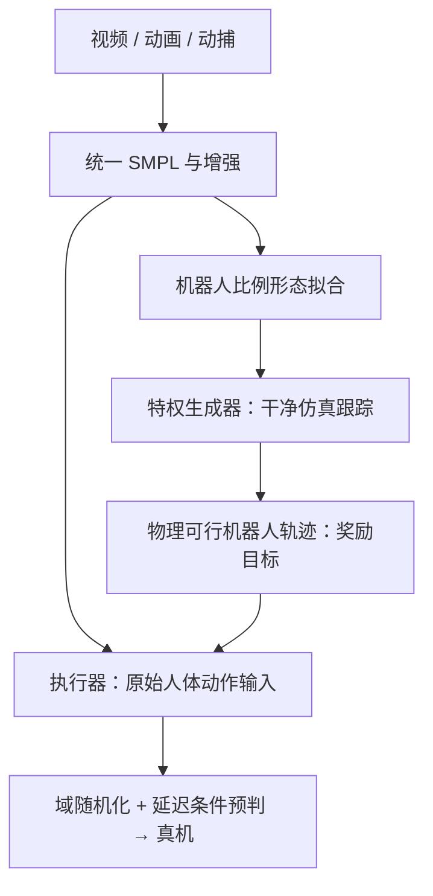

# GAE：General Action Expert for Real-Time Humanoid Teleoperation

## 一句话定义

**GAE** 是让人形机器人实时模仿操作员全身动作的运动控制框架：离线用生成器清洗并适配人类动作，执行器直接接收人体动作，在部署时按实际延迟预判。

## 英文缩写速查

| 缩写 | 英文全称 | 简要说明 |
|------|----------|----------|
| GAE | General Action Expert | 本文全身遥操作框架；不同于 Geometric Autoencoder |
| SMPL | Skinned Multi-Person Linear Model | 统一人体动作表示及机器人比例代理骨架 |
| PPO | Proximal Policy Optimization | 生成器与执行器的策略训练算法 |
| RoPE | Rotary Position Embedding | 通过人体动作 token 的时间索引偏移指定预判时域 |
| PD | Proportional-Derivative | 低层执行策略给出的目标关节位置 |
| SR | Success Rate | 整段动作跟踪成功率，非单帧误差 |

## 为什么重要

对全身遥操作，**动作覆盖广**与**人机同步快**是两个不同难题。直接拿嘈杂、形态不匹配的人类动作，在强域随机化下训练部署策略，会把参考质量和动力学扰动混在同一个优化问题里。GAE 把它们拆开，再把通信与执行延迟显式作为控制输入。

## 核心信息

| 项 | 内容 |
|----|------|
| 论文 | [arXiv:2609.34233](https://arxiv.org/abs/2609.34233)，2026-09-28 |
| 作者机构 | 西湖机器人（Westlake Robotics）、西湖大学（Westlake University） |
| 动作数据 | 视频 / 动画 / 动捕，统一 SMPL 后镜像、拼接、上下身重组；超过 **1 万小时** |
| 模型与仿真 | 生成器、执行器均约 **852M 参数**；Isaac Lab |
| 输入 / 输出 | 本体状态 + 人体动作目标（及延迟）→ 各关节目标位置 → 低层 PD |
| 控制频率 | 论文所述策略 **50 Hz**，一帧预判为 **20 ms** |
| 真机 | Unitree G1；Westlake O1 经形态专用微调 |
| 开放程度 | [项目页核查](../../sources/sites/gae-general-action-expert.md)：截至 2026-10-02 未列算法代码、权重或数据下载 |

## 方法：先生成可行轨迹，再训可部署控制器

- **生成器**使用特权状态及未来目标帧，在干净仿真中跟踪形态拟合参考，rollout 得到机器人可行轨迹。
- **执行器**使用机器人可部署本体观测与人体动作目标；生成轨迹只用于计算跟踪奖励。课程式域随机化逐步加入动力学差异、观测噪声和外力。部署时无需在线运行生成器或机器人轨迹重定向，但人体动作仍须被观测并整理为策略所需格式。
- **同步**：真实人体目标到机器人有端到端延迟 `τ`。执行器学习 `π(a | 本体状态, 延迟人体目标, τ)`，训练时对齐当前人体动作的奖励；RoPE 时间索引偏移表示预判时域，部署可依据测得延迟调节。预判是**动作趋势估计**，不能消除网络抖动或凭空获知不可预测的人体动作。

## 实验与评测

| 指标（论文 Table I） | SONIC | GAE | 解读 |
|------|------:|------:|------|
| Easy 序列 SR | 95.4% | 97.3% | 简单动作差距较小 |
| Medium 序列 SR | 85.2% | 96.9% | 中等动态动作优势扩大 |
| Hard 序列 SR | 77.7% | 93.9% | 跳跃、爬行、起身等优势明显 |

每组约 50 段训练集外序列；**SR 要求整段运动所有选定关键点始终在参考轨迹 50 cm 内**。Hard 集把预判从 0 增到 5 帧（0–100 ms），SR 从 **93.9%** 到 **92.1%**，关键点位置误差从 **0.045 m** 增到 **0.056 m**：同步改善存在精度代价。真机两台 G1 的 0 与 4 帧（80 ms）对照显示可见延迟降低；并展示行走、单脚、跪蹲、爬行和灵巧手交互。O1 的迁移是**微调后**，不是零样本。

## 与其他工作对比

- [SONIC](../methods/sonic-motion-tracking.md)：论文选择的全身跟踪基线；GAE 在高动态序列上的 SR 更高，但各分项误差并非全优。
- [Teleopit](./paper-teleopit.md)：同属西湖相关的遥操作研究；Teleopit 强调 PICO VR + 灵巧手 / 视点 / 录制的系统栈，GAE 聚焦大规模全身运动先验和时延条件控制。
- [TWIST2](./paper-twist2.md)：同为全身遥操作参考，可比较输入设备、策略目标、时延处理和代码开放程度。

## 结论

**GAE 的主要可复用点，是把嘈杂人体参考的“物理可行化”、真机鲁棒性训练和遥操作延迟补偿分成可分别验证的环节。**

1. 先用生成器生成可行轨迹，再用课程域随机化训执行器；不要把原始噪声参考与强扰动一次性叠加。
2. 执行器部署输入仍是人体动作，不依赖在线运行特权生成器；其“无需在线重定向”不等于无需人体感知与格式转换。
3. 用序列级 SR 和关键点误差一起验收：高动态动作成功率提升，不代表每一个姿态 / 角速度指标都更优。
4. 预判时域按实测端到端延迟设置；100 ms 预判下 Hard SR 仍为 92.1%，但位置误差有增幅。
5. 跨机器人适配需微调；没有 RGB / LiDAR 外感知，复杂地形与障碍交互仍受限。

## 工程实践

复现时分别记录原始人体目标的噪声、生成器轨迹可行性、域随机化强度、端到端延迟分布、50 Hz 策略与 PD 环的时间戳。优先以零预判为基线，再扫 1–5 帧时域，报告**人与机器人同一绝对时间轴**上的跟踪误差及跌倒 / 任务成功率。

## 局限与风险

- 论文控制器主要依赖人体目标和机器人本体观测，**无 RGB / LiDAR 环境外感知**；楼梯与未知障碍无法由策略主动判断。
- 预判越远，跟踪误差越大；突发改向和不稳定通信仍需另外评测。
- 项目页展示物体操作，但灵巧手与物体状态的闭环能力不可由动作跟踪 SR 直接推出。
- 截至入库日未发现官方可运行代码或权重；部署细节和复现成本暂不能独立验证。

## 源码运行时序图

**不适用**：截至 2026-10-02 官方项目页未公开可运行实现，不能把方法示意图冒充源码模块时序。

## 关联页面

- [遥操作](../tasks/teleoperation.md)
- [人形运动](../tasks/humanoid-locomotion.md)
- [运动重定向](../concepts/motion-retargeting.md)
- [Teleopit](./paper-teleopit.md)
- [TWIST2](./paper-twist2.md)

## 参考来源

- [论文原始资料](../../sources/papers/gae_general_action_expert_arxiv_2609_34233.md)
- [项目页开放状态核查](../../sources/sites/gae-general-action-expert.md)

## 推荐继续阅读

- [原论文](https://arxiv.org/abs/2609.34233)
- [项目视频与方法概览](https://wangyf0928.github.io/gae-wlrobotics/)
