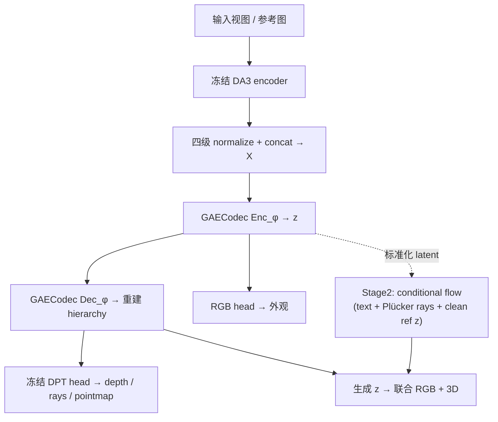
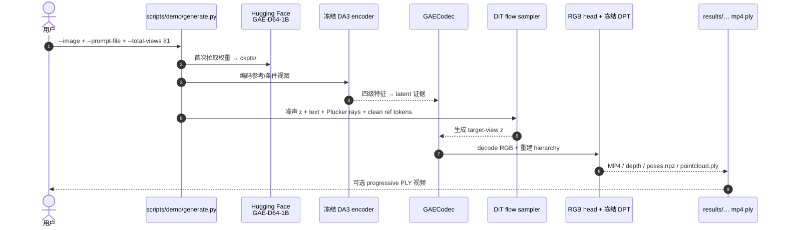

# GAE（Geometry-Native Autoencoder · arXiv:2609.24981）

**GAE**（*Learning a Geometry-Native Latent Space for 3D-Consistent World Generation*，[arXiv:2609.24981](https://arxiv.org/abs/2609.24981)，[项目页](https://jiah-cloud.github.io/GAE.github.io/)，[GitHub](https://github.com/TencentARC/GAE-GeometricAutoEncoder)，[HF 论文卡](https://huggingface.co/papers/2609.24981)）由 **香港科技大学、腾讯 ARC Lab（IEG）、香港大学、德克萨斯大学奥斯汀** 提出（Lu / Yin 共一；Hu / Liu 通讯）：不把几何当作 appearance latent 的 **外挂约束**，而是把 **Depth Anything 3（DA3）** 的多级几何特征 **重参数化** 为 compact、可 flow 的 **单一潜空间**，且该潜变量 **原生可解码** 为 RGB、深度、相机与点图。固定 DiT 条件 flow 训练协议，仅替换 latent 即可同时改善 **FVD** 与 **独立 3D 一致性** 指标。

> **命名注意：** 本文 **GAE** = Geometry-Native **Autoencoder**；与强化学习里的 [Generalized Advantage Estimation](../methods/gae.md) **无关**。

## 一句话定义

**把几何 foundation 的多级特征蒸馏进一个 64/128 通道的生成态，让标准 conditional flow 直接在「几何可读」的 latent 里演化，而不是先生成像素再事后补 3D。**

## 英文缩写速查

| 缩写 | 英文全称 | 简要说明 |
|------|----------|----------|
| GAE | Geometry-Native Autoencoder | 本文核心：geometry-native 潜空间自编码器 |
| DA3 | Depth Anything 3 | 冻结的几何 foundation 编解码骨干 |
| DiT | Diffusion Transformer | Stage2 条件 flow 骨干（x-prediction） |
| FVD | Fréchet Video Distance | 生成视频质量；RealEstate10K / DL3DV 主指标 |
| DPT | Dense Prediction Transformer | DA3 冻结几何头，读重建后的四级特征 |
| CFG | Classifier-Free Guidance | demo / 采样常用 guidance scale（如 2.0） |
| NVS | Novel View Synthesis | 参考图 + 相机路径的新视角生成任务之一 |

## 为什么重要

- **表征 > 单纯加 loss：** 对照实验 **锁定 generator 与训练配方**，只换 latent，说明 **3D 一致性瓶颈可在潜空间层面解决**，而不必总是 post-hoc 几何奖励或双 latent 耦合。
- **感知–生成接口：** 与「几何 foundation 只服务重建、视频 VAE 只服务像素」的分工不同，GAE 主张 **同一 latent 同时服务 perception readout 与 generative transport**。
- **机器人 / 导航交叉读法：** 已有工作（如 [TADreamer](./paper-tadreamer.md)、[DreamWAM](./paper-dreamwam.md)）把 **DA3** 当 **重建前端**；GAE 提供 **「若要用生成式 world model，latent 应长什么样」** 的对照基线——尤其 camera-controlled **81 视角** 序列 + **点云** 联合输出。
- **可复现入口清晰：** 官方仓 + **`TencentARC/GAE-D64-1B`** 权重 + `run_demo.sh`；适合作为 **geometry-native vs SD/Wan/RAE/ raw DA3** 的实验参照（项目页 §06）。

## 核心信息

| 项 | 内容 |
|----|------|
| **机构** | 香港科技大学（HKUST）；腾讯 ARC Lab, Tencent IEG；香港大学（HKU）；德克萨斯大学奥斯汀（UT Austin） |
| **规模** | 约 **1B** 参数级 flow 项目（项目页）；codec 输出 **64（GAE-64）** 或 **128（GAE-128）** 通道 |
| **骨干** | 冻结 **DA3-GIANT** encoder + 冻结 **DPT** geometry head；可训练 codec + RGB head + Stage2 flow |
| **任务** | Text-to-image；metric 相机轨迹控制视频；参考条件新视角；联合 RGB + depth + pose + progressive point cloud |
| **开源** | **已开源** — [TencentARC/GAE-GeometricAutoEncoder](https://github.com/TencentARC/GAE-GeometricAutoEncoder)；推理权重 [GAE-D64-1B](https://huggingface.co/TencentARC/GAE-D64-1B) |
| **许可** | Tencent **`LICENSE.txt`：仅限学术用途** — 禁止非学术 / 商业 / 生产 |

## 核心原理

### DA3 层级为何不适合直接生成

- 四级 DA3 特征 **互补但冗余**：单级无法同时保留语义、空间与跨视角结构；全级联建模则 **多 coupled 生成态**（对比 GLD 级联 flow）。
- Raw 3072 通道 **有效维 ~11**，条件数 **10⁸–10¹⁶** — 不适合标准 Euclidean flow transport。

### Stage 1：Geometry-native codec

1. 冻结 DA3 encoder → 四级 patch tokens；**per-level 固定 normalize** 后 **spatial concat** 为 \(X_v\)。
2. **Enc_φ / Dec_φ** 压到 grid latent \(z_v\)（64 或 128 通道），**Dec 重建完整 hierarchy**。
3. **冻结** \(\mathcal{H}_{\mathrm{DPT}}\) 读 depth / rays / point maps；**可训练 RGB head** 从 **同一 \(z\)** 解码外观 — 强制 appearance 与 geometry **共存**。
4. 除重建外，**L_tok**（对齐 C-RADIOv2.5-B）与 **L_struct**（DINOv2 patch 相似度，作用在 posterior mean）把 bottleneck **整理成可 flow 的欧氏态**。

### Stage 2：Conditional flow in standardized latent

- Codec 冻结；posterior mean 经 **Std** 标准化为 flow 目标。
- **x-prediction** conditional flow（RAEv2 风格）；**仅 target-view latents** 参与 ODE；**clean reference latents**、**metric Plücker ray maps**、**text** 为固定控制（reference 为 **证据** 而非演化状态）。
- 采样后 **Std⁻¹** → \( \hat z \) → 联合 RGB + 几何 readout。

### 流程总览

## 源码运行时序图

官方仓提供 **Stage1 codec** 与 **Stage2 flow** 推理 CLI（归档见 [sources/repos/gae-geometric-autoencoder.md](../../sources/repos/gae-geometric-autoencoder.md)）。最短 **I2V + 点云** 路径：

- **一键：** `bash scripts/demo/run_demo.sh`（`--smoke` 快速验通路）。
- **交互轨迹：** `provision_fast_demo.sh` + `run_fast_demo.sh`（Camera Studio，默认多 GPU resident）。
- **训练复现：** `scripts/train/` + `scripts/eval/`（FVD / 3D consistency / MEt3R 等）。

## 工程实践

| 项 | 建议 |
|----|------|
| **环境** | Python **3.10–3.12**，torch **2.5.1**；**勿用 3.13** |
| **安装** | `pip install -e .`（或 `requirements.txt`） |
| **权重** | demo 默认 **`TencentARC/GAE-D64-1B`**；空 `ckpts/` 时自动下载 |
| **许可** | **仅学术** — 产品 / 数据增广产线需法务另议 |
| **算力** | 单卡可跑 `generate.py`；Camera Studio README 默认 **8× CUDA** resident |
| **与 RL GAE 区分** | 站内检索「GAE」时先读 frontmatter `arxiv: 2609.24981` 或本页标题 |
| **对照实验** | 项目页 §06：同 DiT 协议下对比 SD VAE / Wan VAE / RAEv2 / raw DA3 |
| **下游 DA3 栈** | 若只需 **重建 SLAM 前端**，见 [R³](./paper-r3-relative-regression.md)；GAE 面向 **生成式 latent 设计** |

## 实验与评测

- **Matched latent（摘要）：** RealEstate10K FVD **−12.7%**，DL3DV **−23.1%**（相对最强对照 latent）；RealEstate10K **相机轨迹误差约减半**。
- **Latent 诊断：** 3072→128 通道；条件数 **κ 约 10⁸→10²**（项目页）。
- **3D consistency：** 64-scene benchmark — GAE **40/64** 场景 normalized Chamfer 最优（项目页）。
- **生成设定（项目页 latent 对照）：** 64 RE10K + 64 ScanNet++；9 views、1 conditioning frame、guidance 2.0、50 steps 等 — 与对照 latent **同协议**。
- **Operating points：** **GAE-64** 偏 **紧凑生成 / 轨迹一致**；**GAE-128** 偏 **重建与跨视角对应**（Pareto 前沿叙事）。

## 与其他工作对比

| 维度 | GAE | 对照 |
|------|-----|------|
| 生成 latent 来源 | DA3 四级特征经 codec 压成 64/128 通道 **geometry-native** grid latent | SD VAE / [Wan](./paper-wan-video.md) VAE / RAEv2：appearance 导向 latent，几何需事后读出或外挂约束（项目页 §06 同 DiT 协议对照） |
| 是否直接用 raw DA3 | 否 — raw 3072 通道有效维 ~11、条件数 10⁸–10¹⁶，先重参数化 | raw DA3 latent：项目页对照之一，病态 conditioning 不利 flow transport |
| DA3 的角色 | 生成态的表征骨干（同一 \(z\) 联合解码 RGB + 深度 + 相机 + 点云） | [R³](./paper-r3-relative-regression.md)、[TADreamer](./paper-tadreamer.md)：DA3 作 **重建 / 标定前端**，不承担生成 |
| 动作条件 | 无 — camera 轨迹 / 文本 / 参考图条件 | [DreamWAM](./paper-dreamwam.md)：训练期 DA3 几何支路 + 动作条件 Joint WAM |

## 结论

**当 generator 与训练配方固定时，把 latent 换成 geometry-native 的 GAE，可以同时拉高视频质量指标并改善独立测量的 3D 一致性——说明「世界是否一致」首先是表征问题，而不只是后处理几何。**

1. **不要直接 flow DA3 raw 特征** — 冗余 + 病态 conditioning；codec 把 **四级 hierarchy 压成单一欧氏 grid latent** 是必要重参数化。
2. **冻结几何头 = 硬约束** — geometry readout 不能「绕开」丢失的信息；RGB 必须与同一 \(z\) 共存。
3. **L_tok + L_struct 分工** — token 对齐改善 transport；仅 token 对齐会伤空间结构，需 **DINOv2 pairwise** 补回。
4. **Reference latent 是证据** — DA3 set-based 特性决定 reference 只能作 **clean 条件**，不能当作要积分重建的演化态。
5. **64 vs 128 是显式 Pareto 旋钮** — 生成紧凑性 vs 重建/对应精度；选型看任务是 **长轨迹视频** 还是 **高保真 NVS**。
6. **复现从 demo 权重起步** — `GAE-D64-1B` + `generate.py` 即可验证 **RGB + 点云** 同 latent；全量训练需对齐 `scripts/data/` 与 DA3 Hub 依赖。
7. **商用边界** — 代码/权重 **非 MIT**；与 [R³](./paper-r3-relative-regression.md) 等 DA3 衍生品的 NC 限制类似，集成到机器人产线前必须过许可。

## 局限与风险

- **学术许可** 限制产业 Sim2Real / 闭源产品直接嵌入。
- **算力：** 1B 级 flow + DA3-GIANT；交互 Camera Studio 假设 **多 GPU** 常驻。
- **动态 / 接触：** 论文主叙事为 **静态场景 camera 控制与 T2I**；非机器人 **动作条件** WM（对照 [DreamWAM](./paper-dreamwam.md)、[Wan-Move](./paper-wan-move.md)）。
- **与 manipulation WM 的距离：** 输出是 **视角序列 + 点云**，不自带 **动作 chunk** 或 **物理交互** 接口。

## 关联页面

- [Generative World Models](../methods/generative-world-models.md) — 像素/潜变量世界生成总览
- [R³（DA3 相对位姿流式重建）](./paper-r3-relative-regression.md) — 同 DA3 生态的 **感知** 前端
- [TADreamer（视频想象 + DA3 标定）](./paper-tadreamer.md) — 生成视频作规划中间表示的对照
- [DreamWAM](./paper-dreamwam.md) — 训练期 DA3 几何支路的 Joint WAM 实例
- [Wan 视频基础模型](./paper-wan-video.md) — 项目页 latent 对照之一（Wan2.1 VAE）

## 参考来源

- [GAE 论文摘录](../../sources/papers/gae_arxiv_2609_24981.md)
- [GAE 项目页归档](../../sources/sites/gae-github-io.md)
- [GAE GitHub 仓归档](../../sources/repos/gae-geometric-autoencoder.md)

## 推荐继续阅读

- 原文 PDF：<https://arxiv.org/pdf/2609.24981>
- 项目页交互 demo：<https://jiah-cloud.github.io/GAE.github.io/>
- Depth Anything 3：<https://arxiv.org/abs/2511.10647>
