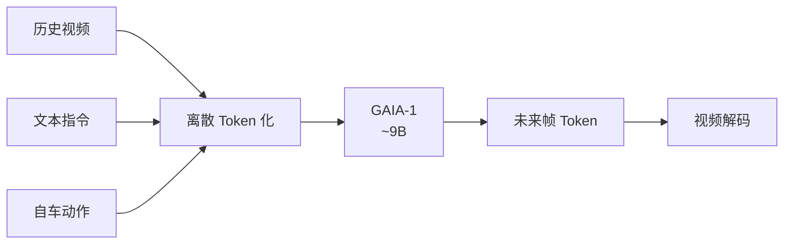

# GAIA-1（GAIA-1: A Generative World Model for Autonomous Driving · arXiv:2309.17080）

**GAIA-1**（*GAIA-1: A Generative World Model for Autonomous Driving*，[2309.17080](https://arxiv.org/abs/2309.17080)，Technical Report）由 **韦弗（Wayve）** 提出，收录于深蓝AI《端到端自动驾驶：十大前沿算法盘点》**生成式世界模型** 线索代表作。

## 一句话定义

约 90 亿参数的驾驶世界模型：把历史视频、文本指令与自车动作编成离散 token，像语言模型一样预测未来视频帧。

## 英文缩写速查

| 缩写 | 英文全称 | 简要说明 |
|------|----------|----------|
| GAIA-1 | Generative AI for Autonomy | Wayve 驾驶生成式世界模型 |
| WM | World Model | 预测未来观测的世界模型 |
| AR | Autoregressive | 自回归下一 token/帧预测 |
| E2E | End-to-End | 端到端自动驾驶语境 |
| FPS | Frames Per Second | 视频生成/回放帧率 |

## 为什么重要

- 自动驾驶核心难题之一是「自车动作之后世界如何演变」；生成式 WM 提供无风险仿真与想象训练场。
- 在下一帧预测目标下涌现运动学、3D 几何与红绿灯等场景逻辑。
- 站内 [generative-world-models](../methods/generative-world-models.md) 的驾驶视频 WM 代表作之一。

## 核心信息

| 字段 | 内容 |
|------|------|
| **机构** | 韦弗（Wayve） |
| **arXiv** | [2309.17080](https://arxiv.org/abs/2309.17080) |
| Venue | Technical Report |
| **演进线索** | 生成式世界模型 |
| **开源** | **未开源** — Wayve 技术报告 / 博客形态，无可运行公开训练代码与权重。 |
| **指标索引** | 技术报告侧重生成逼真度与可控性演示；定量表以原文为准。 |

## 核心原理

### Token 世界模型

输入：过去视频序列 + 文本指令 + 自车动作 → 离散 Token；自回归预测未来帧 Token 并解码为视频。

### 流程总览

## 源码运行时序图

**不适用** — Wayve 技术报告 / 博客形态，无可运行公开训练代码与权重。。

## 实验与评测

| 维度 | 记录 |
|------|------|
| 形态 | 技术报告 + 视频演示 |
| 能力点 | 动作条件未来帧、天气/场景可控、物理/交通逻辑涌现 |
| 定量 | 以报告图表为准；外部难复现 |

## 与相邻路线对比

| 路线 | 相对 GAIA-1 | 取舍 |
|------|-------------|------|
| [M⁴World](./paper-m4world.md) | 多摄+LiDAR、物体级控制 | 仍未开源 |
| [X-World](./paper-x-world.md) | 车载多摄 WM | 条件接口不同 |
| 规划器 E2E（UniAD 等） | 直接出轨迹 | 无像素想象训练场 |

## 工程实践

| 维度 | 记录 |
|------|------|
| 典型评测 | nuScenes / NAVSIM / Bench2Drive / Waymo Open（依论文） |
| 开源状态 | **未开源** — Wayve 技术报告 / 博客形态，无可运行公开训练代码与权重。 |
| 复现入口 | https://wayve.ai/thinking/gaia-1/ |
| 工程关注点 | 延迟、帧间一致性、可解释中间量表征、与模块化栈的接口 |

## 局限与风险

- 像素级仿真不等于物理保真；长视界漂移与动作可控性需后续工作（如 M⁴World / X-World）继续推进。
- 闭源大模型，外部只能作概念与评测对照。
- 与规划器闭环如何接（model-based RL / 想象数据）仍是系统工程问题。

## 关联页面

- [e2e-autonomous-driving-top10-algorithms](../overview/e2e-autonomous-driving-top10-algorithms.md) — 十大盘点父节点
- [自动驾驶核心算法盘点专辑](../overview/autonomous-driving-core-algorithms-series.md) — 模块化栈姊妹篇
- [生成式世界模型](../methods/generative-world-models.md)
- [S²-VLA](./paper-s-squared-vla.md) — 驾驶 VLA / NAVSIM 对照
- [M⁴World](./paper-m4world.md) — 驾驶世界模型后继
- [VLA](../methods/vla.md)

## 参考来源

- [深蓝AI：端到端自动驾驶十大前沿算法盘点](../../sources/blogs/wechat_shenlan_ai_ad_e2e_top10.md)
- [e2e_ad_gaia1.md](../../sources/papers/e2e_ad_gaia1.md) — 论文 source
- arXiv: [2309.17080](https://arxiv.org/abs/2309.17080)
- [sites/wayve-gaia1.md](../../sources/sites/wayve-gaia1.md)

## 推荐继续阅读

- 论文 PDF：<https://arxiv.org/pdf/2309.17080.pdf>
- 项目页/博客：<https://wayve.ai/thinking/gaia-1/>
