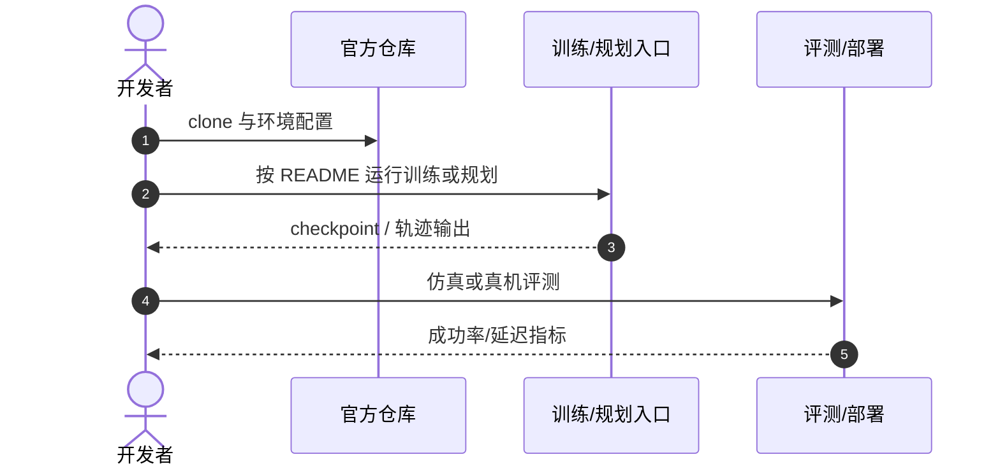

# GAINS

**GAINS: Leveraging Inconsistent Human Intervention Signals in Reinforcement Learning**（[arXiv:2608.15707](https://arxiv.org/abs/2608.15707)，[项目页](https://gains-hil.github.io/)）——北京理工大学；北京人形机器人创新中心；香港城市大学；南开大学。

## 一句话定义

**人类反馈不是完美标签，而是需要被建模的噪声与延迟信号。**

## 英文缩写速查

| 缩写 | 英文全称 | 简要说明 |
|------|----------|----------|
| GAINS | leveraGing inconsistent humAn InterventioN Signals | 本文 HIL-RL 框架 |
| HIL-RL | Human-in-the-Loop Reinforcement Learning | 人类在环强化学习 |
| RLIF | Reinforcement Learning from Intervention Feedback | 干预反馈 RL 基线 |

## 为什么重要

- 纳入 [具身智能小站 2026-08-23 九篇盘点](../../sources/blogs/wechat_embodied_station_9_papers_open_source_2026-08-23.md) 的「长视野 VLA → 动作分布 → 真实交互」主线。
- 开源状态（入库日）：**已开源**。

## 核心信息

| 项 | 内容 |
|----|------|
| **机构** | 北京理工大学；北京人形机器人创新中心；香港城市大学；南开大学 |
| **出处** | arXiv:2608.15707（2026-08） |
| **开源** | **已开源** |

### 流程总览

## 评测

| 项 | 内容 |
|----|------|
| **主结果** | 四仿真操作任务 + 两真实场景；任务成功率比 RLIF 高 **22%**；失败恢复最高提升 **43%**。 |

- 数据出处：[ingest 摘录](../../sources/papers/gains_arxiv_2608_15707.md)。

## 结论

**显式建模干预信号的不确定性与悲观探索，是在环 RL 真机部署的关键。**

- quantile Q-networks 捕获干预 return 变异性
- pessimistic exploration 兼顾安全与样本效率
- HIL-RM 基准含四稀疏奖励操作任务
- LeRobot 异步 actor-critic 统一真机/仿真
- 官方 HIL-RL 仓已链

## 源码运行时序图

## 与其他页面的关系

- [reinforcement-learning](../methods/reinforcement-learning.md)
- [manipulation](../tasks/manipulation.md)
- [paper-autointervene](./paper-autointervene.md)
- [vla-robustness-9-papers-technology-map](../overview/vla-robustness-9-papers-technology-map.md)

## 参考来源

- [gains_arxiv_2608_15707](../../sources/papers/gains_arxiv_2608_15707.md)
- [gains-hil](../../sources/sites/gains-hil.md)
- [hil-rl](../../sources/repos/hil-rl.md)
- [wechat_embodied_station_9_papers_open_source_2026-08-23](../../sources/blogs/wechat_embodied_station_9_papers_open_source_2026-08-23.md)

## 推荐继续阅读

- [arXiv:2608.15707](https://arxiv.org/abs/2608.15707)
- [官方代码](https://github.com/nuomizai/HIL-RL)
