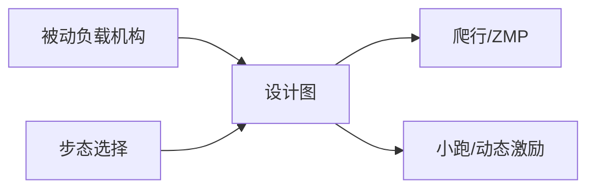

# Gait-Dependent Load Carrying（arXiv:2609.11059）

**Gait-Dependent Load Carrying**（*Gait-Dependent Effects on Quadruped Locomotion for Load-Carrying using Passive Mechanisms*，[arXiv:2609.11059](https://arxiv.org/abs/2609.11059)）由 **印度理工学院（IIT）** 提出（公众号周更 ingest 见 [策展索引](../../sources/blogs/wechat_shenlan_weekly_humanoid_quadruped_2026-09-14.md)）。

## 一句话定义

采用被动机构负载运输时步态对四足运动的影响 — gait-load-stiffness-damping design map。

## 英文缩写速查

| 缩写 | 英文全称 | 简要说明 |
|------|----------|----------|
| ZMP | Zero Moment Point | 零力矩点 |
| COM | Center of Mass | 质心 |
| PD | Proportional-Derivative | 关节阻尼控制 |

## 为什么重要

背负负载改变质心与接触力；步态选择决定稳定裕度与能耗。

## 核心信息

| 项 | 内容 |
|----|------|
| **机构** | 印度理工学院（IIT） |
| **开源** | **未见/待发布**（步骤 2.5 核查：截至 2026-09-14 无可运行官方仓库） |

## 核心原理

建立 gait-load-stiffness-damping 设计图；爬行提高 ZMP 裕度，trot 引入更高动态激励；被动机构参数协同优化。

### 流程总览

## 源码运行时序图

**不适用** — 截至 **2026-09-14** arXiv 与常见项目页 **未见** 官方可运行代码仓库。

## 工程实践

| 项 | 说明 |
|----|------|
| 开源状态 | 未见官方仓库；以 arXiv 为准 |
| 复现入口 | 论文方法与超参；代码发布后再补 `sources/repos/` |
| 部署注意 | 负载质心高度限制；被动阻尼磨损需维护。 |

## 实验与评测

不同步态下 ZMP 裕度、能耗、振动幅值。

## 结论

负载运输应步态感知：爬行偏稳定，小跑偏速度但激励大。

1. 设计图指导刚度阻尼选型。
2. 爬行 ZMP 裕度更适合重载。
3. trot 动态激励需被动机构吸收。
4. 被动机构降低主动控制负担。
5. IIT 平台实验验证。

## 与其他工作对比

| 对照 | 差异读法 |
|------|----------|
| 忽略步态的负载控制 | 稳定裕度误判 |
| 主动配重 | 机构更复杂 |

## 局限与风险

未与 RL 策略联合优化；地形多样性有限。

## 关联页面

- [locomotion](../tasks/locomotion.md)
- [hybrid-locomotion](../tasks/hybrid-locomotion.md)
- [./paper-qlaun.md](./paper-qlaun.md)

## 参考来源

- [gait_dependent_load_carrying_quadruped_arxiv_2609_11059.md](../../sources/papers/gait_dependent_load_carrying_quadruped_arxiv_2609_11059.md)
- [公众号周更策展](../../sources/blogs/wechat_shenlan_weekly_humanoid_quadruped_2026-09-14.md)

## 推荐继续阅读

- [https://arxiv.org/abs/2609.11059](https://arxiv.org/abs/2609.11059)
