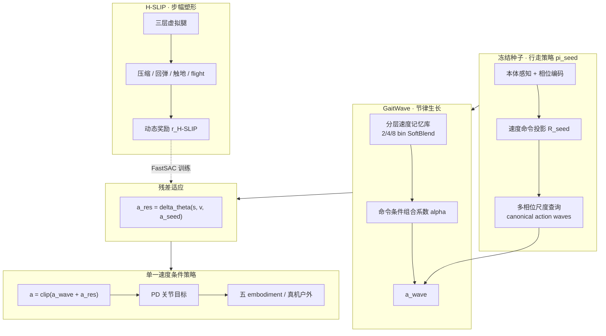

# GaitSpan：从行走到跑步的人形技能生长

**GaitSpan**（*Growing Humanoid Locomotion from Walking to Running*，密歇根大学 / 加州大学伯克利分校 / Skyline High School，arXiv:[2607.12114](https://arxiv.org/abs/2607.12114)，2026-07-13）提出 **skill growth** 范式：把 **预训练行走策略** $\pi_{\mathrm{seed}}$ **冻结** 为种子，经 **GaitWave**（多内部时钟调制 + 分层速度记忆组合）、**H-SLIP**（三层虚拟腿 SLIP 动态奖励）与 **残差适应**，在 **无步态标签、无人体演示、无多专家蒸馏** 下，用 **单一速度条件策略** 让走–慢跑–跑类 regime **连续涌现**，并在 **Booster T1 / K1、Unitree G1** 真机与 **五套 embodiment** 上验证 **零样本 sim-to-sim 与户外地形**。

## 一句话定义

**会走了就别重学跑——把行走策略当种子，调节律、拉步幅、加一点残差，速度命令一路从慢走到跑。**

## 英文缩写速查

| 缩写 | 英文全称 | 简要说明 |
|------|----------|----------|
| GaitSpan | — | 本文从行走种子生长多样步态的人形 locomotion 框架 |
| GaitWave | — | 相位尺度重查询 + 分层记忆组合种子 action waves 的节律模块 |
| H-SLIP | Hierarchical Spring-Loaded Inverted Pendulum | 三层虚拟腿 SLIP 启发的动态步幅塑形奖励 |
| SLIP | Spring-Loaded Inverted Pendulum | 弹簧负载倒立摆，高速足式 locomotion 经典简化模型 |
| RL | Reinforcement Learning | 本文用 FastSAC 学习残差与 GaitWave 组合系数 |
| AMP | Adversarial Motion Prior | 人体演示基线所用对抗运动先验 |
| OOD | Out-of-Distribution | 分布外速度命令，论文重点评测高速外推 |
| Sim2Sim | Simulation to Simulation | Isaac Gym 训练、MuJoCo 零样本评估的跨仿真迁移 |

## 核心信息

| 字段 | 内容 |
|------|------|
| 机构 | 密歇根大学（University of Michigan）、加州大学伯克利分校（UC Berkeley）、美国 Skyline High School |
| 作者 | Kwan-Yee Lin†、Zilin Wang†、Janelle J. Liu、Stella X. Yu（†共同一作） |
| 平台 | Booster T1、Booster K1、Unitree G1（真机）；T1/K1/G1 的 23/29 DoF 等五套 embodiment |
| 仿真 / 训练 | Isaac Gym，200 Hz / 50 Hz，4096 env，**FastSAC** |
| 种子策略 | 冻结行走 $\pi_{\mathrm{seed}}$（相位编码观测；命令映射至种子 $[-1,1]$ 域） |
| 速度命令 | 训练偏置集中于 ~2.2 m/s；评测含 **2.5 m/s OOD**；项目页展示至 **~2.8 m/s** 户外跑 |
| 项目页 | <https://gaitspan2026.github.io/> |

## 为什么重要

- **范式转换：** 把「走、慢跑、跑」从 **独立技能 / 专家拼装** 转为 **同一行走种子的结构化扩张**——与课程学习「后期覆盖前期」、直接微调种子覆写稳定性的痛点形成对照。
- **无需人体演示：** 相对 [SD-AMP](./paper-unified-walk-run-recovery-sdamp.md)（LAFAN1 + 门控 AMP）与 AMP 人体基线，GaitSpan 用 **机器人自身行走先验** 即可产生 **速度分化的动态步态**，且论文报告 **中低速能耗更低**、低速不会过早 flight。
- **连续命令单策略：** 相对多专家能耗塑形（Fu et al.）与 FSM 蒸馏路线，避免 regime 边界 **平均步态** 与 **高速 tracking 崩溃**。
- **形态与地形泛化：** 同一训练管线覆盖 **五套 embodiment**；训练仅平地/缓坡，真机可上 **波场、砂石、草地、林间坡道**，并耐受 **负重与低摩擦鞋** 扰动。
- **与 SPRINT 互补：** [SPRINT](./paper-sprint-humanoid-athletic-sprints.md) 用极少 MoCap **频谱外推** 至 6 m/s 冲刺；GaitSpan 强调 **从已有行走 checkpoint 生长**、**无外部动作库**，更贴近「已会走的人形如何加速」工程路径。

## 方法

| 模块 | 机制 |
|------|------|
| **种子分支** | 冻结 $\pi_{\mathrm{seed}}(\mathbf{s}_t,\tilde{\mathbf{v}}_t)$，$\tilde{\mathbf{v}}_t=\mathcal{R}_{\mathrm{seed}}(\mathbf{v}_t)$ 将目标速度投影到行走训练域 |
| **GaitWave** | 相位尺度 $\rho_k$ 调制 $(\sin\phi,\cos\phi)\to(\sin\rho_k\phi,\cos\rho_k\phi)$，重查询得 waves $\mathbf{a}^{\mathrm{seed}^{(k)}}$；**2/4/8 分辨率记忆库** + SoftBlend 得 $\boldsymbol{\alpha}_t$，组合为 $\mathbf{a}^{\mathrm{wave}}$ |
| **H-SLIP** | root–foot / upper-leg / lower-leg 虚拟腿长度变化；奖励压缩、回弹（速度门控）、触地、flight + 滑移惩罚 |
| **残差** | $\mathbf{a}^{\mathrm{res}}=\delta_\theta(\mathbf{s},\mathbf{v},\mathbf{a}^{\mathrm{seed}})$；最终 $\mathbf{a}_t=\mathrm{clip}(\mathbf{a}^{\mathrm{wave}}+\mathbf{a}^{\mathrm{res}})$ |
| **SA 正则** | 低速锚定种子动作、残差紧凑、相位 bin 自相似、相对种子的时间一致性 |
| **总奖励** | $r^{\mathrm{total}}=r^{\mathrm{task}}+\lambda_{\mathrm{H\text{-}SLIP}} r^{\mathrm{H\text{-}SLIP}}-\lambda_{\mathrm{SA}}\mathcal{L}_{\mathrm{SA}}$ + 标准 tracking / 姿态 / 存活项 |

### 流程总览

## 实验要点（归纳）

| 轴 | 报告口径（以论文为准） |
|----|------------------------|
| **涌现步态** | 低速规律交替支撑；高速 contact–flight 密度上升；**0.5→2.5 m/s** 平滑过渡（项目页视频） |
| **跟踪 vs flight** | 相对 **Seed** 与 **Energy Multi-Experts**，GaitSpan 在全速域 **更低跟踪误差** 且高速有 **显著 flight time** |
| **vs AMP 人体基线** | 更准确速度跟踪、更清晰的 **速度依赖接触重组**；中低速 **能耗更低**；人形姿态「像人」≠ 机器人最优 |
| **消融** | 仅 GaitWave 或仅 H-SLIP 均无法同时保住 OOD 跟踪与动态 flight；**直接微调种子** 易退化为原地踏步 |
| **形态** | 同速下 T1/K1/G1 **足接触模式不同**；29 DoF 相对 23 DoF 可把补偿分布到腰/臂，足端模式更 subtle |
| **局限** | 依赖行走种子质量与覆盖；目前为 **一步生长**（走→快），未闭环把新技能回灌种子 |

## 常见误区或局限

- **误区：「相位加倍就等于跑起来」。** 补充实验表明 **直接相位缩放** 在种子训练域外 **跟踪误差大**，需 **GaitWave 自适应组合** 而非固定频率。
- **误区：「残差 alone 够用」。** Vanilla seed–residual 无法承担全速域动态生长；残差应补 **waves 未覆盖的细节**。
- **误区：「更像人的 AMP 一定更好」。** 论文强调低速过早 flight 与能耗浪费；机器人应发展 **速度适配** 的接触模式，而非静态模仿跑姿。
- **局限：** 种子策略需预先可得（论文引用 [Holosoma](./holosoma.md) 类相位行走管线）；峰值速度低于 [SPRINT](./paper-sprint-humanoid-athletic-sprints.md) 冲刺向工作；代码尚未公开。

## 与其他工作对比

| 维度 | GaitSpan | SD-AMP | SPRINT | Energy Multi-Experts |
|------|----------|--------|--------|----------------------|
| 生长起点 | **冻结行走 checkpoint** | 从头 AMP+RL | 频谱先验 + 残差 RL | 分速专家拼装 |
| 人体数据 | **不需要** | 3 条 LAFAN1 | 5 条 LAFAN1 | 不需要 |
| 步态切换 | **连续命令** | 重力门控训练期 | 连续 0–6 m/s | 专家边界脆弱 |
| 真机 | **T1/K1/G1 户外** | G1 走跑起身 | G1 冲刺 | 论文仿真为主 |
| 物理先验 | **H-SLIP 虚拟腿** | AMP 风格 | 频域周期性 | 能耗最小化 |

## 关联页面

- [Humanoid Locomotion](../tasks/humanoid-locomotion.md) — 人形移动任务总览
- [Locomotion](../tasks/locomotion.md) — 足式移动广义任务
- [SLIP + VMC](../methods/slip-vmc.md) — H-SLIP 的模型控制理论对照
- [holosoma](./holosoma.md) — 行走种子与相位 locomotion 工程入口
- [SD-AMP 统一走跑起身](./paper-unified-walk-run-recovery-sdamp.md) — LAFAN1 + 门控 AMP 对照
- [SPRINT 人形冲刺频谱先验](./paper-sprint-humanoid-athletic-sprints.md) — 极速单策略另一轴

## 参考来源

- [GaitSpan 论文摘录（arXiv:2607.12114）](../../sources/papers/gaitspan_arxiv_2607_12114.md)

## 推荐继续阅读

- 项目页与视频：<https://gaitspan2026.github.io/>
- 论文 PDF：<https://arxiv.org/pdf/2607.12114>
- 论文 HTML：<https://arxiv.org/html/2607.12114v1>
- [holosoma](./holosoma.md) — 行走策略与相位 locomotion 训练管线
- [SPRINT](./paper-sprint-humanoid-athletic-sprints.md) — 极少参考下的连续变速冲刺对照
