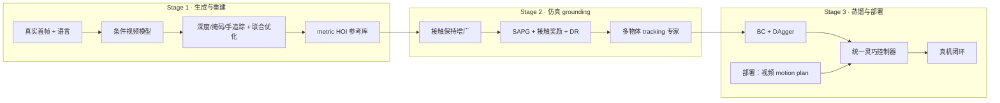

# GALATEA（arXiv:2609.10050）

**GALATEA**（*Grounding Generated Video Plans in Simulation Towards Versatile Dexterous Controllers*，UC Berkeley / Sharpa / HKU，[arXiv:2609.10050](https://arxiv.org/abs/2609.10050)，[项目页](https://boyuan-an.github.io/GALATEA/)）把**生成式 HOI 视频**当作可扩展的运动参考库：训练期用重建轨迹在仿真中学多物体 HOI tracker，部署期由视频模型出 motion plan、tracker 闭环执行。

## 一句话定义

**生成视频当「运动提案」、仿真当「落地过滤器」——先批量重建 metric 手–物轨迹并 SAPG 跟踪，再蒸馏成跨物体灵巧控制器。**

## 英文缩写速查

| 缩写 | 英文全称 | 简要说明 |
|------|----------|----------|
| GALATEA | Grounding Generated Video Plans in Simulation Towards Versatile Dexterous Controllers | 本文方法名 |
| HOI | Hand–Object Interaction | 手–物交互 |
| SAPG | — | 仿真中用于多轨迹 HOI 跟踪的 RL 算法（论文设定） |
| BC | Behavior Cloning | 行为克隆 |
| DAgger | Dataset Aggregation | 交互式模仿聚合，用于专家蒸馏 |
| SR | Success Rate | 任务/grounding 成功率 |

## 核心信息

| 字段 | 内容 |
|------|------|
| **机构** | 加州大学伯克利分校（UC Berkeley）、Sharpa、香港大学（HKU） |
| **作者** | Tianyue Wu⋆‡、Boyuan An⋆、Shuqi Zhao、Heyu Guo、Wanli Xing、Yi Ma、Kaifeng Zhang、Ruihai Wu†、Masayoshi Tomizuka† |
| **开源** | **部分 / 待发布**（[GitHub](https://github.com/boyuan-an/GALATEA) 已建库；RL 与 HOI 重建代码 **2026-11 前**公开，步骤 2.5 核查 2026-09-19） |
| **规模** | ~2500 生成 clip → ~2000 可用参考 → **1500+** 仿真 grounding；仿真训练 SR 较基线 **+25 pp** 以上 |
| **真机** | 66 段物理 rollout：功能抓取、非抓取推操纵、抓后物体姿态跟踪 |

## 为什么重要

- **把「视频生成」从 demo 接到可执行控制：** 生成模型提供多样 HOI 提案，仿真 tracker 负责接触可行性与跨物体泛化，部署时二者分工明确。
- **HOI 参考的可扩展性：** 传统 mocap/遥操作难覆盖多物体多轨迹；生成+自动重建把数据瓶颈换成 **重建成功率** 与 **仿真 grounding 率**。
- **与纯 IL/VLA 的对照轴：** 不是端到端像素→扭矩，而是 **plan（视频）+ track（RL 蒸馏策略）** 两阶段，便于单独升级生成模型或 tracker。

## 方法

| 阶段 | 输入 | 机制 | 输出 |
|------|------|------|------|
| **1 生成与重建** | 真实首帧 + 语言指令 | 条件视频模型生成 HOI clip；立体深度、物体掩码、手追踪 + 联合优化得 metric 轨迹 | ~2000/2500 可用参考 |
| **2 仿真 grounding** | 重建轨迹 | 接触保持的数据增广；接触感知奖励 + **SAPG** + 域随机化；多物体多轨迹 tracking 策略 | 1500+ 可执行仿真轨迹 |
| **3 蒸馏** | 类别专家策略 | **BC + DAgger** 合并为单一跨物体/跨轨迹控制器 | 部署用 tracker |

### 流程总览

### 源码运行时序图

**不适用**（截至 2026-09-19：官方 GitHub 仅有 README/资产占位，RL 跟踪与 HOI 重建入口 **待 2026-11 前发布**；项目页标注 *Code (by Nov.)*）。

## 工程实践

| 项 | 读法 |
|----|------|
| 开源状态 | 仓库：<https://github.com/boyuan-an/GALATEA>；勿按 PDF「Videos and code are available」误判为 **已可复现** |
| 复现优先级 | 先盯 HOI 重建成功率与仿真 grounding 率——论文 headline +25 pp 建立在此链路上 |
| 部署栈 | 推理 = 视频模型出 plan + 已蒸馏 tracker 跟踪；需分别维护生成与控制在环延迟 |
| 与 VLA 选型 | 若已有强触觉/力控栈，GALATEA 更偏 ** kinematic plan + 接触跟踪** 而非语言端到端 |

## 实验与评测

| 轴 | 报告口径（以论文/项目页为准） |
|----|--------------------------------|
| 数据效率 | 2500 生成 → 2000 重建可用 → 1500+ 仿真成功 |
| 仿真对比 | Grounding SR 较 baselines **+25 percentage points** 量级 |
| 真机闭环 | 功能抓取、non-prehensile 推、post-grasp 物体姿态跟踪；项目页 66 rollout |
| 读法 | 先确认对象类别、轨迹来源（生成 vs held-out）再对比 SR |

## 结论

**GALATEA 的可复制价值在「生成参考 → 仿真过滤 → 蒸馏部署」三段式：真影响指标是重建+grounding 通过率，而不是单看生成视频质量。**

1. **数据链优先：** ~80% 重建可用率与 1500+ grounding 是方法可扩展性的核心证据；缺任一环节数字都会失真。
2. **开源节奏：** 2026-11 前才承诺 RL/重建代码——当前仅宜作架构与指标阅读，不宜排期复现。
3. **部署分工：** 视频模型负责 **提案**，tracker 负责 **接触可行**；升级生成 backbone 不必重训整条 VLA。
4. **对照 HumoSlope/纯 RL：** 本文解决 **灵巧操作参考从哪来**，不是 locomotion；与 [Blind Dexterity](./paper-blind-dexterity.md) 等同属 sim 落地 dexterous 线，但监督来自生成视频而非 RL explore。
5. **风险：** 重建失败 clip 会系统性偏置物体/接触类型；需监控 HOI-DETR 接触窗与 pre/post-contact 分布。
6. **工程入口：** 代码发布后优先读 HOI 重建 + SAPG 训练脚本，再碰 DAgger 蒸馏配置。

## 局限与风险

- **重建误差传播：** 深度/掩码/手追踪任一环节漂移会直接污染仿真奖励与蒸馏标签。
- **生成域覆盖：** 未见物体/极端接触可能无参考；tracker 泛化仍受 grounding 分布约束。
- **两阶段延迟：** 部署时视频 plan 与 tracker 串行，实时性取决于两模块推理时间之和。
- **开源：** 截至入库日 **待发布** 可运行代码；GitHub 占位不等于可复现。

## 与其他工作对比

| 对照 | 差异读法 |
|------|----------|
| [Generative World Models](../methods/generative-world-models.md) | 同用生成式视觉先验；GALATEA 聚焦 **HOI 轨迹→灵巧控制**，不是通用环境 rollout |
| [Blind Dexterity](./paper-blind-dexterity.md) | 同强调仿真学 dexterous；GALATEA 监督来自 **生成视频重建**，非纯 RL 探索 |
| [Imitation Learning](../methods/imitation-learning.md) | 蒸馏阶段用 BC+DAgger；但主数据来自生成+仿真而非人类遥操作 |
| Video-plan + track 类工作 | 关键差异在 **HOI metric 重建自动化** 与 1500+ 规模 grounding 统计 |

## 关联页面

- [Manipulation](../tasks/manipulation.md)
- [Generative World Models](../methods/generative-world-models.md)
- [Imitation Learning](../methods/imitation-learning.md)
- [Sim2Real](../concepts/sim2real.md)
- [Blind Dexterity](./paper-blind-dexterity.md)

## 参考来源

- [galatea_arxiv_2609_10050.md](../../sources/papers/galatea_arxiv_2609_10050.md)
- [galatea.md（项目页）](../../sources/sites/galatea.md)
- [galatea.md（仓库）](../../sources/repos/galatea.md)
- [arXiv:2609.10050](https://arxiv.org/abs/2609.10050)

## 推荐继续阅读

- [项目页](https://boyuan-an.github.io/GALATEA/)
- [arXiv PDF](https://arxiv.org/pdf/2609.10050)
- [GitHub（待完整发布）](https://github.com/boyuan-an/GALATEA)
