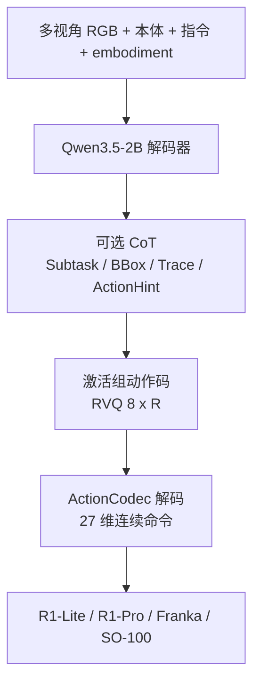
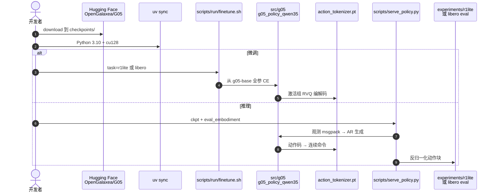

# G0.5：推理与动作同一自回归流

**G0.5**（*Galaxea G0.5: One Autoregressive Stream for Robot Reasoning and Action*，[arXiv:2608.11739](https://arxiv.org/abs/2608.11739)，[项目页](https://opengalaxea.github.io/G05/)，[代码](https://github.com/OpenGalaxea/GalaxeaVLA)，[权重](https://huggingface.co/OpenGalaxea/G05)）由 **星海图（Galaxea）** 提出：反对把预训练 VLM 降成 flow-matching 动作专家的条件编码器，改回 **VLM-as-Actor**——一个 Transformer、一套权重、一个 next-token 目标，同时生成 **链式推理** 与 **压缩动作码**。跨本体 **ActionCodec** 把异构机器人收进共享 27 维词表；视觉记忆给长程移动操作补多秒历史。

## 一句话定义

**别把 VLM 当特征抽取器：让它在同一条 token 流里先想后动，闲置关节连 token 都不发。**

## 英文缩写速查

| 缩写 | 英文全称 | 简要说明 |
|------|----------|----------|
| G0.5 / G05 | Galaxea 0.5 VLA | 本文统一自回归视觉–语言–动作模型 |
| VLM-as-Actor | Vision-Language Model as Actor | VLM 自己发动作 token，而不是只条件化外部 expert |
| ActionCodec | Cross-embodiment action tokenizer | 分组 RVQ：左/右臂、夹爪、下身 → 共享离散码 |
| CoT | Chain-of-Thought | 本页指 Subtask / BBox / Trace / ActionHint 与动作同流 |
| RVQ | Residual Vector Quantization | 残差量化动作块；每激活组 8 码 × \(R\) 轮 |
| GRPO | Group Relative Policy Optimization | 用 AR token logp 做低数据 RL 微调 |

## 为什么重要

- **架构立场清楚：** \(\pi_{0.5}\) / GR00T 把 VLM 变成条件；G0.5 用学出来的 codec 把 AR 的 token 税砍掉，把推理能力留在动作分布里。
- **数字可读且开源：** 真机六设定 **76.7%** vs \(\pi_{0.5}\) **53.3%**；LIBERO **98.9%**、RoboTwin **93.3%**；仓内有微调、WebSocket 服务和 R1/DROID/LIBERO 入口。
- **CoT 不是装饰：** 单阶段几乎没增益，五阶段零样本家务才拉开；同一段 CoT 下 AR 头比外挂 FM 头更跟指令——符合「同流可直接 attend」的假说。
- **许可证要读：** **G0.5 Community License** 偏向学术/评估，不是 Apache 商用绿灯。

## 核心信息

| 字段 | 内容 |
|------|------|
| 作者 | Galaxea Team |
| 机构 | 星海图（Galaxea / Xinghaitu (Beijing) AI Technology） |
| 出处 | arXiv:2608.11739（2026-08） |
| 骨干 | Qwen3.5-2B；视觉塔全程解冻 |
| 动作空间 | 统一 27 维：`left_control(9) \| gripper(1) \| right(9) \| gripper(1) \| lower_body(7)` |
| 预训练 | 14 本体机器人 + Web/具身 VQA（动作:VQA 4:1）；DROID 不进基础混合 |
| 开源（截至 2026-08-14） | **已开源**：[`OpenGalaxea/GalaxeaVLA`](https://github.com/OpenGalaxea/GalaxeaVLA) + HF `OpenGalaxea/G05` |

## 方法与核心结构

| 模块 | 作用 |
|------|------|
| **条件段** | 多视角 RGB、embodiment id、指令、连续本体嵌入（与视觉帧对齐） |
| **生成段** | 可选 CoT + `<part_r>` 组标记 + 8 个动作码 × 残差轮 |
| **ActionCodec** | 分组 pad → 时间对比 → RVQ；只序列化激活部分 |
| **视觉记忆** | ViT 每 4 层分解时空注意；末层丢历史；训练随机 drop 历史帧（约 6 帧 / 5 s） |
| **可选 FM 头** | 条件 AR 隐状态，作加速/对照；主表默认纯 AR |

训练只有一条 CE：CoT 和动作「都是 token」。8 种 CoT 模板加权采样，子任务文本权重最高；评测默认 no-CoT，需要时再打开。

### 流程总览

闭环每步用新观测重写条件段，推理可以改计划而不是一次性开环。

## 源码运行时序图

官方仓 [OpenGalaxea/GalaxeaVLA](https://github.com/OpenGalaxea/GalaxeaVLA) 与 HF 权重布局见 [sources/repos/galaxea-vla.md](../../sources/repos/galaxea-vla.md)：

- **最短路径：** `uv sync` → 拉 `g05-base` → `serve_policy.py` 对 R1-Lite 零样本，或 `experiments/libero` 用 `g05-libero`。
- **微调：** `finetune.sh` 默认 DDP 每卡一份整模，**不能**当成模型并行省显存；全参 >70 GB。
- **许可证：** 先读 `LICENSE-G0.5`；内部 PoC 评估与生产部署不是同一档。

## 工程实践

| 项 | 建议 |
|----|------|
| 何时用 G0.5 | 要语言跟随、长程子任务、跨本体同一套头；有 R1 / SO-100 / DROID / LIBERO 评测需求 |
| 何时不必上 | 只要高频连续控制、且已有成熟 \(\pi_{0.5}\) 栈；或必须 OSI 宽松商用许可 |
| 默认推理 | 纯 AR；FM 头当加速选项，长程指令优先 AR+CoT |
| CoT | 单阶段开关收益小；多阶段家务再开 Subtask/BBox |
| 指代消歧 | 长尾物体加目标裁剪图（多图接口）比纯坐标 token 有效 |
| RL 后训练 | AR 有现成 token logp，GRPO 比把 FM 改写成 SDE 更直接 |
| 显存 | 推理 >8 GB；全参微调按 80 GB 级 GPU 估 |

## 实验与评测

| 设定 | G0.5 | 读法 |
|------|------|------|
| R1-Lite/Pro 六设定 | **76.7%** / process 129.2 | 同数据同墙钟；五设定第一，R1 Pro 码垛 \(\pi_{0.5}\) 略高 |
| BEHAVIOR-1K | **0.3136**（4 ep 单 ckpt） | 1 ep 已超 4 ep \(\pi_{0.5}\) 与四 ckpt 冠军 |
| DROID env/object ZS | **82.5%** | 评测环境与物体实例都 held-out；半透明抽屉是弱点 |
| LIBERO | **98.9%**（Long **98.6**） | 与 Xiaomi-Robotics-0 同档，Long 套件最好 |
| RoboTwin 2.0 | **93.3%** | 略高于 LingBot-VA / Fast-WAM |
| SimplerEnv-Bridge | **87.3%** | 四任务均 |
| PP Bench 50h | 跟随 84.4 / 成功 75.0 | +目标图 → 跟随 98.4 |

## 结论

**G0.5 要证明的不是「AR 也能刷榜」，而是把推理留在动作生成器里之后，语言跟随和长程分解会结构性变强。**

1. **真影响：VLM 继续当 actor** — 七套评测同时打过 encoder+expert 族，不是单榜偶然。
2. **真影响：codec 而不是逐步 binning** — 分组 RVQ + 激活组稀疏解码，才让基础模型尺度的 AR 控得动双臂移动操作。
3. **真影响：CoT 跟任务地平线走** — 用五阶段零样本家务读增益，不要用 PP Bench 的 +1.5 点否定同流推理。
4. **次要代价：数据偏置** — BEHAVIOR 上微波炉/热狗仍落后 \(\pi_{0.5}\)；论文自己说是预训练分布，多训几个 epoch 能追上一部分。
5. **部署读法：** 开源路径完整（权重 + `serve_policy` + 真机客户端）；先确认 Community License 是否覆盖你的用途。
6. **选型：** 要 prompt 级 steering 和原生 RL logp → G0.5；要 OSI 宽松 + 成熟 RTC 栈 → 仍看 OpenPI。

## 与其他工作对比

| 对照 | 差异读法 |
|------|----------|
| [\(\pi_{0.5}\)](./paper-pi05-open-world-vla.md) | FAST 预训练 + flow 专家；G0.5 把动作留在 AR 词表，CoT 不是调用 expert 前的子任务文本 |
| [InternVLA-A1.5](./paper-internvla-a15-unified-vla.md) | 同 Qwen3.5-2B，但动作走 flow、未来靠冻结 WAN query；部署不滚像素。G0.5 部署仍 AR 解码动作码 |
| [Xiaomi-Robotics-0](./xiaomi-robotics-0.md) | VLM+DiT flow；LIBERO 几乎打平，Bridge 上 G0.5 更高 |
| [LingBot-VLA 2.0](./lingbot-vla-v2.md) | 通才 flow + 稀疏 MoE 动作头；RoboTwin 上 G0.5 略高 |
| Fast-WAM / [Rift](./paper-rift-wam.md) | 联合未来–动作；G0.5 是 VLA 不是 WAM，但 RoboTwin 表上已超过 Fast-WAM |

## 局限与风险

- Community License **限制商用与对外服务**；评估 PoC ≠ 产线。
- 预训练全量混合与自动标注管线（Gemini/Doubao/SAM3）不随仓发布。
- Prompt steering 在文中是小样本定性，不是系统定量结论。
- 半透明、低对比孔径等视觉 degenerate 场景仍弱。
- 全参微调显存门槛高；不要把 DDP 理解成省显存。

## 关联页面

- [VLA](../methods/vla.md) — 方法主线；本文是 VLM-as-Actor 开源代表
- [π0.5](./paper-pi05-open-world-vla.md) — 主对照 encoder+expert
- [InternVLA-A1.5](./paper-internvla-a15-unified-vla.md) — 同骨干、不同动作接口
- [VLA 开源复现景观](../overview/vla-open-source-repro-landscape-2025.md) — 2026 补充入口
- [操作 VLA 选型](../queries/manipulation-vla-architecture-selection.md) — 有大规模带动作数据时的 AR 选项
- [Xiaomi-Robotics-0](./xiaomi-robotics-0.md) — LIBERO 近邻
- [LingBot-VLA 2.0](./lingbot-vla-v2.md) — RoboTwin 近邻
- [RoboTwin 2.0](./robotwin.md) — 双臂仿真榜
- [LIBERO](./libero-benchmark.md) — 四套件协议
- [Manipulation](../tasks/manipulation.md) — 桌面与移动操作语境
- [World Action Models](../concepts/world-action-models.md) — 联合未来对照，不是本模型
- [Riemann-1.0](./paper-riemann-1.md) — 闭源 WAM；真机对照表里本页厨房 SR 35% vs 其 90%（公司自报）

## 参考来源

- [galaxea_g05_arxiv_2608_11739.md](../../sources/papers/galaxea_g05_arxiv_2608_11739.md)
- [项目页归档](../../sources/sites/opengalaxea-g05.md)
- [GalaxeaVLA 仓库归档](../../sources/repos/galaxea-vla.md)
- [具身智能小站 10 篇盘点（2026-08-19）](../../sources/blogs/wechat_embodied_station_world_model_exec_10_papers_2026-08-19.md)
- Galaxea Team — <https://arxiv.org/abs/2608.11739>
- 项目页 — <https://opengalaxea.github.io/G05/>
- 代码 — <https://github.com/OpenGalaxea/GalaxeaVLA>
- 权重 — <https://huggingface.co/OpenGalaxea/G05>

## 推荐继续阅读

- 仓库 README 与 `docs/architecture/g05_architecture.md`
- Physical Intelligence \(\pi_{0.5}\) — <https://www.physicalintelligence.company/blog/pi05>
- InternVLA-A1.5 — <https://arxiv.org/abs/2607.04988>
- Open-World Dataset — <https://huggingface.co/datasets/OpenGalaxea/Galaxea-Open-World-Dataset>
