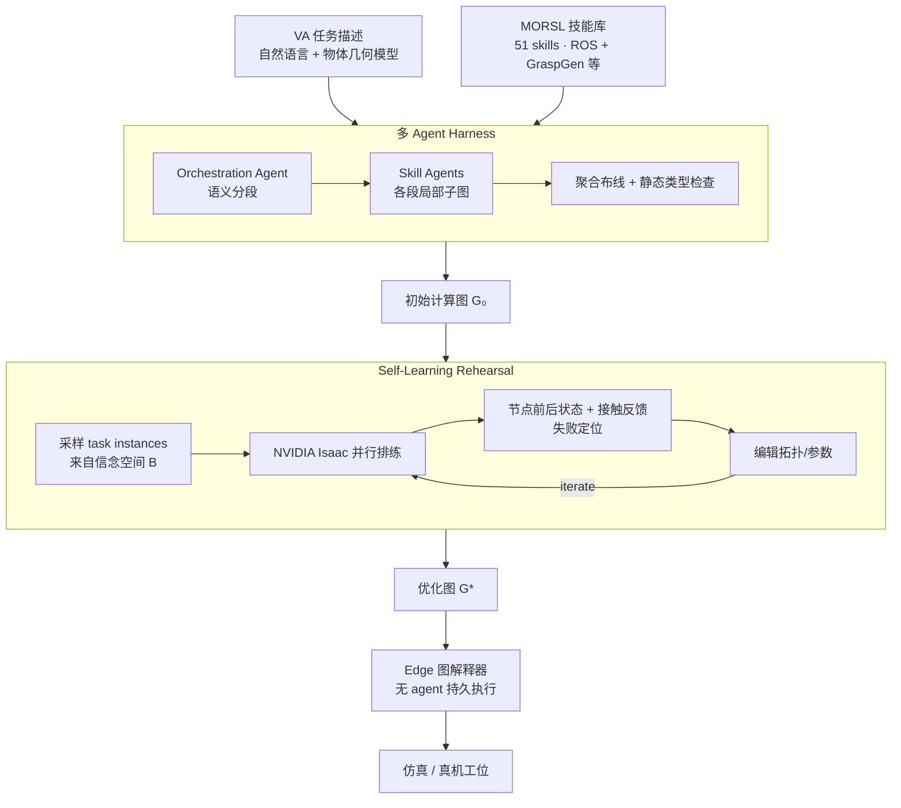

# GaP（Graph-as-Policy）

**GaP**（*A Graph-as-Policy Multi-Agent Self-Learning Harness For Variational Automation Tasks*，NVIDIA / UC Berkeley / CMU / Bosch，arXiv:[2607.05369](https://arxiv.org/abs/2607.05369)，[项目页](https://graph-robots.github.io/gap/)）提出 **Agentic Robotics** 新变体：**策略 = 有向计算图**（类 ROS/TAMP），由多 agent 编码 harness 从 **MORSL** 技能库合成、在仿真中自学习优化，再 **无 agent 地** 在 edge 设备上持久执行——旨在 **弥合传统工程方法的可靠性与 VLA 的泛化能力之间的鸿沟**。

## 一句话定义

**用多 agent 把自然语言 VA 任务编译成类型检查过的感知–规划–控制计算图，在仿真排练里自主改图直至可靠，然后像 ROS 节点图一样在真机上长期跑——既保留模块化可解释性，又接入 GraspGen 等 model-free 原语与 VLA staging。**

## 英文缩写速查

| 缩写 | 英文全称 | 简要说明 |
|------|----------|----------|
| GaP | Graph-as-Policy | 本工作：策略表示为有向计算图 + 多 agent 自学习 harness |
| VA | Variational Automation | 有界几何/位姿变化的持久自动化任务类 |
| MORSL | Modular Open Robot Skill Library | 开放机器人技能库，首发 51 项可组合技能 |
| CaP | Code as Policy | LLM 写可执行控制代码的范式；GaP 为其结构化图变体 |
| VLA | Vision-Language-Action | 端到端视觉-语言-动作模型；VA 上可靠性不足但可被 GaP staging |
| TAMP | Task and Motion Planning | 任务+运动联合规划；GaP 图结构的另一灵感来源 |
| ROS | Robot Operating System | 基于计算图的机器人中间件 |

## 核心信息

| 字段 | 内容 |
|------|------|
| 机构 | 加州大学伯克利分校（UC Berkeley）、NVIDIA、卡内基梅隆大学（CMU）、博世（Bosch） |
| 共同一作 | Kaiyuan Chen、Shuangyu Xie（Berkeley） |
| NVIDIA 署名 | Linxi "Jim" Fan、Yuke Zhu、Guanzhi Wang 等（与 [GEAR Lab](./nvidia-gear-lab.md) 网络重叠） |
| Berkeley PI | Ken Goldberg、S. Shankar Sastry |
| 仿真 | NVIDIA Isaac / Isaac Lab |
| 硬件 | Franka（LIBERO 衍生，任务 I–III）、UR5+力反馈（VA-IV）、双臂 Franka 洗箱（VA-V） |
| 开源 | [graph-as-policy](https://github.com/graph-robots/graph-as-policy)（Beta，Apache-2.0）+ [open-robot-skills](https://github.com/graph-robots/open-robot-skills)；[项目页](https://graph-robots.github.io/gap/) |

## 为什么重要

- **明确 VA 任务刻度：** 提出 **FA / VA / GR** 三分法与 **8 项开放 benchmark**，使「工业可靠 vs 学习泛化」的讨论有 **可复现靶场**（见 [变体自动化](../concepts/variational-automation.md)）。
- **结构化 agentic robotics：** 相对单 agent **自由 Python [CaP](../methods/aspire.md)**，GaP 用 **图节点 + 静态验证** 抑制幻觉与「作弊指标」；消融显示 **去图或合并 agent → 0% 成功率**。
- **桥接 model-based 与 model-free：** MORSL 同时含 **ROS 过程** 与 **GraspGen** 等学习原语；**π₀.₅ w/ GaP** 用图式 staging 把 VLA 成功率 **>2×**——不是取代 VLA，而是 **用可解释图把 VLA 送进分布**。
- **仿真排练闭环：** 并行 task instance + 节点级状态/接触反馈 → **定位失败节点** → 自主改拓扑/参数；Make Popcorn **33% → 94%（sim）/ 90%（real）** 展示 **图级 self-learning** 可落地。
- **接近手工工程：** 双臂洗箱 GaP **0.953** vs 手工图 **0.987**；真机 grocery fulfillment **25/25** vs TipTop **8/25**。

## 流程总览

## 核心机制

### Graph-as-Policy

策略 $\pi(a\mid\mathbf{x},\mathcal{T})$ 表示为有向图 $\mathcal{G}=(V,E)$：

- **节点 $V$：** 原子原语（取相机帧、感知推理、运动规划/执行、脚本路由）；具 **类型化 IO 签名**；可组合为 **skill**（自然语言规约的子任务段）。
- **边 $E$：** **数据边**（生产者输出 → 消费者输入）与 **控制边**（success/failure route、回环直至任务完成）。
- **执行：** 优化后的 $G^*$ 交给 **edge interpreter** 反复执行，**不依赖** 在线 LLM 推理。

项目页展示杂货打包实例：感知 → 抓取 → 搬运回环，失败路由汇聚 abort，成功至 done——**同一 JSON 图** 在仿真与真机回放。

### 多 Agent Harness

| 角色 | 职责 |
|------|------|
| **Orchestration Agent** | 将 VA 任务切分为 skill-aware 语义段 |
| **Skill Agents** | 为各段合成局部子图（仅见本段上下文） |
| **静态验证** | 全图类型与结构检查；生成与测试分离以降低「作弊」激励 |

依赖 frontier **coding tools**（Claude、Gemini 等）。与 [ASPIRE](../methods/aspire.md) 的差异：ASPIRE 优化 **Python 程序 + 技能库复利 + 进化搜索**；GaP 优化 **计算图拓扑 + 仿真排练**，更贴近 **ROS/TAMP 工程形态**。

### MORSL（Modular Open Robot Skill Library）

首发 **51** 项技能，覆盖感知、抓取规划、运动规划、2D/3D 视觉、ROS 翻译、验证等；每项声明 **图 IO、参数、前置条件** 的 agent 可读规约。技能库 **开放演进**（论文贡献之一）。

### Self-Learning Rehearsal

1. 从 $\mathcal{B}$ 并行采样 $N$ 个 task instance
2. 在 Isaac 中执行当前图，注册 **节点前后状态**
3. 用接触与状态差分 **定位失败节点**
4. Agent 编辑子图/参数；重复直至加权目标（成功率 + 吞吐）plateau

**Make Popcorn 案例：** 初图只会开关炉钮、抓锅失败 → 10 轮排练后抓取、搬运、放置三阶段改进 → sim **94%**、real **18/20**。

## 实验要点

### 主对比（仿真 I–II，5500+ trials）

| 方法 | 大位姿变化列（示意） | 要点 |
|------|---------------------|------|
| **GaP** | **0.93–0.99** | 图 + 自学习 + MORSL |
| π₀.₅ / MolmoAct2 | **~0.15–0.20** | LIBERO 微调 VLA；VA 列可靠性断崖 |
| TipTop（TAMP+LLM） | **~0.22–0.46** | 开放词汇规划；真机 fulfillment 8/25 |
| CaP-X（单 agent） | **~0.01–0.22** | 无图自由 Python；VA 设定下极弱 |
| **π₀.₅ w/ GaP** | Pack varied **0.67** vs 裸 **0.17** | 图式 wrist camera staging + VLA handoff |
| **MolmoAct2 w/ GaP** | mixed_all **0.66** vs 裸 **0.20** | 同上 |

### 关键消融

- **无图单 LLM 吐 Python：** 成功率 **0%**（接口/语法不匹配终止）
- **多 agent 合并为单 LLM：** **0%**（结构验证全失败）
- **结论：** **图结构** 与 **多 agent 分工** 均为必要，非仅 prompt 工程

### 真机与工业向结果

- Grocery fulfillment：**25/25**（GaP）vs **8/25**（TipTop）
- USB-C 插线（UR5 + 力）：单图处理升/降序与奇偶口位，**50×** 回放
- 工业洗箱：GaP **0.953** vs 专家手工图 **0.987**
- **周期时间：** 仍低于 ~**7 s/instance** 工业标准；需减 VLM 调用、加速 IK/规划

## 常见误区

- **误区 1：「GaP 是又一个 VLA。」** GaP 主策略是 **计算图**；VLA 出现在 **MORSL 原语** 与 **staging 末端**，角色是 **补泛化** 而非核心表示。
- **误区 2：「有 LLM 就不够工程可靠。」** 设计目标是 **编译期/agent 期** 用 LLM，**运行期** 仅 edge 解释器执行已验证图——对齐产线 **持久运行** 需求。
- **误区 3：「和 ASPIRE/CaP 重复。」** 三者同属 agentic 谱：**CaP** 自由代码；**ASPIRE** 程序 + 技能库 + trace/进化；**GaP** **ROS 式图** + **仿真排练改图** + **VA benchmark**——选型看任务是否在 **VA 假设** 内、是否需要 **图级可解释性**。

## 局限

- Benchmark 以 **准静态 pick-and-place** 为主；除线缆插入外少用力控/可变形体
- Harness 与 MORSL 规模增长后，需更强 **组合验证与维护** 工具
- Beta 代码已发布（2026-07-01）；API / workflow schema 在 2026-08-01 前可能变动

## 关联页面

- [变体自动化（VA）](../concepts/variational-automation.md) — FA/VA/GR 任务谱与形式化
- [ASPIRE](../methods/aspire.md) — GEAR 姊妹 **code-as-policy** 路线（技能库 vs 计算图）
- [VLA](../methods/vla.md) — GR 方向基线；GaP staging 的互补角色
- [Manipulation](../tasks/manipulation.md) — 操作任务栈中的 agentic / 工业分支
- [NVIDIA GEAR Lab](./nvidia-gear-lab.md) — 署名与 agentic 研究网络
- [Simulation Evaluation Infrastructure](../concepts/simulation-evaluation-infrastructure.md) — Isaac 内环排练

## 推荐继续阅读

- Chen et al., *GaP: A Graph-as-Policy Multi-Agent Self-Learning Harness For Variational Automation Tasks*, arXiv:2607.05369, 2026. <https://graph-robots.github.io/gap/>
- [ASPIRE](../methods/aspire.md) — 持续学习 code-as-policy 对照
- [Real-robot policy autoresearch harness](../queries/real-robot-policy-autoresearch-harness.md) — agentic 真机开发环

## 与其他工作对比

- 正文已给出与相邻路线 / baseline 的 **定性对照**；定量表格与 ablation 见原文（[参考来源](#参考来源)）。

## 参考来源

- [GaP 论文归档](../../sources/papers/gap_arxiv_2607_05369.md)
- [GaP 项目页归档](../../sources/sites/gap-graph-robots-project.md)
- [graph-as-policy 代码索引](../../sources/repos/graph_robots_graph_as_policy.md)
