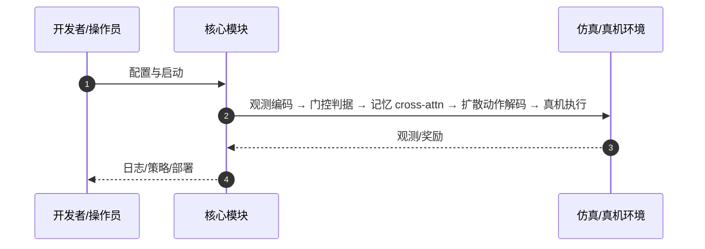

# Gated Memory Policy（arXiv:2604.18933）

**Gated Memory Policy**（Yihuai Gao, Jeff Jinyun Liu, Shuang Li, Shuran Song；Stanford University；[arXiv:2604.18933](https://arxiv.org/abs/2604.18933)，[项目页](https://gated-memory-policy.github.io/)）— 学「何时记、记什么」：门控决定是否激活历史上下文，cross-attention 构造潜记忆，并对历史动作加扩散噪声以抗噪。

## 一句话定义

学「何时记、记什么」：门控决定是否激活历史上下文，cross-attention 构造潜记忆，并对历史动作加扩散噪声以抗噪。

## 英文缩写速查

| 缩写 | 英文全称 | 简要说明 |
|------|----------|----------|
| GMP | Gated Memory Policy | 本文 visuomotor 策略 |
| DP | Diffusion Policy | 动作头骨干 |
| IL | Imitation Learning | 训练范式 |
| MemMimic | Memory Mimic Benchmark | 非马尔可夫评测基准 |

## 为什么重要

盲目加长历史会因分布偏移掉点；操作任务记忆需求随阶段变化，需要选择性记忆而非全时序堆叠。

## 核心原理（方法）

二进制内存门控 + cross-attention 记忆模块 + 历史动作扩散噪声；推理时可缓存历史 token。

## 实验与评测

MemMimic 非马尔可夫基准平均 SR +30.1% vs 长历史基线；RoboMimic 马尔可夫任务保持竞争力。

## 结论

GMP 证明「选择性记忆」优于无脑长上下文，是扩散 visuomotor 走向多阶段/多试次任务的可插拔模块。

- 门控解决「何时需要记忆」
- cross-attention 压缩有效历史表征
- 扩散噪声提升对错误历史的鲁棒性
- 真机部署说明与数据一并发布

## 源码运行时序图

官方入口见 frontmatter `code` / 项目页。运行时主干：

- **最短路径：** 克隆官方仓库 → 按 README 安装依赖 → 运行训练/采集/部署入口脚本。

## 局限与风险

仍依赖任务相关记忆标注/数据分布；极长跨试次记忆未充分验证。

## 与其他工作对比

相对固定窗口历史与无门控 Transformer，显式学习记忆激活。

## 关联页面

- [diffusion-policy](../methods/diffusion-policy.md)
- [paper-behavior-prompting-policy](./paper-behavior-prompting-policy.md)
- [manipulation](../tasks/manipulation.md)
- [REALab 14 篇技术地图](../overview/realab-14-papers-technology-map-2026.md)

## 参考来源

- [gated_memory_policy_arxiv_2604_18933.md](../../sources/papers/gated_memory_policy_arxiv_2604_18933.md)
- [wechat_shenlan_realab_14_papers_2026.md](../../sources/blogs/wechat_shenlan_realab_14_papers_2026.md)

## 推荐继续阅读

- 论文：<https://arxiv.org/abs/2604.18933>
- 项目页：<https://gated-memory-policy.github.io/>
