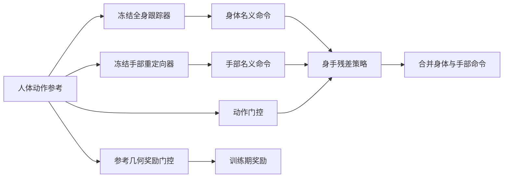

# Gated Residual Body–Hand Coordination for Whole-Body Humanoid Teleoperation

**中文名：** 门控残差身–手协调  
**作者：** Ruiming Wu、Shuang Li、Liding Zhang、Alois Knoll、Zhaopeng Chen  
**单位：** Technical University of Munich（TUM）与 Agile Robots SE  
**发表状态：** arXiv 预印本 v1（2026-09-16，cs.RO），未据此标注为会议/期刊论文  
**论文：** [arXiv:2609.18763](https://arxiv.org/abs/2609.18763) · [HTML 全文](https://arxiv.org/html/2609.18763) · [PDF](https://arxiv.org/pdf/2609.18763)

## 一句话定义

在冻结的人形全身动作跟踪器和独立手部重定向器之上，学习有界的身体与手部残差；动作门控依人体动作连续调节修正权限，训练时再依人体参考几何调节交互奖励权重。

## 英文缩写速查

| 缩写 | 全称 | 含义 |
|---|---|---|
| PPO | Proximal Policy Optimization | 训练名义跟踪器与残差策略所用的强化学习算法 |
| IK | Inverse Kinematics | 逆运动学；SOMA Retargeter 用于把人体动作重定向到机器人 |
| BVH | Biovision Hierarchy | 人体动作捕捉文件格式（SEED 原始动作） |
| SMPL | Skinned Multi-Person Linear model | 参数化人体模型，用于与 BVH 动作配对 |
| AMASS | Archive of Motion Capture as Surface Shapes | 大规模人体动作库；本文用于名义跟踪器与跟踪保持评测 |
| GRAB | GRasping Actions with Bodies | 全身抓取交互动作数据集；本文残差训练与 held-out 评测 |
| DoF | Degrees of Freedom | 自由度；Agile One 身体为 29 DoF |

## 研究问题与贡献

模块化遥操作便于独立开发身体控制器与手部重定向器，但两路命令即使各自跟踪良好，也不保证手腕相对位置、双手间距或指尖关系一致。本文把问题限定为**命令级身手协调**：保留既有两个模块，仅学习协调它们输出的残差，不要求显式物体状态或接触标签。

论文的三项贡献：

1. 通过多姿态形态标定与分阶段运动筛选，为 Agile One 建立机器人专属的全身参考动作和名义跟踪器。
2. 在冻结身体跟踪器与手部重定向器的基础上，训练具有身体/手部独立输出头、关节组有界修正的残差策略。
3. 用两种不同门控分别控制**学什么**与**何时修正多少**：参考几何门控只作用于训练奖励；人体动作条件门控作用于残差权限。

## 方法

### 1. 多姿态标定与动作语料整理

目标平台 Agile One 有 29 个身体自由度。作者从 SEED 五类 SOMA BVH 动作开始：57,799 段；与 SMPL 动作按 key 匹配后保留 52,663 对候选。形态标定使用 7 组人工配对的人体–机器人姿态，联合拟合根坐标系三轴缩放与末端执行器局部偏移，缓解单姿态标定中比例和偏移不可辨识的问题。作者报告，与单姿态标量标定相比，根部误差由 23.16 降至 20.48 mm、腕部误差由 76.59 降至 54.82 mm；踝部误差则从 1.67 增至 2.03 mm。

经 SOMA Retargeter 逆运动学重定向后，流程依次进行目标几何检查、脚滑/关节速度/自碰撞/jerk 质量筛选、短时 IK 分支跳变修复、足底高度对齐与按 153 个动作描述符做密度感知去冗余，最终选出 20,000 条、共 43.67 小时的参考动作。作者报告 8,537 段瞬时 IK 跳变得到修复。

### 2. 冻结的名义命令生成器

作者以整理后的语料训练 SONIC-based 全身跟踪器（PPO 30,000 次迭代，8 张 RTX PRO 6000，约 1.1k GPU 小时），然后冻结它。手部命令由 DexPilot 风格的几何重定向器单独生成。执行频率为 50 Hz；身体命令为 29 维，双手共 32 个活动关节角（每只手 16 个）。

### 3. 有界身手残差

残差策略接收两路名义命令、人体根坐标系身体参考、腕坐标系手部参考，以及机器人本体状态历史（重力投影、基座角速度、关节状态、上一步合并命令）。共享特征主干后分出身体 29 维与手部 32 维输出头。零初始化的末层使初始确定性输出等价于直接组合；之后用 tanh 和固定尺度限制修正范围。腿部残差上限更紧，头部残差关闭。把残差尺度设为零即可恢复直接组合基线。

### 4. 两个职责不同的门控

- **动作门控（训练和执行时）：** 在已有 SONIC 180 ms 参考缓存提供的 25 帧窗口（过去 15 帧、当前帧、未来 9 帧）上计算人体动作特征。腕部工作空间、腕/指活动与双腕接近度描述操作强度；腿部活动范围、脚部摆动与左右交替描述运动强度。平滑后的两个得分分别调节操作关节组和腿部的修正权限，并保留非零下限。
- **参考几何奖励门控（仅训练时）：** 根据人体参考中的双手指尖距离、双腕距离与腕部方向，调整相应几何奖励的权重。距离阈值让近距离双手交互时强调相对几何、手臂伸展时强调腕方向。门控输入不需要物体状态、接触力或触觉观测。

残差策略在 2,304 段 GRAB（含镜像）和 1,006 段 PICO 参考上使用 PPO 训练 5,000 次迭代（8 张 RTX PRO 6000）。PICO 回放用于匹配目标遥操作输入格式；训练 critic 可访问未来人体参考与局部手部几何，执行策略则以当前命令、参考和本体状态作条件。

### 方法流程图

图中参考几何奖励门控只参与训练目标，不是执行时的额外传感器输入。

## 实验与结果

### 实验设置

| 评测 | 设置与读法 |
|---|---|
| 重定向标定 | 同一批 52,663 对候选比较单姿态标量标定和七姿态三轴标定；脚本几何误差是相对各自校准目标计算 |
| 名义跟踪器 | 8,802 段 held-out AMASS，排除 GRAB；每段 10 个观测扰动副本。约 40 小时数据/1.1k GPU 小时的 SONIC AO 与同预算 G1 Comparable 对比；SONIC G1 Released 使用约 700 小时/21k GPU 小时，仅作非同预算参照 |
| 残差消融 | 50 段 held-out GRAB，覆盖 10 位受试者、26 类物体和 15 种意图；分五种动作情境，每段 10 个匹配副本。所有条件均使用同一仿真手部模型与冻结命令生成器，且都达到 100% 根跟踪存活成功率，因此主要比较连续几何误差 |
| 跟踪保持 | AMASS 上比较固定手、关节手，以及关节手加残差；这项测试用于区分手部模型影响和残差影响 |

### 主要结果

| 指标 | 直接组合（Residual Off） | 完整残差 | 变化 |
|---|---:|---:|---:|
| 根部 XY 误差 | 0.145 m | 0.110 m | 降 24.2% |
| 腕间距离误差 | 10.26 cm | 4.62 cm | 降约 55.0% |
| 腕部旋转误差 | 29.15° | 17.73° | 降约 39.2% |
| 双手指尖间误差 | 11.61 cm | 5.07 cm | 降约 56.3% |
| 拇指–指尖误差 | 4.33 cm | 2.28 cm | 降约 47.3% |

消融揭示了取舍，而非单一门控全面胜出：**Constant Reward Gate** 的整体聚合协调误差最低；完整模型在近距离双手交互窗口的腕距误差（6.11 cm 对 6.54 cm）与腕旋转误差（22.33° 对 23.57°）更低。移除动作条件、改为常数动作门控后，根部 XY 误差从 0.110 增至 0.129 m；取消腿部残差后增至 0.153 m。

在同一关节手仿真模型的 AMASS 测试中，加入残差后存活成功率从 89.03% 变为 89.29%，根部朝向误差从 0.2089 降至 0.2020 rad；但根部 XY、身体位置与身体朝向误差略有上升。因此，结果支持“保持了相近的全身跟踪能力”，不支持“所有全身跟踪指标都改善”。

## 与其他工作对比

| 方案 | 身体/手部关系 | 额外任务观测 | 与本文的区别 |
|---|---|---|---|
| 直接组合（本文基线） | 冻结跟踪器和手部重定向器各自输出，未显式协调跨模块几何 | 无 | 本文残差的比较对象 |
| CoorDex | 共享残差协调独立身体与手部先验 | 使用物体相对几何、接触特征、目标与任务阶段等任务信号 | 本文面向人体参考驱动的遥操作，不依赖物体/接触标注 |
| WristMimic | 身体/腕参考结合物体跟踪与接触动力学 | 物体与接触信息 | 关注对象交互耦合；本文关注冻结命令流之间的几何协调 |
| 本文 | 双头有界残差；分别对修正权限与训练奖励门控 | 人体运动参考、名义命令、机器人本体状态 | 目标是低侵入地改善双手与身体几何关系 |

## 局限与复现状态

- 评测仅在仿真中完成，使用单一 Agile One 具身与一个训练随机种子；没有真机遥操作验证。
- 策略没有显式物体状态、接触力或触觉输入。接触相关效果只能通过参考几何代理量学习。
- 动作门控依赖现有 180 ms 未来参考缓存；不同遥操作系统若没有该缓存，门控特征与延迟假设需重新评估。
- AMASS 的残差收益不是全面的跟踪指标提升；解释时应同时报告几何误差和身体跟踪误差。
- 论文专属代码或独立项目页：截至 2026-10-06 未在论文首页/原文中找到公开入口，故标为**未发现公开发布**；不要把相关依赖（如 SOMA Retargeter）误当作本文实现。
- 论文报告训练硬件与迭代数，但当前无作者实现可供端到端复现。

## 结论

这项工作把模块化全身遥操作中的身手不一致，转化为对冻结命令生成器的有界协调问题。它在 held-out 仿真交互动作上显著降低腕部与指尖几何误差，同时保留相近的 AMASS 存活率；但不同门控在聚合误差和特定双手交互窗口之间有取舍，身体跟踪的若干误差略有变差。真机泛化、更多具身/随机种子和触觉/接触感知仍待验证。

## 关联页面

- [teleoperation](../tasks/teleoperation.md)
- [loco-manipulation](../tasks/loco-manipulation.md)
- [whole-body-control](../concepts/whole-body-control.md)

## 参考来源

- [论文来源归档](../../sources/papers/gated-residual-body-hand-coordination_arxiv_2609_18763.md)
- [arXiv 摘要页](https://arxiv.org/abs/2609.18763)
- [arXiv HTML 全文（方法、表格与限制）](https://arxiv.org/html/2609.18763)
- [senlanke 周更盘点（原始策展线索）](../../sources/blogs/wechat_senlanke_weekly_humanoid_quadruped_2026-09-14_18.md)
