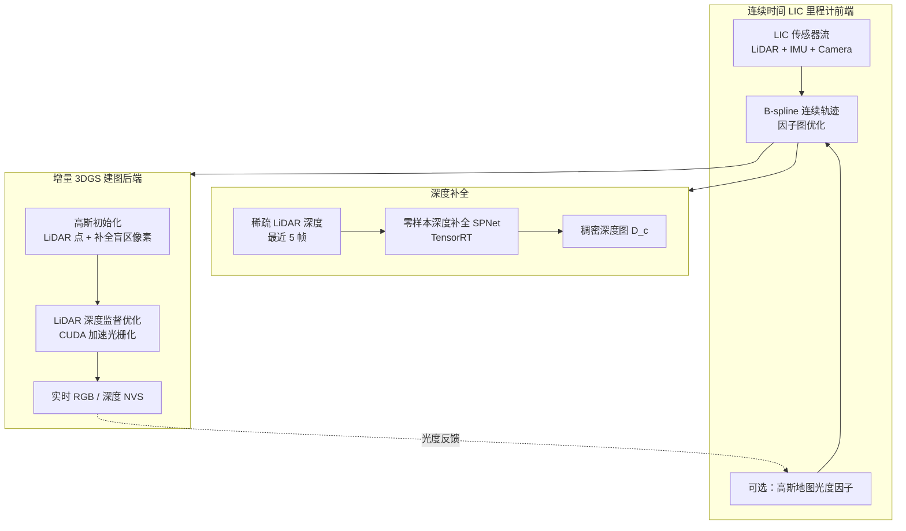
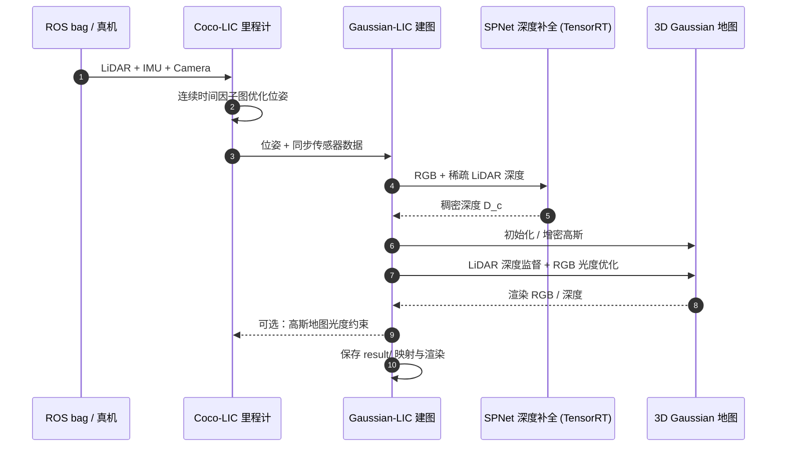

# Gaussian-LIC2（LiDAR-Inertial-Camera 3DGS-SLAM）

**Gaussian-LIC2**（Lang et al., arXiv:2507.04004，[项目页](https://xingxingzuo.github.io/gaussian_lic2/)，[代码](https://github.com/APRIL-ZJU/Gaussian-LIC)）由 **浙江大学** 与 **MBZUAI** 提出，是 Gaussian-LIC（ICRA 2025）的期刊扩展版（**IJRR 2026**）。系统声称是首个在 **实时** 约束下同时兼顾 **照片级 RGB/深度 novel view 渲染** 与 **几何精度** 的 **LiDAR-Inertial-Camera 3D Gaussian Splatting SLAM**：前端在连续时间因子图中紧耦合 LIC 里程计（可选高斯地图光度因子），后端用 **零样本深度补全** 填 LiDAR 盲区、以 **稀疏 LiDAR 深度监督** 增量优化 3D 高斯地图，并展示帧插值与快速网格提取等下游应用。

## 一句话定义

**在连续时间 LIC 里程计与增量 3DGS 建图之间形成闭环：用深度补全解决稀疏 LiDAR 盲区初始化，用 LiDAR 深度监督与 CUDA 加速守住几何，再用高斯地图光度约束在 LiDAR 退化时稳住跟踪。**

## 英文缩写速查

| 缩写 | 英文全称 | 简要说明 |
|------|----------|----------|
| Gaussian-LIC2 | LiDAR-Inertial-Camera Gaussian Splatting SLAM (v2) | 本文实时 LIC 3DGS-SLAM 系统 |
| LIC | LiDAR-Inertial-Camera | 激光-惯性-相机多传感器融合 |
| 3DGS | 3D Gaussian Splatting | 显式各向异性高斯辐射场表示 |
| SLAM | Simultaneous Localization and Mapping | 同步定位与建图 |
| NVS | Novel View Synthesis | 新视角 RGB/深度渲染 |
| ADC | Adaptive Density Control | 3DGS 基于梯度的克隆/分裂增密策略 |
| SPNet | Sparse depth completion network | 本文采用的轻量零样本深度补全网络（TensorRT 部署） |
| CT | Continuous-Time | 连续时间 B-spline 轨迹表示 |

## 为什么重要

- **辐射场 SLAM 的三难：** 视觉质量、几何精度、实时性往往只能取其二；户外大尺度 LIC 场景还需应对 LiDAR 退化与纹理缺失。
- **LiDAR 盲区是增量 3DGS 的结构性短板：** 仅从 LiDAR 点初始化高斯会在稀疏/窄 FoV LiDAR 下欠重建；在线 ADC 在增量 SLAM 中滞后且对成熟度不一的高斯不友好。
- **里程计与建图可闭环：** 多数 LIC 3DGS-SLAM 解耦前后端；本文探索 **增量高斯地图光度约束** 反哺连续时间跟踪，在 LiDAR 退化且缺纹理时仍有价值。
- **评测维度补齐：** 自采 LIC 数据集支持 **序列外（out-of-sequence）** RGB/深度 NVS，填补公开基准缺口。

## 核心信息

| 字段 | 内容 |
|------|------|
| 作者 | Xiaolei Lang*, Jiajun Lv*, Kai Tang, Laijian Li, Jianxin Huang, Lina Liu, Yong Liu†, Xingxing Zuo† |
| 机构 | 浙江大学控制科学与工程学院 · MBZUAI 机器人系 |
| 出处 | arXiv:2507.04004；IJRR 2026；前作 Gaussian-LIC（ICRA 2025） |
| 项目 | <https://xingxingzuo.github.io/gaussian_lic2/> |
| 代码 | <https://github.com/APRIL-ZJU/Gaussian-LIC>（**已开源**，GPL-3） |
| 视频 | <https://www.youtube.com/watch?v=SkPnpuCfh88> |

## 方法与核心结构

| 模块 | 作用 |
|------|------|
| **连续时间 LIC 里程计（前端）** | B-spline 轨迹 + 因子图紧融合 LiDAR / IMU / 光流或 **高斯地图光度** 相机因子 |
| **零样本深度补全** | RGB + 稀疏 LiDAR → 稠密深度，为 LiDAR 未覆盖像素初始化高斯 |
| **增量 3DGS 建图（后端）** | LiDAR 深度监督 + opacity-scaled 渲染深度；CUDA 加速光栅化与优化 |
| **下游扩展** | 连续时间轨迹支持 **视频帧插值**；高斯地图 **快速网格提取** |

### 流程总览

## 源码运行时序图

复现路径对齐官方 README：先启动 **Gaussian-LIC** 建图节点，再启动 **Coco-LIC** 里程计向 ROS 话题喂入 LIC 数据；深度补全权重需预先 TensorRT 部署。

关键复现命令：`roslaunch gaussian_lic fastlivo2.launch`（建图）+ `roslaunch cocolic odometry.launch`（里程计）；FAST-LIVO2 等公开 bag 可直接评测。

## 实验与评测（论文报告摘要）

| 基准 / 场景 | 指标 | Gaussian-LIC | Gaussian-LIC2 | 读法 |
|-------------|------|--------------|---------------|------|
| Bell_Tower_01（150 s，自估位姿） | PSNR ↑ / Depth-L1 ↓ | 25.36 / **0.93 m** | **25.51 / 0.27 m** | 几何误差大幅下降，视觉基本持平 |
| 同上，RTX 4090 | 处理时间 ↓ | 102 s | **90 s** | 加速策略有效 |
| 自采数据集（GT 位姿，in-seq） | PSNR | GS-LIVM ~17–23 | **21.78–27.63** | 多序列领先 |
| FAST-LIVO2 退化序列 | 起终点漂移 | LIO-only 米级 | **(c1) 厘米级** | 高斯光度约束助退化场景 |
| HKisland03 / HKairport03 | 轨迹 | — | **1.95 km / 2.1 km** | 大尺度户外实时 |
| 前端（每 0.1 s 扫描） | 总耗时 | — | **42–55 ms** | 跟踪 < 0.1 s，实时 |

**消融要点：** 深度补全对 LiDAR 盲区初始化关键；opacity-scaled 深度缓解增量插入低估；CUDA 策略（tile culling 等）在几乎不损精度下缩短建图时间。

## 工程实践

| 项 | 说明 |
|----|------|
| **平台** | Ubuntu 20.04；RTX 3090 / 4090 实测 |
| **依赖链** | CUDA 11.7、cuDNN、OpenCV 4.7（CUDA）、LibTorch 2.0.1、TensorRT 8.6.1、ROS catkin |
| **前端** | [Coco-LIC](https://github.com/APRIL-ZJU/Coco-LIC) 独立 catkin 工作空间 |
| **深度权重** | `ckpt/Large_300.pth`（Google Drive）+ ONNX/TensorRT 导出脚本 |
| **数据** | FAST-LIVO(2)、R3LIVE、MCD、M2DGR 等 ROS bag；**自采 LIC 评测集待发布** |
| **输出** | `result/` 下映射与渲染结果 |
| **许可** | GPL-3 |

## 局限与风险

- **重依赖与部署成本：** GPU + TensorRT + 双 catkin 工作空间，真机集成门槛高于纯 LIO（如 [FAST-LIO](./fast-lio.md)）。
- **自采数据集未公开：** out-of-sequence NVS 定量结论暂难完全第三方复现。
- **GPL-3 许可：** 衍生分发需注意传染性。
- **与专用 LIVO 的定位差异：** 若只需厘米级定位、不需照片级地图，[FAST-LIVO2](https://github.com/hku-mars/FAST-LIVO2) 等更轻量；Gaussian-LIC2 的价值在 **辐射场地图 + 实时 LIC 跟踪** 一体。

## 结论

**Gaussian-LIC2 把 LIC 3DGS-SLAM 从「能看清」推进到「几何也可用」：深度补全填盲区、LiDAR 深度监督守几何、高斯光度反馈稳退化跟踪，并在 RTX 4090 上维持实时。**

- **Depth-L1 是硬收益：** Bell_Tower_01 上 **0.93 m → 0.27 m**（约 **-71%**），摘称跨方法 **-62%**；PSNR 基本持平，说明几何改进未牺牲视觉。
- **三机制各管一块：** 零样本深度补全 → LiDAR 盲区初始化；LiDAR 深度 + opacity-scaled 渲染深度 → 几何监督；高斯地图光度因子 → LiDAR 退化 + 缺纹理时的跟踪兜底。
- **工程已可跑：** 官方仓库 + Coco-LIC 前端 + SPNet TensorRT；支持 FAST-LIVO2 等公开 bag；但 **自采评测集、Docker、网格工具仍待发布**。
- **选型读法：** 需要 **户外实时照片级 RGB/深度地图** 且已有 LIC 传感器栈 → 优先评估；仅需定位或轻量 LIO → FAST-LIVO2 / [Ultra-Fusion](./paper-ultra-fusion-multi-sensor-slam.md) 更合适。
- **与辐射场 SLAM 谱系：** 相对 MonoGS / GS-SLAM（室内 RGB-D）与 GS-LIVM（非实时或几何弱），本文强调 **LIC + 实时 + 双模态 NVS**。
- **下游：** 连续时间轨迹天然支持帧插值；高斯地图可快速抽网格，利于数字孪生与可视化，但障碍物几何仍须结合任务验证。

## 与其他页面的关系

- [导航·SLAM 栈总览](../overview/navigation-slam-autonomy-stack.md) — Nav2 上游里程计/建图分层；辐射场 SLAM 属 **稠密感知建图** 支路
- [LiDAR SLAM / LIO / VIO 选型](../comparisons/lidar-slam-lio-vio-selection.md) — 开源 LIC/LIVO 横向对照
- [State Estimation（概念）](../concepts/state-estimation.md) — 连续时间轨迹与因子图语境
- [Ultra-Fusion（实体）](./paper-ultra-fusion-multi-sensor-slam.md) — 另一路线：统一滑窗多传感器 **定位韧性**，亦可扩展 3DGS 建图
- [FAST-LIO（实体）](./fast-lio.md) — 轻量 3D LIO 基线，无辐射场地图

## 参考来源

- [gaussian_lic2_arxiv_2507_04004.md](../../sources/papers/gaussian_lic2_arxiv_2507_04004.md)
- [gaussian-lic2.md](../../sources/sites/gaussian-lic2.md)
- [gaussian-lic.md](../../sources/repos/gaussian-lic.md)
- Lang et al., *Gaussian-LIC2: LiDAR-Inertial-Camera Gaussian Splatting SLAM*, arXiv:2507.04004, 2025 — <https://arxiv.org/abs/2507.04004>

## 推荐继续阅读

- [Gaussian-LIC2 项目页](https://xingxingzuo.github.io/gaussian_lic2/) — Pipeline 与 out-of-sequence NVS 定性结果
- [Gaussian-LIC 代码仓库](https://github.com/APRIL-ZJU/Gaussian-LIC) — 安装、运行与 checklist
- [Coco-LIC](https://github.com/APRIL-ZJU/Coco-LIC) — 连续时间 LIC 里程计前端
- Zheng et al., *FAST-LIVO2* — 强 LIC 里程计基线与评测数据集来源（<https://github.com/hku-mars/FAST-LIVO2>）
- Tosi et al., *How NeRFs and 3D Gaussian Splatting are reshaping SLAM: a survey* — 辐射场 SLAM 综述（arXiv:2402.13255）
