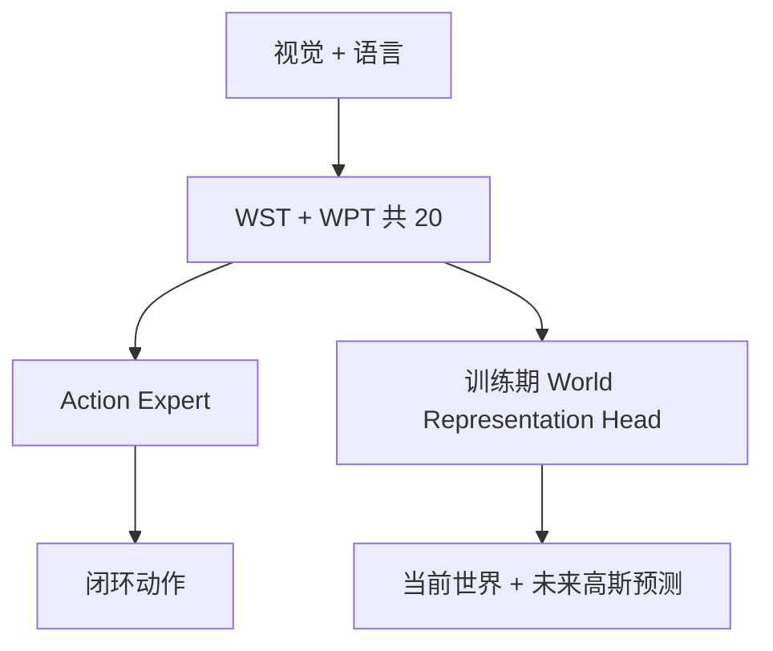
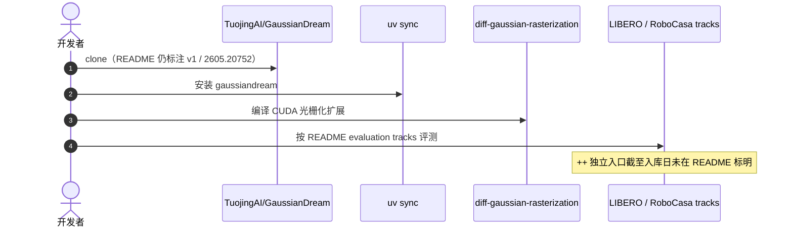

# GaussianDream++

**GaussianDream++: Efficient 3D Gaussian World Modeling for Robotic Manipulation**（[arXiv:2608.25659](https://arxiv.org/abs/2608.25659)，[项目页](https://tuojingai.github.io/GaussianDream-Series-project-page/)）——拓境智能（Tuojing Intelligence）；中国科学院自动化研究所（CASIA）；中国科学院大学（UCAS）等。

本页覆盖 **++（2608.25659）**。前作 [GaussianDream](./paper-sa-2605-20752-gaussiandream-a-feed-forward-3d-gaussian-world-m.md)（[arXiv:2605.20752](https://arxiv.org/abs/2605.20752)）是 Awesome 索引级节点，**不是**同一论文，勿合并。

## 一句话定义

**三维世界监督可以只在训练期存在，部署只留下 20 个世界令牌，不必在线高斯解码。**

## 英文缩写速查

| 缩写 | 英文全称 | 简要说明 |
|------|----------|----------|
| 3DGS | 3D Gaussian Splatting | 可微高斯基元场景表示 |
| WST | World State Tokens | 编码当前物理场景的令牌 |
| WPT | World Prediction Tokens | 编码短时程演化的令牌 |
| VGGT | Visual Geometry Grounded Transformer | v1 前缀几何通路，++ 推理期移除 |

## 为什么重要

- 纳入 [具身智能小站 2026-08-28 九篇盘点](../../sources/blogs/wechat_embodied_station_wam_vla_cross_embodiment_9_papers_2026-08-28.md)：训练期三维、部署期轻量。
- 开源状态（入库日）：**部分开源**（仓为 v1 实现；++ 入口未在 README 标明）。

## 核心信息

| 项 | 内容 |
|----|------|
| **机构** | 拓境智能；中科院自动化所；国科大；另有清华、中科大、港科广、南洋理工、北航、CMU、港大等 |
| **出处** | arXiv:2608.25659（2026-08） |
| **开源** | **部分开源** |

### 流程总览

## 工程实践

| 项 | 内容 |
|----|------|
| **训练** | World Representation Head 解码共享高斯基元；静态—动态分解把残差运动集中在交互区 |
| **部署** | 去掉头、渲染器、辅助目标与 VGGT/TGE；只保留 20 个世界令牌 |
| **v1 仓** | `uv sync` 后评测 LIBERO / RoboCasa；++ 是否可复用同一入口需对照后续 README |

## 评测

| 项 | 内容 |
|----|------|
| **LIBERO** | **98.6%** |
| **LIBERO-Plus** | **87.8%**（Camera / Layout 相对 v1 +2.8 / +1.6 pp） |
| **真机** | 平均成功率 复现 π0.5 **29.2%** → **52.5%** |

- 数据出处：[ingest 摘录「评测」](../../sources/papers/gaussiandream_plusplus_arxiv_2608_25659.md) 与 arXiv HTML 摘要。

## 结论

**预测几何的价值可以沉在训练损失里，不必把在线仿真器带上真机。**

1. 相对 v1 的稠密 VGGT/TGE 前缀，++ 把世界表示写成策略原生令牌。
2. 当前状态与未来变化分角色，残差只打在交互区域。
3. Camera / Layout 偏移上的增益比 LIBERO 饱和套件更值得读。
4. 复现时先确认跑的是 v1 还是 ++，不要把同一 GitHub 仓当成 ++ 已完整开源。

## 源码运行时序图

若只需 v1 复现，按官方 README 的 LIBERO commit `f78abd6` 与 RoboCasa `756598a5` 对齐；++ 权重与 World Token 训练脚本需等待仓更新。

## 局限与风险

- 公众号写「GitHub项目页」未给 URL；以论文脚注为准。
- 同一仓服务两篇论文，容易误把 v1 数字当成 ++。
- 训练期高斯头增加算力；部署收益依赖不把头留在推理图里。

## 与其他工作对比

- 相对索引级 [GaussianDream](./paper-sa-2605-20752-gaussiandream-a-feed-forward-3d-gaussian-world-m.md)：本页是深度实体，覆盖 ++ 机制与指标。
- 相对几何增强 VLA：++ 同时监督当前结构与短时程演化。
- 相对在线世界模型 rollout：推理不做高斯解码或未来展开。

## 关联页面

- [GaussianDream（索引级前作）](./paper-sa-2605-20752-gaussiandream-a-feed-forward-3d-gaussian-world-m.md)
- [生成式世界模型](../methods/generative-world-models.md)
- [VLA](../methods/vla.md)
- [LIBERO](./libero-benchmark.md)
- [WAM / VLA / 跨本体 9 篇技术地图](../overview/wam-vla-cross-embodiment-9-papers-technology-map.md)

## 参考来源

- [gaussiandream_plusplus_arxiv_2608_25659](../../sources/papers/gaussiandream_plusplus_arxiv_2608_25659.md)
- [gaussiandream-series 项目页](../../sources/sites/gaussiandream-series.md)
- [gaussiandream 仓库](../../sources/repos/gaussiandream.md)
- [具身智能小站 9 篇盘点](../../sources/blogs/wechat_embodied_station_wam_vla_cross_embodiment_9_papers_2026-08-28.md)

## 推荐继续阅读

- [arXiv:2608.25659](https://arxiv.org/abs/2608.25659)
- [GaussianDream Series 项目页](https://tuojingai.github.io/GaussianDream-Series-project-page/)
