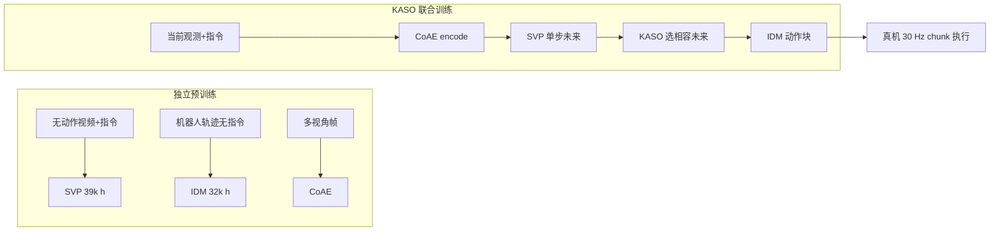

# GE-Act 2.0：世界–动作模型预训练与规模扩展

**GE-Act 2.0**（*GE-Act 2.0: Pretraining and Scaling a World-Action Model for Robotic Manipulation*，全称 **Genie Envisioner Act 2.0**，[arXiv:2609.05588](https://arxiv.org/abs/2609.05588)，[项目页](https://ge-act-v2.github.io/)）由 **智元机器人（AgiBot Research）** 提出（学术合作含 **南洋理工大学 DeCLaRe Lab** 等）：可训练的视觉生成与动作组件 **均在操作数据上从零预训练**，通过 **分模块预训练 + KASO 联合对齐** 吃尽无动作视频与有标签轨迹的互补监督，并系统报告 **30,000 h** 量级共训缩放下的 **零样本 OOD** 操作能力与 **104 ms** 级部署延迟。

## 一句话定义

**不靠继承通用视频生成器——用紧凑 CoAE 潜空间里的单步视觉规划器接逆动力学，再用 KASO 筛掉「看起来对但动作不对」的未来，把操作数据从 300 h 拉到 30k h 仍能单调涨零样本成功率。**

## 英文缩写速查

| 缩写 | 英文全称 | 简要说明 |
|------|----------|----------|
| WAM | World–Action Model | 联合预测未来观测与可执行动作 |
| CoAE | Control-Oriented Autoencoder | 面向控制的紧凑视觉潜编码器 |
| SVP | Single-step Visual Planner | 单步 MeanFlow 视觉未来规划器 |
| IDM | Inverse Dynamics Model | 从状态转移恢复动作的逆动力学头 |
| KASO | Knowledge-Aligned Selective Optimization | 按动作相容性筛选预测未来的联合优化 |
| OOD | Out-of-Distribution | 新物体/场景/背景/光照的分布外评测 |

## 为什么重要

- **把 WAM 预训练从「接视频骨干」改成「操作域从零搭栈」**：SVP **39k h**、IDM **32k h** 独立预训练后再共训，证明模块边界与数据类型可解耦设计。
- **显式处理 validity gap**：视觉可信的未来未必与示范动作一致；KASO 在动作空间选候选，比盲用生成未来更稳（四物体 pick **37.5% vs 22.5%**）。
- **跨本体缩放证据**：G2-90D 仅占共训 **<2%** 仍随共享语料 **+17.7 pt**，支持「大数据 + 稀疏目标本体」路线。
- **部署可落地**：单步 SVP 去掉视觉迭代去噪；整链 **104 ms / 52 步 @ 30 Hz** 于消费级 GPU。
- **Genie Envisioner 平台动作侧**：与 [Genie Envisioner](./paper-sa-2508-05635-genie-envisioner-a-unified-world-foundation-plat.md) WM 栈、[GE-Sim 2.0](./ge-sim-2.md) 仿真侧形成 AgiBot **世界基础 + 动作** 闭环叙事。

## 核心信息

| 项 | 内容 |
|----|------|
| **机构** | 智元机器人（AgiBot Research）；学术合作含南洋理工大学 DeCLaRe Lab 等 |
| **架构** | **CoAE** → **SVP** → **IDM**；冻结 **Qwen3.5-2B**（2.72B）接地语言 |
| **规模** | SVP **2.51B**（36 DiT、宽 2048）；IDM **0.56B**（28 块、宽 1152） |
| **预训练** | SVP **39,000 h**（含 **3,000 h** 无本体第一视角+人类视频）；IDM **32,000 h**（含 **2,000 h** 失败/rollout）；与最大共训池 30k h 不同 |
| **共训缩放** | **300 / 1,200 / 5,000 / 30,000 h** 嵌套池 |
| **评测** | **G1-OP**、**G2-90D**；**100 任务 / 20 技能组**；零样本 OOD |
| **开源** | **待发布** — 项目页 **Code · Coming soon**（截至 **2026-09-09**） |

## 核心原理

### 三模块流水线

1. **CoAE**：256×384 多视角帧 → **4×6×512** 潜网格（**24 tokens/帧**，64× 压缩；同分辨率 DINOv3 为 **384 tokens**）；像素 + LPIPS + 对抗重建，并对齐 **SigLIP 2 / V-JEPA 2.1 / DINOv3**。冻结 CoAE + 两层逆动力学探针：动作 MAE 比 DINOv3/V-JEPA **高 13–31%**，但 token **1/16**；同 64× 下采样 **DC-AE** MAE **高 54%**；指令–画面匹配 **97.95%**（探针表五项最佳）。
2. **SVP**：头部相机 + 指令 → **一次 MeanFlow** 输出完整未来潜序列（动作视界内 **dense**，至任务末 **sparse**）；使 IDM 可先独立预训练，再经可微边界接入生成未来。
3. **IDM**：当前潜变量 + 预测未来 + 本体感知 → **dense action chunk**（**5 步 Euler** flow 去噪，无 guidance）；部署仅执行 chunk **前 30 个 dense 动作**。

单步 SVP 使 IDM 可先独立学真实转移，再经 **可微边界** 接入生成未来；亦支持 KASO 的 **噪声重放**（多候选评估后带梯度复现选中未来）。

### KASO 与有效性缺口

| 现象 | 处理 |
|------|------|
| 同场景多种合法完成方式 | 生成未来 A，示范记录方式 B → 直接配对训练 **mismatch** |
| KASO | 多噪声候选 → IDM 在固定高噪声时刻比较与 **记录视频** 的动作响应 → 选最低能量候选 → 保留噪声重放并反传 SVP+IDM |
| 消融（G2-90D，300 h 连接阶段） | 四物体 **Follow 95%** 持平 E2E+PT；四物体 pick **37.5% vs 22.5%**；单物体 pick **40% vs 12%**（每目标 10/25 次，机制验证非能力榜） |

### 流程总览

## 源码运行时序图

**不适用** — 截至 **2026-09-09** 项目页标注 **Code · Coming soon**，无可运行官方仓库。若开源，预期路径：三路相机 → CoAE encode → SVP 单步未来 → IDM 去噪 chunk → 机器人执行前缀并重规划。

## 评测与指标

| 轴 | 报告口径 |
|----|----------|
| **共训缩放（30k）** | G1-OP 均值 **44.1%**（自 17.1%）；G2-90D **31.1%**（自 13.4%） |
| **技能覆盖** | G1 **19/20** 组涨分；G2 **18/20**；非零任务 G1 **76/100**、G2 **72/100** |
| **跨本体** | G2 数据 <2% 仍 **+17.7 pt**；10 组技能各 <5 h（4 组 <1 h） |
| **技能–成功相关** | Pearson **r=0.80**；Spearman **ρ=0.85**；每十倍数据 **+1.94 logit** |
| **覆盖案例（3 万 h）** | Wipe **824.1 h → 76.7%** vs Sweep **64.6 h → 3.3%**；Straighten **510.5 h** 在 5k h 前为 0%、3 万 h 才 **30%** |
| **指令 grounding（295 rollout）** | Pick+Place **83.1%** 跟随 / **72.9%** 完整成功；物体/颜色/位置/形状 **≥90%**；尺寸 **82.5%/65.7%**；顺序 **13.3%/26.7%**（与语料频率长尾同构） |
| **延迟** | RTX 5090 **104 ms**；**52** 可执行步 @ **30 Hz** |

协议：每任务每本体每规模 **10 次**；固定末 checkpoint 与部署设置；**无** per-task 微调或 prompt 调参。

## 结论

**GE-Act 2.0 把「分模块预训练 + 动作相容的未来筛选 + 万小时级共训」写成可量化的零样本 OOD 操作缩放律，并证明消费级 GPU 上实时 chunk 部署可行。**

1. **架构** — 从零 CoAE/SVP/IDM 优于隐式继承通用视频生成器；**单步 MeanFlow** 是 IDM 可独立预训练与 KASO 重放的前提。
2. **监督** — 无动作视频与无指令轨迹应 **分训再连**；联合阶段必须用 **KASO** 类机制处理 validity gap，否则 pick 类指标易卡死。
3. **缩放** — 300→30k h 在主导本体 G1-OP 近 **2.6×** 均值成功率；5k→30k 仍有增益，勿过早外推饱和。
4. **跨本体** — 共享语料可抬升数据稀缺本体，但 **<2% 占比** 下绝对成功率仍低于主导本体——读榜要看 **绝对值 + 增益** 双轴。
5. **语言** — 预训练 WAM 可在零样本下做细粒度指代与 **对抗动作偏置** 的指令跟随，不必先 task-specific FT。
6. **部署** — **104 ms** 级整链延迟使「预测未来再控」在真机 chunk 范式下可实时；瓶颈在潜压缩与单步规划，而非多步像素去噪。
7. **开源** — **待发布**；复现需等待官方代码、权重与 G1-OP/G2-90D 评测脚本。

## 工程实践

| 项 | 建议 |
|----|------|
| 数据配方 | 区分 **SVP 视频域** 与 **IDM 轨迹域** 预训练；共训池与预训练池小时数 **不可混读** |
| 连接训练 | 默认启用 **KASO**；连接阶段可用小混合（如 300 h 含 ~10% 目标本体）做对齐消融 |
| 表征 | CoAE **24 tokens/帧** 是延迟关键；探针显示动作信息保留但误差仍高于 DINOv3/V-JEPA |
| 推理 | 仅执行 **dense chunk**；稀疏远期动作仅训练监督 |
| 评测 | 坚持 **零样本 OOD** 协议（新实例/场景/光照）；勿与 LIBERO 微调榜直接横比 |
| 平台 | 与 [Genie Envisioner](./paper-sa-2508-05635-genie-envisioner-a-unified-world-foundation-plat.md) / [GE-Sim 2.0](./ge-sim-2.md) 组合时，分清 **仿真 WM** 与 **动作 WAM** 职责 |
| 复现 | 等待官方 **Code · Coming soon** 落地后再对齐训练图与部署栈 |

## 与其他工作对比

| 对照 | 差异读法 |
|------|----------|
| [OpenWAM](./paper-openwam.md) | 开源模块化 WAM 预训练对照实验；GE-Act 强调 **AgiBot 真机尺度 + 从零栈 + KASO** |
| [Kairos](./paper-kairos-native-world-model-stack.md) | 联合 Video+Action DiT flow matching；GE-Act **分模块预训练 + 单步 SVP** |
| [LD4WAM](./paper-ld4wam.md) | 潜动力学对齐 + MoT WAM；GE-Act 用 **CoAE 自建潜空间 + IDM** |
| [DeFI](../methods/defi-decoupled-dynamics-vla.md) | 解耦前向/逆向再耦合；GE-Act 是 **SVP 前向 + IDM 逆向 + KASO 筛选** |
| [JoyAI-RA 0.5](./paper-joyai-ra-05.md) | 同 AgiBot G1 产业叙事；JoyAI 走 VLWA 双对齐，GE-Act 走 **显式世界–动作生成链** |

## 局限与风险

- **待发布**：训练细节、超参与评测脚本暂不可第三方复现。
- **基准私有性**：100 任务 / G1-OP / G2-90D 为 AgiBot 内部协议，与公开仿真榜 **不可直接换算**。
- **绝对成功率**：30k 档 G2-90D **31.1%** 仍偏低；**>50%** 任务仍失败；G2 缩放曲线中 **22/100** 轨迹相对低数据档下降。
- **matched-compute 未隔离**：论文自述为 practical end-to-end scaling comparison，斜率与天花板未定。
- **人类视频占比低**：SVP 预训练仅 **3,000 h**（约 **8%**）第一视角人类视频，Scaling 上升段可能尚未触顶。
- **CoAE 压缩代价**：探针动作恢复误差比 DINOv3/V-JEPA **高 13–31%**。
- **KASO 算力**：每步多候选探测 + 重放，训练成本高于 naive E2E（项目未报 FLOP 明细）。

## 关联页面

- [World Action Models](../concepts/world-action-models.md) — Joint WAM 文献坐标与缩放讨论
- [Generative World Models](../methods/generative-world-models.md) — 单步 vs 多步视觉生成
- [Manipulation](../tasks/manipulation.md) — 操作任务与 WAM 产业实例索引
- [Genie Envisioner](./paper-sa-2508-05635-genie-envisioner-a-unified-world-foundation-plat.md) — 统一世界基础平台
- [GE-Sim 2.0](./ge-sim-2.md) — 同平台闭环视频模拟器
- [AgiBot 2026-06 发布技术地图](../overview/agibot-june-2026-release-technology-map.md) — 产业开源全景

## 推荐继续阅读

- AgiBot Research, *GE-Act 2.0: Pretraining and Scaling a World-Action Model for Robotic Manipulation* — [arXiv:2609.05588](https://arxiv.org/abs/2609.05588)
- [GE-Act 2.0 项目页](https://ge-act-v2.github.io/)
- [OpenWAM](./paper-openwam.md) — 开源 WAM 预训练模块化对照

## 参考来源

- [GE-Act 2.0 论文归档](../../sources/papers/ge_act_2_arxiv_2609_05588.md)
- [GE-Act 2.0 项目页归档](../../sources/sites/ge-act-v2-project.md)
- [深蓝AI · GE-Act 2.0 Scaling 导读](../../sources/blogs/wechat_shenlan_ge_act_2_scaling_2026-09-11.md)
